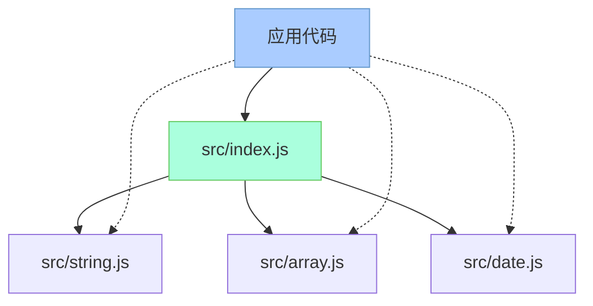

# JavaScript 模块导出

## 模块导出的基本概念

模块化是JavaScript中的重要概念，它允许我们将代码分割成独立且可重用的部分。而模块导出就是模块化中的关键环节，它决定了一个模块对外暴露哪些功能。

简单来说，模块导出就是指定一个JavaScript文件中哪些变量、函数或对象可以被其他文件使用。

:::note
在模块化编程中，我们遵循一个重要原则：**只导出必要的内容**。这有助于保持代码的封装性和安全性。
:::

## JavaScript 模块系统

在JavaScript中，主要有两种流行的模块系统：

1. **CommonJS** - 主要用于Node.js环境
2. **ES Modules** - ECMAScript官方模块标准，现代浏览器原生支持

让我们分别了解这两种系统中的导出语法。

## CommonJS模块导出

CommonJS是Node.js采用的模块系统，使用`module.exports`和`exports`对象来导出模块内容。

### 基本导出方式

```js
// 导出单个函数
module.exports = function add(a, b) {
  return a + b;
};

// 输出:
// 此模块导出一个函数
```

### 导出多个项目

```js
// math.js文件
exports.add = function(a, b) {
  return a + b;
};

exports.subtract = function(a, b) {
  return a - b;
};

exports.PI = 3.14159;

// 输出:
// 此模块导出了两个函数和一个常量
```

:::caution
注意`exports`是`module.exports`的引用。如果你直接给`exports`赋值，会破坏这个引用关系，导致导出失败：

```js
// 错误方式 - 这样会导致导出失败
exports = {
  add: function(a, b) { return a + b; }
};

// 正确方式
module.exports = {
  add: function(a, b) { return a + b; }
};
```
:::

## ES Modules导出

ES Modules是JavaScript官方的模块系统，使用`export`和`import`语句。

### 命名导出

```js
// math.js
export function add(a, b) {
  return a + b;
}

export function subtract(a, b) {
  return a - b;
}

export const PI = 3.14159;

// 这些函数和常量可以通过它们的名字被导入
```

### 默认导出

```js
// calculator.js
export default class Calculator {
  add(a, b) {
    return a + b;
  }
  
  subtract(a, b) {
    return a - b;
  }
}

// 这个类可以作为默认值被导入
```

### 组合导出

也可以先定义然后统一导出：

```js
// utils.js
function formatDate(date) {
  return date.toLocaleString();
}

function capitalize(str) {
  return str.charAt(0).toUpperCase() + str.slice(1);
}

const VERSION = '1.0.0';

// 统一导出
export { formatDate, capitalize, VERSION };
```

## 导出的重命名

有时我们需要改变导出项的名称，可以使用`as`关键字：

```js
// 命名导出的重命名
function sum(a, b) { return a + b; }
export { sum as add };

// 这个函数将以'add'的名字被导出
```

## 导出与重新导出

有时我们需要从一个模块导入然后再导出，这称为"重新导出"：

```js
// re-export.js
export { add, subtract } from './math.js';
export * from './utils.js';

// 这会导出math.js中的add和subtract函数，以及utils.js中的所有导出项
```

## 实际案例：构建工具库

假设我们正在构建一个实用工具库，该库包含多个模块：

```js
// src/string.js
export function capitalize(str) {
  return str.charAt(0).toUpperCase() + str.slice(1);
}

export function reverse(str) {
  return str.split('').reverse().join('');
}

// src/array.js
export function unique(arr) {
  return [...new Set(arr)];
}

export function flatten(arr) {
  return arr.reduce((flat, next) => flat.concat(next), []);
}

// src/index.js - 主入口文件
export * from './string.js';
export * from './array.js';

// 还可以添加一些这个主模块特有的功能
export const VERSION = '1.0.0';
```

这种结构使得用户可以：
1. 导入整个库：`import * as Utils from 'my-utils';`
2. 导入特定函数：`import { capitalize, unique } from 'my-utils';`
3. 导入特定模块的所有内容：`import * as StringUtils from 'my-utils/string';`

## 模块导出的最佳实践

1. **导出接口而非实现**：只暴露必要的API，隐藏内部实现细节
2. **使用命名导出提高可读性**：使用描述性名称使代码自文档化
3. **每个文件只使用一个默认导出**：保持清晰的主要功能
4. **避免过度导出**：一个模块应该有一个明确的职责
5. **考虑使用索引文件**：像上面例子中的`index.js`那样整合多个模块



## 总结

JavaScript模块导出是实现代码模块化的关键环节，它决定了模块如何对外暴露其功能：

- **CommonJS**使用`module.exports`和`exports`对象导出
- **ES Modules**使用`export`和`export default`语句
- 可以导出变量、函数、类或对象
- 导出方式包括命名导出、默认导出和重新导出
- 良好的导出设计遵循封装原则，只暴露必要接口

理解和掌握模块导出是成为高效JavaScript开发者的基本功，它帮助我们构建可维护、可扩展的代码库。

## 练习与资源

### 练习

1. 创建一个数学工具模块，导出加、减、乘、除四个基本函数
2. 创建一个字符串处理模块，提供至少3个实用函数
3. 尝试创建一个汇总模块，从以上两个模块重新导出所有函数

### 延伸阅读

- [MDN Web Docs: JavaScript 模块](https://developer.mozilla.org/zh-CN/docs/Web/JavaScript/Guide/Modules)
- [ES modules: A cartoon deep-dive](https://hacks.mozilla.org/2018/03/es-modules-a-cartoon-deep-dive/)
- [Node.js文档: CommonJS模块](https://nodejs.org/api/modules.html)