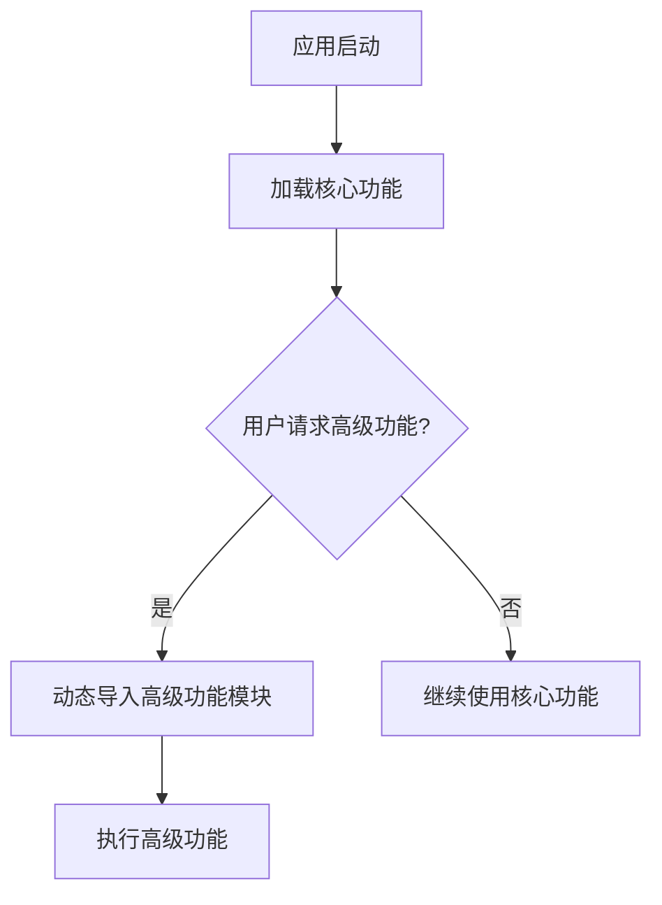

# JavaScript 动态导入

## 什么是动态导入？

JavaScript动态导入是ES2020（ES11）标准的一部分，它允许我们在程序运行时按需导入模块，而不是在程序开始执行时就加载所有模块。这种方式使得代码分割和懒加载成为可能，从而提高了应用程序的性能和用户体验。

传统的静态导入语句（`import`）必须位于模块的顶部，并在程序执行前完成导入操作。而动态导入函数 `import()` 可以在代码的任何位置调用，根据条件导入模块，并返回一个Promise对象。

:::tip
动态导入不仅提高了性能，还使代码更加灵活，因为你可以基于用户行为或特定条件来决定何时加载模块。
:::

## 静态导入 vs 动态导入

在了解动态导入之前，让我们先看看传统的静态导入方式：

```javascript
// 静态导入 - 必须位于模块顶部
import { someFunction } from './someModule.js';

// 在代码中使用导入的函数
someFunction();
```

而动态导入则是这样的：

```javascript
// 动态导入 - 可以在任何需要的地方使用
button.addEventListener('click', async () => {
  // 仅在用户点击按钮后才导入模块
  const { someFunction } = await import('./someModule.js');
  someFunction();
});
```

## 动态导入的语法

动态导入使用 `import()` 函数，它接受一个参数：模块的路径字符串。

```javascript
import(modulePath)
  .then(module => {
    // 使用导入的模块
  })
  .catch(error => {
    // 处理导入错误
  });
```

由于 `import()` 返回一个Promise，你也可以使用async/await语法：

```javascript
async function loadModule() {
  try {
    const module = await import(modulePath);
    // 使用导入的模块
  } catch (error) {
    // 处理导入错误
  }
}
```

## 动态导入的特点

1. **按需加载**：只在需要时加载模块，减少初始加载时间
2. **条件导入**：可以基于条件决定是否或何时加载模块
3. **返回Promise**：处理异步加载情况
4. **支持模块命名空间**：可以访问模块的所有导出
5. **支持代码分割**：与打包工具如Webpack配合实现代码分割

## 实际示例

### 示例1：基本用法

```javascript
// 基本的动态导入用法
const loadData = async () => {
  // 只有在需要时才导入math模块
  const math = await import('./math.js');
  console.log('2 + 3 =', math.add(2, 3));
  console.log('2 * 3 =', math.multiply(2, 3));
};

// 调用函数
loadData();
```

在上面的示例中，`math.js` 模块只有在 `loadData` 函数被调用时才会加载。

### 示例2：按条件导入不同模块

```javascript
// 根据用户选择的主题导入不同的样式模块
async function loadTheme(themeName) {
  try {
    if (themeName === 'dark') {
      const { applyDarkTheme } = await import('./darkTheme.js');
      applyDarkTheme();
    } else {
      const { applyLightTheme } = await import('./lightTheme.js');
      applyLightTheme();
    }
    console.log(`已加载${themeName === 'dark' ? '深色' : '浅色'}主题`);
  } catch (error) {
    console.error('加载主题失败:', error);
  }
}

// 用户选择主题后调用
document.getElementById('darkThemeBtn').addEventListener('click', () => {
  loadTheme('dark');
});

document.getElementById('lightThemeBtn').addEventListener('click', () => {
  loadTheme('light');
});
```

### 示例3：结合按钮点击的延迟加载

```javascript
// HTML中有一个按钮：<button id="loadChartBtn">加载图表</button>

document.getElementById('loadChartBtn').addEventListener('click', async () => {
  try {
    // 显示加载指示器
    const loadingIndicator = document.createElement('p');
    loadingIndicator.textContent = '正在加载图表库...';
    document.body.appendChild(loadingIndicator);
    
    // 动态导入图表库
    const { Chart } = await import('./chartLibrary.js');
    
    // 移除加载指示器
    document.body.removeChild(loadingIndicator);
    
    // 使用导入的库创建图表
    const chart = new Chart('chartContainer', {
      data: [10, 20, 30, 40, 50],
      type: 'bar'
    });
    
    chart.render();
    console.log('图表已加载并渲染');
  } catch (error) {
    console.error('加载图表库失败:', error);
  }
});
```

## 动态导入的实际应用场景

1. **大型应用中的路由懒加载**：

```javascript
// 路由配置中使用动态导入
const routes = [
  {
    path: '/',
    component: () => import('./views/Home.js')
  },
  {
    path: '/about',
    component: () => import('./views/About.js')
  },
  {
    path: '/dashboard',
    component: () => import('./views/Dashboard.js')
  }
];
```

2. **按需加载重量级功能**：



3. **多语言支持**：

```javascript
// 根据用户选择的语言动态加载语言包
async function setLanguage(lang) {
  try {
    // 动态导入对应的语言包
    const translations = await import(`./lang/${lang}.js`);
    
    // 应用翻译到界面
    document.querySelectorAll('[data-i18n]').forEach(element => {
      const key = element.getAttribute('data-i18n');
      if (translations.default[key]) {
        element.textContent = translations.default[key];
      }
    });
    
    console.log(`已切换到${lang}语言`);
  } catch (error) {
    console.error('加载语言包失败:', error);
  }
}

// 用户切换语言
document.getElementById('langSelector').addEventListener('change', (event) => {
  setLanguage(event.target.value);
});
```

## 性能优化与代码分割

动态导入是实现代码分割（Code Splitting）的关键技术。现代打包工具如Webpack、Rollup和Parcel能够识别 `import()` 调用，并自动将这些动态导入的模块分割成单独的文件（称为chunks）。

这样做的好处是：
1. 减少初始加载时间，因为浏览器只需下载核心功能所需的代码
2. 提高缓存效率，因为不同模块的变化不会影响其他模块的缓存
3. 按需加载功能，节省带宽和内存资源

:::caution
虽然动态导入可以提高性能，但过度使用也可能导致过多的HTTP请求，特别是在网络连接不稳定的情况下。应当根据实际需求合理使用。
:::

## 处理动态导入的错误

由于动态导入是异步操作，它可能会失败。因此，错误处理是很重要的：

```javascript
import('./moduleA.js')
  .then(module => {
    // 成功导入
  })
  .catch(error => {
    console.error('模块导入失败:', error);
    // 提供后备功能或显示错误消息给用户
    showErrorNotification('无法加载所需功能，请检查网络连接后重试。');
  });
```

## 与顶层await结合使用

在ES2022中，我们可以在模块顶层使用await，这使得使用动态导入变得更加简洁：

```javascript
// 在模块顶层使用await导入
const messages = await import('./messages.js');
console.log(messages.default);

// 其余代码会等待导入完成后执行
```

:::note
顶层await目前不是所有环境都支持，使用前请确保你的环境（浏览器或Node.js版本）支持此功能。
:::

## 总结

JavaScript动态导入是一项强大的功能，它允许我们：

- 按需加载模块，提高应用性能
- 根据条件导入不同的模块，增加代码的灵活性
- 实现代码分割，优化资源利用
- 延迟加载非核心功能，提升初始加载速度

通过合理使用动态导入，你可以显著提高Web应用的性能和用户体验。在现代前端框架中，这项技术已经成为实现高效应用的标准做法。

## 练习与挑战

1. 创建一个简单的应用，包含"计算器"和"待办事项"两个功能，使用动态导入按需加载这两个功能模块。
2. 实现一个图片库应用，当用户点击"高级编辑"按钮时，动态导入图片编辑功能。
3. 创建一个支持多语言的简单网页，使用动态导入加载不同的语言包。

## 延伸阅读

- [MDN Web文档: 动态导入](https://developer.mozilla.org/zh-CN/docs/Web/JavaScript/Reference/Statements/import)
- [TC39 提案: 动态导入](https://github.com/tc39/proposal-dynamic-import)
- [Webpack文档: 代码分割](https://webpack.js.org/guides/code-splitting/)

掌握动态导入将帮助你构建更高效、更灵活的JavaScript应用。随着Web应用规模和复杂度的增长，这项技术将变得越来越重要。