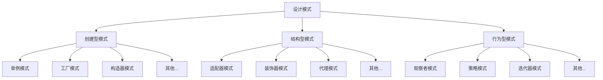

# JavaScript 设计模式基础

## 什么是设计模式？

设计模式是软件开发过程中常见问题的可重用解决方案。它们是经过时间检验的编程经验总结，可以帮助我们编写更优雅、可维护、可扩展的代码。在JavaScript这种灵活多变的语言中，理解并应用设计模式尤为重要。

:::note
设计模式并不是具体的代码实现，而是解决特定问题的思路和方法。不同语言中的设计模式可能实现方式不同，但核心思想相同。
:::

## 为什么要学习设计模式？

作为一名JavaScript开发者，学习设计模式有以下好处：

1. **提高代码质量** - 设计模式提供了经过验证的解决方案，使代码更加稳定
2. **加快开发速度** - 无需"重新发明轮子"
3. **促进团队协作** - 共同的模式语言使团队成员更容易理解彼此的代码
4. **增强代码可维护性** - 结构清晰的代码更容易维护和扩展
5. **适应变化** - 良好的设计模式使代码更容易适应需求变化

## 设计模式的分类

根据《设计模式：可复用面向对象软件的基础》(Gang of Four, GoF)一书，设计模式主要分为三大类：



## JavaScript 中的常见设计模式

下面我们将介绍几种在JavaScript开发中最常用的设计模式：

### 1. 构造器模式

构造器模式用于创建特定类型的对象，同时确保对象被正确初始化。

```javascript
// 构造器模式示例
function Person(name, age) {
  this.name = name;
  this.age = age;
  
  this.sayHello = function() {
    return `你好，我是${this.name}，今年${this.age}岁`;
  };
}

// 使用
const person1 = new Person("张三", 25);
const person2 = new Person("李四", 30);

console.log(person1.sayHello()); // 输出: 你好，我是张三，今年25岁
console.log(person2.sayHello()); // 输出: 你好，我是李四，今年30岁
```

在ES6中，我们可以使用Class语法糖来实现同样的功能：

```javascript
class Person {
  constructor(name, age) {
    this.name = name;
    this.age = age;
  }
  
  sayHello() {
    return `你好，我是${this.name}，今年${this.age}岁`;
  }
}

const person = new Person("王五", 28);
console.log(person.sayHello()); // 输出: 你好，我是王五，今年28岁
```

### 2. 模块模式

模块模式利用闭包实现私有变量和方法，只暴露必要的接口。这是JavaScript中实现封装的经典方式。

```javascript
// 模块模式示例
const counterModule = (function() {
  // 私有变量
  let count = 0;
  
  // 私有方法
  function checkCount() {
    if(count < 0) count = 0;
  }
  
  // 公共接口
  return {
    increment() {
      count++;
      return count;
    },
    decrement() {
      count--;
      checkCount();
      return count;
    },
    getCount() {
      return count;
    }
  };
})();

console.log(counterModule.getCount());  // 输出: 0
console.log(counterModule.increment()); // 输出: 1
console.log(counterModule.increment()); // 输出: 2
console.log(counterModule.decrement()); // 输出: 1
console.log(counterModule.count);       // 输出: undefined (私有变量无法直接访问)
```

### 3. 观察者模式

观察者模式（也称为发布-订阅模式）允许对象（观察者）订阅事件，当事件发生时被通知。这种模式在前端开发中非常常见，比如事件处理和状态管理。

```javascript
// 简单的观察者模式实现
class EventEmitter {
  constructor() {
    this.events = {};
  }
  
  // 订阅事件
  on(eventName, callback) {
    if (!this.events[eventName]) {
      this.events[eventName] = [];
    }
    this.events[eventName].push(callback);
  }
  
  // 触发事件
  emit(eventName, data) {
    const eventCallbacks = this.events[eventName];
    if (eventCallbacks) {
      eventCallbacks.forEach(callback => {
        callback(data);
      });
    }
  }
  
  // 取消订阅
  off(eventName, callback) {
    if (this.events[eventName]) {
      this.events[eventName] = this.events[eventName].filter(
        cb => cb !== callback
      );
    }
  }
}

// 使用示例
const newsEmitter = new EventEmitter();

// 订阅事件
function sportNewsListener(news) {
  console.log(`体育新闻: ${news}`);
}

function techNewsListener(news) {
  console.log(`科技新闻: ${news}`);
}

newsEmitter.on('sport', sportNewsListener);
newsEmitter.on('tech', techNewsListener);

// 发布消息
newsEmitter.emit('sport', '中国队获得金牌！'); // 输出: 体育新闻: 中国队获得金牌！
newsEmitter.emit('tech', '新款iPhone发布');   // 输出: 科技新闻: 新款iPhone发布

// 取消订阅
newsEmitter.off('sport', sportNewsListener);
newsEmitter.emit('sport', '新的体育消息'); // 没有输出，因为已取消订阅
```

### 4. 单例模式

单例模式确保一个类只有一个实例，并提供一个全局访问点。这对于管理共享资源、配置对象或服务连接非常有用。

```javascript
// 单例模式示例
const Singleton = (function() {
  let instance;
  
  function createInstance() {
    // 私有成员
    const privateVariable = '这是私有变量';
    const privateMethod = function() {
      console.log('这是私有方法');
    };
    
    return {
      publicMethod: function() {
        console.log('这是公共方法');
        privateMethod();
      },
      getPrivateVariable: function() {
        return privateVariable;
      }
    };
  }
  
  return {
    getInstance: function() {
      if (!instance) {
        instance = createInstance();
      }
      return instance;
    }
  };
})();

// 测试单例
const instance1 = Singleton.getInstance();
const instance2 = Singleton.getInstance();

console.log(instance1 === instance2); // 输出: true，表明是同一个实例

instance1.publicMethod(); // 输出: 这是公共方法 然后是 这是私有方法
console.log(instance1.getPrivateVariable()); // 输出: 这是私有变量
```

### 5. 工厂模式

工厂模式用于创建对象而无需指定创建对象的确切类或构造函数。这在需要根据不同条件创建不同类型的对象时特别有用。

```javascript
// 工厂模式示例
function UserFactory() {
  this.createUser = function(type, userData) {
    let user;
    
    if (type === 'admin') {
      user = new AdminUser(userData);
    } else if (type === 'regular') {
      user = new RegularUser(userData);
    } else {
      user = new GuestUser();
    }
    
    return user;
  }
}

function AdminUser(data) {
  this.name = data.name;
  this.permissions = ['read', 'write', 'delete', 'admin'];
  this.role = 'admin';
}

function RegularUser(data) {
  this.name = data.name;
  this.permissions = ['read', 'write'];
  this.role = 'regular';
}

function GuestUser() {
  this.name = 'Guest';
  this.permissions = ['read'];
  this.role = 'guest';
}

// 使用工厂模式
const userFactory = new UserFactory();
const adminUser = userFactory.createUser('admin', { name: '管理员' });
const regularUser = userFactory.createUser('regular', { name: '普通用户' });
const guestUser = userFactory.createUser('guest');

console.log(adminUser.role, adminUser.permissions); 
// 输出: admin ['read', 'write', 'delete', 'admin']

console.log(regularUser.role, regularUser.permissions); 
// 输出: regular ['read', 'write']

console.log(guestUser.role, guestUser.permissions); 
// 输出: guest ['read']
```

## 实际应用案例

### React中的设计模式应用

React框架中使用了多种设计模式：

1. **组件模式** - React组件本身就是一种设计模式，将UI拆分成独立、可复用的部分
2. **高阶组件(HOC)** - 装饰器模式的应用
3. **Context API** - 观察者模式的实现
4. **Redux** - 状态管理库使用了观察者模式和单例模式

### Vue中的设计模式应用

Vue框架同样使用了许多设计模式：

1. **MVVM模式** - Vue的核心架构
2. **观察者模式** - Vue的响应式系统
3. **工厂模式** - Vue.component注册组件
4. **装饰器模式** - Vue指令系统

### 前端项目实际案例

让我们看一个简单的前端项目如何利用设计模式解决实际问题：

:::tip 实际案例：用户认证系统
假设我们正在构建一个需要用户认证的Web应用。我们可以使用单例模式来管理用户会话：
:::

```javascript
// auth.js - 用户认证系统
const AuthService = (function() {
  let instance;
  
  function init() {
    // 私有变量
    let currentUser = null;
    let isAuthenticated = false;
    
    // 从localStorage加载用户会话（如果存在）
    try {
      const savedUser = localStorage.getItem('user');
      if (savedUser) {
        currentUser = JSON.parse(savedUser);
        isAuthenticated = true;
      }
    } catch (e) {
      console.error('无法加载用户会话', e);
    }
    
    // 公共接口
    return {
      login(username, password) {
        // 在实际应用中，这里应当调用API
        return new Promise((resolve, reject) => {
          // 模拟API调用
          setTimeout(() => {
            if (username && password) {
              currentUser = {
                username,
                name: `${username}的账户`,
                loginTime: new Date()
              };
              isAuthenticated = true;
              localStorage.setItem('user', JSON.stringify(currentUser));
              resolve(currentUser);
            } else {
              reject(new Error('无效的凭据'));
            }
          }, 300);
        });
      },
      
      logout() {
        currentUser = null;
        isAuthenticated = false;
        localStorage.removeItem('user');
        return Promise.resolve();
      },
      
      isAuthenticated() {
        return isAuthenticated;
      },
      
      getCurrentUser() {
        return currentUser;
      }
    };
  }
  
  return {
    getInstance: function() {
      if (!instance) {
        instance = init();
      }
      return instance;
    }
  };
})();

// 使用示例
const auth = AuthService.getInstance();

// 在登录表单提交时
document.getElementById('loginForm')?.addEventListener('submit', async (e) => {
  e.preventDefault();
  const username = document.getElementById('username').value;
  const password = document.getElementById('password').value;
  
  try {
    const user = await auth.login(username, password);
    console.log('登录成功', user);
    // 更新UI状态
  } catch (error) {
    console.error('登录失败', error);
    // 显示错误消息
  }
});

// 检查登录状态
if (auth.isAuthenticated()) {
  console.log('用户已登录', auth.getCurrentUser());
  // 显示已登录UI
} else {
  console.log('用户未登录');
  // 显示登录表单
}
```

在这个例子中，我们使用单例模式创建了一个认证服务，确保整个应用只有一个认证状态，避免了状态不一致的问题。

## 总结

设计模式是提高代码质量和可维护性的重要工具。在JavaScript开发中，理解并应用这些模式可以帮助我们：

1. 编写更清晰、更有组织的代码
2. 解决常见编程问题
3. 提高代码重用性
4. 降低代码耦合度
5. 使代码更容易扩展和维护

不过，重要的是记住：设计模式是工具，而不是目标。不要为了使用设计模式而使用设计模式，而是在需要时选择合适的模式来解决特定问题。

随着你的经验增长，你会逐渐识别出何时使用哪种设计模式，甚至可能创建自己的模式来解决特定问题。

## 练习与资源

### 练习

1. **单例模式练习**：创建一个简单的配置管理器，使用单例模式确保整个应用使用相同的配置。

2. **观察者模式练习**：实现一个简单的股票价格跟踪器，当价格变化时通知订阅者。

3. **模块模式练习**：创建一个计算器模块，包含基本算术功能，同时保护内部状态。

### 进一步学习的资源

- 《JavaScript设计模式与开发实践》- 曾探著
- 《Learning JavaScript Design Patterns》- Addy Osmani
- [JavaScript.info](https://javascript.info/) - 现代JavaScript教程
- [Design Patterns in JavaScript](https://www.patterns.dev/posts) - Patterns.dev提供的设计模式资源

记住，掌握设计模式需要时间和实践。从基础开始，逐步将这些模式应用到你的项目中，你会发现它们如何改善你的代码质量和开发效率。