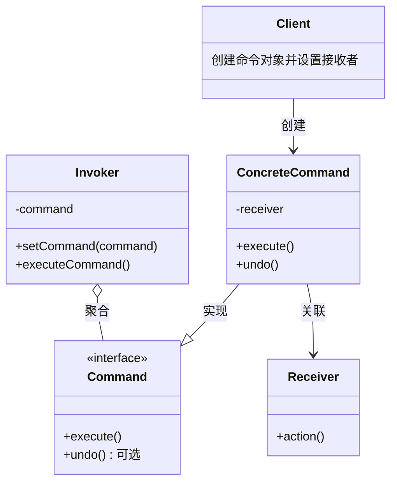

# JavaScript 命令模式

## 介绍

命令模式是一种行为设计模式，它将请求封装为一个对象，从而使你可以用不同的请求对客户进行参数化，对请求排队或记录请求日志，以及支持可撤销操作。简单来说，它将"请求"封装成对象，以便使用不同的请求、队列或者日志来参数化其他对象，同时支持可撤销的操作。

命令模式的核心思想是**将动作请求者与动作执行者解耦**。

:::tip
命令模式的关键点在于：将命令（操作）封装成一个对象，这个对象包含了执行命令的所有信息。
:::

## 命令模式的基本结构

命令模式主要包含以下几个角色：



- **命令(Command)**：声明执行操作的接口。
- **具体命令(ConcreteCommand)**：实现命令接口，通常会持有接收者，并调用接收者的功能来完成命令要执行的操作。
- **接收者(Receiver)**：知道如何实施与执行一个请求相关的操作。
- **调用者(Invoker)**：要求命令对象执行请求。
- **客户端(Client)**：创建具体命令对象并设定它的接收者。

## JavaScript 中的命令模式实现

在JavaScript中，由于其函数式特性，实现命令模式会比较灵活。下面通过一个简单的例子来说明：

```javascript
// 接收者
class Light {
  constructor(location) {
    this.location = location;
    this.status = "off";
  }
  
  turnOn() {
    this.status = "on";
    console.log(`${this.location} light is now ${this.status}`);
  }
  
  turnOff() {
    this.status = "off";
    console.log(`${this.location} light is now ${this.status}`);
  }
}

// 命令接口（JavaScript中可以省略，这里为了说明概念）
class Command {
  execute() {}
  undo() {}
}

// 具体命令 - 开灯命令
class TurnOnCommand {
  constructor(light) {
    this.light = light;
  }
  
  execute() {
    this.light.turnOn();
  }
  
  undo() {
    this.light.turnOff();
  }
}

// 具体命令 - 关灯命令
class TurnOffCommand {
  constructor(light) {
    this.light = light;
  }
  
  execute() {
    this.light.turnOff();
  }
  
  undo() {
    this.light.turnOn();
  }
}

// 调用者 - 遥控器
class RemoteControl {
  constructor() {
    this.command = null;
  }
  
  setCommand(command) {
    this.command = command;
  }
  
  pressButton() {
    this.command.execute();
  }
  
  pressUndoButton() {
    this.command.undo();
  }
}

// 客户端代码
const bedroomLight = new Light("Bedroom");
const kitchenLight = new Light("Kitchen");

const turnOnBedroomLight = new TurnOnCommand(bedroomLight);
const turnOffBedroomLight = new TurnOffCommand(bedroomLight);
const turnOnKitchenLight = new TurnOnCommand(kitchenLight);
const turnOffKitchenLight = new TurnOffCommand(kitchenLight);

// 使用遥控器控制灯
const remote = new RemoteControl();

// 打开卧室灯
remote.setCommand(turnOnBedroomLight);
remote.pressButton();  // 输出: Bedroom light is now on

// 关闭卧室灯
remote.setCommand(turnOffBedroomLight);
remote.pressButton();  // 输出: Bedroom light is now off

// 打开厨房灯
remote.setCommand(turnOnKitchenLight);
remote.pressButton();  // 输出: Kitchen light is now on

// 撤销上一个操作（关闭厨房灯）
remote.pressUndoButton();  // 输出: Kitchen light is now off
```

## 更简洁的JavaScript实现

JavaScript的函数是一等公民，我们可以使用函数直接作为命令，使实现更加简洁：

```javascript
// 接收者
class Light {
  constructor(location) {
    this.location = location;
    this.status = "off";
  }
  
  turnOn() {
    this.status = "on";
    console.log(`${this.location} light is now ${this.status}`);
  }
  
  turnOff() {
    this.status = "off";
    console.log(`${this.location} light is now ${this.status}`);
  }
}

// 命令工厂
function createCommand(receiver, action, undoAction) {
  return {
    execute: () => receiver[action](),
    undo: () => receiver[undoAction]()
  };
}

// 调用者
class RemoteControl {
  constructor() {
    this.commands = {};
    this.history = [];
  }
  
  setCommand(slot, command) {
    this.commands[slot] = command;
  }
  
  executeCommand(slot) {
    const command = this.commands[slot];
    if (command) {
      command.execute();
      this.history.push(command);
    }
  }
  
  undoLastCommand() {
    const command = this.history.pop();
    if (command) {
      command.undo();
    }
  }
}

// 客户端代码
const bedroomLight = new Light("Bedroom");
const kitchenLight = new Light("Kitchen");

const remote = new RemoteControl();

// 设置命令
remote.setCommand("bedroom-on", createCommand(bedroomLight, "turnOn", "turnOff"));
remote.setCommand("bedroom-off", createCommand(bedroomLight, "turnOff", "turnOn"));
remote.setCommand("kitchen-on", createCommand(kitchenLight, "turnOn", "turnOff"));
remote.setCommand("kitchen-off", createCommand(kitchenLight, "turnOff", "turnOn"));

// 使用命令
remote.executeCommand("bedroom-on");    // 输出: Bedroom light is now on
remote.executeCommand("kitchen-on");    // 输出: Kitchen light is now on
remote.executeCommand("bedroom-off");   // 输出: Bedroom light is now off

// 撤销最后一个命令
remote.undoLastCommand();               // 输出: Bedroom light is now on
```

## 命令模式的实际应用场景

### 1. 菜单和按钮操作

命令模式常用于实现GUI中的菜单项和按钮点击操作。每个菜单项或按钮可以封装为一个命令对象，使得UI元素与实际执行的操作分离。

```javascript
// 简单的菜单系统
class MenuItem {
  constructor(command) {
    this.command = command;
  }
  
  click() {
    this.command.execute();
  }
}

// 文档操作的接收者
class Document {
  cut() {
    console.log("Document: 剪切内容");
  }
  
  copy() {
    console.log("Document: 复制内容");
  }
  
  paste() {
    console.log("Document: 粘贴内容");
  }
}

// 命令类
class CutCommand {
  constructor(document) {
    this.document = document;
  }
  
  execute() {
    this.document.cut();
  }
}

class CopyCommand {
  constructor(document) {
    this.document = document;
  }
  
  execute() {
    this.document.copy();
  }
}

class PasteCommand {
  constructor(document) {
    this.document = document;
  }
  
  execute() {
    this.document.paste();
  }
}

// 客户端代码
const doc = new Document();

const cutMenuItem = new MenuItem(new CutCommand(doc));
const copyMenuItem = new MenuItem(new CopyCommand(doc));
const pasteMenuItem = new MenuItem(new PasteCommand(doc));

// 用户点击菜单
cutMenuItem.click();    // 输出: Document: 剪切内容
copyMenuItem.click();   // 输出: Document: 复制内容
pasteMenuItem.click();  // 输出: Document: 粘贴内容
```

### 2. 任务队列

命令模式可以用于实现任务队列，其中命令在稍后执行，或者按特定顺序执行。

```javascript
class TaskRunner {
  constructor() {
    this.tasks = [];
  }
  
  addTask(task) {
    this.tasks.push(task);
  }
  
  run() {
    if (this.tasks.length === 0) {
      console.log("没有任务要执行");
      return;
    }
    
    // 执行队列中的所有任务
    this.tasks.forEach(task => task.execute());
    
    // 清空队列
    this.tasks = [];
  }
}

// 任务命令
class Task {
  constructor(name, action) {
    this.name = name;
    this.action = action;
  }
  
  execute() {
    console.log(`执行任务: ${this.name}`);
    this.action();
  }
}

// 使用任务队列
const taskRunner = new TaskRunner();

// 添加任务
taskRunner.addTask(new Task("发送邮件", () => console.log("邮件已发送")));
taskRunner.addTask(new Task("生成报告", () => console.log("报告已生成")));
taskRunner.addTask(new Task("备份数据", () => console.log("数据已备份")));

// 稍后运行所有任务
setTimeout(() => {
  taskRunner.run();
  // 输出:
  // 执行任务: 发送邮件
  // 邮件已发送
  // 执行任务: 生成报告
  // 报告已生成
  // 执行任务: 备份数据
  // 数据已备份
}, 1000);
```

### 3. 撤销操作

命令模式的一个常见应用是实现撤销功能，例如在文本编辑器或图形应用程序中。

```javascript
class Editor {
  constructor() {
    this.content = '';
    this.history = [];
  }
  
  executeCommand(command) {
    command.execute();
    this.history.push(command);
  }
  
  undo() {
    const command = this.history.pop();
    if (command) {
      command.undo();
    } else {
      console.log("没有可撤销的操作");
    }
  }
  
  getContent() {
    return this.content;
  }
  
  setContent(content) {
    this.content = content;
  }
}

class AddTextCommand {
  constructor(editor, text) {
    this.editor = editor;
    this.text = text;
    this.previousContent = null;
  }
  
  execute() {
    this.previousContent = this.editor.getContent();
    this.editor.setContent(this.previousContent + this.text);
    console.log(`添加文本: "${this.text}"`);
  }
  
  undo() {
    this.editor.setContent(this.previousContent);
    console.log("撤销添加文本");
  }
}

class DeleteTextCommand {
  constructor(editor, charCount) {
    this.editor = editor;
    this.charCount = charCount;
    this.deletedText = '';
    this.previousContent = null;
  }
  
  execute() {
    this.previousContent = this.editor.getContent();
    const newContent = this.previousContent.slice(0, -this.charCount);
    this.deletedText = this.previousContent.slice(-this.charCount);
    this.editor.setContent(newContent);
    console.log(`删除文本: "${this.deletedText}"`);
  }
  
  undo() {
    this.editor.setContent(this.previousContent);
    console.log(`恢复删除的文本: "${this.deletedText}"`);
  }
}

// 使用编辑器和命令
const editor = new Editor();

// 添加文本
editor.executeCommand(new AddTextCommand(editor, "Hello, "));
console.log(editor.getContent()); // 输出: Hello, 

// 继续添加文本
editor.executeCommand(new AddTextCommand(editor, "World!"));
console.log(editor.getContent()); // 输出: Hello, World!

// 删除最后一个单词
editor.executeCommand(new DeleteTextCommand(editor, 6));
console.log(editor.getContent()); // 输出: Hello, 

// 撤销删除操作
editor.undo();
console.log(editor.getContent()); // 输出: Hello, World!

// 再次撤销
editor.undo();
console.log(editor.getContent()); // 输出: Hello, 
```

## 命令模式的优缺点

### 优点

1. **解耦**: 将请求发送者和接收者解耦，使得发送者和接收者之间没有直接引用关系。
2. **扩展性**: 容易扩展新命令或修改现有命令，而不影响客户端代码。
3. **组合命令**: 可以将多个命令组合成一个复合命令（宏命令）。
4. **撤销/重做**: 可以实现撤销和重做功能。
5. **队列和延迟**: 支持请求队列、请求日志和延迟执行。

### 缺点

1. **类数量增加**: 每个具体命令都需要一个单独的类，可能导致类的数量增加。
2. **复杂度**: 对于简单的操作，引入命令模式可能过于复杂。

## 总结

命令模式是一种将请求封装为对象的行为设计模式，通过这种封装，可以将请求参数化、支持撤销操作，并且将请求的发送者和接收者解耦。在JavaScript中，由于函数是一等公民，命令模式的实现可以更加简洁灵活。

命令模式常用于以下场景：
- 需要抽象出待执行的动作，使其参数化
- 需要支持撤销、重做等操作
- 需要将请求排队、记录请求日志
- 需要支持事务操作

通过命令模式，可以让我们的代码更加灵活、可扩展，并且更容易维护，特别是在需要处理复杂请求、撤销机制或者延迟执行的情况下。

## 练习

1. 实现一个简单的计算器，支持加、减、乘、除四种操作，并且能够撤销上一步操作。
2. 设计一个游戏角色控制系统，使用命令模式实现角色的移动、攻击、防御等动作。
3. 实现一个简单的绘图应用，支持画线、画矩形、画圆等操作，并且能够撤销和重做。

## 进一步学习资源

:::tip 推荐阅读
- 《JavaScript设计模式与开发实践》 - 曾探
- 《Head First 设计模式》 - Eric Freeman, Elisabeth Robson
- 《设计模式：可复用面向对象软件的基础》 - Erich Gamma等
:::

掌握命令模式将帮助你编写更加灵活、可维护的代码，特别是在处理复杂交互或需要支持撤销操作的应用程序中。记住，设计模式是解决特定问题的方案，在适当的场景中应用它们才能发挥最大的价值。