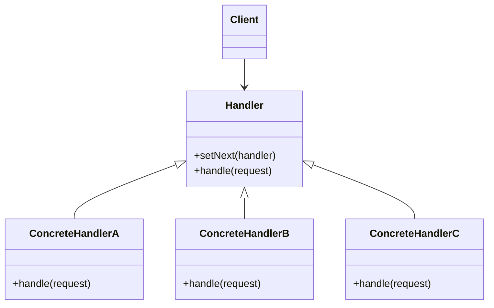

# JavaScript 责任链模式

## 什么是责任链模式？

责任链模式（Chain of Responsibility Pattern）是一种行为设计模式，它允许多个对象有机会处理请求，从而避免请求的发送者和接收者之间的耦合关系。将这些对象连接成一条链，并沿着这条链传递请求，直到有一个对象能够处理它为止。

这种模式的核心思想是：**将处理请求的对象连成一条链，请求沿着这条链传递，直到有对象处理它**。

:::tip
责任链模式非常适合处理一系列可能由不同对象处理的请求，尤其是当你事先不知道哪个对象应该处理请求的情况。
:::

## 责任链模式的结构



在责任链模式中，通常包含以下角色：

1. **处理者接口（Handler）**：定义了处理请求的方法，以及设置下一个处理者的方法。
2. **具体处理者（Concrete Handler）**：实现处理者接口，负责处理能处理的请求，如果不能处理则转发给下一个处理者。
3. **客户端（Client）**：创建责任链，并向链中的第一个处理者发送请求。

## JavaScript 实现责任链模式

下面展示一个简单的责任链模式示例，模拟一个日志系统，根据消息的级别来决定由哪个处理者处理：

```javascript
// 创建处理者基类
class LogHandler {
  constructor() {
    this.nextHandler = null;
  }

  // 设置下一个处理者
  setNext(handler) {
    this.nextHandler = handler;
    // 返回处理者，支持链式调用
    return handler;
  }

  // 处理请求
  logMessage(level, message) {
    // 如果有下一个处理者，则转发请求
    if (this.nextHandler) {
      return this.nextHandler.logMessage(level, message);
    }
    
    // 默认实现，如果没有处理者能处理该请求
    return null;
  }
}

// 创建具体处理者 - INFO级别日志处理者
class InfoLogHandler extends LogHandler {
  logMessage(level, message) {
    if (level === 'INFO') {
      console.log(`INFO: ${message}`);
      return true;
    } else {
      // 调用父类方法，转发给下一个处理者
      return super.logMessage(level, message);
    }
  }
}

// 创建具体处理者 - DEBUG级别日志处理者
class DebugLogHandler extends LogHandler {
  logMessage(level, message) {
    if (level === 'DEBUG') {
      console.log(`DEBUG: ${message}`);
      return true;
    } else {
      return super.logMessage(level, message);
    }
  }
}

// 创建具体处理者 - ERROR级别日志处理者
class ErrorLogHandler extends LogHandler {
  logMessage(level, message) {
    if (level === 'ERROR') {
      console.log(`ERROR: ${message}`);
      return true;
    } else {
      return super.logMessage(level, message);
    }
  }
}

// 创建责任链
const logger = new InfoLogHandler();
const debugLogger = new DebugLogHandler();
const errorLogger = new ErrorLogHandler();

// 构建链
logger.setNext(debugLogger).setNext(errorLogger);

// 使用责任链处理请求
logger.logMessage('INFO', '这是一条信息日志'); // 输出: INFO: 这是一条信息日志
logger.logMessage('DEBUG', '这是一条调试日志'); // 输出: DEBUG: 这是一条调试日志
logger.logMessage('ERROR', '这是一条错误日志'); // 输出: ERROR: 这是一条错误日志
logger.logMessage('WARN', '这是一条警告日志');  // 没有处理者能处理，返回 null
```

输出结果：

```
INFO: 这是一条信息日志
DEBUG: 这是一条调试日志
ERROR: 这是一条错误日志
```

## 责任链模式的优点

1. **解耦发送者与接收者**：发送者不需要知道谁会处理请求，接收者也不需要知道请求来源。
2. **增加灵活性**：可以动态地组织和改变处理者之间的顺序。
3. **符合开闭原则**：可以在不修改现有代码的情况下，通过添加新的处理者来扩展功能。
4. **责任分担**：每个处理者只需关注自己能够处理的请求类型。

## 责任链模式的缺点

1. **请求可能未被处理**：如果责任链设计不当，请求可能在链末尾仍未被处理。
2. **性能问题**：在链较长的情况下，请求可能需要经过多个处理者，影响性能。
3. **调试困难**：请求在链中的传递路径不容易跟踪，可能增加调试难度。

## 实际应用场景

### 场景一：表单验证

表单验证是责任链模式的一个典型应用场景。我们可以创建多个验证器，每个验证器负责特定类型的验证，如必填字段验证、邮箱格式验证、密码复杂性验证等。

```javascript
class Validator {
  constructor() {
    this.nextValidator = null;
  }

  setNext(validator) {
    this.nextValidator = validator;
    return validator;
  }

  validate(data) {
    if (this.nextValidator) {
      return this.nextValidator.validate(data);
    }
    return true; // 默认验证通过
  }
}

class RequiredFieldValidator extends Validator {
  validate(data) {
    console.log('检查必填字段...');
    if (!data.username || !data.email) {
      console.error('用户名和邮箱为必填字段');
      return false;
    }
    return super.validate(data);
  }
}

class EmailFormatValidator extends Validator {
  validate(data) {
    console.log('检查邮箱格式...');
    const emailRegex = /^[^\s@]+@[^\s@]+\.[^\s@]+$/;
    if (!emailRegex.test(data.email)) {
      console.error('邮箱格式不正确');
      return false;
    }
    return super.validate(data);
  }
}

class PasswordValidator extends Validator {
  validate(data) {
    console.log('检查密码...');
    if (data.password && data.password.length < 8) {
      console.error('密码长度至少为8位');
      return false;
    }
    return super.validate(data);
  }
}

// 使用示例
const validator = new RequiredFieldValidator();
const emailValidator = new EmailFormatValidator();
const passwordValidator = new PasswordValidator();

validator.setNext(emailValidator).setNext(passwordValidator);

// 测试数据
const formData1 = {
  username: 'john_doe',
  email: 'invalid-email',
  password: 'pass'
};

const formData2 = {
  username: 'john_doe',
  email: 'john@example.com',
  password: 'password123'
};

console.log('验证表单1:');
const isValid1 = validator.validate(formData1);
console.log(`表单1验证结果: ${isValid1}`);

console.log('\n验证表单2:');
const isValid2 = validator.validate(formData2);
console.log(`表单2验证结果: ${isValid2}`);
```

输出结果：

```
验证表单1:
检查必填字段...
检查邮箱格式...
邮箱格式不正确
表单1验证结果: false

验证表单2:
检查必填字段...
检查邮箱格式...
检查密码...
表单2验证结果: true
```

### 场景二：中间件系统

Express.js 和 Koa.js 等 Node.js 框架中的中间件系统就是责任链模式的一个很好实现。每个中间件可以选择处理请求或将其传递给下一个中间件。

以下是一个简化的中间件系统示例：

```javascript
class MiddlewareChain {
  constructor() {
    this.middlewares = [];
  }

  use(middleware) {
    this.middlewares.push(middleware);
    return this;
  }

  executeRequest(request) {
    let index = 0;
    
    const next = () => {
      // 如果已经执行完所有中间件，则返回
      if (index >= this.middlewares.length) {
        return;
      }
      
      // 获取当前中间件
      const currentMiddleware = this.middlewares[index];
      index++;
      
      // 执行当前中间件
      return currentMiddleware(request, next);
    };
    
    return next();
  }
}

// 使用示例
const app = new MiddlewareChain();

// 日志中间件
app.use((request, next) => {
  console.log(`请求开始: ${request.url}`);
  next();
  console.log(`请求结束: ${request.url}`);
});

// 认证中间件
app.use((request, next) => {
  console.log(`检查认证...`);
  if (request.auth === 'valid') {
    next();
  } else {
    console.log('认证失败，请求被拒绝');
  }
});

// 业务逻辑中间件
app.use((request, next) => {
  console.log(`处理业务逻辑: ${request.action}`);
  next();
});

// 模拟请求
const validRequest = {
  url: '/api/data',
  auth: 'valid',
  action: '获取用户数据'
};

const invalidRequest = {
  url: '/api/admin',
  auth: 'invalid',
  action: '管理员操作'
};

console.log('处理有效请求:');
app.executeRequest(validRequest);

console.log('\n处理无效请求:');
app.executeRequest(invalidRequest);
```

输出结果：

```
处理有效请求:
请求开始: /api/data
检查认证...
处理业务逻辑: 获取用户数据
请求结束: /api/data

处理无效请求:
请求开始: /api/admin
检查认证...
认证失败，请求被拒绝
请求结束: /api/admin
```

## 何时使用责任链模式？

在以下情况下，责任链模式特别有用：

1. 当程序需要处理不同种类的请求，而且请求类型和顺序预先未知时
2. 当必须按特定顺序处理请求时
3. 当处理者集合需要能动态变化时
4. 当你不希望客户端指定请求的接收者时

## 总结

责任链模式是一种强大的行为设计模式，它通过将请求沿着处理者链进行传递，直到有一个处理者能够处理它，从而实现发送者和接收者之间的解耦。

这种模式在表单验证、事件处理、中间件系统等场景中非常有用。它符合单一职责原则和开闭原则，使代码更加灵活和可维护。

然而，设计不当的责任链可能会导致请求未被处理或性能问题，所以在实现时需要仔细考虑责任链的结构和处理逻辑。

## 练习

1. 实现一个购物折扣系统，根据不同条件（如会员等级、购买金额、促销活动）按照一定顺序应用不同的折扣规则。
2. 实现一个文档处理系统，能够处理不同格式的文档（如PDF、Word、Text），每种格式由不同的处理者负责。
3. 改进本文中的日志系统，添加一个可以处理所有级别日志的通用处理者，并使其成为责任链的最后一环。

## 进一步学习资源

- 《JavaScript设计模式与开发实践》- 曾探
- 《Head First 设计模式》- Freeman 等
- [Refactoring.Guru - 责任链模式](https://refactoring.guru/design-patterns/chain-of-responsibility)

通过学习和实践责任链模式，你将能够更有效地组织代码，处理复杂的请求流程，并创建更灵活、更可维护的应用程序。
