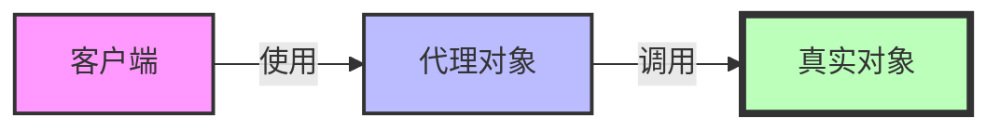

# JavaScript 代理模式

## 什么是代理模式？

代理模式是一种结构型设计模式，它允许你提供一个代替品或者占位符给原对象，以控制对这个原对象的访问。这个模式在很多场景中非常有用，比如延迟初始化、访问控制、日志记录、缓存等。

在JavaScript中，ES6引入了`Proxy`对象，使代理模式的实现变得更加简单和强大。

:::note
代理模式的核心思想：通过一个中间层（代理）控制对原始对象的访问。
:::

## ES6 Proxy对象基础

Proxy对象用于创建一个对象的代理，从而可以拦截该对象的基本操作，如属性查找、赋值、函数调用等。

### 基本语法

```javascript
const proxy = new Proxy(target, handler);
```

- `target`：要使用Proxy包装的目标对象（可以是任何类型的对象，包括原生数组，函数，甚至另一个代理）
- `handler`：一个通常以函数作为属性的对象，各属性中的函数分别定义了在执行各种操作时代理的行为

## 常用的Handler方法

1. **get**：属性读取操作的捕捉器
2. **set**：属性设置操作的捕捉器
3. **has**：in操作符的捕捉器
4. **deleteProperty**：delete操作符的捕捉器
5. **apply**：函数调用操作的捕捉器
6. **construct**：new操作符的捕捉器

## 基本示例

### 属性访问拦截

```javascript
const person = {
  name: "张三",
  age: 30
};

const personProxy = new Proxy(person, {
  get(target, property) {
    console.log(`正在获取${property}属性`);
    return property in target ? target[property] : `属性"${property}"不存在`;
  },
  
  set(target, property, value) {
    console.log(`正在设置${property}属性为${value}`);
    target[property] = value;
    return true; // 在严格模式下，如果set方法返回falsy值会抛出TypeError
  }
});

// 使用代理
console.log(personProxy.name); // 输出: 正在获取name属性 张三
console.log(personProxy.job);  // 输出: 正在获取job属性 属性"job"不存在

personProxy.age = 31;  // 输出: 正在设置age属性为31
console.log(personProxy.age); // 输出: 正在获取age属性 31
```

### 函数调用拦截

```javascript
function sum(a, b) {
  return a + b;
}

const sumProxy = new Proxy(sum, {
  apply(target, thisArg, argumentsList) {
    console.log(`调用函数，参数: ${argumentsList}`);
    return target.apply(thisArg, argumentsList);
  }
});

console.log(sumProxy(1, 2)); 
// 输出:
// 调用函数，参数: 1,2
// 3
```

## 实际应用场景

### 1. 数据验证

```javascript
const student = {
  name: "李四",
  age: 20
};

const studentProxy = new Proxy(student, {
  set(target, property, value) {
    if (property === 'age') {
      if (!Number.isInteger(value)) {
        throw new TypeError('年龄必须是整数');
      }
      if (value < 0 || value > 120) {
        throw new RangeError('年龄必须在0-120之间');
      }
    }
    
    target[property] = value;
    return true;
  }
});

try {
  studentProxy.age = "invalid"; // 抛出TypeError
} catch (e) {
  console.error(e.message); // 输出: 年龄必须是整数
}

try {
  studentProxy.age = 150; // 抛出RangeError
} catch (e) {
  console.error(e.message); // 输出: 年龄必须在0-120之间
}

studentProxy.age = 21; // 成功设置
console.log(student.age); // 输出: 21
```

### 2. 私有属性

```javascript
function createSecretHolder(secret) {
  const obj = {
    _secret: secret,
    getSecret: function() { return this._secret; },
    setSecret: function(value) { this._secret = value; }
  };
  
  return new Proxy(obj, {
    get(target, prop) {
      if (prop.startsWith('_')) {
        throw new Error('不能访问私有属性');
      }
      return target[prop];
    },
    
    set(target, prop, value) {
      if (prop.startsWith('_')) {
        throw new Error('不能修改私有属性');
      }
      target[prop] = value;
      return true;
    },
    
    has(target, prop) {
      return prop.startsWith('_') ? false : (prop in target);
    }
  });
}

const holder = createSecretHolder('秘密数据');
console.log(holder.getSecret()); // 输出: 秘密数据
holder.setSecret('新的秘密');
console.log(holder.getSecret()); // 输出: 新的秘密

try {
  console.log(holder._secret); // 抛出错误
} catch (e) {
  console.error(e.message); // 输出: 不能访问私有属性
}
```

### 3. 日志记录

```javascript
const api = {
  getUsers: function() { return ["用户1", "用户2", "用户3"]; },
  getUserById: function(id) { return `用户${id}`; }
};

const loggingProxy = new Proxy(api, {
  get(target, property) {
    return function(...args) {
      console.log(`调用方法: ${property}, 参数: ${args}`);
      const result = target[property].apply(this, args);
      console.log(`方法${property}返回:`, result);
      return result;
    };
  }
});

loggingProxy.getUsers();
// 输出:
// 调用方法: getUsers, 参数: 
// 方法getUsers返回: ["用户1", "用户2", "用户3"]

loggingProxy.getUserById(2);
// 输出:
// 调用方法: getUserById, 参数: 2
// 方法getUserById返回: 用户2
```

### 4. 缓存代理

```javascript
function createCacheProxy(target) {
  const cache = new Map();
  
  return new Proxy(target, {
    apply(target, thisArg, args) {
      const key = JSON.stringify(args);
      
      if (cache.has(key)) {
        console.log('使用缓存结果');
        return cache.get(key);
      }
      
      const result = target.apply(thisArg, args);
      cache.set(key, result);
      return result;
    }
  });
}

// 耗时函数
function fibonacci(n) {
  if (n <= 1) return n;
  return fibonacci(n - 1) + fibonacci(n - 2);
}

const cachedFib = createCacheProxy(fibonacci);

console.time('首次计算');
console.log(cachedFib(30)); // 第一次计算，较慢
console.timeEnd('首次计算');

console.time('使用缓存');
console.log(cachedFib(30)); // 使用缓存，非常快
console.timeEnd('使用缓存');
```

## 代理模式与其他模式的关系

让我们用图表来理解代理模式及其与原对象的关系：



## 代理模式的优缺点

### 优点
1. **控制访问**：可以控制对原对象的访问
2. **延迟加载**：可以实现懒加载，减少资源消耗
3. **额外功能**：可以在不修改原对象的情况下添加功能
4. **分离职责**：可以将辅助功能与核心业务分离

### 缺点
1. **性能影响**：代理会增加一层间接访问，可能会有轻微的性能损失
2. **复杂性**：增加了系统的复杂性
3. **调试困难**：使用代理后，调试可能会变得更加困难

## 总结

代理模式是JavaScript中一种非常有用的设计模式，特别是在ES6引入了`Proxy`对象后，实现起来变得更加简单和灵活。通过代理模式，我们可以在不修改原对象的情况下，拦截并控制对对象的访问，实现数据验证、访问控制、日志记录、缓存等功能。

在实际开发中，代理模式可以帮助我们解决很多问题，使代码更加健壮和可维护。但也要注意避免过度使用代理，以免增加不必要的复杂性和性能开销。

:::tip
记住，代理模式的核心是"控制访问"，而不是替代原对象的功能。
:::

## 练习

1. 创建一个代理，使数组的每个元素在访问时都会自动转换为大写（假设数组中都是字符串）。
2. 实现一个只读代理，不允许修改原对象的任何属性。
3. 创建一个代理，自动记录对象属性的所有变更历史。

## 进一步学习资源

- [MDN Web Docs - Proxy](https://developer.mozilla.org/zh-CN/docs/Web/JavaScript/Reference/Global_Objects/Proxy)
- [ES6 Proxies in Depth](https://ponyfoo.com/articles/es6-proxies-in-depth)
- [Proxy 和 Reflect](https://es6.ruanyifeng.com/#docs/proxy)