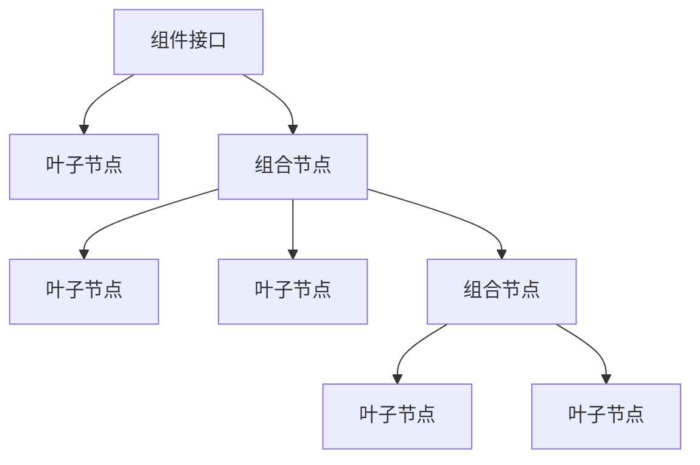

# JavaScript 组合模式

## 什么是组合模式？

组合模式（Composite Pattern）是一种结构型设计模式，它允许你将对象组合成树形结构来表示"部分-整体"的层次结构。这种模式让客户端可以统一对待单个对象和对象组合。

简单来说，组合模式就像是一个树形结构，其中的叶节点（单个对象）和分支节点（对象组合）实现相同的接口，使得客户端代码能够以一致的方式处理它们。



## 为什么使用组合模式？

组合模式在以下情况特别有用：

1. 你需要表示对象的部分-整体层次结构
2. 你希望客户端代码能够忽略单个对象和组合对象的差异
3. 你想以统一的方式处理所有对象

## 组合模式的基本结构

组合模式通常包含以下几个角色：

1. **组件（Component）**：声明组合中所有对象的共同接口
2. **叶子（Leaf）**：表示组合中的叶子节点对象（没有子节点）
3. **组合（Composite）**：表示有子节点的组件，实现了Component接口

## JavaScript 实现组合模式

让我们通过一个文件系统的例子来实现组合模式：

```javascript
// 组件接口 - 抽象基类
class FileSystemComponent {
  constructor(name) {
    this.name = name;
  }
  
  // 公共方法声明
  display(indent = 0) {
    // 子类必须实现
    throw new Error("子类必须实现display方法");
  }
  
  getName() {
    return this.name;
  }
  
  getSize() {
    // 子类必须实现
    throw new Error("子类必须实现getSize方法");
  }
}

// 叶子节点 - 文件
class File extends FileSystemComponent {
  constructor(name, size) {
    super(name);
    this.size = size; // 以KB为单位
  }
  
  display(indent = 0) {
    console.log(`${' '.repeat(indent)}📄 ${this.name} (${this.size}KB)`);
  }
  
  getSize() {
    return this.size;
  }
}

// 组合节点 - 文件夹
class Folder extends FileSystemComponent {
  constructor(name) {
    super(name);
    this.children = [];
  }
  
  add(component) {
    this.children.push(component);
    return this;
  }
  
  remove(component) {
    const componentIndex = this.children.indexOf(component);
    if (componentIndex !== -1) {
      this.children.splice(componentIndex, 1);
    }
    return this;
  }
  
  display(indent = 0) {
    console.log(`${' '.repeat(indent)}📁 ${this.name} (${this.getSize()}KB)`);
    
    // 递归显示所有子项
    this.children.forEach(child => {
      child.display(indent + 4);
    });
  }
  
  getSize() {
    // 计算文件夹大小为所有子项大小之和
    return this.children.reduce((sum, child) => sum + child.getSize(), 0);
  }
}

// 使用示例
const root = new Folder("Root");

const documentsFolder = new Folder("Documents");
const musicFolder = new Folder("Music");

const resume = new File("resume.pdf", 1024);
const coverLetter = new File("cover_letter.docx", 512);

const song1 = new File("song1.mp3", 4096);
const song2 = new File("song2.mp3", 4096);

// 组合对象
documentsFolder.add(resume).add(coverLetter);
musicFolder.add(song1).add(song2);

root.add(documentsFolder).add(musicFolder);

// 显示整个文件系统
root.display();

// 获取总大小
console.log(`总大小: ${root.getSize()}KB`);
```

输出结果：
```
📁 Root (9728KB)
    📁 Documents (1536KB)
        📄 resume.pdf (1024KB)
        📄 cover_letter.docx (512KB)
    📁 Music (8192KB)
        📄 song1.mp3 (4096KB)
        📄 song2.mp3 (4096KB)
总大小: 9728KB
```

## 组合模式的详细解析

让我们逐步理解组合模式的核心概念：

### 1. 统一接口

组合模式的关键在于创建一个统一的接口，使得客户端可以同等对待叶子节点和组合节点。在我们的例子中，`FileSystemComponent` 类定义了所有文件系统组件都应该实现的方法：

- `display()` - 显示组件
- `getName()` - 获取组件名称
- `getSize()` - 获取组件大小

### 2. 叶子节点

叶子节点是组合中的最小单位，它们不包含其他组件。在我们的例子中，`File` 类代表叶子节点：

- 它具有名称和大小属性
- 实现了 `display()` 方法来显示文件信息
- 实现了 `getSize()` 方法返回文件大小

### 3. 组合节点

组合节点可以包含其他节点（可以是叶子节点或其他组合节点）。在我们的例子中，`Folder` 类代表组合节点：

- 它维护一个子组件列表 `children`
- 提供 `add()` 和 `remove()` 方法来管理子组件
- 实现了 `display()` 方法，它递归地显示自身及其所有子组件
- 实现了 `getSize()` 方法，通过计算所有子组件大小的总和来获取自身大小

### 4. 递归组合

组合模式的强大之处在于它的递归结构。当我们调用组合节点的方法时，它通常会对其所有子节点调用相同的方法。这种递归行为使我们能够轻松处理复杂的树形结构。

在我们的例子中：
- 调用 `root.display()` 会触发整个树的显示
- 调用 `root.getSize()` 会计算整个树中所有文件的总大小

## 实际应用场景

组合模式在前端开发中有许多实际应用：

### 1. UI组件树

前端框架如React和Vue使用类似组合模式的概念来构建UI组件树：

```jsx
// React组件示例
const App = () => (
  <div>
    <Header />
    <MainContent>
      <Sidebar>
        <Navigation />
        <WidgetList>
          <Widget type="weather" />
          <Widget type="news" />
        </WidgetList>
      </Sidebar>
      <Article>
        <ArticleHeader />
        <ArticleContent />
        <Comments>
          <Comment id="1" />
          <Comment id="2" />
        </Comments>
      </Article>
    </MainContent>
    <Footer />
  </div>
);
```

### 2. 虚拟DOM

虚拟DOM也是组合模式的一个例子，其中每个节点都可以是一个元素（组合）或文本（叶子）：

```javascript
// 简化的虚拟DOM结构
const vdom = {
  type: 'div',
  props: { className: 'container' },
  children: [
    { type: 'h1', props: {}, children: ['标题'] },
    { 
      type: 'ul', 
      props: { className: 'list' },
      children: [
        { type: 'li', props: {}, children: ['项目1'] },
        { type: 'li', props: {}, children: ['项目2'] }
      ]
    }
  ]
};
```

### 3. 表单验证器

我们可以使用组合模式来创建复杂的表单验证规则：

```javascript
// 验证器组件
class Validator {
  validate(value) {
    throw new Error('子类必须实现validate方法');
  }
}

// 叶子验证器
class RequiredValidator extends Validator {
  validate(value) {
    return value !== undefined && value !== null && value !== '';
  }
}

class EmailValidator extends Validator {
  validate(value) {
    const emailRegex = /^[^\s@]+@[^\s@]+\.[^\s@]+$/;
    return emailRegex.test(value);
  }
}

// 组合验证器
class CompositeValidator extends Validator {
  constructor() {
    super();
    this.validators = [];
  }
  
  add(validator) {
    this.validators.push(validator);
    return this;
  }
  
  validate(value) {
    return this.validators.every(validator => validator.validate(value));
  }
}

// 使用示例
const emailFieldValidator = new CompositeValidator();
emailFieldValidator
  .add(new RequiredValidator())
  .add(new EmailValidator());

console.log(emailFieldValidator.validate('')); // false (不满足必填)
console.log(emailFieldValidator.validate('invalid')); // false (不是有效邮箱)
console.log(emailFieldValidator.validate('test@example.com')); // true
```

## 组合模式的优缺点

### 优点

1. **简化客户端代码**：客户端可以统一处理复杂的组合结构和简单的叶子节点
2. **易于添加新组件**：可以方便地向系统中添加新的组件类型
3. **符合开闭原则**：无需修改现有代码就可以引入新的组件类型

### 缺点

1. **可能过于笼统**：为组件定义通用接口可能会使设计变得过于笼统
2. **难以限制组件类型**：难以限制组合中可以包含的组件类型
3. **递归操作可能存在性能问题**：在大型树形结构中，递归操作可能会影响性能

## 何时使用组合模式

:::tip 使用场景提示
当你需要处理树结构，并且希望统一处理分支和叶子节点时，请考虑使用组合模式。
:::

以下场景适合使用组合模式：

1. 需要表示对象的部分-整体层次结构
2. 希望客户端忽略组合对象和单个对象的差异
3. 需要递归处理复杂的嵌套结构
4. 需要动态组合和管理组件树

## 总结

组合模式是一种强大的设计模式，它通过将对象组织成树形结构，使客户端能够统一处理单个对象和对象组合。这种模式特别适合表示具有层次结构的系统，如文件系统、UI组件树、菜单系统等。

在JavaScript中，组合模式通常通过创建基类（组件接口）以及继承自该基类的叶子类和组合类来实现。组合类通常包含子组件的集合，并且其方法会递归应用于所有子组件。

正确应用组合模式可以简化代码结构，提高代码复用性，并使系统更易于扩展和维护。

## 练习

1. 创建一个使用组合模式的菜单系统，包含菜单项和子菜单。
2. 实现一个HTML DOM树的简化版本，使用组合模式表示元素和文本节点。
3. 设计一个图形编辑器，其中可以组合基本图形（圆形、矩形等）来创建复杂图形。

## 进一步学习资源

- 《JavaScript设计模式》 - Addy Osmani
- 《Head First设计模式》 - Eric Freeman, Elisabeth Robson
- [JavaScript设计模式系列文章](https://www.patterns.dev/)（在线资源）

通过掌握组合模式，你将能够更有效地处理具有层次结构的系统，创建更灵活、更可维护的代码。