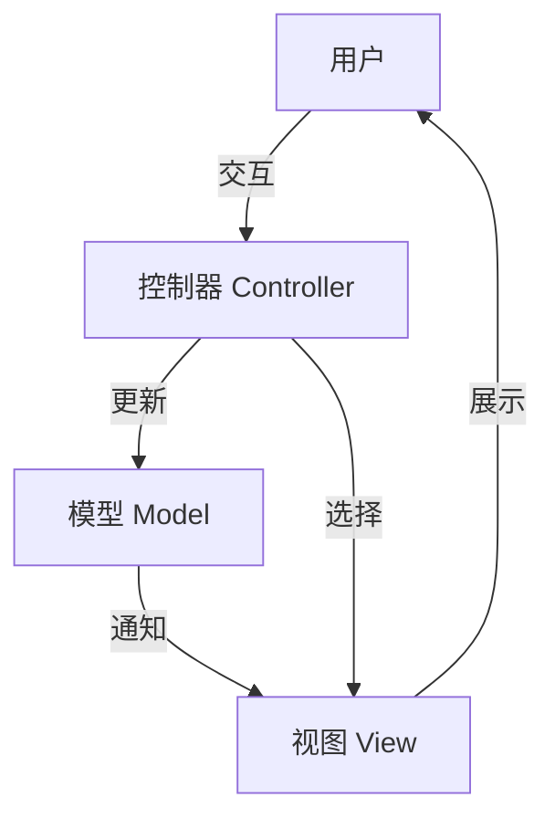

# JavaScript MVC模式

## 什么是MVC模式？

MVC (Model-View-Controller) 是一种软件架构设计模式，它将应用程序分成三个互相关联的组件：**模型(Model)**、**视图(View)**和**控制器(Controller)**。这种模式有助于实现关注点分离，使代码更加模块化、可维护和可扩展。



### MVC的三个组件

1. **模型(Model)**: 负责管理应用程序的数据、逻辑和规则
2. **视图(View)**: 负责向用户展示信息
3. **控制器(Controller)**: 接收用户输入并调用模型和视图来完成用户的需求

:::tip
MVC的核心思想是分离关注点，让每个组件专注于自己的职责。这样可以提高代码的重用性和可维护性。
:::

## JavaScript 中实现MVC模式

在JavaScript中实现MVC模式可以有多种方式，下面我们将逐步构建一个简单的待办事项应用，来展示MVC的工作原理。

### 1. 创建模型(Model)

模型负责管理数据和业务逻辑：

```javascript
class TodoModel {
  constructor() {
    this.todos = [];
    this.onTodoListChanged = null;
  }

  addTodo(todoText) {
    const todo = {
      id: this.todos.length > 0 ? this.todos[this.todos.length - 1].id + 1 : 1,
      text: todoText,
      completed: false,
    };

    this.todos.push(todo);
    this._commit();
  }

  editTodo(id, updatedText) {
    this.todos = this.todos.map(todo =>
      todo.id === id ? { ...todo, text: updatedText } : todo
    );
    this._commit();
  }

  deleteTodo(id) {
    this.todos = this.todos.filter(todo => todo.id !== id);
    this._commit();
  }

  toggleTodo(id) {
    this.todos = this.todos.map(todo =>
      todo.id === id ? { ...todo, completed: !todo.completed } : todo
    );
    this._commit();
  }

  bindTodoListChanged(callback) {
    this.onTodoListChanged = callback;
  }

  _commit() {
    if (this.onTodoListChanged) {
      this.onTodoListChanged(this.todos);
    }
  }
}
```

### 2. 创建视图(View)

视图负责用户界面：

```javascript
class TodoView {
  constructor() {
    this.app = this.getElement('#root');
    
    this.title = this.createElement('h1');
    this.title.textContent = '待办事项';
    
    this.form = this.createElement('form');
    
    this.input = this.createElement('input');
    this.input.type = 'text';
    this.input.placeholder = '添加待办事项';
    this.input.name = 'todo';
    
    this.submitButton = this.createElement('button');
    this.submitButton.textContent = '添加';
    
    this.todoList = this.createElement('ul', 'todo-list');
    
    this.form.append(this.input, this.submitButton);
    this.app.append(this.title, this.form, this.todoList);
  }

  createElement(tag, className) {
    const element = document.createElement(tag);
    if (className) element.classList.add(className);
    return element;
  }

  getElement(selector) {
    return document.querySelector(selector);
  }

  get _todoText() {
    return this.input.value;
  }

  _resetInput() {
    this.input.value = '';
  }

  displayTodos(todos) {
    // 先删除所有节点
    while (this.todoList.firstChild) {
      this.todoList.removeChild(this.todoList.firstChild);
    }

    // 如果没有待办事项则显示消息
    if (todos.length === 0) {
      const p = this.createElement('p');
      p.textContent = '没有待办事项！添加一个吧？';
      this.todoList.append(p);
    } else {
      // 创建待办事项节点
      todos.forEach(todo => {
        const li = this.createElement('li');
        li.id = todo.id;

        const checkbox = this.createElement('input');
        checkbox.type = 'checkbox';
        checkbox.checked = todo.completed;

        const span = this.createElement('span');
        span.contentEditable = true;
        span.textContent = todo.text;

        if (todo.completed) {
          span.style.textDecoration = 'line-through';
        }

        const deleteButton = this.createElement('button', 'delete');
        deleteButton.textContent = '删除';

        li.append(checkbox, span, deleteButton);
        this.todoList.append(li);
      });
    }
  }

  bindAddTodo(handler) {
    this.form.addEventListener('submit', event => {
      event.preventDefault();
      if (this._todoText) {
        handler(this._todoText);
        this._resetInput();
      }
    });
  }

  bindDeleteTodo(handler) {
    this.todoList.addEventListener('click', event => {
      if (event.target.className === 'delete') {
        const id = parseInt(event.target.parentElement.id);
        handler(id);
      }
    });
  }

  bindToggleTodo(handler) {
    this.todoList.addEventListener('change', event => {
      if (event.target.type === 'checkbox') {
        const id = parseInt(event.target.parentElement.id);
        handler(id);
      }
    });
  }

  bindEditTodo(handler) {
    this.todoList.addEventListener('focusout', event => {
      if (event.target.tagName.toLowerCase() === 'span') {
        const id = parseInt(event.target.parentElement.id);
        handler(id, event.target.textContent);
      }
    });
  }
}
```

### 3. 创建控制器(Controller)

控制器将视图和模型连接起来：

```javascript
class TodoController {
  constructor(model, view) {
    this.model = model;
    this.view = view;

    // 绑定模型的回调函数
    this.model.bindTodoListChanged(this.onTodoListChanged);
    
    // 绑定视图的事件处理函数
    this.view.bindAddTodo(this.handleAddTodo);
    this.view.bindDeleteTodo(this.handleDeleteTodo);
    this.view.bindToggleTodo(this.handleToggleTodo);
    this.view.bindEditTodo(this.handleEditTodo);

    // 初始显示
    this.onTodoListChanged(this.model.todos);
  }

  onTodoListChanged = todos => {
    this.view.displayTodos(todos);
  }

  handleAddTodo = todoText => {
    this.model.addTodo(todoText);
  }

  handleDeleteTodo = id => {
    this.model.deleteTodo(id);
  }

  handleToggleTodo = id => {
    this.model.toggleTodo(id);
  }

  handleEditTodo = (id, todoText) => {
    this.model.editTodo(id, todoText);
  }
}
```

### 4. 初始化应用

```javascript
const app = new TodoController(new TodoModel(), new TodoView());
```

## MVC模式的优势

1. **关注点分离**：每个组件都有明确的职责，使代码更易于理解和维护
2. **代码可重用性**：模型可以被多个视图使用
3. **并行开发**：不同团队可以同时开发不同组件
4. **易于测试**：各组件可以单独测试

:::note
通过将应用程序划分为MVC三个部分，我们可以更容易地修改或替换任何一个组件，而不会影响其他部分。
:::

## MVC模式与现代JavaScript框架

很多现代JavaScript框架和库都采用了MVC模式或其变体：

1. **Angular**：遵循MVVM(Model-View-ViewModel)模式
2. **React**：主要处理View层，通常与Redux(Model)和React Router(Controller)一起构成MVC架构
3. **Vue.js**：采用MVVM模式
4. **Backbone.js**：直接使用MVC模式

## 实际应用案例：电子商务网站

让我们看一个电子商务网站如何使用MVC模式：

### 模型(Model)

```javascript
class ProductModel {
  constructor() {
    this.products = [];
    this.cart = [];
    this.onProductListChanged = null;
    this.onCartChanged = null;
  }

  async fetchProducts() {
    // 从API获取产品
    try {
      const response = await fetch('https://api.example.com/products');
      const products = await response.json();
      this.products = products;
      this._commitProducts();
    } catch (error) {
      console.error('获取产品失败:', error);
    }
  }

  addToCart(productId) {
    const product = this.products.find(p => p.id === productId);
    if (product) {
      const cartItem = this.cart.find(item => item.id === productId);
      if (cartItem) {
        cartItem.quantity += 1;
      } else {
        this.cart.push({ ...product, quantity: 1 });
      }
      this._commitCart();
    }
  }

  removeFromCart(productId) {
    this.cart = this.cart.filter(item => item.id !== productId);
    this._commitCart();
  }

  bindProductListChanged(callback) {
    this.onProductListChanged = callback;
  }

  bindCartChanged(callback) {
    this.onCartChanged = callback;
  }

  _commitProducts() {
    if (this.onProductListChanged) {
      this.onProductListChanged(this.products);
    }
  }

  _commitCart() {
    if (this.onCartChanged) {
      this.onCartChanged(this.cart);
    }
  }
}
```

### 视图(View)

```javascript
class ShopView {
  constructor() {
    this.app = document.getElementById('app');
    
    // 创建产品列表区域
    this.productSection = this.createElement('section');
    this.productSection.id = 'products';
    this.productTitle = this.createElement('h2');
    this.productTitle.textContent = '产品列表';
    this.productList = this.createElement('div', 'product-list');
    this.productSection.append(this.productTitle, this.productList);
    
    // 创建购物车区域
    this.cartSection = this.createElement('section');
    this.cartSection.id = 'cart';
    this.cartTitle = this.createElement('h2');
    this.cartTitle.textContent = '购物车';
    this.cartItems = this.createElement('div', 'cart-items');
    this.cartTotal = this.createElement('p', 'cart-total');
    this.cartSection.append(this.cartTitle, this.cartItems, this.cartTotal);
    
    this.app.append(this.productSection, this.cartSection);
  }

  createElement(tag, className) {
    const element = document.createElement(tag);
    if (className) element.classList.add(className);
    return element;
  }

  displayProducts(products) {
    while (this.productList.firstChild) {
      this.productList.removeChild(this.productList.firstChild);
    }

    products.forEach(product => {
      const productEl = this.createElement('div', 'product');
      productEl.id = `product-${product.id}`;
      
      const productName = this.createElement('h3');
      productName.textContent = product.name;
      
      const productPrice = this.createElement('p');
      productPrice.textContent = `￥${product.price.toFixed(2)}`;
      
      const addButton = this.createElement('button');
      addButton.textContent = '加入购物车';
      addButton.dataset.id = product.id;
      
      productEl.append(productName, productPrice, addButton);
      this.productList.append(productEl);
    });
  }

  displayCart(cart) {
    while (this.cartItems.firstChild) {
      this.cartItems.removeChild(this.cartItems.firstChild);
    }

    let total = 0;
    
    cart.forEach(item => {
      const cartItem = this.createElement('div', 'cart-item');
      
      const itemName = this.createElement('span');
      itemName.textContent = item.name;
      
      const itemPrice = this.createElement('span');
      itemPrice.textContent = `￥${item.price.toFixed(2)} x ${item.quantity}`;
      
      const itemTotal = item.price * item.quantity;
      total += itemTotal;
      
      const removeButton = this.createElement('button');
      removeButton.textContent = '移除';
      removeButton.dataset.id = item.id;
      
      cartItem.append(itemName, itemPrice, removeButton);
      this.cartItems.append(cartItem);
    });
    
    this.cartTotal.textContent = `总计: ￥${total.toFixed(2)}`;
  }

  bindAddToCart(handler) {
    this.productList.addEventListener('click', event => {
      if (event.target.tagName.toLowerCase() === 'button') {
        const id = parseInt(event.target.dataset.id);
        handler(id);
      }
    });
  }

  bindRemoveFromCart(handler) {
    this.cartItems.addEventListener('click', event => {
      if (event.target.tagName.toLowerCase() === 'button') {
        const id = parseInt(event.target.dataset.id);
        handler(id);
      }
    });
  }
}
```

### 控制器(Controller)

```javascript
class ShopController {
  constructor(model, view) {
    this.model = model;
    this.view = view;
    
    // 绑定模型回调
    this.model.bindProductListChanged(this.onProductListChanged);
    this.model.bindCartChanged(this.onCartChanged);
    
    // 绑定视图事件
    this.view.bindAddToCart(this.handleAddToCart);
    this.view.bindRemoveFromCart(this.handleRemoveFromCart);
    
    // 初始化
    this.model.fetchProducts();
  }

  onProductListChanged = products => {
    this.view.displayProducts(products);
  }

  onCartChanged = cart => {
    this.view.displayCart(cart);
  }

  handleAddToCart = id => {
    this.model.addToCart(id);
  }

  handleRemoveFromCart = id => {
    this.model.removeFromCart(id);
  }
}
```

### 初始化应用

```javascript
document.addEventListener('DOMContentLoaded', () => {
  const shop = new ShopController(new ProductModel(), new ShopView());
});
```

## MVC模式的注意事项

1. **过度复杂化**：对于简单应用，完全遵循MVC可能会导致不必要的复杂性
2. **同步问题**：确保模型、视图和控制器之间的数据保持同步可能很困难
3. **学习曲线**：对新开发者来说，理解完整的MVC架构可能具有挑战性

:::caution
避免将过多逻辑放入控制器中。控制器应该尽可能精简，主要负责协调模型和视图。
:::

## 总结

MVC模式是一种强大的软件架构模式，它将应用程序分为模型、视图和控制器三个组件，实现关注点分离。在JavaScript中，MVC模式可以帮助我们组织代码，提高可维护性和可扩展性。

通过本文的学习，你应该了解：

1. MVC的基本概念和组件
2. 如何在JavaScript中实现MVC模式
3. MVC模式的优势和注意事项
4. MVC在实际应用中的使用方法

## 练习

1. 尝试扩展上面的待办事项应用，添加本地存储功能，使待办事项在页面刷新后依然存在。
2. 修改电子商务示例，添加更新购物车商品数量的功能。
3. 使用MVC模式创建一个简单的博客应用，具有查看、添加和删除文章的功能。

## 进一步学习资源

- 《JavaScript设计模式》 - Addy Osmani
- 《Learning JavaScript Design Patterns》- Addy Osmani
- MDN Web文档 - JavaScript模块
- Backbone.js文档 - 一个基于MVC的JavaScript框架

通过深入学习MVC模式及其在JavaScript中的应用，你将能够更好地组织代码，构建更易于维护和扩展的Web应用程序。