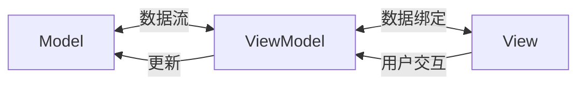

# JavaScript MVVM模式

---
title: JavaScript MVVM模式
description: 深入理解JavaScript的MVVM设计模式，以及它在现代前端框架中的应用
---

## MVVM模式概述

MVVM（Model-View-ViewModel）是一种软件架构设计模式，它是MVC模式的一种演变，专注于分离界面（View）与业务逻辑（Model）。在这个模式中，ViewModel作为中间层，负责将Model中的数据转换为View可以展示的形式，同时将View中的操作转换为Model数据的更新。

:::note MVVM 的三个组成部分
- **Model**：代表数据模型，也可以在Model中定义数据修改和操作的业务逻辑
- **View**：用户界面，展示数据，捕获用户操作
- **ViewModel**：连接View和Model的桥梁，处理View的所有业务逻辑
:::

## MVVM与双向绑定

MVVM模式的一个核心特点是**双向数据绑定**，这意味着：

1. Model中的数据变化会自动反映到View上
2. View中的用户操作也会自动更新到Model中

这种双向绑定机制减少了手动DOM操作，使开发者可以专注于业务逻辑而非UI操作。



## 实现一个简单的MVVM框架

让我们从零开始实现一个简易的MVVM框架，来理解其核心原理：

```javascript
class MVVM {
  constructor(options) {
    this.$el = document.querySelector(options.el);
    this.$data = options.data;
    
    // 数据代理
    this._proxyData(this.$data);
    
    // 数据劫持
    observer(this.$data);
    
    // 编译模板
    new Compiler(this.$el, this);
  }
  
  // 将data数据代理到vm实例上
  _proxyData(data) {
    Object.keys(data).forEach(key => {
      Object.defineProperty(this, key, {
        get() {
          return data[key];
        },
        set(newVal) {
          if (newVal !== data[key]) {
            data[key] = newVal;
          }
        }
      });
    });
  }
}

// 数据劫持 - 监听数据变化
function observer(data) {
  if (!data || typeof data !== 'object') return;
  
  // 创建依赖收集器
  const dep = new Dep();
  
  Object.keys(data).forEach(key => {
    let value = data[key];
    
    // 递归处理嵌套对象
    observer(value);
    
    Object.defineProperty(data, key, {
      enumerable: true,
      configurable: true,
      get() {
        // 依赖收集
        if (Dep.target) {
          dep.addSub(Dep.target);
        }
        return value;
      },
      set(newVal) {
        if (value === newVal) return;
        value = newVal;
        // 如果新值是对象，继续劫持
        observer(newVal);
        // 通知更新
        dep.notify();
      }
    });
  });
}

// 依赖收集器
class Dep {
  constructor() {
    this.subs = []; // 订阅者集合
  }
  
  addSub(sub) {
    this.subs.push(sub);
  }
  
  notify() {
    this.subs.forEach(sub => sub.update());
  }
}

// 订阅者 - Watcher
class Watcher {
  constructor(vm, key, cb) {
    this.vm = vm;
    this.key = key;
    this.cb = cb;
    
    // 标记当前watcher
    Dep.target = this;
    // 触发getter，添加依赖
    this.oldValue = this.vm[this.key];
    // 清空标记
    Dep.target = null;
  }
  
  update() {
    const newValue = this.vm[this.key];
    if (this.oldValue === newValue) return;
    this.cb(newValue);
    this.oldValue = newValue;
  }
}

// 编译器 - 解析指令和插值表达式
class Compiler {
  constructor(el, vm) {
    this.el = el;
    this.vm = vm;
    
    // 编译模板
    this.compile(this.el);
  }
  
  compile(el) {
    const childNodes = el.childNodes;
    Array.from(childNodes).forEach(node => {
      // 文本节点 - 解析插值表达式 {{}}
      if (this.isTextNode(node)) {
        this.compileText(node);
      }
      // 元素节点 - 解析指令 v-xxx
      else if (this.isElementNode(node)) {
        this.compileElement(node);
      }
      
      // 递归编译子节点
      if (node.childNodes && node.childNodes.length) {
        this.compile(node);
      }
    });
  }
  
  // 解析文本节点
  compileText(node) {
    const reg = /\{\{(.+?)\}\}/;
    const text = node.textContent;
    
    if (reg.test(text)) {
      const key = RegExp.$1.trim();
      node.textContent = text.replace(reg, this.vm[key]);
      
      // 创建watcher，实现视图更新
      new Watcher(this.vm, key, (newValue) => {
        node.textContent = text.replace(reg, newValue);
      });
    }
  }
  
  // 解析元素节点上的指令
  compileElement(node) {
    // 获取元素属性
    Array.from(node.attributes).forEach(attr => {
      // 判断是否是指令
      if (this.isDirective(attr.name)) {
        // 指令名称 v-xxx => xxx
        const directiveName = attr.name.slice(2);
        // 指令的值（数据的键名）
        const key = attr.value;
        
        // v-model 指令处理
        if (directiveName === 'model') {
          node.value = this.vm[key];
          
          // 创建watcher，数据变化更新视图
          new Watcher(this.vm, key, (newValue) => {
            node.value = newValue;
          });
          
          // 监听input事件，视图变化更新数据
          node.addEventListener('input', () => {
            this.vm[key] = node.value;
          });
        }
      }
    });
  }
  
  // 判断节点是否是文本节点
  isTextNode(node) {
    return node.nodeType === 3;
  }
  
  // 判断节点是否是元素节点
  isElementNode(node) {
    return node.nodeType === 1;
  }
  
  // 判断属性是否是指令
  isDirective(attrName) {
    return attrName.startsWith('v-');
  }
}
```

使用这个简易MVVM框架：

```html
<div id="app">
  <h1>{{title}}</h1>
  <input v-model="inputValue" />
  <p>你输入的内容是：{{inputValue}}</p>
</div>

<script>
  const vm = new MVVM({
    el: '#app',
    data: {
      title: '简易MVVM框架演示',
      inputValue: ''
    }
  });
</script>
```

## MVVM模式在现代框架中的应用

### Vue.js中的MVVM

Vue.js是最典型的MVVM框架之一：

```javascript
new Vue({
  el: '#app',
  data: {
    message: 'Hello MVVM!'
  }
});
```

在Vue中：
- **Model**: Vue实例中的data属性
- **View**: 模板或HTML
- **ViewModel**: Vue实例本身，处理双向绑定

下面是一个完整的Vue示例，展示了MVVM模式的工作方式：

```html
<div id="app">
  <h2>{{ title }}</h2>
  <input v-model="newTodo" @keyup.enter="addTodo" />
  <ul>
    <li v-for="(todo, index) in todos" :key="index">
      <input type="checkbox" v-model="todo.completed" />
      <span :class="{ completed: todo.completed }">{{ todo.text }}</span>
      <button @click="removeTodo(index)">删除</button>
    </li>
  </ul>
</div>

<script>
  new Vue({
    el: '#app',
    data: {
      title: 'Todo List',
      newTodo: '',
      todos: [
        { text: '学习MVVM模式', completed: false },
        { text: '学习Vue.js', completed: true }
      ]
    },
    methods: {
      addTodo() {
        if (this.newTodo.trim()) {
          this.todos.push({ text: this.newTodo, completed: false });
          this.newTodo = '';
        }
      },
      removeTodo(index) {
        this.todos.splice(index, 1);
      }
    }
  });
</script>

<style>
  .completed {
    text-decoration: line-through;
    color: gray;
  }
</style>
```

### 其他MVVM框架

1. **Angular**：使用依赖注入和类型系统实现MVVM模式
2. **Knockout.js**：专注于数据绑定的轻量级MVVM框架
3. **React+MobX**：React本身是一个视图库，但与MobX结合可以实现MVVM模式

## MVVM模式的优缺点

### 优点

1. **关注点分离**：UI和业务逻辑清晰分离
2. **可测试性**：ViewModel可以独立于UI进行测试
3. **可维护性**：代码结构清晰，易于维护
4. **开发效率**：减少DOM操作，提高开发效率

### 缺点

1. **学习成本**：相比简单的jQuery，有一定学习曲线
2. **适用场景**：对于非常简单的应用可能有些"过度设计"
3. **调试复杂**：双向绑定机制使数据流向不够清晰，可能增加调试难度

## 实际案例：一个简单的购物车应用

以下是一个使用MVVM模式实现的购物车示例：

```html
<div id="shopping-cart">
  <h1>{{ shopName }}</h1>
  
  <div class="products">
    <h2>商品列表</h2>
    <ul>
      <li v-for="product in products">
        {{ product.name }} - ¥{{ product.price }}
        <button @click="addToCart(product)">添加到购物车</button>
      </li>
    </ul>
  </div>
  
  <div class="cart">
    <h2>购物车</h2>
    <ul>
      <li v-for="item in cart">
        {{ item.name }} - ¥{{ item.price }} x {{ item.quantity }}
        <button @click="increaseQuantity(item)">+</button>
        <button @click="decreaseQuantity(item)">-</button>
      </li>
    </ul>
    <div class="total">
      总计: ¥{{ totalPrice }}
    </div>
  </div>
</div>

<script>
  new Vue({
    el: '#shopping-cart',
    data: {
      shopName: 'MVVM电子商城',
      products: [
        { id: 1, name: '笔记本电脑', price: 5999 },
        { id: 2, name: '手机', price: 2999 },
        { id: 3, name: '耳机', price: 299 }
      ],
      cart: []
    },
    computed: {
      totalPrice() {
        return this.cart.reduce((sum, item) => sum + (item.price * item.quantity), 0);
      }
    },
    methods: {
      addToCart(product) {
        const existingItem = this.cart.find(item => item.id === product.id);
        
        if (existingItem) {
          existingItem.quantity++;
        } else {
          this.cart.push({
            id: product.id,
            name: product.name,
            price: product.price,
            quantity: 1
          });
        }
      },
      increaseQuantity(item) {
        item.quantity++;
      },
      decreaseQuantity(item) {
        if (item.quantity > 1) {
          item.quantity--;
        } else {
          this.cart = this.cart.filter(cartItem => cartItem.id !== item.id);
        }
      }
    }
  });
</script>
```

在这个购物车案例中：
- **Model**：products和cart数组存储数据
- **View**：HTML模板展示UI
- **ViewModel**：Vue实例处理业务逻辑和双向绑定

通过这种方式，我们无需直接操作DOM就能实现复杂的购物车功能。

## 总结

MVVM模式是现代前端开发中非常重要的设计模式，它通过将应用程序分离为Model、View和ViewModel三部分，实现了业务逻辑和UI的解耦。双向数据绑定机制使开发者可以专注于数据和业务逻辑，而不必频繁操作DOM。

Vue、Angular等现代前端框架都采用了MVVM或类似的架构模式，极大地提高了前端开发效率。但是，MVVM模式并非万能的，在选择架构模式时，还需要考虑项目复杂度、性能需求等因素。

### 学习建议

1. 先理解MVC模式，再学习MVVM，有助于理解设计模式的演变
2. 深入学习至少一个MVVM框架（如Vue或Angular）
3. 尝试自己实现一个简单的MVVM框架，加深理解
4. 关注数据流向和状态管理，这是MVVM应用中的重要问题

### 练习任务

1. 使用我们的简易MVVM框架实现一个待办事项列表
2. 用Vue实现一个包含过滤和排序功能的商品列表
3. 对比jQuery和MVVM框架的实现方式，理解各自的优缺点
4. 尝试为Vue应用添加Vuex状态管理，理解复杂应用中的数据流管理

:::tip 参考资源
- [Vue.js官方文档](https://vuejs.org/)
- [Angular官方文档](https://angular.io/)
- [Knockout.js教程](https://knockoutjs.com/documentation/introduction.html)
- [MobX状态管理](https://mobx.js.org/)
:::

掌握MVVM模式后，你将能够更高效地开发现代Web应用，特别是那些具有复杂UI交互的应用。随着你对MVVM的深入理解，你还能够更好地评估和选择适合项目需求的前端架构。