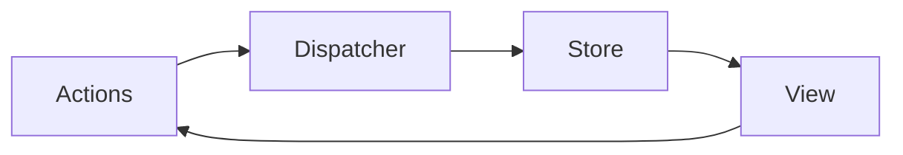
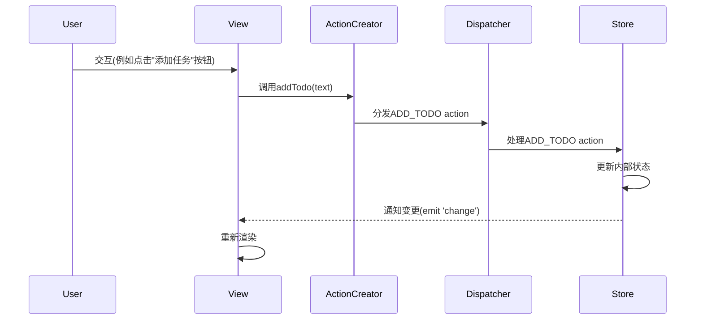

# JavaScript Flux架构

## 什么是Flux架构？

Flux是Facebook开发的一种应用架构模式，专门用于构建客户端Web应用程序。它是为了解决传统MVC架构在处理复杂UI交互时出现的问题而设计的。Flux的核心思想是**单向数据流**，使应用中的数据流向变得可预测，从而更容易调试和理解。

:::note
Flux并不是一个具体的框架或库，而是一种架构思想。Facebook提供了一个Flux的实现，但也有许多其他库（如Redux、MobX等）基于Flux思想开发。
:::



## Flux架构的核心组成部分

Flux架构由四个主要部分组成：

1. **Actions**: 描述应用中发生的事件，包含事件类型和相关数据
2. **Dispatcher**: 中央事件调度器，接收Actions并将它们分发到Stores
3. **Stores**: 保存应用状态和业务逻辑，响应由Dispatcher发送的Actions
4. **Views**: 展示界面并响应用户交互，通常由React组件实现

### 数据流向

在Flux中，数据严格按照以下流向单向流动：

1. 用户与View交互
2. View触发Action
3. Action被发送到Dispatcher
4. Dispatcher将Action发送给相应的Store
5. Store更新数据并通知View
6. View更新UI展示

这种单向数据流解决了MVC架构中模型和视图之间可能出现的复杂依赖和循环更新问题。

## 实现一个简单的Flux架构

下面我们将从头开始实现一个简单的待办事项应用，展示Flux架构的基本概念：

### 1. 定义Actions

首先，我们定义应用中可能发生的所有动作：

```javascript
// actions/TodoActions.js
const TodoActions = {
  ADD_TODO: 'ADD_TODO',
  TOGGLE_TODO: 'TOGGLE_TODO',
  DELETE_TODO: 'DELETE_TODO'
};

// Action创建函数
const ActionCreators = {
  addTodo: (text) => ({
    type: TodoActions.ADD_TODO,
    payload: { text, completed: false, id: Date.now() }
  }),
  
  toggleTodo: (id) => ({
    type: TodoActions.TOGGLE_TODO,
    payload: { id }
  }),
  
  deleteTodo: (id) => ({
    type: TodoActions.DELETE_TODO,
    payload: { id }
  })
};

export { TodoActions, ActionCreators };
```

### 2. 创建Dispatcher

Dispatcher是Flux架构的核心，负责将Actions分发到所有注册的Store：

```javascript
// dispatcher/AppDispatcher.js
class Dispatcher {
  constructor() {
    this.callbacks = [];
  }

  register(callback) {
    this.callbacks.push(callback);
    return this.callbacks.length - 1; // 返回注册ID
  }

  dispatch(action) {
    this.callbacks.forEach(callback => callback(action));
  }
}

const AppDispatcher = new Dispatcher();
export default AppDispatcher;
```

### 3. 实现Store

Store负责保存应用状态并处理Actions：

```javascript
// stores/TodoStore.js
import { EventEmitter } from 'events';
import AppDispatcher from '../dispatcher/AppDispatcher';
import { TodoActions } from '../actions/TodoActions';

class TodoStore extends EventEmitter {
  constructor() {
    super();
    this.todos = [];
  }

  getTodos() {
    return this.todos;
  }

  addTodo(todo) {
    this.todos.push(todo);
    this.emit('change');
  }

  toggleTodo(id) {
    this.todos = this.todos.map(todo => 
      todo.id === id ? { ...todo, completed: !todo.completed } : todo
    );
    this.emit('change');
  }

  deleteTodo(id) {
    this.todos = this.todos.filter(todo => todo.id !== id);
    this.emit('change');
  }

  // 处理Actions
  handleAction(action) {
    switch (action.type) {
      case TodoActions.ADD_TODO:
        this.addTodo(action.payload);
        break;
      case TodoActions.TOGGLE_TODO:
        this.toggleTodo(action.payload.id);
        break;
      case TodoActions.DELETE_TODO:
        this.deleteTodo(action.payload.id);
        break;
      default:
        // 不需要处理的action
    }
  }
}

const todoStore = new TodoStore();

// 注册到Dispatcher
AppDispatcher.register(action => {
  todoStore.handleAction(action);
});

export default todoStore;
```

### 4. 创建React视图组件

最后，我们创建React视图组件，从Store获取数据并响应用户操作：

```jsx
// components/TodoApp.js
import React, { useState, useEffect } from 'react';
import todoStore from '../stores/TodoStore';
import AppDispatcher from '../dispatcher/AppDispatcher';
import { ActionCreators } from '../actions/TodoActions';

function TodoApp() {
  const [todos, setTodos] = useState(todoStore.getTodos());
  const [inputText, setInputText] = useState('');

  useEffect(() => {
    // 监听Store变化
    const onChange = () => {
      setTodos([...todoStore.getTodos()]);
    };
    todoStore.on('change', onChange);
    
    // 清理监听器
    return () => {
      todoStore.removeListener('change', onChange);
    };
  }, []);

  const handleAddTodo = (e) => {
    e.preventDefault();
    if (!inputText.trim()) return;
    
    // 分发Action
    AppDispatcher.dispatch(ActionCreators.addTodo(inputText));
    setInputText('');
  };

  const handleToggleTodo = (id) => {
    AppDispatcher.dispatch(ActionCreators.toggleTodo(id));
  };

  const handleDeleteTodo = (id) => {
    AppDispatcher.dispatch(ActionCreators.deleteTodo(id));
  };

  return (
    <div className="todo-app">
      <h1>Todo List</h1>
      
      <form onSubmit={handleAddTodo}>
        <input
          value={inputText}
          onChange={(e) => setInputText(e.target.value)}
          placeholder="What needs to be done?"
        />
        <button type="submit">Add Todo</button>
      </form>
      
      <ul>
        {todos.map(todo => (
          <li key={todo.id}>
            <input
              type="checkbox"
              checked={todo.completed}
              onChange={() => handleToggleTodo(todo.id)}
            />
            <span style={{ textDecoration: todo.completed ? 'line-through' : 'none' }}>
              {todo.text}
            </span>
            <button onClick={() => handleDeleteTodo(todo.id)}>Delete</button>
          </li>
        ))}
      </ul>
    </div>
  );
}

export default TodoApp;
```

## Flux架构与React的结合

Flux架构与React配合得非常好，因为它们都推崇单向数据流和声明式编程。在实际项目中，通常会按照以下方式组织React和Flux：

1. React组件主要负责UI渲染，尽量保持为"纯"组件
2. 响应用户输入时，组件触发Action
3. Store负责保存和更新状态
4. 当Store状态变化时，React组件重新渲染

### 实际工作流程



## Flux的优缺点

### 优点

1. **可预测性**：单向数据流使应用状态变化更加可预测
2. **可调试性**：每一个状态变化都有明确的来源（Action）
3. **模块化**：各组件职责清晰，易于维护
4. **适合复杂UI**：特别适合有复杂交互的大型应用

### 缺点

1. **样板代码**：需要编写较多模板代码
2. **学习曲线**：初学者可能需要时间适应这种思维方式
3. **小应用过度设计**：对于小型应用可能显得繁琐

## Flux的衍生架构

基于Flux思想，出现了多个流行的状态管理库：

1. **Redux**：最流行的Flux实现，引入了单一数据源、纯函数reducer的概念
2. **MobX**：采用可观察对象的响应式编程方法
3. **Vuex**：专为Vue.js设计的状态管理库，也基于Flux思想

## 实际应用场景

Flux架构特别适合以下场景：

1. **大型单页应用**：有复杂状态管理需求的SPA
2. **协作开发**：多人团队需要清晰的数据流向和规范
3. **复杂用户交互**：如社交媒体、内容管理系统、数据分析平台等

## 总结

Flux架构通过强制单向数据流，解决了传统MVC架构中可能出现的数据流混乱问题。其核心组件（Action、Dispatcher、Store和View）各司其职，共同构建了一个可预测、可维护的应用架构。

虽然学习和实施Flux可能需要一些时间，但对于构建复杂的前端应用，这种投资是值得的。特别是随着应用规模的增长，Flux架构的优势会变得越来越明显。

### 学习建议

1. 先理解单向数据流的核心思想
2. 从小型项目开始实践
3. 考虑使用Redux等成熟库而非手动实现
4. 结合React的Context API和Hooks可以实现更简洁的Flux模式

:::tip 练习任务
尝试扩展上面的待办事项应用，添加以下功能：
1. 为待办事项添加优先级标记
2. 实现任务过滤（全部/已完成/未完成）
3. 将任务保存到localStorage中持久化
:::

## 延伸阅读

- [Facebook官方Flux文档](https://facebook.github.io/flux/)
- [Redux文档](https://redux.js.org/)
- [深入理解React状态管理模式](https://www.patterns.dev/posts/react-state-management)

掌握Flux架构模式将帮助你更好地理解现代前端应用的状态管理方式，也为学习React生态系统中更高级的工具和技术打下基础。