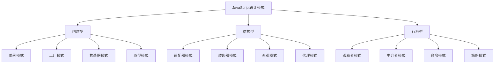

# JavaScript 设计模式应用

## 什么是设计模式？

设计模式是软件开发中的最佳实践，是解决特定问题的经过验证的方案。它们不是代码片段，而是解决问题的思路和方法。掌握设计模式能够帮助你写出更加结构化、可维护、可扩展的代码。

:::note 定义
设计模式是在软件设计中常见问题的解决方案，它们就像预制的蓝图，可用来解决代码中反复出现的设计问题。
:::

在JavaScript中，设计模式尤为重要，因为JavaScript是一种灵活的语言，可以用多种方式实现同一功能。使用设计模式可以帮助开发者选择最佳实践，并确保代码的质量和一致性。

## JavaScript 常见设计模式分类

设计模式通常分为三大类：



让我们深入了解几个在JavaScript中特别有用的设计模式。

## 1. 单例模式

单例模式确保一个类只有一个实例，并提供全局访问点。这在JavaScript中尤其有用，比如创建配置管理器、数据库连接等。

### 实现示例

```javascript
const Singleton = (function() {
    let instance;
    
    function createInstance() {
        const object = new Object({
            name: "我是单例对象",
            getInfo: function() {
                return this.name;
            }
        });
        return object;
    }
    
    return {
        getInstance: function() {
            if (!instance) {
                instance = createInstance();
            }
            return instance;
        }
    };
})();

// 使用示例
const instance1 = Singleton.getInstance();
const instance2 = Singleton.getInstance();

console.log(instance1 === instance2); // 输出: true
console.log(instance1.getInfo());     // 输出: "我是单例对象"
```

### 实际应用场景

- **浏览器中的window对象**：浏览器中的`window`对象本质上是单例的。
- **全局状态管理**：如Redux store，确保应用中只有一个数据存储。
- **数据库连接池**：确保应用只创建一个数据库连接。

## 2. 工厂模式

工厂模式是一种创建型模式，它提供一个接口来创建不同类型的对象，而无需暴露具体的实例化逻辑。

### 实现示例

```javascript
class UserFactory {
    createUser(type) {
        let user;
        
        if (type === "admin") {
            user = new AdminUser();
        } else if (type === "regular") {
            user = new RegularUser();
        } else if (type === "guest") {
            user = new GuestUser();
        }
        
        user.type = type;
        user.say = function() {
            return `我是${this.type}用户`;
        }
        
        return user;
    }
}

class AdminUser {}
class RegularUser {}
class GuestUser {}

// 使用示例
const factory = new UserFactory();
const admin = factory.createUser("admin");
const regular = factory.createUser("regular");

console.log(admin.say());  // 输出: "我是admin用户"
console.log(regular.say()); // 输出: "我是regular用户"
```

### 实际应用场景

- **UI组件创建**：根据配置或用户操作创建不同类型的UI组件。
- **跨浏览器兼容性**：创建适合特定浏览器环境的对象。
- **API错误处理**：根据错误类型创建相应的错误对象。

## 3. 观察者模式

观察者模式是一种行为型模式，它定义了对象间的一对多依赖关系。当一个对象状态改变时，其所有依赖者都会收到通知。

### 实现示例

```javascript
class Subject {
    constructor() {
        this.observers = [];
    }
    
    subscribe(observer) {
        this.observers.push(observer);
    }
    
    unsubscribe(observer) {
        this.observers = this.observers.filter(obs => obs !== observer);
    }
    
    notify(data) {
        this.observers.forEach(observer => observer.update(data));
    }
}

class Observer {
    constructor(name) {
        this.name = name;
    }
    
    update(data) {
        console.log(`${this.name} 收到通知: ${data}`);
    }
}

// 使用示例
const subject = new Subject();
const observer1 = new Observer("观察者1");
const observer2 = new Observer("观察者2");

subject.subscribe(observer1);
subject.subscribe(observer2);
subject.notify("数据已更新"); 
// 输出: 
// 观察者1 收到通知: 数据已更新
// 观察者2 收到通知: 数据已更新

subject.unsubscribe(observer2);
subject.notify("再次更新数据");
// 输出: 
// 观察者1 收到通知: 再次更新数据
```

### 实际应用场景

- **事件处理系统**：DOM事件处理就是观察者模式的应用。
- **数据绑定**：如Vue和Angular中的数据绑定机制。
- **消息通知系统**：如聊天应用中的新消息通知。

## 4. 模块模式

模块模式是利用闭包创建私有变量和方法的模式，只暴露必要的公共接口。

### 实现示例

```javascript
const Calculator = (function() {
    // 私有变量和方法
    let result = 0;
    
    function add(a, b) {
        return a + b;
    }
    
    function subtract(a, b) {
        return a - b;
    }
    
    // 公共API
    return {
        add: function(a, b) {
            result = add(a, b);
            return result;
        },
        subtract: function(a, b) {
            result = subtract(a, b);
            return result;
        },
        getResult: function() {
            return result;
        }
    };
})();

// 使用示例
console.log(Calculator.add(5, 3));      // 输出: 8
console.log(Calculator.getResult());    // 输出: 8
console.log(Calculator.subtract(10, 4)); // 输出: 6
console.log(Calculator.getResult());     // 输出: 6
```

### 实际应用场景

- **封装复杂业务逻辑**：如表单验证、数据处理等。
- **创建独立的功能模块**：如日期处理、货币转换等功能模块。
- **防止全局命名空间污染**：特别是在没有使用模块打包工具的项目中。

## 5. 策略模式

策略模式定义了一系列算法，并使它们可以互相替换。这种模式让算法的变化独立于使用它的客户端。

### 实现示例

```javascript
// 定义一组验证策略
const validationStrategies = {
    required: function(value) {
        return value.trim() !== '';
    },
    minLength: function(value, min) {
        return value.length >= min;
    },
    maxLength: function(value, max) {
        return value.length <= max;
    },
    email: function(value) {
        const pattern = /^[^\s@]+@[^\s@]+\.[^\s@]+$/;
        return pattern.test(value);
    }
};

// 创建验证器
class Validator {
    constructor() {
        this.validations = [];
    }
    
    add(value, rules) {
        for (let rule in rules) {
            const params = rules[rule];
            this.validations.push(() => {
                if (typeof params === 'boolean') {
                    return { 
                        isValid: params ? validationStrategies[rule](value) : true,
                        message: `${value} 不符合 ${rule} 验证规则`
                    };
                } else {
                    return { 
                        isValid: validationStrategies[rule](value, params),
                        message: `${value} 不符合 ${rule} 验证规则`
                    };
                }
            });
        }
    }
    
    validate() {
        const errorMessages = [];
        this.validations.forEach(validation => {
            const result = validation();
            if (!result.isValid) {
                errorMessages.push(result.message);
            }
        });
        return {
            isValid: errorMessages.length === 0,
            errors: errorMessages
        };
    }
}

// 使用示例
const validator = new Validator();
validator.add('test@example.com', { email: true, required: true });
validator.add('username', { required: true, minLength: 5 });

const result = validator.validate();
console.log(result.isValid);  // 输出: false
console.log(result.errors);   // 输出: ["username 不符合 minLength 验证规则"]
```

### 实际应用场景

- **表单验证**：根据不同的验证规则验证表单字段。
- **支付处理**：选择不同的支付方式处理支付请求。
- **排序算法**：根据需求选择不同的排序算法。

## 实践案例：构建一个简易的事件管理系统

下面我们通过结合观察者模式和单例模式，创建一个简易的事件管理系统：

```javascript
const EventManager = (function() {
    let instance;
    
    function createInstance() {
        const events = {};
        
        return {
            // 订阅事件
            subscribe: function(event, callback) {
                if (!events[event]) {
                    events[event] = [];
                }
                events[event].push(callback);
            },
            
            // 取消订阅
            unsubscribe: function(event, callback) {
                if (!events[event]) return;
                events[event] = events[event].filter(cb => cb !== callback);
            },
            
            // 触发事件
            publish: function(event, data) {
                if (!events[event]) return;
                events[event].forEach(callback => callback(data));
            },
            
            // 列出所有事件
            listEvents: function() {
                return Object.keys(events);
            }
        };
    }
    
    return {
        getInstance: function() {
            if (!instance) {
                instance = createInstance();
            }
            return instance;
        }
    };
})();

// 使用示例
const eventManager = EventManager.getInstance();

// 订阅事件
function userLoggedInHandler(user) {
    console.log(`用户 ${user.name} 已登录!`);
}

function notificationHandler(user) {
    console.log(`发送欢迎通知给 ${user.name}`);
}

eventManager.subscribe('userLoggedIn', userLoggedInHandler);
eventManager.subscribe('userLoggedIn', notificationHandler);

// 触发事件
eventManager.publish('userLoggedIn', { name: '张三' });
// 输出:
// 用户 张三 已登录!
// 发送欢迎通知给 张三

// 取消订阅
eventManager.unsubscribe('userLoggedIn', notificationHandler);
eventManager.publish('userLoggedIn', { name: '李四' });
// 输出:
// 用户 李四 已登录!

console.log(eventManager.listEvents()); // 输出: ["userLoggedIn"]
```

## 总结

设计模式是解决软件开发中常见问题的有效方案。在JavaScript中，合理使用设计模式可以：

- 提高代码质量和可维护性
- 促进代码重用
- 增强代码的扩展性和灵活性
- 减少错误和bug
- 使代码更易于理解和协作

本文介绍了几种常用的JavaScript设计模式及其应用场景。掌握这些模式并学会在适当的场景使用它们，将会极大提高你的JavaScript编程能力。

:::tip 学习建议
设计模式不是必须使用的规则，而是解决特定问题的工具。关键是理解每种模式适用的场景，以及如何结合项目需求选择合适的模式。
:::

## 练习建议

1. 尝试用单例模式实现一个应用配置管理器。
2. 使用工厂模式创建不同类型的表单元素。
3. 用观察者模式实现一个简单的消息订阅/发布系统。
4. 运用策略模式实现不同的打折策略（如固定折扣、百分比折扣等）。
5. 将上述事件管理系统整合到一个小型应用中，实现用户登录、权限变更等功能。

## 进一步学习资源

- 《JavaScript设计模式与开发实践》- 曾探
- 《Learning JavaScript Design Patterns》- Addy Osmani
- 在线教程网站：MDN Web Docs, JavaScript.info
- 开源项目分析：分析流行的JavaScript库如React, Vue等使用的设计模式