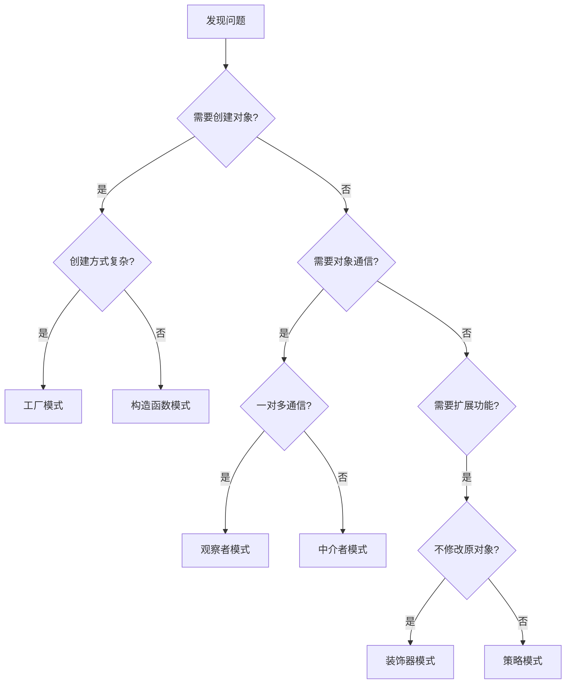

# JavaScript 设计模式最佳实践

## 设计模式简介

设计模式是软件开发过程中，针对特定问题的可重用解决方案。它们是经过时间考验的编程范式，能够帮助我们编写更加灵活、可维护和可扩展的代码。在JavaScript开发中，理解和应用适当的设计模式可以显著提高代码质量。

:::tip
设计模式不是具体的代码，而是一种思想和方法，需要根据具体情况进行调整和应用。
:::

## 为什么需要学习设计模式？

- **提高代码质量** - 设计模式能帮助你写出更加健壮、可维护的代码
- **团队协作** - 使用共同认可的模式可以提高团队协作效率
- **解决常见问题** - 为常见的开发问题提供经过验证的解决方案
- **职业成长** - 掌握设计模式是高级开发者的必备技能

## JavaScript 中常用的设计模式及最佳实践

### 1. 单例模式 (Singleton Pattern)

单例模式确保一个类只有一个实例，并提供一个全局访问点。在JavaScript中，单例模式常用于管理全局状态或创建只需要一个实例的服务。

#### 实现示例

```javascript
const Singleton = (function() {
  let instance;
  
  function createInstance() {
    const object = new Object({name: "单例对象"});
    return object;
  }
  
  return {
    getInstance: function() {
      if (!instance) {
        instance = createInstance();
      }
      return instance;
    }
  };
})();

// 使用示例
const instance1 = Singleton.getInstance();
const instance2 = Singleton.getInstance();

console.log(instance1 === instance2); // true
```

#### 最佳实践

- **延迟初始化**：只有在第一次需要时才创建实例
- **提供清晰的访问点**：通过一个公共方法访问实例
- **适合场景**：配置管理、数据库连接、日志记录等

:::caution
单例模式可能导致全局状态难以测试，使用时需谨慎考虑。
:::

### 2. 工厂模式 (Factory Pattern)

工厂模式提供一个创建对象的接口，但允许子类决定实例化的对象类型。这种模式特别适合需要根据条件创建不同对象的场景。

#### 实现示例

```javascript
// 简单工厂
function vehicleFactory(type) {
  switch(type) {
    case 'car':
      return { 
        type: 'car', 
        drive: () => console.log('开车中...') 
      };
    case 'bicycle':
      return { 
        type: 'bicycle', 
        ride: () => console.log('骑行中...') 
      };
    default:
      throw new Error('不支持的交通工具类型');
  }
}

// 使用示例
const car = vehicleFactory('car');
car.drive(); // 输出: 开车中...

const bicycle = vehicleFactory('bicycle');
bicycle.ride(); // 输出: 骑行中...
```

#### 最佳实践

- **封装创建逻辑**：将对象创建的复杂性隐藏在工厂内部
- **使用工厂方法**：当创建逻辑较为复杂时，使用工厂方法模式
- **保持接口一致**：确保工厂创建的对象有一致的接口

### 3. 观察者模式 (Observer Pattern)

观察者模式定义了对象间的一对多依赖关系，当一个对象状态改变时，所有依赖它的对象都会得到通知并自动更新。

#### 实现示例

```javascript
class Subject {
  constructor() {
    this.observers = [];
  }
  
  subscribe(observer) {
    this.observers.push(observer);
  }
  
  unsubscribe(observer) {
    this.observers = this.observers.filter(obs => obs !== observer);
  }
  
  notify(data) {
    this.observers.forEach(observer => observer.update(data));
  }
}

class Observer {
  constructor(name) {
    this.name = name;
  }
  
  update(data) {
    console.log(`${this.name} 收到通知: ${data}`);
  }
}

// 使用示例
const subject = new Subject();

const observer1 = new Observer('观察者1');
const observer2 = new Observer('观察者2');

subject.subscribe(observer1);
subject.subscribe(observer2);

subject.notify('数据更新了!');
// 输出:
// 观察者1 收到通知: 数据更新了!
// 观察者2 收到通知: 数据更新了!

subject.unsubscribe(observer1);
subject.notify('再次更新!');
// 输出:
// 观察者2 收到通知: 再次更新!
```

#### 最佳实践

- **松耦合设计**：主题和观察者之间保持松散耦合
- **事件处理**：优先考虑使用内置的事件系统
- **内存管理**：注意取消订阅避免内存泄漏

### 4. 模块模式 (Module Pattern)

模块模式利用立即执行函数表达式(IIFE)和闭包来创建私有作用域，隐藏内部实现细节，只暴露公共API。

#### 实现示例

```javascript
const calculator = (function() {
  // 私有变量
  let result = 0;
  
  // 私有方法
  function validate(value) {
    return typeof value === 'number';
  }
  
  // 公共API
  return {
    add: function(value) {
      if (validate(value)) {
        result += value;
        return this;
      }
      throw new Error('请提供有效数字');
    },
    subtract: function(value) {
      if (validate(value)) {
        result -= value;
        return this;
      }
      throw new Error('请提供有效数字');
    },
    getResult: function() {
      return result;
    }
  };
})();

// 使用示例
calculator.add(5).subtract(2);
console.log(calculator.getResult()); // 3
```

#### 最佳实践

- **分隔关注点**：将相关功能组织在一起
- **暴露必要接口**：只公开需要被外部访问的方法和属性
- **现代替代**：考虑使用ES模块系统替代传统模块模式

### 5. 装饰器模式 (Decorator Pattern)

装饰器模式允许向现有对象添加新的功能，同时不改变其结构。这是一种比继承更灵活的扩展对象功能的方式。

#### 实现示例

```javascript
// 基础组件
class Coffee {
  cost() {
    return 5;
  }
  
  description() {
    return 'Simple coffee';
  }
}

// 装饰器
class MilkDecorator {
  constructor(coffee) {
    this.coffee = coffee;
  }
  
  cost() {
    return this.coffee.cost() + 1.5;
  }
  
  description() {
    return `${this.coffee.description()}, with milk`;
  }
}

class SugarDecorator {
  constructor(coffee) {
    this.coffee = coffee;
  }
  
  cost() {
    return this.coffee.cost() + 0.5;
  }
  
  description() {
    return `${this.coffee.description()}, with sugar`;
  }
}

// 使用示例
let coffee = new Coffee();
console.log(coffee.description()); // Simple coffee
console.log(coffee.cost());        // 5

coffee = new MilkDecorator(coffee);
console.log(coffee.description()); // Simple coffee, with milk
console.log(coffee.cost());        // 6.5

coffee = new SugarDecorator(coffee);
console.log(coffee.description()); // Simple coffee, with milk, with sugar
console.log(coffee.cost());        // 7
```

#### 最佳实践

- **组合优于继承**：使用装饰器可以避免过度继承带来的类爆炸
- **保持接口一致**：装饰器和原始对象应该提供相同的接口
- **关注单一职责**：每个装饰器应只负责添加一种功能

## 设计模式的选择与应用

### 如何选择合适的设计模式

选择设计模式时应考虑以下因素:

1. **问题特性** - 理解你试图解决的问题
2. **扩展性需求** - 考虑代码未来可能的变化
3. **团队经验** - 考虑团队对模式的熟悉程度
4. **复杂度平衡** - 避免过度设计



### 实际应用场景

#### 用户界面组件库

```javascript
// 组件工厂
class UIFactory {
  createButton(type) {
    switch(type) {
      case 'primary':
        return new PrimaryButton();
      case 'secondary':
        return new SecondaryButton();
      case 'danger':
        return new DangerButton();
      default:
        return new DefaultButton();
    }
  }
  
  createInput(type) {
    switch(type) {
      case 'text':
        return new TextInput();
      case 'number':
        return new NumberInput();
      case 'password':
        return new PasswordInput();
      default:
        return new TextInput();
    }
  }
}

// 使用示例
const factory = new UIFactory();
const loginButton = factory.createButton('primary');
const passwordInput = factory.createInput('password');
```

#### 前端状态管理

```javascript
// 简化版的状态管理器 (观察者模式)
class Store {
  constructor(initialState = {}) {
    this.state = initialState;
    this.listeners = [];
  }
  
  getState() {
    return this.state;
  }
  
  setState(newState) {
    this.state = { ...this.state, ...newState };
    this.notify();
  }
  
  subscribe(listener) {
    this.listeners.push(listener);
    // 返回取消订阅函数
    return () => {
      this.listeners = this.listeners.filter(l => l !== listener);
    };
  }
  
  notify() {
    this.listeners.forEach(listener => listener(this.state));
  }
}

// 使用示例
const store = new Store({ count: 0 });

const unsubscribe = store.subscribe(state => {
  console.log('状态更新:', state);
});

store.setState({ count: 1 });  // 输出: 状态更新: { count: 1 }
store.setState({ user: { name: 'John' } });  // 输出: 状态更新: { count: 1, user: { name: 'John' } }

// 取消订阅
unsubscribe();
```

## 设计模式的常见问题与解决方案

### 过度设计

:::warning
滥用设计模式会导致代码过于复杂，难以理解和维护。始终遵循YAGNI原则(You Aren't Gonna Need It)。
:::

**解决方案**:
- 从简单解决方案开始，在确实需要时逐步引入设计模式
- 保持代码可读性，提供充分的文档说明

### 性能问题

一些设计模式可能引入性能开销，特别是在处理大量对象或需要频繁操作时。

**解决方案**:
- 在性能关键的部分使用轻量级实现
- 考虑对象池等优化技术
- 进行性能测试和分析

## 总结

JavaScript设计模式是提高代码质量的重要工具。通过学习和应用这些最佳实践，你可以:

- 编写更加灵活、可复用的代码
- 有效解决常见的开发问题
- 提高代码的可维护性和可扩展性
- 更好地与团队协作

记住，设计模式不是银弹，而是一种工具。合理选择和应用设计模式才能真正发挥其价值。

## 进阶练习

1. **模式识别**：分析一个你熟悉的JavaScript库或框架，尝试识别其中使用的设计模式
2. **模式重构**：选择一段你写过的代码，尝试用一种适当的设计模式重构它
3. **组合模式**：尝试将多种设计模式结合使用，解决一个复杂问题

## 延伸阅读

- 《JavaScript设计模式与开发实践》- 曾探
- 《Head First设计模式》- Freeman与Freeman
- 《设计模式：可复用面向对象软件的基础》- Gang of Four

祝你在JavaScript设计模式的学习之旅中取得进步！