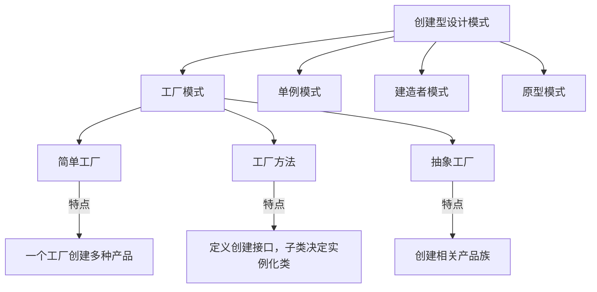

# JavaScript 工厂模式

## 什么是工厂模式？

工厂模式是一种创建型设计模式，它提供了一种创建对象的最佳方式。在工厂模式中，我们不会直接使用 `new` 关键字来创建对象，而是使用一个工厂来创建对象。这种方式可以将对象的创建与使用分离，使系统更加灵活。

:::note 核心思想
工厂模式的核心思想是**封装创建对象的过程**，通过工厂函数来创建和返回新对象，而不是直接在代码中使用构造函数。
:::

## 为什么需要工厂模式？

想象一下，如果你正在开发一个游戏，需要创建不同类型的敌人。每种敌人都有不同的属性和行为，但它们都是"敌人"这个概念的实例。如果直接使用构造函数或类来创建，代码会变得复杂且难以维护。这时，工厂模式就能派上用场了。

工厂模式有以下优点：

1. **封装复杂的创建逻辑**：隐藏对象的创建细节
2. **代码复用**：避免重复的对象创建代码
3. **灵活性**：可以根据条件创建不同类型的对象
4. **松耦合**：使用者不需要知道具体的实现类

## JavaScript 中的简单工厂模式

让我们从一个简单的例子开始，创建一个生产不同类型汽车的工厂：

```javascript
function carFactory(type, brand, color) {
  // 创建一个空对象
  const car = {};
  
  // 添加属性
  car.type = type;
  car.brand = brand;
  car.color = color;
  
  // 添加方法
  car.drive = function() {
    console.log(`驾驶 ${color} 色的 ${brand} ${type}`);
  };
  
  car.getInfo = function() {
    return `这是一辆${color}色的${brand}品牌${type}`;
  };
  
  // 返回创建的对象
  return car;
}

// 使用工厂创建对象
const sedan = carFactory('轿车', '丰田', '红');
const suv = carFactory('SUV', '本田', '蓝');

sedan.drive(); // 输出: 驾驶 红 色的 丰田 轿车
console.log(suv.getInfo()); // 输出: 这是一辆蓝色的本田品牌SUV
```

在这个例子中，`carFactory` 是一个工厂函数，它根据传入的参数创建并返回不同类型的汽车对象。

## 工厂模式的进阶：工厂方法模式

工厂方法模式是简单工厂的进阶版本。在这种模式中，我们定义一个创建对象的接口，但让子类决定实例化哪个类。

```javascript
// 定义车辆构造函数
function Vehicle(brand, color) {
  this.brand = brand;
  this.color = color;
}

// 定义不同类型的车辆
function Car(brand, color, doors) {
  Vehicle.call(this, brand, color);
  this.doors = doors;
  this.type = "轿车";
}

function Truck(brand, color, loadCapacity) {
  Vehicle.call(this, brand, color);
  this.loadCapacity = loadCapacity;
  this.type = "卡车";
}

function Motorcycle(brand, color, hasSideCar) {
  Vehicle.call(this, brand, color);
  this.hasSideCar = hasSideCar;
  this.type = "摩托车";
}

// 工厂对象
const vehicleFactory = {
  createVehicle: function(type, options) {
    switch(type) {
      case 'car':
        return new Car(options.brand, options.color, options.doors);
      case 'truck':
        return new Truck(options.brand, options.color, options.loadCapacity);
      case 'motorcycle':
        return new Motorcycle(options.brand, options.color, options.hasSideCar);
      default:
        throw new Error('未知的车辆类型');
    }
  }
};

// 使用工厂创建不同类型的车辆
const myCar = vehicleFactory.createVehicle('car', {
  brand: '大众',
  color: '黑色',
  doors: 4
});

const myTruck = vehicleFactory.createVehicle('truck', {
  brand: '沃尔沃',
  color: '白色',
  loadCapacity: '5吨'
});

console.log(myCar); // Car {brand: "大众", color: "黑色", doors: 4, type: "轿车"}
console.log(myTruck); // Truck {brand: "沃尔沃", color: "白色", loadCapacity: "5吨", type: "卡车"}
```

## 使用ES6类实现工厂模式

ES6引入的类可以使工厂模式的实现更加清晰：

```javascript
// 基础产品类
class Product {
  constructor(name) {
    this.name = name;
  }
  
  getInfo() {
    return `产品: ${this.name}`;
  }
}

// 具体产品类
class Electronics extends Product {
  constructor(name, warranty) {
    super(name);
    this.category = "电子产品";
    this.warranty = warranty;
  }
  
  getInfo() {
    return `${super.getInfo()}, 类别: ${this.category}, 保修期: ${this.warranty}`;
  }
}

class Furniture extends Product {
  constructor(name, material) {
    super(name);
    this.category = "家具";
    this.material = material;
  }
  
  getInfo() {
    return `${super.getInfo()}, 类别: ${this.category}, 材质: ${this.material}`;
  }
}

// 产品工厂
class ProductFactory {
  createProduct(type, options) {
    switch(type) {
      case 'electronics':
        return new Electronics(options.name, options.warranty);
      case 'furniture':
        return new Furniture(options.name, options.material);
      default:
        throw new Error('未知的产品类型');
    }
  }
}

// 使用工厂
const factory = new ProductFactory();

const phone = factory.createProduct('electronics', {
  name: '智能手机',
  warranty: '2年'
});

const table = factory.createProduct('furniture', {
  name: '餐桌',
  material: '实木'
});

console.log(phone.getInfo()); // 输出: 产品: 智能手机, 类别: 电子产品, 保修期: 2年
console.log(table.getInfo()); // 输出: 产品: 餐桌, 类别: 家具, 材质: 实木
```

## 工厂模式的实际应用场景

工厂模式在JavaScript应用中有许多实际应用场景：

### 1. UI组件创建

```javascript
class UIFactory {
  createButton(type, text, onClick) {
    switch(type) {
      case 'primary':
        return new PrimaryButton(text, onClick);
      case 'danger':
        return new DangerButton(text, onClick);
      case 'success':
        return new SuccessButton(text, onClick);
      default:
        return new DefaultButton(text, onClick);
    }
  }
  
  createInput(type, placeholder) {
    switch(type) {
      case 'text':
        return new TextInput(placeholder);
      case 'password':
        return new PasswordInput(placeholder);
      case 'number':
        return new NumberInput(placeholder);
      default:
        return new TextInput(placeholder);
    }
  }
}
```

### 2. AJAX请求管理

```javascript
class RequestFactory {
  createRequest(type, url, data) {
    switch(type) {
      case 'GET':
        return new GetRequest(url);
      case 'POST':
        return new PostRequest(url, data);
      case 'PUT':
        return new PutRequest(url, data);
      case 'DELETE':
        return new DeleteRequest(url);
      default:
        throw new Error('不支持的请求类型');
    }
  }
}

// 使用实例
const requestFactory = new RequestFactory();
const getUsers = requestFactory.createRequest('GET', '/api/users');
getUsers.send().then(data => console.log(data));
```

### 3. 游戏开发中的角色创建

```javascript
class CharacterFactory {
  createCharacter(type, name) {
    switch(type) {
      case 'warrior':
        return new Warrior(name, 100, 50, 20);
      case 'mage':
        return new Mage(name, 60, 20, 100);
      case 'archer':
        return new Archer(name, 80, 80, 30);
      default:
        throw new Error('未知的角色类型');
    }
  }
}
```

## 工厂模式的优缺点

### 优点
- **解耦**: 将对象的创建与使用分离
- **封装性好**: 隐藏了对象创建的复杂逻辑
- **扩展性强**: 添加新产品类型时，只需修改工厂，不影响客户端代码
- **代码复用**: 避免重复的对象创建代码

### 缺点
- **增加系统复杂度**: 引入额外的工厂类和接口
- **难以支持新种类产品**: 每增加一种产品，可能需要修改工厂类代码
- **不易调试**: 在出错时可能难以定位问题

## 工厂模式与其他创建型模式的对比



## 总结

工厂模式是JavaScript中非常实用的设计模式，它能够：

1. 封装对象的创建过程，使代码更加模块化
2. 根据不同条件创建不同类型的对象
3. 使系统更加灵活且易于扩展
4. 遵循"开放-封闭"原则，对扩展开放，对修改关闭

学习并掌握工厂模式，将帮助你编写更加健壮、可维护的JavaScript代码。无论是前端应用开发还是Node.js后端开发，工厂模式都有广泛的应用场景。

## 练习与思考

1. 尝试实现一个简单工厂，创建不同类型的表单元素（输入框、按钮、复选框等）
2. 使用工厂方法模式改进上述实现，使其更加灵活
3. 思考在你当前的项目中，哪些地方可以应用工厂模式来改进代码结构

## 额外资源

- [JavaScript设计模式与开发实践](https://book.douban.com/subject/26382780/)
- [学习JavaScript设计模式](https://addyosmani.com/resources/essentialjsdesignpatterns/book/)
- [Refactoring.Guru - 工厂方法模式](https://refactoring.guru/design-patterns/factory-method)

:::tip 实践建议
先从简单工厂开始尝试，理解其核心概念，再逐步学习更复杂的工厂方法和抽象工厂模式。实践是掌握设计模式的最佳途径！
:::