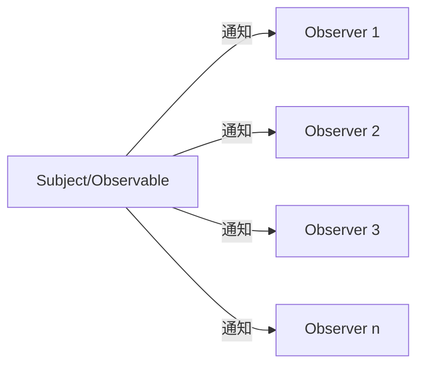
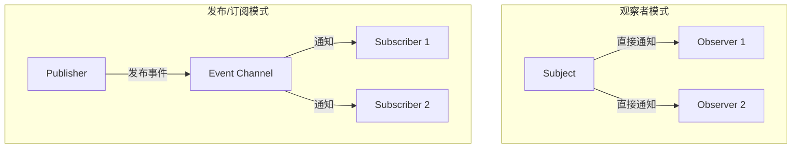

# JavaScript 观察者模式

## 什么是观察者模式？

观察者模式是一种行为设计模式，它定义了对象间的一对多依赖关系。当一个对象的状态发生改变时，所有依赖于它的对象都会得到通知并自动更新。在这种模式中，被观察的对象（通常称为"主题"或"可观察者"）维护着一系列观察者，并在状态变化时通知它们。

简单来说，观察者模式就像订阅一份报纸：
- 报社（Subject）负责发布报纸
- 读者（Observers）订阅这份报纸
- 当新的报纸出版时，所有订阅者都会收到通知



## 观察者模式的核心组件

1. **Subject（主题/可观察者）**：
   - 维护观察者列表
   - 提供添加和删除观察者的方法
   - 当状态改变时通知所有观察者

2. **Observer（观察者）**：
   - 提供更新接口，以便主题通知它们
   - 当收到通知后执行相应操作

## 基本实现

下面是 JavaScript 中观察者模式的基本实现：

```javascript
// 主题（Subject）类
class Subject {
  constructor() {
    this.observers = []; // 观察者列表
  }

  // 添加观察者
  addObserver(observer) {
    this.observers.push(observer);
  }

  // 移除观察者
  removeObserver(observer) {
    this.observers = this.observers.filter(obs => obs !== observer);
  }

  // 通知所有观察者
  notify(data) {
    this.observers.forEach(observer => {
      observer.update(data);
    });
  }
}

// 观察者（Observer）类
class Observer {
  constructor(name) {
    this.name = name;
  }

  // 当收到主题通知时调用此方法
  update(data) {
    console.log(`${this.name} 收到通知，数据更新为: ${data}`);
  }
}

// 使用示例
const subject = new Subject();

// 创建观察者
const observer1 = new Observer('观察者1');
const observer2 = new Observer('观察者2');

// 添加观察者到主题
subject.addObserver(observer1);
subject.addObserver(observer2);

// 通知所有观察者
subject.notify('重要数据已更新！');

// 移除一个观察者
subject.removeObserver(observer1);

// 再次通知
subject.notify('又有新数据！');
```

输出结果：
```
观察者1 收到通知，数据更新为: 重要数据已更新！
观察者2 收到通知，数据更新为: 重要数据已更新！
观察者2 收到通知，数据更新为: 又有新数据！
```

## 使用 ES6 的简化实现

利用 ES6 的语法特性，我们可以更简洁地实现观察者模式：

```javascript
class EventEmitter {
  constructor() {
    this.events = {};
  }

  // 订阅事件
  on(event, listener) {
    if (!this.events[event]) {
      this.events[event] = [];
    }
    this.events[event].push(listener);
    return () => this.off(event, listener); // 返回取消订阅的函数
  }

  // 取消订阅
  off(event, listener) {
    if (!this.events[event]) return;
    this.events[event] = this.events[event].filter(l => l !== listener);
  }

  // 触发事件
  emit(event, ...args) {
    if (!this.events[event]) return;
    this.events[event].forEach(listener => listener(...args));
  }

  // 只订阅一次
  once(event, listener) {
    const remove = this.on(event, (...args) => {
      remove();
      listener(...args);
    });
  }
}

// 使用示例
const emitter = new EventEmitter();

function dataChangeHandler(data) {
  console.log(`数据已更新: ${data}`);
}

// 订阅事件
emitter.on('dataChange', dataChangeHandler);

// 发布事件
emitter.emit('dataChange', '新数据值123');

// 取消订阅
emitter.off('dataChange', dataChangeHandler);

// 再次发布事件（不会有响应）
emitter.emit('dataChange', '另一个新值');

// 使用一次性订阅
emitter.once('specialEvent', data => {
  console.log(`特殊事件触发: ${data}`);
});

emitter.emit('specialEvent', '特殊数据');  // 会触发
emitter.emit('specialEvent', '再次触发');  // 不会触发
```

输出结果：
```
数据已更新: 新数据值123
特殊事件触发: 特殊数据
```

## 实际应用场景

### 1. 用户界面更新

当应用状态改变时更新 UI 元素：

```javascript
class UserInterface {
  constructor() {
    this.observers = [];
    this.data = { username: '' };
    
    // 添加DOM元素
    this.usernameInput = document.createElement('input');
    this.greeting = document.createElement('div');
    document.body.appendChild(this.usernameInput);
    document.body.appendChild(this.greeting);
    
    // 设置输入监听
    this.usernameInput.addEventListener('input', (e) => {
      this.updateData({ username: e.target.value });
    });
  }
  
  addObserver(observer) {
    this.observers.push(observer);
  }
  
  updateData(newData) {
    this.data = { ...this.data, ...newData };
    this.notify();
  }
  
  notify() {
    this.observers.forEach(observer => observer.update(this.data));
  }
}

class GreetingComponent {
  update(data) {
    const greetingElement = document.querySelector('div');
    if (data.username) {
      greetingElement.textContent = `Hello, ${data.username}!`;
    } else {
      greetingElement.textContent = 'Please enter your name';
    }
  }
}

// 使用
const ui = new UserInterface();
const greeting = new GreetingComponent();
ui.addObserver(greeting);
```

### 2. 事件处理系统

在复杂的应用程序中实现事件处理：

```javascript
class EventBus {
  constructor() {
    this.events = {};
  }
  
  subscribe(event, callback) {
    if (!this.events[event]) {
      this.events[event] = [];
    }
    this.events[event].push(callback);
    
    // 返回取消订阅的函数
    return () => {
      this.events[event] = this.events[event].filter(cb => cb !== callback);
    };
  }
  
  publish(event, data) {
    if (!this.events[event]) return;
    this.events[event].forEach(callback => callback(data));
  }
}

// 使用示例
const eventBus = new EventBus();

// 用户登录组件
class LoginComponent {
  constructor(eventBus) {
    this.eventBus = eventBus;
  }
  
  login(username, password) {
    // 模拟登录逻辑
    console.log(`尝试登录: ${username}`);
    
    // 登录成功后，发布事件
    setTimeout(() => {
      const userData = { username, id: 123, lastLogin: new Date() };
      this.eventBus.publish('user:loggedin', userData);
    }, 1000);
  }
}

// 导航栏组件 - 订阅登录事件
const unsubscribeNav = eventBus.subscribe('user:loggedin', (userData) => {
  console.log(`导航栏更新: 欢迎回来, ${userData.username}!`);
});

// 用户资料组件 - 订阅登录事件
const unsubscribeProfile = eventBus.subscribe('user:loggedin', (userData) => {
  console.log(`加载用户资料，用户ID: ${userData.id}`);
  console.log(`上次登录时间: ${userData.lastLogin}`);
});

// 创建登录组件并使用
const loginComponent = new LoginComponent(eventBus);
loginComponent.login('alice', 'password123');
```

输出结果：
```
尝试登录: alice
导航栏更新: 欢迎回来, alice!
加载用户资料，用户ID: 123
上次登录时间: Thu Oct 12 2023 10:15:30 GMT+0800 (中国标准时间)
```

### 3. 数据同步

在本地存储和应用状态间保持同步：

```javascript
class StateManager {
  constructor() {
    this.state = {};
    this.observers = [];
  }
  
  subscribe(observer) {
    this.observers.push(observer);
    return () => {
      this.observers = this.observers.filter(obs => obs !== observer);
    };
  }
  
  update(newState) {
    this.state = { ...this.state, ...newState };
    this.notify();
  }
  
  notify() {
    this.observers.forEach(observer => observer(this.state));
  }
}

// 使用示例
const stateManager = new StateManager();

// 用于将状态同步到localStorage的观察者
const localStorageObserver = (state) => {
  Object.entries(state).forEach(([key, value]) => {
    localStorage.setItem(key, JSON.stringify(value));
  });
  console.log('数据已同步到本地存储');
};

// 用于记录状态变化的观察者
const loggingObserver = (state) => {
  console.log('状态已更新:', state);
};

// 添加观察者
stateManager.subscribe(localStorageObserver);
stateManager.subscribe(loggingObserver);

// 更新状态
stateManager.update({ username: 'john_doe', preferences: { theme: 'dark' } });
```

输出结果：
```
状态已更新: { username: 'john_doe', preferences: { theme: 'dark' } }
数据已同步到本地存储
```

## 观察者模式和发布/订阅模式的区别

:::note
虽然这两种模式很相似，但它们有一个关键的区别：

- **观察者模式**：观察者和主题之间是直接耦合的，主题知道它的所有观察者。
- **发布/订阅模式**：发布者和订阅者之间是通过一个中间事件通道解耦的，彼此不需要了解对方的存在。
:::



## 优缺点

### 优点
1. **解耦**: 主题和观察者之间的松散耦合
2. **广播通信**: 可以向多个观察者发送通知
3. **灵活性**: 可以动态添加和删除观察者

### 缺点
1. **内存泄漏风险**: 如果不正确地移除观察者，可能会导致内存泄漏
2. **意外通知**: 如果通知顺序很重要，可能会出现问题
3. **复杂性**: 在大型应用中，跟踪观察者和更新可能会变得复杂

## 最佳实践

1. **及时清理**: 当观察者不再需要时，务必将其移除
2. **避免循环依赖**: 确保观察者和主题之间不会形成循环依赖关系
3. **考虑性能**: 通知大量观察者可能会影响性能，需要设计适当的优化策略
4. **异步考量**: 在异步环境中使用观察者模式需要特别小心

## 总结

观察者模式是 JavaScript 中一种强大的设计模式，特别适合于构建松耦合的事件驱动系统。通过将状态变化的通知从主题传播到所有依赖的观察者，它提供了一种优雅的方式来处理对象之间的一对多关系。

该模式在现代 JavaScript 应用程序中随处可见，从简单的事件监听到复杂的状态管理系统。掌握这一模式可以帮助你设计出更加灵活和可维护的代码。

## 练习与挑战

1. 实现一个简单的天气系统，有一个 `WeatherStation`（主题）和多个 `Display`（观察者）。当天气数据更新时，所有显示设备都应更新。

2. 扩展 `EventEmitter` 类，增加 `removeAllListeners` 方法，以便能够清除特定事件的所有监听器。

3. 使用观察者模式实现一个简单的表单验证系统，当表单数据变化时通知所有验证规则。

## 进一步学习资源

- 设计模式的官方术语和定义
- 现代前端框架（如 React、Vue）中的状态管理与观察者模式的关系
- RxJS 库，它是基于观察者模式的响应式编程库

通过掌握观察者模式，你将能够更好地理解许多现代 JavaScript 库和框架的内部工作原理，并能够在自己的应用中应用这一强大的设计模式。