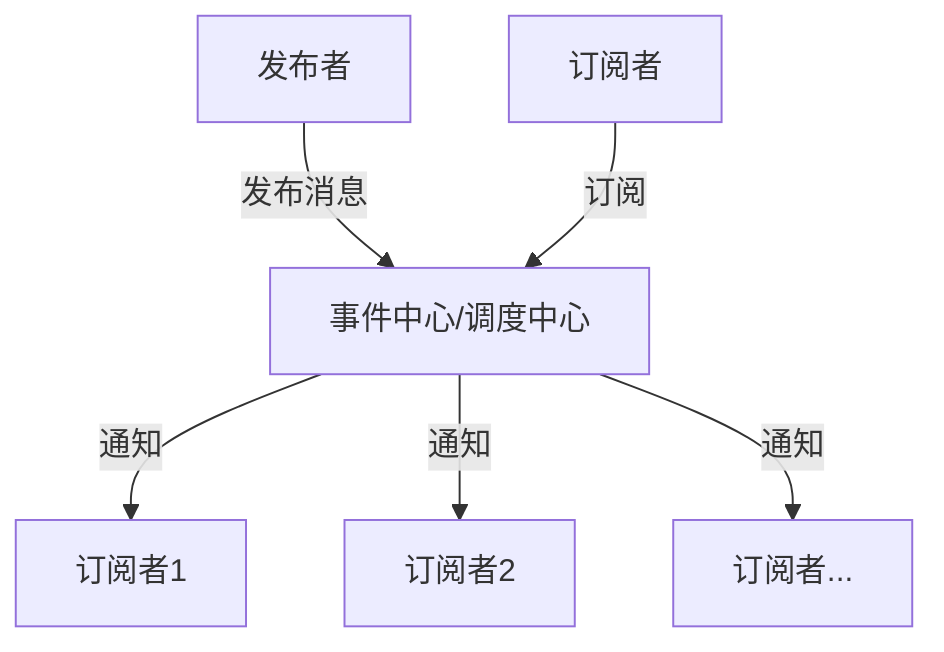
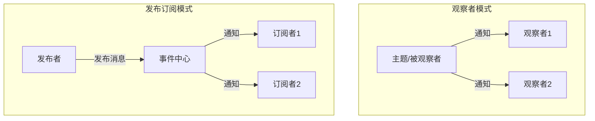

# JavaScript 发布订阅模式

## 什么是发布订阅模式？

发布订阅模式（Publish-Subscribe Pattern），简称 pub-sub，是一种消息传递模式。在这种模式中，消息的发送者（称为发布者）不会直接将消息发送给特定的接收者（称为订阅者）。相反，发布者将消息分类，订阅者表示对一个或多个类别感兴趣，仅接收感兴趣的消息，而不需要了解是哪个发布者发布的消息。

:::note 定义
发布订阅模式定义了一种一对多的依赖关系，当一个对象的状态发生改变时，所有依赖它的对象都将得到通知并自动更新。
:::

## 发布订阅模式的核心组成



1. **发布者（Publisher）**：负责发布事件/消息
2. **订阅者（Subscriber）**：负责订阅事件并在事件发生时执行相应操作
3. **事件中心（Event Channel）**：负责存储订阅者并在事件发生时通知订阅者

## 发布订阅模式的实现

### 基本实现

下面是一个简单的JavaScript发布订阅模式实现：

```javascript
class EventEmitter {
  constructor() {
    // 事件存储对象
    this.events = {};
  }

  // 订阅事件
  subscribe(eventName, callback) {
    if (!this.events[eventName]) {
      this.events[eventName] = [];
    }
    this.events[eventName].push(callback);
    
    // 返回取消订阅的方法
    return () => {
      this.events[eventName] = this.events[eventName].filter(cb => cb !== callback);
    };
  }

  // 发布事件
  publish(eventName, ...args) {
    const callbacks = this.events[eventName] || [];
    callbacks.forEach(callback => callback(...args));
  }

  // 取消订阅
  unsubscribe(eventName, callback) {
    if (!this.events[eventName]) return;
    if (!callback) {
      // 如果没有提供回调函数，则清除该事件的所有订阅
      delete this.events[eventName];
    } else {
      // 否则只移除特定的回调函数
      this.events[eventName] = this.events[eventName].filter(cb => cb !== callback);
    }
  }
}
```

### 使用示例

```javascript
// 创建事件中心
const eventBus = new EventEmitter();

// 订阅事件
const unsubscribe = eventBus.subscribe('userLogin', (user) => {
  console.log(`${user.name} 已登录`);
});

// 再添加一个订阅
eventBus.subscribe('userLogin', (user) => {
  console.log(`欢迎回来，${user.name}！上次登录时间: ${user.lastLogin}`);
});

// 发布事件
eventBus.publish('userLogin', { 
  name: '张三', 
  lastLogin: '2023-05-20 10:30:00' 
});

// 输出:
// 张三 已登录
// 欢迎回来，张三！上次登录时间: 2023-05-20 10:30:00

// 取消特定的订阅
unsubscribe();

// 再次发布事件
eventBus.publish('userLogin', { 
  name: '张三', 
  lastLogin: '2023-05-21 09:15:00' 
});

// 输出:
// 欢迎回来，张三！上次登录时间: 2023-05-21 09:15:00
```

## 发布订阅模式的优点

1. **松耦合**：发布者和订阅者之间不直接通信，降低了代码耦合度
2. **灵活性**：可以动态添加或移除订阅者
3. **可扩展性**：易于添加新的发布者和订阅者而不影响现有系统
4. **异步通信**：支持异步消息传递，提高系统响应能力

## 发布订阅模式的缺点

1. **内存泄漏风险**：如果订阅后没有正确取消订阅，可能导致内存泄漏
2. **调试困难**：因为松散耦合，事件流程不直观，调试可能较为困难
3. **可能的性能问题**：频繁发布事件时可能导致性能问题

## 与观察者模式的区别

发布订阅模式常常被与观察者模式混淆，但它们有明显区别：



- **观察者模式**：观察者直接订阅主题，主题状态变化时直接通知观察者
- **发布订阅模式**：发布者和订阅者通过事件中心交互，它们互不了解对方的存在

## 实际应用场景

### 1. 浏览器事件处理

DOM事件系统本质上就是一个发布订阅模式：

```javascript
// 订阅点击事件
document.getElementById('myButton').addEventListener('click', function() {
  console.log('按钮被点击了');
});

// 元素被点击时自动发布事件
```

### 2. 前端框架中的应用

Vue.js中的事件总线：

```javascript
// 创建事件总线
const eventBus = new Vue();

// 组件A中发布事件
eventBus.$emit('itemAdded', { id: 1, name: '新项目' });

// 组件B中订阅事件
eventBus.$on('itemAdded', item => {
  console.log('新增项目:', item);
});
```

### 3. 跨组件通信

在React应用中使用发布订阅模式实现跨组件通信：

```javascript
// 实现一个简单的事件总线
import { EventEmitter } from './eventEmitter';

const appEvents = new EventEmitter();

// 组件A
function ComponentA() {
  const handleClick = () => {
    appEvents.publish('dataChanged', { value: Math.random() });
  };
  
  return <button onClick={handleClick}>更新数据</button>;
}

// 组件B
function ComponentB() {
  const [value, setValue] = React.useState(null);
  
  React.useEffect(() => {
    const unsubscribe = appEvents.subscribe('dataChanged', (data) => {
      setValue(data.value);
    });
    
    // 清理函数
    return unsubscribe;
  }, []);
  
  return <div>接收到的值: {value}</div>;
}
```

### 4. 模块解耦

在大型应用中解耦模块间的通信：

```javascript
// 购物车模块
const shoppingCartModule = {
  init() {
    eventBus.subscribe('product:addToCart', this.addItem.bind(this));
  },
  addItem(product) {
    console.log(`添加商品 ${product.name} 到购物车`);
    // 更新购物车逻辑...
    
    // 发布购物车更新事件
    eventBus.publish('cart:updated', { itemCount: 5, total: 499 });
  }
};

// 产品模块
const productModule = {
  init() {
    document.querySelector('.add-to-cart-btn').addEventListener('click', () => {
      const product = { id: 123, name: 'JavaScript高级编程', price: 99 };
      eventBus.publish('product:addToCart', product);
    });
  }
};

// 头部导航模块
const navbarModule = {
  init() {
    eventBus.subscribe('cart:updated', this.updateCartIcon.bind(this));
  },
  updateCartIcon(cartData) {
    console.log(`更新导航栏购物车图标: ${cartData.itemCount} 件商品`);
    // 更新UI...
  }
};

// 初始化各模块
shoppingCartModule.init();
productModule.init();
navbarModule.init();
```

## 增强版发布订阅模式

下面是一个增强版的发布订阅模式实现，支持更多功能：

```javascript
class AdvancedEventEmitter {
  constructor() {
    this.events = {};
  }

  // 订阅事件
  subscribe(eventName, callback, context = null) {
    if (!this.events[eventName]) {
      this.events[eventName] = [];
    }
    
    // 存储回调和上下文
    const listener = {
      callback,
      context,
      once: false
    };
    
    this.events[eventName].push(listener);
    
    return () => this.unsubscribe(eventName, callback);
  }

  // 只订阅一次
  once(eventName, callback, context = null) {
    if (!this.events[eventName]) {
      this.events[eventName] = [];
    }
    
    const listener = {
      callback,
      context,
      once: true
    };
    
    this.events[eventName].push(listener);
    
    return () => this.unsubscribe(eventName, callback);
  }

  // 发布事件
  publish(eventName, ...args) {
    if (!this.events[eventName]) return false;
    
    const listeners = this.events[eventName].slice();
    
    listeners.forEach((listener) => {
      listener.callback.apply(listener.context, args);
      
      // 如果是一次性监听，则移除
      if (listener.once) {
        this.unsubscribe(eventName, listener.callback);
      }
    });
    
    return true;
  }

  // 取消订阅
  unsubscribe(eventName, callback) {
    if (!eventName) {
      // 清除所有事件
      this.events = {};
      return true;
    }
    
    if (!this.events[eventName]) return false;
    
    if (!callback) {
      // 清除特定事件的所有订阅
      delete this.events[eventName];
      return true;
    }
    
    // 移除特定回调
    const index = this.events[eventName].findIndex(
      listener => listener.callback === callback
    );
    
    if (index === -1) return false;
    
    this.events[eventName].splice(index, 1);
    // 如果该事件没有监听器了，则删除整个事件
    if (this.events[eventName].length === 0) {
      delete this.events[eventName];
    }
    
    return true;
  }

  // 获取某个事件的所有订阅者数量
  listenerCount(eventName) {
    if (!this.events[eventName]) return 0;
    return this.events[eventName].length;
  }

  // 获取所有已注册的事件名
  eventNames() {
    return Object.keys(this.events);
  }
}
```

使用增强版的事件发射器：

```javascript
const emitter = new AdvancedEventEmitter();

// 普通订阅
emitter.subscribe('message', (msg) => {
  console.log('收到消息1:', msg);
});

// 一次性订阅
emitter.once('message', (msg) => {
  console.log('一次性消息:', msg);
});

// 使用上下文
const logger = {
  prefix: '[日志]',
  log(msg) {
    console.log(`${this.prefix} ${msg}`);
  }
};

emitter.subscribe('message', logger.log, logger);

// 发布事件
emitter.publish('message', 'Hello World');

// 输出:
// 收到消息1: Hello World
// 一次性消息: Hello World
// [日志] Hello World

// 再次发布
emitter.publish('message', 'Second message');

// 输出:
// 收到消息1: Second message
// [日志] Second message
// (一次性订阅不再触发)

// 查看订阅者数量
console.log(emitter.listenerCount('message')); // 2

// 查看所有事件名
console.log(emitter.eventNames()); // ['message']
```

## 注意事项与最佳实践

1. **始终取消不需要的订阅**：特别是在组件销毁时，避免内存泄漏
2. **明确的事件命名约定**：比如采用 `模块:动作` 的命名方式
3. **避免过度使用**：发布订阅模式虽然灵活，但过度使用会使程序流程难以追踪
4. **事件文档化**：记录所有事件的名称、参数和用途，便于团队协作
5. **传递完整数据**：发布事件时提供足够的上下文信息，避免订阅者需要额外查询
6. **错误处理**：处理订阅者可能抛出的错误，避免影响其他订阅者

## 总结

发布订阅模式是JavaScript中一个强大且常用的设计模式，它能有效地解耦系统组件，使各部分能够独立开发和维护。这种模式在前端开发中尤为有用，比如处理用户交互、组件通信、异步操作等场景。

通过本文，我们学习了：
- 发布订阅模式的基本概念和核心组成
- 如何实现一个简单和增强版的事件发射器
- 发布订阅模式的实际应用场景
- 使用该模式的最佳实践和注意事项

掌握这一模式将帮助你编写更加灵活、可维护的JavaScript代码，特别是在处理复杂的应用架构时。

## 练习

1. 实现一个带有事件优先级功能的发布订阅系统，高优先级的订阅者应该先收到通知。
2. 创建一个简单的聊天应用，使用发布订阅模式处理消息收发。
3. 扩展基本的EventEmitter，添加一个`subscribeOnce`方法，使订阅者只能接收一次消息。
4. 实现一个支持通配符订阅的事件系统，比如订阅`user.*`可以接收`user.login`、`user.logout`等事件。

## 延伸阅读

- 深入了解JavaScript中的事件循环与异步编程
- 探索Node.js的EventEmitter实现
- 比较不同JavaScript框架(React, Vue, Angular)中的事件处理机制
- 学习RxJS等反应式编程库，它们也是基于发布订阅模式的高级实现

掌握发布订阅模式将为你在JavaScript编程中提供一个强大的工具，帮助你构建更加灵活和可维护的应用程序。