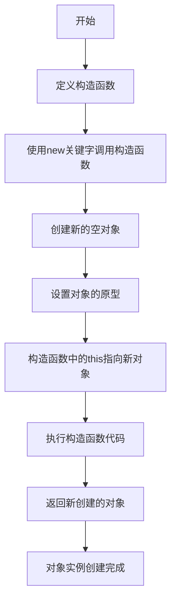

# JavaScript 构造器模式

## 什么是构造器模式？

构造器模式是JavaScript中创建新对象的一种基本方式，它使用构造函数来初始化和定制对象。这种模式允许我们定义"蓝图"，然后从这个蓝图创建多个相似但独立的对象实例。

在JavaScript中，构造器模式是实现面向对象编程的基础之一。尽管JavaScript不是一个传统的面向对象编程语言，但它通过构造函数和原型链提供了创建和管理对象的机制。

:::note
构造函数通常以大写字母开头，这是一种编程约定，用来区分构造函数和普通函数。
:::

## 基本语法

构造器模式的基本语法如下：

```javascript
function Constructor(param1, param2, ...) {
  this.property1 = param1;
  this.property2 = param2;
  
  this.method1 = function() {
    // 方法代码
  };
}

// 使用new关键字创建实例
const instance = new Constructor(arg1, arg2);
```

当我们使用`new`关键字调用构造函数时，发生了以下几步：

1. 创建一个新的空对象
2. 设置这个对象的原型为构造函数的`prototype`属性
3. 将构造函数内部的`this`指向新创建的对象
4. 执行构造函数中的代码
5. 如果构造函数没有明确返回其他对象，则返回新创建的对象

## 实际示例

让我们通过一个简单的例子来理解构造器模式：

```javascript
// 定义一个Person构造函数
function Person(name, age, job) {
  this.name = name;
  this.age = age;
  this.job = job;
  
  this.greet = function() {
    return `你好，我是${this.name}，今年${this.age}岁，我的职业是${this.job}。`;
  };
}

// 创建Person的实例
const person1 = new Person('张三', 28, '软件工程师');
const person2 = new Person('李四', 32, '产品经理');

console.log(person1.greet()); // 输出: 你好，我是张三，今年28岁，我的职业是软件工程师。
console.log(person2.greet()); // 输出: 你好，我是李四，今年32岁，我的职业是产品经理。

// 每个实例都有自己的属性
console.log(person1.name); // 输出: 张三
console.log(person2.name); // 输出: 李四

// 验证实例来源
console.log(person1 instanceof Person); // 输出: true
console.log(person2 instanceof Person); // 输出: true
```

在这个例子中，`Person`是一个构造函数，通过`new`关键字，我们创建了两个不同的`Person`实例。每个实例都有自己的`name`、`age`和`job`属性，以及`greet`方法。

## 构造器模式的缺点

虽然构造器模式很实用，但它也有一些缺点：

1. **内存效率问题**：每次创建新实例时，所有的方法都会在内存中重新创建一次。比如在上面的例子中，`person1.greet`和`person2.greet`是两个不同的函数实例，即使它们做的事情完全一样。

```javascript
console.log(person1.greet === person2.greet); // 输出: false
```

这意味着如果创建大量实例，内存使用效率会很低。

## 结合原型模式改进

为了解决这个问题，我们可以将方法定义在构造函数的`prototype`属性上：

```javascript
function Person(name, age, job) {
  this.name = name;
  this.age = age;
  this.job = job;
}

// 将方法添加到原型上
Person.prototype.greet = function() {
  return `你好，我是${this.name}，今年${this.age}岁，我的职业是${this.job}。`;
};

const person1 = new Person('张三', 28, '软件工程师');
const person2 = new Person('李四', 32, '产品经理');

console.log(person1.greet()); // 输出: 你好，我是张三，今年28岁，我的职业是软件工程师。
console.log(person2.greet()); // 输出: 你好，我是李四，今年32岁，我的职业是产品经理。

// 现在方法是共享的
console.log(person1.greet === person2.greet); // 输出: true
```

这样，无论创建多少个实例，`greet`方法只在内存中存在一份，提高了内存效率。

## ES6中的类（Class）

ES6引入了`class`语法，这使得构造器模式的使用更加现代化和直观：

```javascript
class Person {
  constructor(name, age, job) {
    this.name = name;
    this.age = age;
    this.job = job;
  }
  
  greet() {
    return `你好，我是${this.name}，今年${this.age}岁，我的职业是${this.job}。`;
  }
}

const person1 = new Person('张三', 28, '软件工程师');
console.log(person1.greet()); // 输出: 你好，我是张三，今年28岁，我的职业是软件工程师。
```

虽然语法不同，但ES6的`class`本质上仍然是基于原型的构造函数模式的语法糖。

## 实际应用场景

### 1. 用户管理系统

在网站或应用的用户管理系统中，可以使用构造器模式创建用户对象：

```javascript
function User(id, username, email, role = 'user') {
  this.id = id;
  this.username = username;
  this.email = email;
  this.role = role;
  this.createdAt = new Date();
  this.isActive = true;
}

User.prototype.deactivate = function() {
  this.isActive = false;
};

User.prototype.promoteToAdmin = function() {
  this.role = 'admin';
};

// 创建普通用户
const regularUser = new User(1, 'user123', 'user@example.com');

// 创建管理员
const adminUser = new User(2, 'admin', 'admin@example.com', 'admin');

console.log(regularUser);
regularUser.promoteToAdmin();
console.log(regularUser.role); // 输出: admin
```

### 2. 游戏角色创建

在游戏开发中，可以使用构造器模式创建不同的游戏角色：

```javascript
function GameCharacter(name, type, level = 1) {
  this.name = name;
  this.type = type;
  this.level = level;
  this.health = type === 'warrior' ? 200 : 100;
  this.power = type === 'mage' ? 150 : 50;
}

GameCharacter.prototype.levelUp = function() {
  this.level += 1;
  this.health += 20;
  this.power += 10;
};

GameCharacter.prototype.attack = function() {
  return `${this.name}发动攻击，造成${this.power}点伤害！`;
};

const warrior = new GameCharacter('狂战士', 'warrior');
const mage = new GameCharacter('法师', 'mage');

console.log(warrior.attack()); // 输出: 狂战士发动攻击，造成50点伤害！
console.log(mage.attack());    // 输出: 法师发动攻击，造成150点伤害！

warrior.levelUp();
console.log(warrior.level);    // 输出: 2
console.log(warrior.health);   // 输出: 220
```

## 构造器模式的工作流程

下面是构造器模式的工作流程图：



## 小结与最佳实践

### 构造器模式的优点

1. **创建对象的标准方式**：提供了一种创建具有相似结构但具有不同属性值的对象的方法
2. **面向对象编程支持**：支持JavaScript中的面向对象编程范式
3. **代码组织**：通过将相关功能分组到构造函数中，促进了更好的代码组织

### 构造器模式的注意事项

1. **总是使用`new`关键字**：忘记使用`new`会导致意外行为，因为`this`将指向全局对象
2. **方法应该放在原型上**：为了内存效率，共享方法应该放在构造函数的原型上
3. **ES6类语法**：考虑使用现代ES6类语法来创建更清晰的构造器

```javascript
// 错误：忘记使用new
const badExample = Person('小明', 25, '学生'); 
// 此时this指向全局对象，在浏览器中是window
// window.name被设为'小明'

// 正确：使用new关键字
const goodExample = new Person('小明', 25, '学生');
```

:::tip
在现代JavaScript开发中，建议使用ES6的`class`语法来创建对象，它更加清晰直观，同时保持了JavaScript基于原型的继承本质。
:::

## 练习

1. 创建一个`Book`构造函数，包含属性：`title`、`author`、`year`、`pages`，以及方法：`getSummary()`返回书籍摘要。
2. 创建一个`Car`构造函数，包含属性：`make`、`model`、`year`，以及方法：`getAge()`计算汽车的年龄。
3. 使用ES6的`class`语法重写上述构造函数。

## 进一步学习资源

- JavaScript高级程序设计（第4版）- 介绍JavaScript中对象创建的章节
- 设计模式：可复用面向对象软件的基础 - 经典的设计模式书籍
- MDN Web文档 - [JavaScript类](https://developer.mozilla.org/zh-CN/docs/Web/JavaScript/Reference/Classes)
- MDN Web文档 - [对象原型](https://developer.mozilla.org/zh-CN/docs/Learn/JavaScript/Objects/Object_prototypes)

通过掌握构造器模式，你已经迈出了JavaScript面向对象编程的第一步。继续学习和实践，你将能够创建更复杂、更有组织性的代码结构！