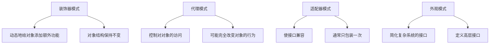

# JavaScript 装饰器模式

## 什么是装饰器模式？

装饰器模式(Decorator Pattern)是一种结构型设计模式，它允许我们在不改变对象自身的基础上，动态地给对象添加额外的职责或行为。装饰器模式提供了比继承更加灵活的替代方案，可以在运行时动态地扩展对象的功能。

:::tip 核心思想
装饰器就像一层一层的包装，每一层都可以给原始对象添加新的功能，而不需要修改原始对象的代码。
:::

## 为什么需要装饰器模式？

在开发过程中，我们可能会遇到这样的情况：

- 需要在不修改现有代码的情况下为对象添加新功能
- 需要动态地给对象增加职责，并且能够随时撤销
- 继承机制不够灵活或者会导致类爆炸问题

装饰器模式正好解决了这些问题。

## JavaScript 中装饰器模式的实现方式

### 1. 基本实现方式

在JavaScript中，由于其函数式特性和灵活的对象系统，实现装饰器模式非常简单。以下是一个基本示例：

```javascript
// 原始对象（被装饰对象）
function Coffee() {
  this.cost = function() {
    return 5;
  };
}

// 装饰器
function MilkDecorator(coffee) {
  const originalCost = coffee.cost;
  coffee.cost = function() {
    return originalCost.call(this) + 2;
  };
  return coffee;
}

// 另一个装饰器
function SugarDecorator(coffee) {
  const originalCost = coffee.cost;
  coffee.cost = function() {
    return originalCost.call(this) + 1;
  };
  return coffee;
}

// 使用装饰器
const myCoffee = new Coffee();
console.log("原始咖啡价格: $" + myCoffee.cost()); // 输出: 原始咖啡价格: $5

// 添加牛奶
const milkedCoffee = MilkDecorator(myCoffee);
console.log("加牛奶后咖啡价格: $" + milkedCoffee.cost()); // 输出: 加牛奶后咖啡价格: $7

// 再添加糖
const sweetMilkedCoffee = SugarDecorator(milkedCoffee);
console.log("加牛奶和糖后咖啡价格: $" + sweetMilkedCoffee.cost()); // 输出: 加牛奶和糖后咖啡价格: $8
```

### 2. ES6类实现装饰器模式

使用ES6的类语法，我们可以更优雅地实现装饰器模式：

```javascript
// 基础组件类
class BasicCoffee {
  getCost() {
    return 5;
  }
  
  getDescription() {
    return "基本咖啡";
  }
}

// 装饰器基类
class CoffeeDecorator {
  constructor(coffee) {
    this.coffee = coffee;
  }
  
  getCost() {
    return this.coffee.getCost();
  }
  
  getDescription() {
    return this.coffee.getDescription();
  }
}

// 具体装饰器 - 牛奶
class MilkDecorator extends CoffeeDecorator {
  constructor(coffee) {
    super(coffee);
  }
  
  getCost() {
    return this.coffee.getCost() + 2;
  }
  
  getDescription() {
    return this.coffee.getDescription() + ", 加牛奶";
  }
}

// 具体装饰器 - 糖
class SugarDecorator extends CoffeeDecorator {
  constructor(coffee) {
    super(coffee);
  }
  
  getCost() {
    return this.coffee.getCost() + 1;
  }
  
  getDescription() {
    return this.coffee.getDescription() + ", 加糖";
  }
}

// 使用示例
let coffee = new BasicCoffee();
console.log(`${coffee.getDescription()} 价格: $${coffee.getCost()}`);
// 输出: 基本咖啡 价格: $5

coffee = new MilkDecorator(coffee);
console.log(`${coffee.getDescription()} 价格: $${coffee.getCost()}`);
// 输出: 基本咖啡, 加牛奶 价格: $7

coffee = new SugarDecorator(coffee);
console.log(`${coffee.getDescription()} 价格: $${coffee.getCost()}`);
// 输出: 基本咖啡, 加牛奶, 加糖 价格: $8
```

### 3. 使用高阶函数实现装饰器模式

JavaScript的函数式特性使得我们可以通过高阶函数轻松实现装饰器模式：

```javascript
// 原始函数
function greet(name) {
  return `你好, ${name}!`;
}

// 装饰器函数 - 添加敬语
function withRespect(fn) {
  return function(name) {
    return fn(name).replace('你好', '尊敬的您好');
  };
}

// 装饰器函数 - 添加时间戳
function withTimestamp(fn) {
  return function(name) {
    return `[${new Date().toLocaleTimeString()}] ${fn(name)}`;
  };
}

// 使用装饰器
console.log(greet("张三")); 
// 输出: 你好, 张三!

const respectfulGreet = withRespect(greet);
console.log(respectfulGreet("张三")); 
// 输出: 尊敬的您好, 张三!

const timestampedRespectfulGreet = withTimestamp(respectfulGreet);
console.log(timestampedRespectfulGreet("张三")); 
// 输出: [12:34:56] 尊敬的您好, 张三!
```

## ES7/TypeScript装饰器

在ES7提案和TypeScript中，装饰器已经作为一项语法特性被引入。虽然截至我的知识更新日期，JavaScript装饰器还是一个实验性特性，但在TypeScript中已经可以使用。

```typescript
// 类装饰器
function Logger(target: Function) {
  console.log(`创建了新实例: ${target.name}`);
}

// 方法装饰器
function LogMethod(target: any, propertyKey: string, descriptor: PropertyDescriptor) {
  const originalMethod = descriptor.value;
  
  descriptor.value = function(...args: any[]) {
    console.log(`调用方法 ${propertyKey} 参数:`, args);
    const result = originalMethod.apply(this, args);
    console.log(`方法 ${propertyKey} 返回:`, result);
    return result;
  };
  
  return descriptor;
}

@Logger
class Person {
  constructor(public name: string) {}
  
  @LogMethod
  sayHello(greeting: string): string {
    return `${greeting}, 我是 ${this.name}`;
  }
}

const person = new Person("张三");
person.sayHello("你好");
// 输出:
// 创建了新实例: Person
// 调用方法 sayHello 参数: ["你好"]
// 方法 sayHello 返回: 你好, 我是 张三
```

## 装饰器模式的实际应用场景

### 1. 日志记录

装饰器模式可用于为函数或方法添加日志记录功能：

```javascript
function logExecutionTime(fn) {
  return function(...args) {
    console.log(`开始执行 ${fn.name}...`);
    const start = performance.now();
    const result = fn.apply(this, args);
    const end = performance.now();
    console.log(`${fn.name} 执行完毕，耗时 ${end - start} 毫秒`);
    return result;
  };
}

function calculateSum(n) {
  let sum = 0;
  for (let i = 1; i <= n; i++) {
    sum += i;
  }
  return sum;
}

const enhancedCalculateSum = logExecutionTime(calculateSum);
console.log(enhancedCalculateSum(1000000));
// 输出:
// 开始执行 calculateSum...
// calculateSum 执行完毕，耗时 5.200000047683716 毫秒
// 500000500000
```

### 2. 表单验证

可以使用装饰器模式为表单字段添加验证规则：

```javascript
// 基本的表单验证函数
function validateForm(formData) {
  return { isValid: true, formData };
}

// 必填字段验证装饰器
function requireFields(...fields) {
  return function(validateFn) {
    return function(formData) {
      for (const field of fields) {
        if (!formData[field]) {
          return {
            isValid: false,
            error: `${field} 是必填字段`,
            formData
          };
        }
      }
      return validateFn(formData);
    };
  };
}

// 邮箱格式验证装饰器
function validateEmail(emailField) {
  return function(validateFn) {
    return function(formData) {
      const emailRegex = /^[^\s@]+@[^\s@]+\.[^\s@]+$/;
      if (formData[emailField] && !emailRegex.test(formData[emailField])) {
        return {
          isValid: false,
          error: `${emailField} 不是有效的邮箱格式`,
          formData
        };
      }
      return validateFn(formData);
    };
  };
}

// 应用多个装饰器
const validateUserForm = validateEmail('email')(
  requireFields('name', 'email', 'password')(
    validateForm
  )
);

// 使用验证
const validForm = {
  name: 'John',
  email: 'john@example.com',
  password: '123456'
};

const invalidForm = {
  name: 'John',
  email: 'not-an-email',
  password: '123456'
};

console.log(validateUserForm(validForm));
// 输出: { isValid: true, formData: {...} }

console.log(validateUserForm(invalidForm));
// 输出: { isValid: false, error: 'email 不是有效的邮箱格式', formData: {...} }
```

### 3. 缓存计算结果

装饰器可以用于缓存函数的计算结果，避免重复计算：

```javascript
function memoize(fn) {
  const cache = new Map();
  
  return function(...args) {
    const key = JSON.stringify(args);
    if (cache.has(key)) {
      console.log('从缓存获取结果');
      return cache.get(key);
    }
    
    console.log('计算新结果');
    const result = fn.apply(this, args);
    cache.set(key, result);
    return result;
  };
}

function fibonacci(n) {
  if (n <= 1) return n;
  return fibonacci(n - 1) + fibonacci(n - 2);
}

const memoizedFibonacci = memoize(function(n) {
  if (n <= 1) return n;
  return memoizedFibonacci(n - 1) + memoizedFibonacci(n - 2);
});

console.time('非缓存');
console.log(fibonacci(30));
console.timeEnd('非缓存');

console.time('缓存');
console.log(memoizedFibonacci(30));
console.timeEnd('缓存');

// 再次调用，应该会从缓存获取
console.time('再次调用');
console.log(memoizedFibonacci(30));
console.timeEnd('再次调用');
```

## 装饰器模式与其他设计模式的区别

下面是装饰器模式与其他常见设计模式的对比：



## 装饰器模式的优缺点

### 优点

1. **开闭原则：** 遵循开闭原则，可以在不修改现有代码的情况下扩展对象功能
2. **灵活性：** 比继承更加灵活，可以动态组合不同功能
3. **单一职责：** 每个装饰器只关注特定的功能，符合单一职责原则
4. **可移除性：** 装饰器添加的功能可以动态地撤销

### 缺点

1. **复杂性：** 过多的装饰器可能会导致代码难以理解和调试
2. **实例标识问题：** 装饰器可能会改变对象的标识，使得依赖原始对象标识的代码出现问题
3. **顺序敏感：** 装饰器的应用顺序可能会影响最终结果

## 总结

装饰器模式是JavaScript中一种强大而灵活的设计模式，特别适合用于动态地扩展对象功能。它符合开闭原则，使我们能够在不修改原始代码的情况下为对象添加新的行为。在JavaScript中，由于函数是一等公民，我们可以通过多种方式实现装饰器模式，包括函数包装、类继承以及ES7装饰器语法。

装饰器模式在日志记录、性能监控、表单验证、缓存等场景中特别有用。当你需要动态地、可组合地扩展对象功能，而不希望通过继承产生大量子类时，装饰器模式是一个不错的选择。

## 练习与扩展学习

1. 尝试创建一个用于HTTP请求的装饰器，它可以添加认证头、记录请求时间、自动重试等功能。
2. 为DOM元素操作创建装饰器，例如为点击事件添加防抖或节流功能。
3. 探索TypeScript中装饰器的更多用法，例如属性装饰器和参数装饰器。
4. 比较装饰器模式与中间件模式的异同，思考它们各自的适用场景。

## 参考资源

- JavaScript设计模式与开发实践 (曾探)
- Design Patterns: Elements of Reusable Object-Oriented Software (GoF)
- TypeScript官方文档中关于装饰器的部分

:::caution
请注意，ES装饰器目前仍处于提案阶段（尽管TypeScript已支持），其语法和行为可能会在未来发生变化。
:::