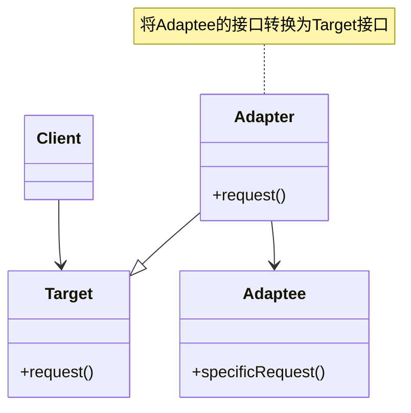

# JavaScript 适配器模式

## 什么是适配器模式？

适配器模式是一种结构型设计模式，它允许两个不兼容的接口能够一起工作。就像现实生活中的电源适配器一样，它能够连接两个原本不匹配的接口，使它们能够协同工作。

在JavaScript中，适配器模式主要用于：
- 让具有不同接口的类可以一起工作
- 使旧接口与新接口兼容
- 重用已有代码，但接口不符合当前需求

:::tip
适配器模式特别适合处理第三方库整合、API对接、旧代码重构等场景，能够帮助我们构建更加灵活和可维护的代码。
:::

## 适配器模式的基本结构



上图中：
- `Target` 是客户端期望的接口
- `Adaptee` 是需要被适配的类/接口
- `Adapter` 是适配器，它实现了 `Target` 接口并包装了 `Adaptee` 对象
- `Client` 是使用 `Target` 接口的客户端代码

## 简单示例：温度转换适配器

假设我们有一个天气应用，它使用摄氏度，但我们需要与一个提供华氏度的旧API对接：

```javascript
// 旧的API（适配者Adaptee）
class FahrenheitTemperature {
  constructor(fahrenheit) {
    this.fahrenheit = fahrenheit;
  }
  
  getFahrenheit() {
    return this.fahrenheit;
  }
}

// 新系统期望的接口（目标Target）
class CelsiusTemperature {
  getCelsius() {
    // 默认实现
  }
}

// 适配器（Adapter）
class TemperatureAdapter extends CelsiusTemperature {
  constructor(fahrenheitTemp) {
    super();
    this.fahrenheitTemp = fahrenheitTemp;
  }
  
  getCelsius() {
    // 华氏度转摄氏度的公式: (F - 32) * 5/9
    return (this.fahrenheitTemp.getFahrenheit() - 32) * 5/9;
  }
}

// 客户端代码
const fahrenheitTemperature = new FahrenheitTemperature(98.6);
const adapter = new TemperatureAdapter(fahrenheitTemperature);

console.log(`华氏温度: ${fahrenheitTemperature.getFahrenheit()}°F`);
console.log(`摄氏温度: ${adapter.getCelsius()}°C`);
```

输出：
```
华氏温度: 98.6°F
摄氏温度: 37°C
```

在这个例子中，我们构建了一个适配器，将华氏温度转换为摄氏温度，使不兼容的温度表示方式能够在我们的系统中正常工作。

## 适配器模式的两种实现方式

在JavaScript中，适配器模式有两种常见的实现方式：

### 1. 类适配器（使用继承）

类适配器使用继承来实现适配，适配器继承自目标接口：

```javascript
class Adapter extends Target {
  constructor(adaptee) {
    super();
    this.adaptee = adaptee;
  }
  
  request() {
    // 调用adaptee的方法，并进行必要的转换
    return this.translate(this.adaptee.specificRequest());
  }
  
  translate(value) {
    // 将adaptee的返回值转换为target接口期望的格式
    return convertedValue;
  }
}
```

### 2. 对象适配器（使用组合）

对象适配器使用组合而不是继承，这在JavaScript中更为常见：

```javascript
class Adapter {
  constructor(adaptee) {
    this.adaptee = adaptee;
  }
  
  request() {
    // 调用adaptee的方法，并进行必要的转换
    return this.translate(this.adaptee.specificRequest());
  }
  
  translate(value) {
    // 将adaptee的返回值转换为期望的格式
    return convertedValue;
  }
}
```

:::note
在JavaScript中，由于其动态类型和灵活的对象系统，对象适配器通常是更简单、更直接的实现方式。
:::

## 实际应用场景

### 1. 第三方库整合

假设你的项目使用了一个特定的数据格式化库，但现在需要集成另一个具有不同API的库：

```javascript
// 现有的数据格式化器
class CurrentFormatter {
  format(data) {
    return `${data.name}, ${data.age} years old`;
  }
}

// 新的第三方格式化器
class FancyFormatter {
  formatPerson(personData) {
    return {
      personName: personData.name,
      personAge: personData.age,
      formattedString: `Name: ${personData.name} (Age: ${personData.age})`
    };
  }
}

// 适配器
class FormatterAdapter {
  constructor(fancyFormatter) {
    this.fancyFormatter = fancyFormatter;
  }
  
  format(data) {
    // 适配新的格式化器到旧的接口
    return this.fancyFormatter.formatPerson(data).formattedString;
  }
}

// 客户端代码
const person = { name: "John Doe", age: 30 };

// 使用原始格式化器
const originalFormatter = new CurrentFormatter();
console.log(originalFormatter.format(person)); // "John Doe, 30 years old"

// 使用带适配器的新格式化器
const fancyFormatter = new FancyFormatter();
const adapter = new FormatterAdapter(fancyFormatter);
console.log(adapter.format(person)); // "Name: John Doe (Age: 30)"
```

这样，客户端代码可以继续使用熟悉的 `format()` 方法，而适配器背后实际调用的是新的 `formatPerson()` 方法。

### 2. 旧API与新API的兼容

想象一个场景，你正在更新一个应用，旧版本使用了特定的地图API，新版本使用了完全不同的地图API：

```javascript
// 旧的地图API
class OldMapAPI {
  showLocation(latitude, longitude) {
    console.log(`Old API: Showing location at ${latitude}, ${longitude}`);
  }
}

// 新的地图API
class NewMapAPI {
  displayPosition(position) {
    console.log(`New API: Displaying position at ${position.lat}, ${position.lng}`);
  }
}

// 地图适配器
class MapAdapter {
  constructor(newMapAPI) {
    this.newMapAPI = newMapAPI;
  }
  
  showLocation(latitude, longitude) {
    // 将旧API的参数格式转换为新API需要的格式
    this.newMapAPI.displayPosition({
      lat: latitude,
      lng: longitude
    });
  }
}

// 客户端代码（假设这是无法修改的老代码）
function showUserLocation(mapAPI) {
  // 此处的代码期望所有地图实现都有showLocation方法
  mapAPI.showLocation(37.7749, -122.4194);
}

// 使用旧API
const oldMap = new OldMapAPI();
showUserLocation(oldMap); // "Old API: Showing location at 37.7749, -122.4194"

// 使用适配器包装新API
const newMap = new NewMapAPI();
const mapAdapter = new MapAdapter(newMap);
showUserLocation(mapAdapter); // "New API: Displaying position at 37.7749, -122.4194"
```

通过适配器，我们可以在不修改客户端代码的情况下，无缝地将新的地图API整合到现有系统中。

### 3. 前端框架之间的适配

在前端开发中，适配器模式也常用于不同框架或组件库之间的转换：

```javascript
// React组件使用的数据格式
const reactUserData = {
  firstName: "John",
  lastName: "Doe",
  fullName() { return `${this.firstName} ${this.lastName}`; }
};

// Vue组件期望的数据格式
// Vue需要数据是响应式的，并且有特定的属性名
class VueUserAdapter {
  constructor(reactUser) {
    this.user = reactUser;
    // 创建一个适合Vue的数据对象
    this.vueData = {
      name: {
        first: reactUser.firstName,
        last: reactUser.lastName
      },
      getDisplayName: function() {
        return `${this.name.first} ${this.name.last}`;
      }
    };
  }
  
  getData() {
    return this.vueData;
  }
  
  updateReactData() {
    // 当Vue数据更新时，同步回React数据
    this.user.firstName = this.vueData.name.first;
    this.user.lastName = this.vueData.name.last;
  }
}

// 使用适配器
const adapter = new VueUserAdapter(reactUserData);
const vueCompatibleData = adapter.getData();

console.log(reactUserData.fullName()); // "John Doe"
console.log(vueCompatibleData.getDisplayName()); // "John Doe"

// 当数据需要更新时
vueCompatibleData.name.first = "Jane";
adapter.updateReactData();

console.log(reactUserData.fullName()); // "Jane Doe"
```

这个例子展示了如何在不同的框架之间适配数据格式，使得数据可以在不同的组件生态系统中使用。

## 适配器模式的优缺点

### 优点

1. **解耦**: 客户端代码与适配者代码分离，各自可以独立变化
2. **重用**: 可以重用现有的类，即使它们的接口不匹配
3. **灵活性**: 可以在不修改源代码的情况下集成新的系统或API
4. **单一职责**: 适配器专注于转换接口，不掺杂其他逻辑

### 缺点

1. **增加复杂性**: 引入新的类，可能使系统更复杂
2. **可能的性能问题**: 在某些情况下，适配操作可能会带来额外的性能开销
3. **调试困难**: 通过适配器调用代码可能较难调试

## 适配器模式vs其他模式

### 适配器 vs 装饰器

- **适配器模式**：改变接口，使不兼容的接口能够一起工作
- **装饰器模式**：保持相同接口，但增加新功能

### 适配器 vs 外观模式

- **适配器模式**：通常包装一个对象使其接口匹配另一个接口
- **外观模式**：为复杂的子系统提供一个简化的接口，隐藏子系统的复杂性

## 总结

适配器模式是一种强大的结构型模式，可以帮助我们解决接口不兼容的问题。它在以下情况特别有用：

- 需要使用现有类，但其接口不符合需求
- 整合第三方库或旧系统
- 系统重构时保持向后兼容性

在JavaScript中，由于语言的动态特性，实现适配器通常非常直接。通过使用适配器模式，我们可以构建更加灵活、可维护且可扩展的系统。

## 练习与思考

1. 创建一个适配器，将一个返回JSON数据的API转换为返回XML格式的接口
2. 设计一个适配器，使Node.js的文件系统API与浏览器的File API兼容
3. 思考：在你最近的项目中，哪些地方可以应用适配器模式来改进代码结构？

## 进一步学习资源

- 《JavaScript设计模式》- Addy Osmani
- 《Head First设计模式》- Eric Freeman & Elisabeth Robson
- [设计模式：可复用面向对象软件的基础](https://gof.quanke.name/) - GoF的设计模式在线资源

记住，好的设计模式应该用在适当的地方，不要为了使用模式而使用模式。适配器模式是一个强大的工具，但请确保在真正需要它时才使用它。