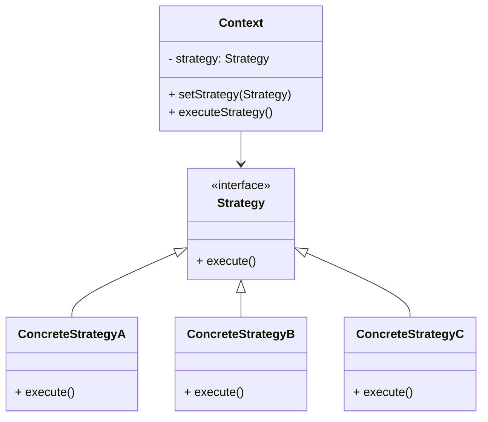

# JavaScript 策略模式

## 什么是策略模式？

策略模式是一种行为设计模式，它允许在运行时选择算法的行为。策略模式将一组算法封装起来，使它们可以互相替换，让算法的变化独立于使用算法的客户端。

简单来说，策略模式的核心思想是：**定义一系列算法，将每个算法封装到独立的类中，使它们可以相互替换**。

:::tip 策略模式的关键点
- 将算法的实现和使用分离
- 消除了大量的条件判断语句
- 提高了代码的可维护性和灵活性
:::

## 策略模式的组成部分

策略模式主要由三部分组成：



1. **策略（Strategy）**: 定义所有支持的算法的通用接口
2. **具体策略（ConcreteStrategy）**: 实现策略接口的具体算法
3. **环境（Context）**: 维护一个对策略对象的引用，负责将客户端请求委派给策略对象

## 基础实现示例

让我们通过一个简单的价格计算示例来理解策略模式：

```javascript
// 定义策略接口（在JavaScript中通常是隐式的）
// 具体策略类 - 不同的折扣计算方式
const discountStrategies = {
  noDiscount: function(price) {
    return price;
  },
  
  tenPercentDiscount: function(price) {
    return price * 0.9;
  },
  
  fivePercentDiscount: function(price) {
    return price * 0.95;
  },
  
  blackFridayDiscount: function(price) {
    return price * 0.7;
  }
};

// 上下文类 - 使用策略的环境
class PriceCalculator {
  constructor() {
    this.discountStrategy = discountStrategies.noDiscount; // 默认策略
  }
  
  setStrategy(strategyFunction) {
    this.discountStrategy = strategyFunction;
  }
  
  calculatePrice(price) {
    return this.discountStrategy(price);
  }
}

// 客户端代码
const calculator = new PriceCalculator();

// 正常价格，无折扣
console.log(calculator.calculatePrice(100)); // 输出: 100

// 应用10%折扣
calculator.setStrategy(discountStrategies.tenPercentDiscount);
console.log(calculator.calculatePrice(100)); // 输出: 90

// 黑色星期五折扣
calculator.setStrategy(discountStrategies.blackFridayDiscount);
console.log(calculator.calculatePrice(100)); // 输出: 70
```

## 为什么要使用策略模式？

策略模式有许多优点，尤其在以下场景中特别有用：

1. **避免复杂的条件语句**：不必使用大量的 if-else 或 switch 语句
2. **遵循开闭原则**：可以添加新的策略而无需修改现有代码
3. **提高代码可维护性**：各个算法被隔离在不同的类中，更易于维护
4. **运行时切换算法**：可以在程序运行时动态切换算法

## 实际应用场景

### 场景1：表单验证

策略模式非常适合用于表单验证，不同的验证规则可以作为不同的策略：

```javascript
// 验证策略对象
const validators = {
  required: function(value) {
    return value.trim() !== '' ? '' : '此字段不能为空';
  },
  
  minLength: function(value, length) {
    return value.length >= length ? '' : `长度不能少于${length}个字符`;
  },
  
  email: function(value) {
    const emailRegex = /^[^\s@]+@[^\s@]+\.[^\s@]+$/;
    return emailRegex.test(value) ? '' : '请输入有效的邮箱地址';
  },
  
  numeric: function(value) {
    return !isNaN(value) ? '' : '请输入数字';
  }
};

// 验证器类
class Validator {
  constructor() {
    this.validations = [];
  }
  
  add(field, value, rules) {
    this.validations.push({ field, value, rules });
  }
  
  validate() {
    const errors = {};
    
    this.validations.forEach(validation => {
      const { field, value, rules } = validation;
      
      for (const rule of rules) {
        let ruleName, ruleValue;
        
        if (typeof rule === 'string') {
          ruleName = rule;
          ruleValue = null;
        } else {
          ruleName = rule.rule;
          ruleValue = rule.value;
        }
        
        if (validators[ruleName]) {
          const error = validators[ruleName](value, ruleValue);
          if (error) {
            errors[field] = error;
            break;
          }
        }
      }
    });
    
    return errors;
  }
}

// 使用示例
const formValidator = new Validator();

// 添加验证规则
formValidator.add('username', 'John', ['required', { rule: 'minLength', value: 3 }]);
formValidator.add('email', 'invalid-email', ['required', 'email']);
formValidator.add('age', '25', ['required', 'numeric']);

// 执行验证
const errors = formValidator.validate();
console.log(errors);
// 输出: { email: '请输入有效的邮箱地址' }
```

### 场景2：动画效果选择器

策略模式可以用于选择不同的动画效果：

```javascript
// 动画策略
const animationStrategies = {
  fadeIn: function(element, duration) {
    element.style.opacity = 0;
    
    let start = null;
    function animate(timestamp) {
      if (!start) start = timestamp;
      const progress = timestamp - start;
      element.style.opacity = Math.min(progress / duration, 1);
      
      if (progress < duration) {
        window.requestAnimationFrame(animate);
      }
    }
    
    window.requestAnimationFrame(animate);
  },
  
  slideDown: function(element, duration) {
    const height = element.scrollHeight;
    element.style.height = '0px';
    element.style.overflow = 'hidden';
    
    let start = null;
    function animate(timestamp) {
      if (!start) start = timestamp;
      const progress = timestamp - start;
      element.style.height = Math.min(progress / duration * height, height) + 'px';
      
      if (progress < duration) {
        window.requestAnimationFrame(animate);
      } else {
        element.style.height = '';
        element.style.overflow = '';
      }
    }
    
    window.requestAnimationFrame(animate);
  },
  
  bounce: function(element, duration) {
    // 弹跳动画实现
    // ...更复杂的动画逻辑
  }
};

// 动画控制器
class AnimationController {
  constructor() {
    this.strategy = null;
  }
  
  setStrategy(strategyName) {
    this.strategy = animationStrategies[strategyName];
    return this;
  }
  
  animate(element, duration = 500) {
    if (!this.strategy) {
      throw new Error('请先设置动画策略');
    }
    this.strategy(element, duration);
  }
}

// 使用示例
const controller = new AnimationController();

// 假设我们有一个元素
const box = document.getElementById('animationBox');

// 使用淡入动画
controller.setStrategy('fadeIn').animate(box, 1000);

// 之后，我们可以切换到滑动动画
setTimeout(() => {
  controller.setStrategy('slideDown').animate(box, 800);
}, 2000);
```

## 策略模式与简单条件语句的比较

在很多简单场景下，可能会有疑问：为什么不直接使用条件语句，而要用策略模式？让我们比较一下两种方式：

### 使用条件语句

```javascript
function calculateDiscount(price, discountType) {
  if (discountType === 'none') {
    return price;
  } else if (discountType === 'ten-percent') {
    return price * 0.9;
  } else if (discountType === 'five-percent') {
    return price * 0.95;
  } else if (discountType === 'black-friday') {
    return price * 0.7;
  }
  return price; // 默认情况
}

// 使用
const finalPrice = calculateDiscount(100, 'ten-percent');
console.log(finalPrice); // 输出: 90
```

### 使用策略模式

```javascript
const discountStrategies = {
  none: price => price,
  'ten-percent': price => price * 0.9,
  'five-percent': price => price * 0.95,
  'black-friday': price => price * 0.7
};

function calculateDiscount(price, discountType) {
  return (discountStrategies[discountType] || discountStrategies.none)(price);
}

// 使用
const finalPrice = calculateDiscount(100, 'ten-percent');
console.log(finalPrice); // 输出: 90
```

### 比较结果

虽然两种方法在这个简单例子中看起来差不多，但是策略模式有以下优势：

1. **添加新策略更容易**：只需在策略对象中添加新方法，而不用修改主函数
2. **更好的组织结构**：每个策略都清晰地分离
3. **更高的可测试性**：每个策略可以单独测试
4. **避免复杂条件**：当策略数量增加或逻辑复杂时，策略模式更有优势

## JavaScript 中实现策略模式的几种方式

由于JavaScript的灵活性，实现策略模式有多种方式：

### 1. 使用对象字面量

```javascript
// 最简单的实现方式，如上面的例子所示
const strategies = {
  strategyA: function() { /* 实现 */ },
  strategyB: function() { /* 实现 */ }
};
```

### 2. 使用类

```javascript
// 策略接口（在JavaScript中通常是隐式的）
class DiscountStrategy {
  calculate(price) {
    throw new Error("子类必须实现calculate方法");
  }
}

// 具体策略
class NoDiscount extends DiscountStrategy {
  calculate(price) {
    return price;
  }
}

class TenPercentDiscount extends DiscountStrategy {
  calculate(price) {
    return price * 0.9;
  }
}

// 上下文
class PriceCalculator {
  constructor(strategy) {
    this.strategy = strategy || new NoDiscount();
  }
  
  setStrategy(strategy) {
    this.strategy = strategy;
  }
  
  calculate(price) {
    return this.strategy.calculate(price);
  }
}

// 使用
const calculator = new PriceCalculator();
console.log(calculator.calculate(100)); // 输出: 100

calculator.setStrategy(new TenPercentDiscount());
console.log(calculator.calculate(100)); // 输出: 90
```

### 3. 使用函数作为策略

```javascript
// 策略函数
const noDiscount = price => price;
const tenPercentDiscount = price => price * 0.9;

// 上下文
function createPriceCalculator(defaultStrategy = noDiscount) {
  let strategy = defaultStrategy;
  
  return {
    setStrategy: function(newStrategy) {
      strategy = newStrategy;
    },
    calculate: function(price) {
      return strategy(price);
    }
  };
}

// 使用
const calculator = createPriceCalculator();
console.log(calculator.calculate(100)); // 输出: 100

calculator.setStrategy(tenPercentDiscount);
console.log(calculator.calculate(100)); // 输出: 90
```

## 总结

策略模式是一种强大且灵活的设计模式，它可以帮助我们：

1. **解耦算法与使用环境**：让算法的实现独立于使用它的客户端
2. **消除复杂的条件语句**：使代码更加清晰和易于维护
3. **遵循开闭原则**：可以添加新策略而不修改现有代码
4. **在运行时动态切换算法**：增加程序的灵活性

策略模式在JavaScript中特别有用，因为JavaScript的函数是一等公民，可以轻松传递和替换。在表单验证、动画效果、排序算法、支付处理等多种场景中，策略模式都能大显身手。

### 练习和挑战

1. **实现一个使用策略模式的排序工具**，支持不同的排序算法（冒泡排序、快速排序等）。
2. **创建一个税费计算器**，根据不同国家或地区的税收政策计算税费。
3. **扩展表单验证示例**，添加更多验证规则，如密码强度检查、信用卡号验证等。

:::note 参考资源
- [Design Patterns: Elements of Reusable Object-Oriented Software](https://www.amazon.com/Design-Patterns-Elements-Reusable-Object-Oriented/dp/0201633612) - 原始的设计模式书籍
- [Learning JavaScript Design Patterns](https://addyosmani.com/resources/essentialjsdesignpatterns/book/) - Addy Osmani的JavaScript设计模式书
- [Refactoring.Guru: Strategy Pattern](https://refactoring.guru/design-patterns/strategy) - 策略模式的详细解释
:::

通过学习和应用策略模式，你将能够编写出更加灵活、可维护和面向对象的JavaScript代码。记住，设计模式是解决特定问题的通用模板，应该根据实际需求来决定是否使用它们。