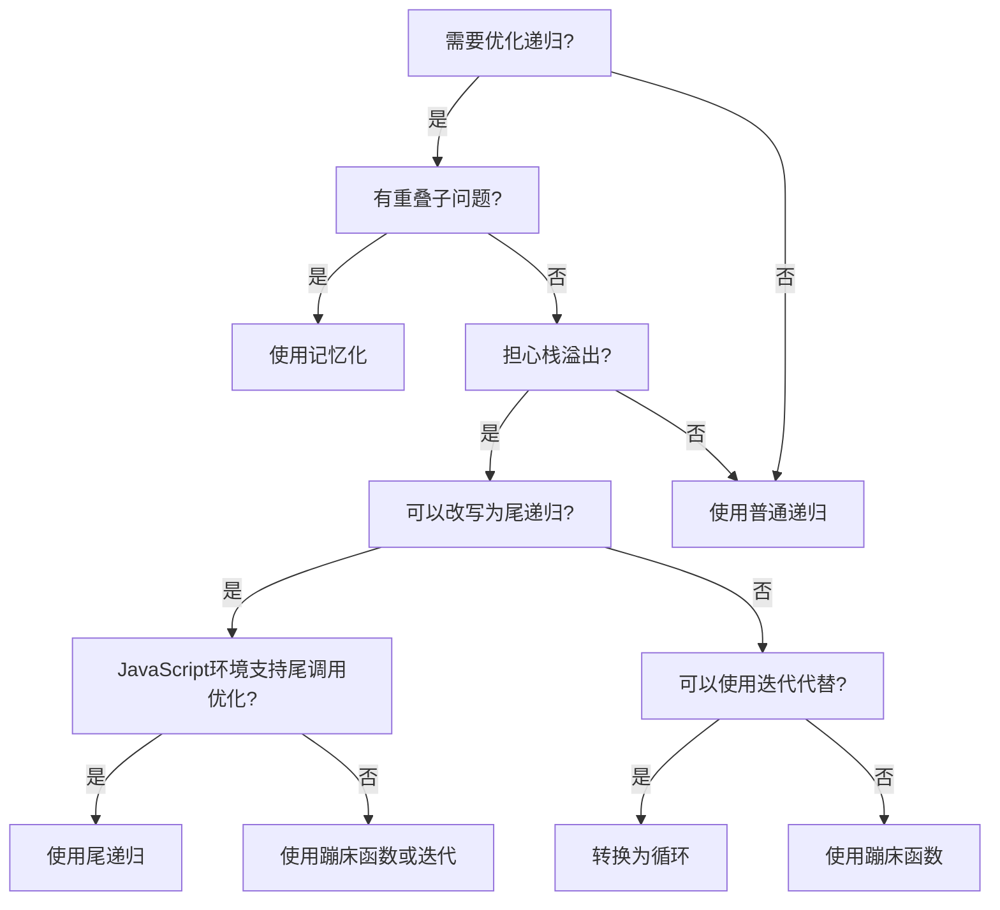

# JavaScript 递归优化

## 什么是递归？

递归是一种函数调用自身的编程技术。在JavaScript中，递归是一种强大的编程模式，可以优雅地解决许多问题，特别是那些可以分解为相似子问题的场景。

然而，递归并非没有缺点。未经优化的递归可能导致：

- 栈溢出错误 (Stack Overflow)
- 性能问题
- 内存使用效率低下

本文将介绍几种优化JavaScript递归的技术，使您能够安全、高效地使用递归。

## 递归的基本结构

在深入优化技术之前，让我们回顾一下递归的基本结构：

```javascript
function recursiveFunction(input) {
  // 基本情况（停止条件）
  if (终止条件) {
    return 基本值;
  }
  
  // 递归情况
  return recursiveFunction(更小的输入);
}
```

每个递归函数必须有：
1. 至少一个基本情况（终止条件）
2. 递归调用部分，处理更小的子问题

## 常见递归问题与优化

### 1. 栈溢出问题

递归最常见的问题是栈溢出。每次函数调用都会在调用栈上创建一个新的帧，当递归层数过深时，会超出JavaScript引擎允许的最大调用栈大小。

例如，计算大数字的阶乘：

```javascript
function factorial(n) {
  if (n <= 1) return 1;
  return n * factorial(n - 1);
}

// 对于小数字没问题
console.log(factorial(5)); // 输出: 120

// 但对于大数字...
// console.log(factorial(100000)); // 栈溢出错误！
```

### 2. 尾递归优化

尾递归是指递归调用是函数执行的最后一个操作。某些语言的编译器会自动优化尾递归，但在JavaScript中，只有部分环境支持此优化。

将普通递归转换为尾递归：

```javascript
function factorialTailRecursive(n, accumulator = 1) {
  if (n <= 1) return accumulator;
  return factorialTailRecursive(n - 1, n * accumulator);
}

console.log(factorialTailRecursive(5)); // 输出: 120
```

:::note
尽管JavaScript引擎如V8（Chrome和Node.js使用）不会自动优化尾递归，但编写尾递归风格的代码仍然是一个好习惯，因为它更容易转换为其他优化形式。
:::

### 3. 使用循环替代递归

有时，最简单的优化方法是将递归转换为循环：

```javascript
function factorialLoop(n) {
  let result = 1;
  for (let i = 2; i <= n; i++) {
    result *= i;
  }
  return result;
}

console.log(factorialLoop(5)); // 输出: 120
console.log(factorialLoop(10000)); // 可以处理更大的数字，不会栈溢出
```

### 4. 记忆化（Memoization）

记忆化是一种优化技术，通过存储已计算结果来避免重复计算，特别适合解决重叠子问题的递归。

斐波那契数列是一个经典例子：

```javascript
// 未优化的斐波那契函数
function fib(n) {
  if (n <= 1) return n;
  return fib(n - 1) + fib(n - 2);
}

// 计算 fib(40) 将非常缓慢，因为有大量重复计算

// 使用记忆化优化
function fibMemoized(n, memo = {}) {
  if (n in memo) return memo[n];
  if (n <= 1) return n;
  
  memo[n] = fibMemoized(n - 1, memo) + fibMemoized(n - 2, memo);
  return memo[n];
}

console.log(fibMemoized(40)); // 快速计算，输出: 102334155
```

记忆化通过缓存已计算结果，将时间复杂度从指数级 O(2^n) 降低到线性 O(n)。

### 5. 蹦床函数（Trampoline）

蹦床技术通过返回函数而不是直接调用函数来避免栈溢出：

```javascript
function trampoline(fn) {
  return function(...args) {
    let result = fn(...args);
    
    while (typeof result === 'function') {
      result = result();
    }
    
    return result;
  };
}

function sumRecursive(n, sum = 0) {
  if (n === 0) return sum;
  return () => sumRecursive(n - 1, sum + n);
}

const sum = trampoline(sumRecursive);

console.log(sum(10000)); // 可以处理大数值，不会栈溢出
```

蹦床函数将递归调用转换为循环执行的一系列函数，避免了调用栈的增长。

## 实际应用场景

### 树结构遍历

处理嵌套数据结构（如DOM树、文件系统等）时，递归非常有用，但可能导致栈溢出。

未优化的递归遍历：

```javascript
function countNodes(node) {
  if (!node) return 0;
  let count = 1; // 当前节点
  
  if (node.children) {
    for (let child of node.children) {
      count += countNodes(child);
    }
  }
  
  return count;
}

// 对于深层嵌套对象可能导致栈溢出
```

优化后的遍历（使用迭代）：

```javascript
function countNodesIterative(rootNode) {
  if (!rootNode) return 0;
  
  let count = 0;
  const stack = [rootNode];
  
  while (stack.length > 0) {
    const node = stack.pop();
    count++;
    
    if (node.children) {
      for (let child of node.children) {
        stack.push(child);
      }
    }
  }
  
  return count;
}
```

### JSON解析和深拷贝

递归常用于JSON解析和对象深拷贝，但对于大型嵌套对象，可能需要优化：

```javascript
// 基本递归深拷贝
function deepClone(obj, hash = new Map()) {
  if (obj === null || typeof obj !== 'object') return obj;
  if (hash.has(obj)) return hash.get(obj); // 处理循环引用
  
  let result;
  
  if (obj instanceof Array) {
    result = [];
    hash.set(obj, result);
    
    for (let i = 0; i < obj.length; i++) {
      result[i] = deepClone(obj[i], hash);
    }
  } else {
    result = {};
    hash.set(obj, result);
    
    for (let key in obj) {
      if (obj.hasOwnProperty(key)) {
        result[key] = deepClone(obj[key], hash);
      }
    }
  }
  
  return result;
}

// 这个实现使用了Map来处理循环引用问题，同时保持了递归的简洁性
```

### 算法问题

递归在分治算法中特别有用，如归并排序：

```javascript
// 记忆化优化的递归归并排序
function mergeSortOptimized(arr, memo = new Map()) {
  // 检查是否已计算过该数组
  const key = arr.toString();
  if (memo.has(key)) return memo.get(key);
  
  // 基本情况
  if (arr.length <= 1) return arr;
  
  // 分治
  const mid = Math.floor(arr.length / 2);
  const left = mergeSortOptimized(arr.slice(0, mid), memo);
  const right = mergeSortOptimized(arr.slice(mid), memo);
  
  // 合并
  const result = merge(left, right);
  
  // 存储结果
  memo.set(key, result);
  return result;
}

function merge(left, right) {
  const result = [];
  let i = 0, j = 0;
  
  while (i < left.length && j < right.length) {
    if (left[i] < right[j]) {
      result.push(left[i]);
      i++;
    } else {
      result.push(right[j]);
      j++;
    }
  }
  
  return result.concat(left.slice(i)).concat(right.slice(j));
}
```

## 递归优化决策树

下面是一个决策树，帮助您选择最适合您问题的递归优化策略：



## 总结

递归是一种强大的编程技术，但未经优化可能导致性能问题：

1. **尾递归**：将递归调用作为函数的最后操作，有助于某些环境中的优化
2. **记忆化**：通过缓存已计算结果避免重复计算
3. **转换为循环**：将递归算法转换为迭代形式
4. **蹦床函数**：通过返回函数而不是调用来避免栈增长
5. **数据结构优化**：使用适当的数据结构（如堆栈）代替递归调用

选择优化策略时，需要考虑：
- 问题的性质（是否有重叠子问题）
- 执行环境的限制
- 代码可读性和维护性

:::tip
始终从最简单的实现开始，然后根据需要应用优化。过早优化可能导致不必要的复杂性。
:::

## 练习

1. 将递归版本的二分查找转换为迭代版本
2. 使用记忆化优化计算帕斯卡三角形的递归函数
3. 实现一个深度优先搜索算法的尾递归版本
4. 使用蹦床函数优化以下递归函数：
   ```javascript
   function sumArray(arr) {
     if (arr.length === 0) return 0;
     return arr[0] + sumArray(arr.slice(1));
   }
   ```

## 额外资源

- [MDN Web Docs: Recursion](https://developer.mozilla.org/en-US/docs/Glossary/Recursion)
- [JavaScript 尾调用优化](https://2ality.com/2015/06/tail-call-optimization.html)
- [函数式编程中的记忆化](https://medium.com/@maybekatz/introducing-node-js-modules-with-explicit-memoization-1e4142a0a301)
- [深入浅出尾递归优化](https://marmelab.com/blog/2018/02/12/understanding-recursion.html)

通过掌握这些优化技术，您可以充分利用递归的优雅性和可读性，同时避免其潜在的性能问题。