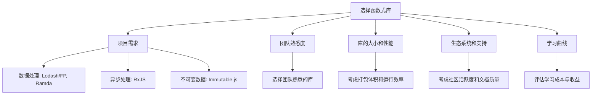

# JavaScript 函数式库

## 什么是函数式库？

函数式库是一组实现了函数式编程范式的工具集合，它们提供了许多实用函数，帮助开发者以函数式的方式编写JavaScript代码。这些库通常提供了不可变数据结构、纯函数操作、函数组合、柯里化等函数式编程特性，使得代码更加简洁、可测试且易于维护。

在JavaScript生态中，有许多优秀的函数式编程库，它们各自有不同的侧重点和特色。本文将介绍几个常用的JavaScript函数式库，帮助你在实际项目中应用函数式编程思想。

## 主流的JavaScript函数式库

### 1. Lodash/FP

Lodash是JavaScript中最受欢迎的实用工具库之一，它提供了大量实用的函数来处理数组、对象、字符串等数据类型。而Lodash/FP是Lodash的一个变体，专门为函数式编程而设计。

#### Lodash/FP的特点：

- 所有函数都是自动柯里化的
- 函数参数顺序经过重新排列，更适合函数组合
- 所有操作都是不可变的，不会修改原始数据
- 数据参数总是放在最后，方便管道操作

#### 基本使用示例：

```javascript
import { compose, map, filter, sortBy } from 'lodash/fp';

// 处理一个用户数组
const users = [
  { name: 'Alice', age: 25, active: true },
  { name: 'Bob', age: 30, active: false },
  { name: 'Charlie', age: 22, active: true },
  { name: 'Dave', age: 35, active: true }
];

// 函数式处理：过滤活跃用户，按年龄排序，并提取名字
const getActiveUserNamesSortedByAge = compose(
  map('name'),
  sortBy('age'),
  filter('active')
);

const result = getActiveUserNamesSortedByAge(users);
console.log(result); // ['Charlie', 'Alice', 'Dave']
```

### 2. Ramda

Ramda是一个专注于函数式编程的JavaScript库，它的设计理念是让你编写纯函数并轻松组合它们来构建复杂的逻辑。

#### Ramda的特点：

- 所有函数都是自动柯里化的
- 参数顺序更适合函数组合，数据通常作为最后一个参数
- 强调纯函数和不可变性
- 提供丰富的函数组合工具

#### 基本使用示例：

```javascript
import * as R from 'ramda';

const data = [
  { name: 'Alice', score: 85 },
  { name: 'Bob', score: 60 },
  { name: 'Charlie', score: 92 },
  { name: 'David', score: 75 }
];

// 找出分数大于80的学生，并按分数降序排列
const getTopStudents = R.pipe(
  R.filter(R.propSatisfies(score => score > 80, 'score')),
  R.sortBy(R.prop('score')),
  R.reverse,
  R.pluck('name')
);

const topStudents = getTopStudents(data);
console.log(topStudents); // ['Charlie', 'Alice']
```

:::tip
Ramda和Lodash/FP的一个关键区别是，Ramda更严格地遵循函数式编程原则，而Lodash/FP则是在实用主义和函数式原则之间找到平衡。
:::

### 3. RxJS

RxJS是一个基于可观察对象(Observable)的函数式响应式编程库，主要用于处理异步操作和事件流。

#### RxJS的特点：

- 基于Observable模式，将异步事件视为数据流
- 提供丰富的操作符来转换、组合、过滤和操作这些流
- 适合处理复杂的异步逻辑和事件处理

#### 基本使用示例：

```javascript
import { fromEvent, interval } from 'rxjs';
import { throttleTime, map, scan } from 'rxjs/operators';

// 统计点击次数，每秒最多允许一次点击
const clicks = fromEvent(document, 'click');
const result = clicks.pipe(
  throttleTime(1000),
  map(event => event.clientX),
  scan((count, clientX) => count + 1, 0)
);

result.subscribe(count => {
  console.log(`Clicked ${count} times`);
});
```

### 4. Immutable.js

Immutable.js是Facebook开发的一个库，提供了许多持久性不可变数据结构，如`List`、`Map`、`Set`等。

#### Immutable.js的特点：

- 所有数据结构都是不可变的
- 高效的数据操作，使用结构共享来优化性能
- 提供丰富的API来操作这些不可变数据结构

#### 基本使用示例：

```javascript
import { Map, List } from 'immutable';

// 创建一个不可变Map
const map1 = Map({ a: 1, b: 2, c: 3 });
// 修改map1会返回一个新的Map，而不是修改原来的
const map2 = map1.set('b', 50);

console.log(map1.get('b')); // 2
console.log(map2.get('b')); // 50

// 不可变List
const list1 = List([1, 2, 3]);
const list2 = list1.push(4);

console.log(list1.toArray()); // [1, 2, 3]
console.log(list2.toArray()); // [1, 2, 3, 4]
```

## 如何选择合适的函数式库？

在选择函数式库时，可以考虑以下几个因素：



## 实际应用案例

### 案例1：使用Ramda处理表单数据验证

```javascript
import * as R from 'ramda';

// 定义验证规则
const rules = {
  username: [
    {
      test: R.compose(R.not, R.isEmpty),
      message: '用户名不能为空'
    },
    {
      test: R.compose(R.gte(R.__, 3), R.length),
      message: '用户名长度至少为3个字符'
    }
  ],
  email: [
    {
      test: R.test(/^[^\s@]+@[^\s@]+\.[^\s@]+$/),
      message: '请输入有效的电子邮件地址'
    }
  ]
};

// 验证单个字段
const validateField = (rules, value) => {
  const failedRule = R.find(rule => !rule.test(value))(rules);
  return failedRule ? failedRule.message : null;
};

// 验证表单
const validateForm = (formRules, formData) => {
  const validateFieldWithRules = (field) => validateField(formRules[field], formData[field]);
  
  return R.pipe(
    R.keys,
    R.reduce((errors, field) => {
      const error = validateFieldWithRules(field);
      return error ? R.assoc(field, error, errors) : errors;
    }, {})
  )(formRules);
};

// 使用示例
const formData = {
  username: 'ab',
  email: 'invalid-email'
};

const errors = validateForm(rules, formData);
console.log(errors);
// 输出: { username: '用户名长度至少为3个字符', email: '请输入有效的电子邮件地址' }
```

### 案例2：使用Lodash/FP处理复杂数据转换

```javascript
import { compose, groupBy, map, filter, sortBy, reverse } from 'lodash/fp';

// 模拟销售数据
const salesData = [
  { product: 'Laptop', category: 'Electronics', price: 1200, date: '2023-01-15' },
  { product: 'Phone', category: 'Electronics', price: 800, date: '2023-01-20' },
  { product: 'Desk', category: 'Furniture', price: 350, date: '2023-01-18' },
  { product: 'Chair', category: 'Furniture', price: 150, date: '2023-01-22' },
  { product: 'Tablet', category: 'Electronics', price: 500, date: '2023-01-25' },
  { product: 'Sofa', category: 'Furniture', price: 1000, date: '2023-01-17' }
];

// 需求：找出每个类别中价格最高的商品
const getTopProductsByCategory = compose(
  // 对每个分组应用转换
  map(products => {
    // 按价格降序排序，取第一个
    const sortedProducts = compose(
      xs => xs[0] || null,
      reverse,
      sortBy('price')
    )(products);
    
    return sortedProducts;
  }),
  // 按类别分组
  groupBy('category')
);

const topProductsByCategory = getTopProductsByCategory(salesData);
console.log(topProductsByCategory);
/* 输出:
{
  Electronics: { product: 'Laptop', category: 'Electronics', price: 1200, date: '2023-01-15' },
  Furniture: { product: 'Sofa', category: 'Furniture', price: 1000, date: '2023-01-17' }
}
*/
```

### 案例3：使用RxJS处理用户交互

```javascript
import { fromEvent, merge, interval } from 'rxjs';
import { map, debounceTime, filter, takeUntil, switchMap } from 'rxjs/operators';

// 搜索框自动完成功能
function setupAutocomplete(inputElement, resultsElement) {
  // 输入事件流
  const input$ = fromEvent(inputElement, 'input').pipe(
    map(e => e.target.value),
    debounceTime(300), // 防抖，避免频繁请求
    filter(text => text.length > 2) // 只有当输入超过2个字符才发送请求
  );
  
  // 模拟API调用
  const search = (term) => {
    console.log(`搜索: ${term}`);
    return new Promise(resolve => {
      setTimeout(() => {
        resolve([
          `结果1 for ${term}`,
          `结果2 for ${term}`,
          `结果3 for ${term}`
        ]);
      }, 500);
    });
  };
  
  // 订阅输入事件，并展示结果
  input$.pipe(
    switchMap(term => {
      // switchMap会取消之前的请求，只处理最新的
      return search(term);
    })
  ).subscribe(results => {
    // 更新结果列表
    resultsElement.innerHTML = '';
    results.forEach(result => {
      const li = document.createElement('li');
      li.textContent = result;
      resultsElement.appendChild(li);
    });
  });
}

// 使用时只需调用
// setupAutocomplete(document.getElementById('search'), document.getElementById('results'));
```

## 函数式库的优缺点

### 优点

1. **代码简洁性**：函数式库通常提供简洁的API，让你用更少的代码完成复杂操作。
2. **可组合性**：函数式库鼓励将复杂操作分解为可组合的小函数。
3. **可测试性**：由于强调纯函数，使用这些库编写的代码通常更容易测试。
4. **可维护性**：函数式风格的代码通常更加声明式，表达了"做什么"而不是"怎么做"，使代码更容易理解。
5. **并发安全**：由于不可变性，函数式代码更容易在并发环境中安全运行。

### 缺点

1. **学习曲线**：函数式编程范式对初学者来说有一定的学习曲线。
2. **性能开销**：不可变数据结构在某些情况下可能会带来性能开销。
3. **调试难度**：函数组合和链式调用有时会使调试变得复杂。
4. **团队适应性**：如果团队成员不熟悉函数式编程，可能会增加协作成本。

:::caution
虽然函数式库很强大，但不要盲目使用。在小型简单项目中，原生JavaScript可能就足够了。选择合适的工具应该基于项目需求和团队能力。
:::

## 总结

JavaScript函数式库为开发者提供了强大的工具，帮助我们用函数式的方式编写更加简洁、可维护的代码。本文介绍了几个主流的函数式库及其各自的特点：

- **Lodash/FP**：实用主义与函数式编程的平衡，适合大多数数据处理场景。
- **Ramda**：更严格的函数式编程库，适合需要高度组合性和不可变操作的场景。
- **RxJS**：专注于异步数据流和事件处理的函数式响应式编程库。
- **Immutable.js**：提供高效的不可变数据结构，适合需要严格不可变性的应用。

在实际项目中，选择合适的函数式库应该基于项目需求、团队熟悉度、性能要求和代码可维护性等因素综合考虑。无论选择哪个库，掌握函数式编程的核心原则都将帮助你编写更好的JavaScript代码。

## 练习

1. 使用Ramda实现一个函数，接受一个对象数组和一个属性名，返回按该属性分组后的对象。
2. 使用Lodash/FP编写一个函数，找出一个数组中出现次数最多的元素。
3. 使用RxJS实现一个简单的计数器，每秒递增，并提供开始、暂停和重置功能。
4. 使用Immutable.js实现一个简单的撤销/重做功能，记录一个对象的状态变化历史。

## 进一步学习资源

- [Ramda 文档](https://ramdajs.com/docs/)
- [Lodash FP 指南](https://github.com/lodash/lodash/wiki/FP-Guide)
- [RxJS 官方文档](https://rxjs.dev/guide/overview)
- [Immutable.js 官方文档](https://immutable-js.com/)
- [函数式编程指南](https://github.com/MostlyAdequate/mostly-adequate-guide)

通过这些资源和实践，你将能够更深入地理解和应用JavaScript函数式库，提升你的函数式编程技能。