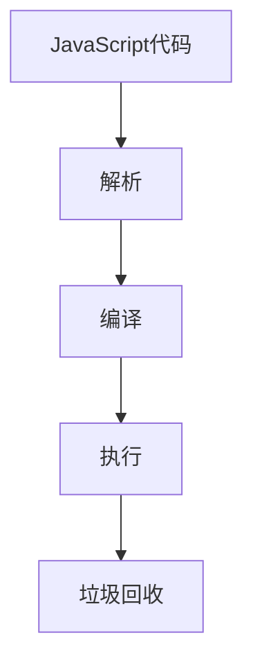

# JavaScript 性能基础

在现代Web开发中，JavaScript性能对于创建流畅、响应迅速的用户体验至关重要。随着Web应用变得越来越复杂，了解如何优化JavaScript代码变得尤为重要。本文将介绍JavaScript性能优化的基础知识，帮助你迈出提升代码性能的第一步。

## 为什么关注JavaScript性能？

JavaScript作为Web前端的核心语言，直接影响用户体验。低效的JavaScript代码可能导致：

- 页面加载缓慢
- 交互延迟
- 动画卡顿
- 电池消耗增加（移动设备）
- 更高的服务器负载

通过优化JavaScript性能，你可以创建更快、更高效、对用户更友好的应用程序。

## JavaScript 执行模型基础

在深入性能优化之前，让我们先简要了解JavaScript的执行模型：



JavaScript是一种单线程语言，使用事件循环机制处理异步操作。了解这一点对于理解性能优化至关重要。

## 关键性能指标

在优化之前，我们需要了解哪些指标能反映JavaScript性能：

1. **执行时间**：代码运行所需的时间
2. **内存使用**：代码消耗的内存量
3. **CPU使用率**：代码对处理器的占用程度
4. **渲染性能**：页面重绘和重排的频率和效率
5. **网络请求**：API调用和数据传输的效率

## 常见的JavaScript性能问题

### 1. 循环效率低下

循环是JavaScript中常见的性能瓶颈之一。考虑以下示例：

```javascript
// 低效的循环
const arr = new Array(10000).fill(0);

console.time('低效循环');
for (let i = 0; i < arr.length; i++) {
  arr[i] = i * 2;
}
console.timeEnd('低效循环');

// 优化后的循环
console.time('优化循环');
const len = arr.length;
for (let i = 0; i < len; i++) {
  arr[i] = i * 2;
}
console.timeEnd('优化循环');
```

输出可能类似于：
```
低效循环: 0.456ms
优化循环: 0.298ms
```

通过缓存数组长度，我们避免了在每次循环迭代中重新计算`arr.length`，从而提高了性能。

### 2. DOM操作频繁

DOM操作通常是最昂贵的JavaScript操作之一。考虑以下示例：

```javascript
// 低效的DOM操作
console.time('低效DOM');
for (let i = 0; i < 100; i++) {
  document.getElementById('container').innerHTML += '<div>' + i + '</div>';
}
console.timeEnd('低效DOM');

// 优化后的DOM操作
console.time('优化DOM');
let html = '';
for (let i = 0; i < 100; i++) {
  html += '<div>' + i + '</div>';
}
document.getElementById('container').innerHTML = html;
console.timeEnd('优化DOM');
```

输出可能类似于：
```
低效DOM: 15.234ms
优化DOM: 2.456ms
```

通过减少DOM操作的次数，我们显著提高了代码性能。

### 3. 内存泄漏

内存泄漏会导致应用程序随着时间推移变得越来越慢。一个常见的例子是事件监听器未正确移除：

```javascript
// 可能导致内存泄漏的代码
function setupListener() {
  const button = document.getElementById('myButton');
  button.addEventListener('click', function() {
    console.log('Button clicked');
    // 这个监听器在元素被移除后仍然存在
  });
}

// 更好的方式
function setupListenerProperly() {
  const button = document.getElementById('myButton');
  const handleClick = function() {
    console.log('Button clicked');
  };
  
  button.addEventListener('click', handleClick);
  
  // 当不再需要时
  // button.removeEventListener('click', handleClick);
}
```

### 4. 闭包使用不当

闭包是JavaScript的强大特性，但使用不当会导致内存问题：

```javascript
// 可能导致问题的闭包使用
function createFunctions() {
  const functions = [];
  const largeData = new Array(10000).fill('data');
  
  for (let i = 0; i < 10; i++) {
    functions.push(function() {
      console.log(i, largeData); // largeData被所有函数引用
    });
  }
  
  return functions;
}

// 更好的方式
function createFunctionsProperly() {
  const functions = [];
  
  for (let i = 0; i < 10; i++) {
    // 只捕获需要的数据
    functions.push((function(index) {
      return function() {
        console.log(index);
      };
    })(i));
  }
  
  return functions;
}
```

## 性能优化基本策略

### 1. 减少计算量

:::tip 原则
如果一个值不需要重复计算，就存储它，而不是每次都重新计算。
:::

```javascript
// 优化前
function calculateTotal(items) {
  let total = 0;
  for (let i = 0; i < items.length; i++) {
    total += items[i].price * items[i].quantity;
  }
  return total;
}

// 优化后 - 缓存计算值
const memoize = (fn) => {
  const cache = {};
  return (...args) => {
    const key = JSON.stringify(args);
    if (cache[key]) {
      return cache[key];
    }
    const result = fn(...args);
    cache[key] = result;
    return result;
  };
};

const calculateTotalMemoized = memoize(calculateTotal);
```

### 2. 批量处理DOM操作

使用DocumentFragment或虚拟DOM技术减少实际DOM操作：

```javascript
// 使用DocumentFragment批量处理DOM操作
function addItems(items) {
  const fragment = document.createDocumentFragment();
  items.forEach(item => {
    const div = document.createElement('div');
    div.textContent = item.name;
    fragment.appendChild(div);
  });
  document.getElementById('container').appendChild(fragment);
}
```

### 3. 使用适当的数据结构和算法

选择正确的数据结构可以显著提升性能：

```javascript
// 使用Set进行高效的唯一值检查
function uniqueValues(array) {
  return [...new Set(array)];
}

// 使用Map进行键值对操作
function countFrequency(array) {
  const frequency = new Map();
  array.forEach(item => {
    frequency.set(item, (frequency.get(item) || 0) + 1);
  });
  return frequency;
}
```

### 4. 使用Web Workers处理密集型计算

Web Workers允许你在后台线程中执行JavaScript，不会阻塞主线程：

```javascript
// 主线程代码
const worker = new Worker('worker.js');

worker.onmessage = function(e) {
  console.log('计算结果:', e.data);
};

worker.postMessage([1, 2, 3, 4]);

// worker.js内容
onmessage = function(e) {
  const numbers = e.data;
  let result = 0;
  
  // 假设这是一个复杂计算
  for (let i = 0; i < 1000000000; i++) {
    result += numbers.reduce((a, b) => a + b, 0) / 1000000;
  }
  
  postMessage(result);
};
```

## 真实应用案例：优化商品列表

假设我们正在开发一个电子商务网站，需要显示并过滤大量商品。以下是性能优化前后的代码对比：

### 优化前

```javascript
function renderProducts(products) {
  const container = document.getElementById('products');
  container.innerHTML = '';
  
  // 对每个产品进行处理
  products.forEach(product => {
    const productDiv = document.createElement('div');
    productDiv.className = 'product';
    productDiv.innerHTML = `
      <h3>${product.name}</h3>
      <p>${product.description}</p>
      <p>$${product.price}</p>
      <button onclick="addToCart(${product.id})">添加到购物车</button>
    `;
    
    // 每次都直接操作DOM
    container.appendChild(productDiv);
  });
}

function filterProducts(category) {
  // 每次过滤都重新从服务器获取数据
  fetch(`/api/products?category=${category}`)
    .then(response => response.json())
    .then(data => renderProducts(data));
}
```

### 优化后

```javascript
// 缓存所有产品数据
let allProducts = [];

// 初始加载所有数据
function loadAllProducts() {
  fetch('/api/products')
    .then(response => response.json())
    .then(data => {
      allProducts = data;
      renderProducts(allProducts);
    });
}

function renderProducts(products) {
  const container = document.getElementById('products');
  
  // 使用DocumentFragment批量处理DOM
  const fragment = document.createDocumentFragment();
  
  products.forEach(product => {
    const productDiv = document.createElement('div');
    productDiv.className = 'product';
    productDiv.innerHTML = `
      <h3>${product.name}</h3>
      <p>${product.description}</p>
      <p>$${product.price}</p>
    `;
    
    const button = document.createElement('button');
    button.textContent = '添加到购物车';
    button.addEventListener('click', () => addToCart(product.id));
    productDiv.appendChild(button);
    
    fragment.appendChild(productDiv);
  });
  
  // 清空容器并一次性添加所有元素
  container.innerHTML = '';
  container.appendChild(fragment);
}

function filterProducts(category) {
  // 在客户端过滤，避免不必要的网络请求
  const filtered = category === 'all' 
    ? allProducts 
    : allProducts.filter(p => p.category === category);
    
  renderProducts(filtered);
}

// 初始化
loadAllProducts();
```

## 性能测量与工具

要有效地优化性能，你需要能够测量它。以下是一些有用的工具和技术：

### 1. Chrome DevTools Performance面板

Chrome DevTools提供了强大的性能分析工具，可以帮助你了解代码执行时间和内存使用情况。

### 2. 使用console.time()和console.timeEnd()

```javascript
console.time('操作名称');
// 要测量的代码
console.timeEnd('操作名称');
```

### 3. 使用Performance API

```javascript
const start = performance.now();
// 要测量的代码
const end = performance.now();
console.log(`执行时间: ${end - start} 毫秒`);
```

### 4. Lighthouse

Lighthouse是Google开发的自动化工具，用于改进网页质量，包括性能指标。

## 总结与最佳实践

JavaScript性能优化是一个持续的过程，而不是一次性的任务。以下是一些关键的最佳实践：

1. **减少DOM操作**：尽量批量处理DOM更新。
2. **缓存频繁使用的值**：避免重复计算。
3. **使用适当的数据结构**：为特定问题选择合适的数据结构。
4. **避免内存泄漏**：特别是在使用事件监听器和闭包时。
5. **延迟加载**：只在需要时加载资源。
6. **减少网络请求**：合并请求并利用浏览器缓存。
7. **使用防抖和节流**：控制频繁触发的事件。
8. **积极使用现代API**：如Web Workers和IntersectionObserver。
9. **先测量，再优化**：使用性能工具确定真正的瓶颈。
10. **不要过早优化**：先确保代码正确工作，然后再考虑优化。

:::caution 注意
性能优化可能会使代码更复杂，降低可读性。始终在性能和可维护性之间寻找平衡。
:::

## 练习与进一步学习

### 练习题

1. 优化以下代码：
```javascript
function findDuplicates(array) {
  const duplicates = [];
  for (let i = 0; i < array.length; i++) {
    for (let j = 0; j < array.length; j++) {
      if (i !== j && array[i] === array[j] && !duplicates.includes(array[i])) {
        duplicates.push(array[i]);
      }
    }
  }
  return duplicates;
}
```

2. 分析以下代码的性能问题并提供改进方案：
```javascript
function appendItems() {
  for (let i = 0; i < 1000; i++) {
    document.getElementById('container').innerHTML += '<div>' + i + '</div>';
  }
}
```

### 进一步学习资源

1. [MDN Web 文档 - JavaScript性能](https://developer.mozilla.org/zh-CN/docs/Web/Performance)
2. [Chrome DevTools 性能分析](https://developers.google.com/web/tools/chrome-devtools/evaluate-performance)
3. [高性能JavaScript](https://www.amazon.com/High-Performance-JavaScript-Nicholas-Zakas/dp/059680279X)
4. [Web性能权威指南](https://www.amazon.com/High-Performance-Browser-Networking-performance/dp/1449344763)

通过本文的学习，你已经掌握了JavaScript性能优化的基础知识。记住，性能优化是一个持续学习和实践的过程。随着你的经验积累，你将能够编写更高效、更优雅的JavaScript代码。