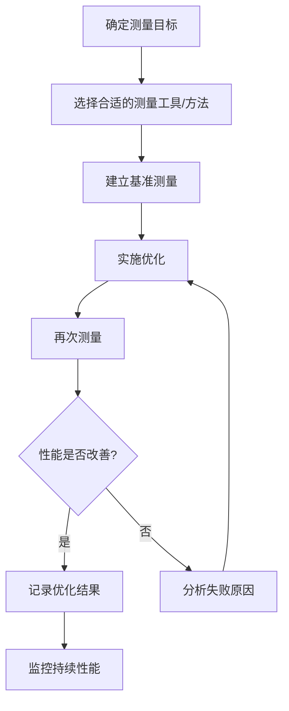

# JavaScript 性能测量

在开发Web应用程序时，性能是用户体验的重要组成部分。JavaScript作为网页交互的核心语言，其性能直接影响着应用的响应速度和流畅度。要优化JavaScript性能，首先需要掌握如何正确测量和分析性能问题。

## 为什么需要性能测量？

性能测量是性能优化的基础。正如管理大师彼得·德鲁克所说："你无法管理你无法测量的事物"。在JavaScript优化中，这一点尤为重要：

- 识别真正的性能瓶颈，而非主观臆测
- 量化优化前后的差异
- 建立性能基准，确保未来的代码变更不会引入性能退化
- 满足特定的性能目标和要求

## 基本性能测量方法

### 使用console.time()和console.timeEnd()

最简单的性能测量方法是使用浏览器内置的控制台计时API：

```javascript
// 开始计时
console.time('myOperation');

// 执行需要测量的代码
for (let i = 0; i < 1000000; i++) {
  // 一些操作
}

// 结束计时并输出结果
console.timeEnd('myOperation');
// 输出: myOperation: 10.957ms
```

这种方法简单直观，适合快速测试特定代码块的执行时间。

:::tip
你可以同时运行多个命名计时器，只要确保`time()`和`timeEnd()`使用相同的标识符即可。
:::

### 使用Performance API

现代浏览器提供了更强大的`Performance` API，它可以更精确地测量时间：

```javascript
// 记录开始时间点
const startTime = performance.now();

// 执行需要测量的代码
for (let i = 0; i < 1000000; i++) {
  // 一些操作
}

// 计算经过的时间
const endTime = performance.now();
const duration = endTime - startTime;

console.log(`操作花费了 ${duration.toFixed(2)} 毫秒`);
// 输出类似: 操作花费了 10.95 毫秒
```

`performance.now()` 比 `Date.now()` 更精确，提供微秒级精度，且不受系统时钟调整的影响。

## 高级性能测量工具

### Performance Timeline API

Performance Timeline API提供了更全面的性能数据收集能力：

```javascript
// 获取所有性能条目
const perfEntries = performance.getEntries();

// 按类型筛选条目
const resourceEntries = performance.getEntriesByType('resource');
const markEntries = performance.getEntriesByType('mark');
const measureEntries = performance.getEntriesByType('measure');

// 创建性能标记点
performance.mark('start_operation');
// 执行一些操作
performance.mark('end_operation');

// 测量两点之间的时间
performance.measure('operation_duration', 'start_operation', 'end_operation');

// 获取测量结果
const measures = performance.getEntriesByType('measure');
console.log(measures[0].duration);
```

### 用户计时API

User Timing API是Performance Timeline API的一部分，专门用于创建自定义性能标记点和测量：

```javascript
// 标记开始点
performance.mark('functionStart');

// 执行复杂函数
complexFunction();

// 标记结束点
performance.mark('functionEnd');

// 测量两个标记之间的时间
performance.measure('functionDuration', 'functionStart', 'functionEnd');

// 获取测量结果
const measurements = performance.getEntriesByName('functionDuration');
console.log(`函数执行时间: ${measurements[0].duration.toFixed(2)}ms`);
```

## 实用性能测量方案

### 基准测试框架

对于更正式的性能测试，你可以使用专门的基准测试库，如 [Benchmark.js](https://benchmarkjs.com/)：

```javascript
const Benchmark = require('benchmark');
const suite = new Benchmark.Suite;

// 添加测试
suite.add('正则表达式#test', function() {
  /o/.test('Hello World');
})
.add('字符串#indexOf', function() {
  'Hello World'.indexOf('o') > -1;
})
// 添加监听器
.on('cycle', function(event) {
  console.log(String(event.target));
})
.on('complete', function() {
  console.log('最快的是 ' + this.filter('fastest').map('name'));
})
// 运行测试
.run({ 'async': true });

// 可能的输出:
// 正则表达式#test x 10,234,567 ops/sec ±0.96% (87 runs sampled)
// 字符串#indexOf x 25,634,654 ops/sec ±0.89% (85 runs sampled)
// 最快的是 字符串#indexOf
```

### 浏览器开发者工具

现代浏览器开发者工具提供了丰富的性能分析功能：

1. **Chrome Performance面板**：记录并分析页面加载和交互时的性能情况
2. **JavaScript性能分析器(Profiler)**：识别耗时函数和调用路径
3. **内存面板**：检测内存泄漏和过度内存使用

## 实际案例：优化数据处理函数

假设我们有一个处理大量数据的函数，我们想测量并优化它的性能：

```javascript
// 原始函数
function processData(dataArray) {
  console.time('原始函数');
  
  const results = [];
  for (let i = 0; i < dataArray.length; i++) {
    const item = dataArray[i];
    if (item.value > 10) {
      const processed = {
        id: item.id,
        computed: item.value * 2,
        category: item.value > 100 ? 'high' : 'medium'
      };
      results.push(processed);
    }
  }
  
  console.timeEnd('原始函数');
  return results;
}

// 优化版本
function processDataOptimized(dataArray) {
  console.time('优化函数');
  
  const results = dataArray
    .filter(item => item.value > 10)
    .map(item => ({
      id: item.id,
      computed: item.value * 2,
      category: item.value > 100 ? 'high' : 'medium'
    }));
  
  console.timeEnd('优化函数');
  return results;
}

// 生成测试数据
const testData = Array.from({ length: 100000 }, (_, i) => ({
  id: i,
  value: Math.random() * 200
}));

// 测试两个函数
const result1 = processData(testData);
const result2 = processDataOptimized(testData);

// 验证结果是否相同
console.log('结果匹配:', JSON.stringify(result1) === JSON.stringify(result2));
```

在真实场景中，这种测量可能会显示出不同的函数实现之间的性能差异，帮助我们选择更高效的方法。

## 性能测量的最佳实践

1. **测量多次取平均值**：单次测量可能受系统波动影响，多次测量更准确。

```javascript
function benchmarkFunction(fn, iterations = 5) {
  const times = [];
  for (let i = 0; i < iterations; i++) {
    const start = performance.now();
    fn();
    const end = performance.now();
    times.push(end - start);
  }
  
  const average = times.reduce((sum, time) => sum + time, 0) / times.length;
  const min = Math.min(...times);
  const max = Math.max(...times);
  
  console.log(`平均执行时间: ${average.toFixed(2)}ms`);
  console.log(`最短时间: ${min.toFixed(2)}ms, 最长时间: ${max.toFixed(2)}ms`);
}
```

2. **隔离测试环境**：确保测试期间没有其他重度进程在运行。

3. **测试真实数据和场景**：使用代表实际应用负载的数据集和用例。

4. **考虑JIT编译影响**：JavaScript引擎会优化频繁执行的代码，所以做"热身"运行。

```javascript
// 热身运行，让JIT优化代码
function warmUp(fn, iterations = 1000) {
  for (let i = 0; i < iterations; i++) {
    fn();
  }
}
```

5. **测量用户感知性能**：有些优化在技术上看起来好，但用户可能感知不到差异。

```javascript
// 记录用户可感知的时间点
performance.mark('appReady');
document.addEventListener('visibilitychange', () => {
  if (!document.hidden) {
    performance.mark('userSeeContent');
    performance.measure('visibleToUser', 'appReady', 'userSeeContent');
  }
});
```

## 性能测量流程图



## 总结

JavaScript性能测量是性能优化过程中至关重要的一步。通过掌握本文介绍的各种测量技术和工具，你可以：

- 准确识别代码中的性能瓶颈
- 量化优化措施的实际效果
- 建立可靠的性能基准
- 做出基于数据的优化决策

记住，性能优化应该始终建立在可靠测量的基础上，而不是猜测。先测量，后优化！

## 练习与深入学习

1. 使用`console.time()`和Performance API测量相同代码块的执行时间，比较两种方法的结果。
2. 尝试使用Chrome开发者工具的Performance面板分析一个网页的加载过程。
3. 为一个排序算法编写性能测试，比较不同数据规模下的执行时间。
4. 探索Lighthouse工具，了解它如何评估网页性能并提供优化建议。

:::note 延伸阅读
- [MDN: Performance API](https://developer.mozilla.org/zh-CN/docs/Web/API/Performance)
- [Chrome DevTools 性能分析](https://developers.google.com/web/tools/chrome-devtools/evaluate-performance)
- [User Timing API](https://developer.mozilla.org/zh-CN/docs/Web/API/User_Timing_API)
- [Web Vitals](https://web.dev/vitals/) - Google推荐的核心Web性能指标
:::