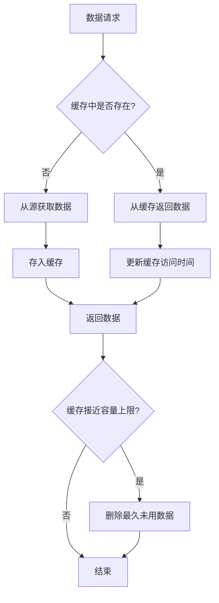

# JavaScript 缓存策略

## 什么是缓存策略？

缓存是一种临时存储数据的技术，它可以提高后续数据访问速度，减少重复计算，从而显著提升应用性能。在JavaScript中，适当的缓存策略可以减少网络请求、避免重复计算，并优化用户体验。

:::tip
良好的缓存策略可以使你的应用响应更快、消耗更少的资源，同时为用户提供更流畅的体验。
:::

## JavaScript 中常见的缓存类型

### 1. 内存缓存(Memory Caching)

内存缓存是最快的缓存类型，数据直接存储在JavaScript的变量中。

```javascript
// 简单的内存缓存示例
const cache = {};

function fetchData(key) {
  // 检查缓存中是否已有数据
  if (cache[key]) {
    console.log('从缓存获取数据');
    return Promise.resolve(cache[key]);
  }
  
  // 模拟API请求
  console.log('从API获取数据');
  return fetch(`https://api.example.com/data/${key}`)
    .then(response => response.json())
    .then(data => {
      // 存入缓存
      cache[key] = data;
      return data;
    });
}

// 使用示例
fetchData('user-1').then(data => console.log('第一次调用:', data));
// 输出: 从API获取数据
// 输出: 第一次调用: {用户数据}

// 稍后再次调用同一API
setTimeout(() => {
  fetchData('user-1').then(data => console.log('第二次调用:', data));
  // 输出: 从缓存获取数据
  // 输出: 第二次调用: {用户数据}
}, 1000);
```

### 2. 函数记忆化(Memoization)

记忆化是一种特殊的缓存形式，用于存储函数调用的结果，尤其适合有昂贵计算的纯函数。

```javascript
// 记忆化函数示例
function memoize(fn) {
  const cache = {};
  
  return function(...args) {
    const key = JSON.stringify(args);
    
    if (cache[key]) {
      console.log('从缓存返回结果');
      return cache[key];
    }
    
    console.log('计算新结果');
    const result = fn.apply(this, args);
    cache[key] = result;
    return result;
  };
}

// 计算斐波那契数列的函数
function fibonacci(n) {
  if (n < 2) return n;
  return fibonacci(n - 1) + fibonacci(n - 2);
}

// 记忆化版本的斐波那契函数
const memoizedFibonacci = memoize(function(n) {
  if (n < 2) return n;
  return memoizedFibonacci(n - 1) + memoizedFibonacci(n - 2);
});

console.time('无缓存');
fibonacci(30); // 执行非常慢
console.timeEnd('无缓存');
// 输出: 无缓存: 17.322ms (时间会因设备而异)

console.time('有缓存');
memoizedFibonacci(30); // 显著更快
console.timeEnd('有缓存');
// 输出: 有缓存: 0.157ms (时间会因设备而异)
```

### 3. HTTP缓存策略

在Web应用中，合理使用HTTP缓存头部可以减少网络请求：

```javascript
// 使用fetch API并设置缓存策略
function fetchWithCache(url) {
  return fetch(url, {
    cache: 'force-cache', // 强制使用缓存，如果存在
    // 其他选项: 'no-cache', 'default', 'reload', 'force-cache', 'only-if-cached'
  })
  .then(response => response.json());
}

// 使用示例
fetchWithCache('/api/users')
  .then(data => console.log('用户数据:', data))
  .catch(error => console.error('获取数据出错:', error));
```

### 4. 本地存储缓存

使用`localStorage`或`sessionStorage`进行客户端持久化缓存：

```javascript
// 使用localStorage进行缓存
const storageCache = {
  set: function(key, data, ttl = null) {
    const item = {
      data: data,
      expiry: ttl ? Date.now() + ttl : null,
    };
    localStorage.setItem(key, JSON.stringify(item));
  },
  
  get: function(key) {
    const itemStr = localStorage.getItem(key);
    if (!itemStr) return null;
    
    const item = JSON.parse(itemStr);
    
    // 检查是否过期
    if (item.expiry && Date.now() > item.expiry) {
      localStorage.removeItem(key);
      return null;
    }
    
    return item.data;
  },
  
  remove: function(key) {
    localStorage.removeItem(key);
  }
};

// 使用示例
// 存储数据，设置10秒过期时间
storageCache.set('user', {id: 1, name: '张三'}, 10000);

// 获取数据
const userData = storageCache.get('user');
console.log(userData); // {id: 1, name: '张三'} 或 null(如果过期)
```

## 高级缓存策略

### LRU缓存(最近最少使用)

LRU缓存保留最近使用的项目，丢弃最久未使用的项目：

```javascript
class LRUCache {
  constructor(capacity) {
    this.capacity = capacity;
    this.cache = new Map();
  }
  
  get(key) {
    if (!this.cache.has(key)) return -1;
    
    // 获取值并更新顺序(删除后重新添加，使其成为"最近使用")
    const value = this.cache.get(key);
    this.cache.delete(key);
    this.cache.set(key, value);
    return value;
  }
  
  put(key, value) {
    // 如果键已存在，先删除
    if (this.cache.has(key)) {
      this.cache.delete(key);
    }
    // 如果达到容量上限，删除最久未使用的项目（Map的第一个项）
    else if (this.cache.size >= this.capacity) {
      const oldestKey = this.cache.keys().next().value;
      this.cache.delete(oldestKey);
    }
    
    // 添加新项
    this.cache.set(key, value);
  }
}

// 使用示例
const cache = new LRUCache(2);
cache.put(1, 1); // 缓存是 {1=1}
cache.put(2, 2); // 缓存是 {1=1, 2=2}
console.log(cache.get(1)); // 返回 1，缓存变为 {2=2, 1=1}
cache.put(3, 3); // 达到容量，删除最久未使用的2，缓存变为 {1=1, 3=3}
console.log(cache.get(2)); // 返回 -1 (未找到)
cache.put(4, 4); // 删除最久未使用的1，缓存变为 {3=3, 4=4}
console.log(cache.get(1)); // 返回 -1 (未找到)
console.log(cache.get(3)); // 返回 3
console.log(cache.get(4)); // 返回 4
```

## 缓存策略图解

以下是典型缓存决策流程：



## 实际应用场景

### 场景1：API数据缓存

在一个天气应用中，相同城市的天气数据可以缓存一小时：

```javascript
const weatherCache = {};

async function getWeather(city) {
  const now = Date.now();
  const cacheKey = city.toLowerCase();
  
  // 检查缓存是否有效(1小时内)
  if (weatherCache[cacheKey] && 
      now - weatherCache[cacheKey].timestamp < 60 * 60 * 1000) {
    console.log('返回缓存的天气数据');
    return weatherCache[cacheKey].data;
  }
  
  // 获取新数据
  console.log('获取新天气数据');
  try {
    const response = await fetch(`https://api.weather.com?city=${city}`);
    const data = await response.json();
    
    // 更新缓存
    weatherCache[cacheKey] = {
      timestamp: now,
      data: data
    };
    
    return data;
  } catch (error) {
    console.error('获取天气数据失败:', error);
    // 如果有过期的缓存数据，可以返回它
    if (weatherCache[cacheKey]) {
      console.log('返回过期的天气数据');
      return weatherCache[cacheKey].data;
    }
    throw error;
  }
}

// 使用示例
getWeather('北京')
  .then(data => console.log('北京天气:', data));
```

### 场景2：计算结果缓存

想象一个应用需要频繁计算大量数据的统计信息：

```javascript
class DataAnalyzer {
  constructor() {
    this.dataCache = {};
  }
  
  computeStatistics(data, metric) {
    const cacheKey = `${metric}-${data.length}-${data[0]}-${data[data.length-1]}`;
    
    if (this.dataCache[cacheKey]) {
      console.log('使用缓存的统计结果');
      return this.dataCache[cacheKey];
    }
    
    console.log('计算新的统计结果');
    
    // 模拟复杂计算
    let result;
    switch (metric) {
      case 'average':
        result = data.reduce((sum, value) => sum + value, 0) / data.length;
        break;
      case 'max':
        result = Math.max(...data);
        break;
      case 'min':
        result = Math.min(...data);
        break;
      default:
        throw new Error(`未知的度量指标: ${metric}`);
    }
    
    // 缓存结果
    this.dataCache[cacheKey] = result;
    return result;
  }
  
  clearCache() {
    this.dataCache = {};
  }
}

// 使用示例
const analyzer = new DataAnalyzer();
const data = Array.from({length: 10000}, () => Math.random() * 100);

console.time('首次计算平均值');
const avg1 = analyzer.computeStatistics(data, 'average');
console.timeEnd('首次计算平均值');

console.time('再次计算平均值');
const avg2 = analyzer.computeStatistics(data, 'average');
console.timeEnd('再次计算平均值');

console.log('平均值:', avg1);
```

## 缓存策略的注意事项

1. **缓存失效(Invalidation)**: 确保在数据更新时清除相关缓存
2. **缓存大小**: 避免无限制增长，设置合理的容量限制
3. **过期策略**: 根据数据特性设置适当的过期时间
4. **一致性**: 需要在性能和数据一致性之间找到平衡
5. **内存管理**: 过多的缓存可能导致内存问题

:::caution
缓存不是万能的。过度缓存可能导致过时数据或内存问题，必须谨慎设计缓存策略。
:::

## 何时使用何种缓存策略

| 缓存类型 | 使用场景 | 优势 | 劣势 |
|---------|---------|------|------|
| 内存缓存 | 短期频繁访问的小型数据 | 速度最快 | 会随页面刷新丢失 |
| 记忆化 | 纯函数的昂贵计算 | 避免重复计算 | 只适用于相同输入总是产生相同输出的函数 |
| localStorage | 需要在会话间保持的数据 | 持久化存储 | 存储容量有限，只能存储字符串 |
| HTTP缓存 | API响应和资源文件 | 减少网络请求 | 需要服务器支持，控制粒度较低 |

## 总结

JavaScript中的缓存策略是性能优化的关键工具。通过合理使用内存缓存、函数记忆化、HTTP缓存和本地存储，可以显著提升应用响应速度，减少资源消耗。

记住，最佳的缓存策略取决于你的具体应用场景、数据特性和用户需求。始终在缓存便利性和数据一致性之间寻找平衡点。

## 练习与挑战

1. 实现一个可以自动清理过期项目的缓存类
2. 为递归计算阶乘的函数添加记忆化功能
3. 创建一个同时使用内存缓存和localStorage的混合缓存策略
4. 设计一个基于索引数据库(IndexedDB)的大规模客户端缓存解决方案

## 附加资源

- MDN关于[HTTP缓存](https://developer.mozilla.org/zh-CN/docs/Web/HTTP/Caching)的文档
- 了解[Service Workers](https://developer.mozilla.org/zh-CN/docs/Web/API/Service_Worker_API)如何用于离线缓存
- 学习[React Query](https://react-query.tanstack.com/)等库如何处理数据缓存
- 探索[LRU缓存算法](https://en.wikipedia.org/wiki/Cache_replacement_policies#Least_recently_used_(LRU))和其他缓存替换策略

通过掌握这些缓存策略，你将能够显著提高你的JavaScript应用性能，为用户创造更流畅的体验。