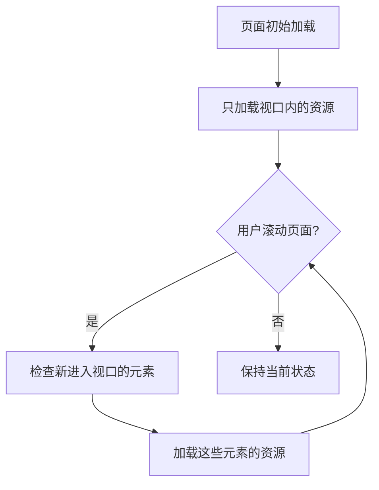

# JavaScript 懒加载

## 什么是懒加载？

懒加载（Lazy Loading）是一种优化网页性能的技术，它的核心思想是：**只在需要时加载资源**。通过延迟加载非关键资源（如图片、视频、脚本或数据），我们可以显著减少页面的初始加载时间，提高用户体验，特别是在网络连接较慢或用户使用移动设备的情况下。

:::tip 懒加载的好处
- 减少初始页面加载时间和资源消耗
- 降低服务器负载和带宽使用
- 提升用户体验，特别是在移动设备上
- 节省不必要的数据传输（对流量敏感的用户很重要）
:::

## 懒加载的工作原理

懒加载的基本原理是将资源的加载推迟到用户真正需要它们的时候。这通常意味着：

1. 当页面首次加载时，只加载可见区域（视口）内的内容
2. 当用户滚动页面，使得更多内容进入视口时，再动态加载这些内容



## 图片懒加载实现

### 1. 使用原生 loading 属性（最简单的方式）

现代浏览器支持图片和iframe的`loading="lazy"`属性，这是实现懒加载最简单的方式：

```html

```

不过，这种方法兼容性有限，不支持旧版浏览器。

### 2. 使用 Intersection Observer API

Intersection Observer API 是现代实现懒加载的推荐方式，它可以高效地检测元素是否进入视口：

```javascript
document.addEventListener("DOMContentLoaded", function() {
  const lazyImages = document.querySelectorAll("img.lazy");
  
  const imageObserver = new IntersectionObserver((entries, observer) => {
    entries.forEach(entry => {
      // 当图片进入视口
      if (entry.isIntersecting) {
        const img = entry.target;
        // 将data-src的值赋给src
        img.src = img.dataset.src;
        // 移除lazy类
        img.classList.remove("lazy");
        // 停止观察这个图片
        observer.unobserve(img);
      }
    });
  });
  
  lazyImages.forEach(img => {
    imageObserver.observe(img);
  });
});
```

HTML结构如下：

```html

```

在这个例子中：
- 我们用低质量的占位图（`placeholder.jpg`）作为初始`src`
- 实际图片URL存储在`data-src`属性中
- 当图片进入视口时，我们将`data-src`的值赋给`src`属性

### 3. 基于滚动事件的传统方法

在不支持Intersection Observer的浏览器中，我们可以使用传统的滚动事件监听：

```javascript
document.addEventListener("DOMContentLoaded", function() {
  const lazyImages = document.querySelectorAll("img.lazy");
  
  // 检查图片是否在视口中
  function isInViewport(element) {
    const rect = element.getBoundingClientRect();
    return (
      rect.bottom >= 0 &&
      rect.right >= 0 &&
      rect.top <= (window.innerHeight || document.documentElement.clientHeight) &&
      rect.left <= (window.innerWidth || document.documentElement.clientWidth)
    );
  }
  
  // 加载视口中的图片
  function loadVisibleImages() {
    lazyImages.forEach(img => {
      if (isInViewport(img)) {
        img.src = img.dataset.src;
        img.classList.remove("lazy");
      }
    });
  }
  
  // 添加事件监听
  window.addEventListener("scroll", _.throttle(loadVisibleImages, 200));
  window.addEventListener("resize", _.throttle(loadVisibleImages, 200));
  
  // 首次检查
  loadVisibleImages();
});
```

:::caution 注意
上述代码使用了`_.throttle`函数（来自Lodash库）来限制事件触发频率。如果不使用节流，滚动事件会频繁触发，影响性能。
:::

## 其他资源的懒加载

### JavaScript 模块懒加载

使用ES6模块的动态导入功能，可以在需要时加载JavaScript模块：

```javascript
// 不是立即加载，而是在用户点击按钮时加载
document.getElementById('loadButton').addEventListener('click', async () => {
  try {
    // 动态导入模块
    const module = await import('./heavy-module.js');
    // 使用模块中的功能
    module.doSomething();
  } catch (error) {
    console.error('模块加载失败:', error);
  }
});
```

### 组件懒加载

在现代前端框架中，我们可以懒加载组件。以下是React中的示例：

```jsx
import React, { lazy, Suspense } from 'react';

// 懒加载组件
const HeavyComponent = lazy(() => import('./HeavyComponent'));

function App() {
  return (
    <div>
      <h1>我的应用</h1>
      <Suspense fallback={<div>加载中...</div>}>
        <HeavyComponent />
      </Suspense>
    </div>
  );
}
```

### 数据懒加载

对于大量数据，可以实现"按需加载"或"无限滚动"：

```javascript
// 简化的无限滚动示例
let page = 1;
const loadMoreData = async () => {
  try {
    const response = await fetch(`/api/data?page=${page}`);
    const newItems = await response.json();
    
    // 将新数据添加到DOM
    const container = document.getElementById('data-container');
    newItems.forEach(item => {
      const element = document.createElement('div');
      element.textContent = item.name;
      container.appendChild(element);
    });
    
    // 增加页码
    page++;
  } catch (error) {
    console.error('加载数据失败:', error);
  }
};

// 监听滚动事件，在接近底部时加载更多数据
window.addEventListener('scroll', () => {
  if ((window.innerHeight + window.scrollY) >= document.body.offsetHeight - 500) {
    loadMoreData();
  }
});

// 初始加载
loadMoreData();
```

## 实际应用案例

### 电商网站产品列表

电商网站通常有大量产品图片。在产品列表页面实现懒加载可以大幅提升初始加载速度：

```javascript
document.addEventListener("DOMContentLoaded", function() {
  // 获取所有产品图片
  const productImages = document.querySelectorAll(".product-image");
  
  const imageObserver = new IntersectionObserver((entries, observer) => {
    entries.forEach(entry => {
      if (entry.isIntersecting) {
        const img = entry.target;
        
        // 加载高质量图片
        img.src = img.dataset.src;
        
        // 添加淡入效果
        img.style.opacity = "0";
        setTimeout(() => {
          img.style.transition = "opacity 0.5s";
          img.style.opacity = "1";
        }, 50);
        
        observer.unobserve(img);
      }
    });
  });
  
  productImages.forEach(img => {
    imageObserver.observe(img);
  });
});
```

### 新闻网站文章内容

新闻文章中的图片和评论可以懒加载，特别是对于长篇文章：

```javascript
// 图片懒加载
const lazyLoadImages = () => {
  const articleImages = document.querySelectorAll('.article-content img[data-src]');
  const imageObserver = new IntersectionObserver((entries, observer) => {
    entries.forEach(entry => {
      if (entry.isIntersecting) {
        const img = entry.target;
        img.src = img.dataset.src;
        observer.unobserve(img);
      }
    });
  });
  
  articleImages.forEach(img => imageObserver.observe(img));
};

// 评论懒加载
const lazyLoadComments = () => {
  const commentsSection = document.querySelector('.comments-section');
  const observer = new IntersectionObserver((entries) => {
    entries.forEach(entry => {
      if (entry.isIntersecting) {
        // 当评论区域进入视口，加载评论
        fetch('/api/comments?article_id=123')
          .then(response => response.json())
          .then(comments => {
            // 渲染评论
            renderComments(comments);
          });
        observer.disconnect();
      }
    });
  });
  
  if (commentsSection) {
    observer.observe(commentsSection);
  }
};

// 初始化
document.addEventListener('DOMContentLoaded', () => {
  lazyLoadImages();
  lazyLoadComments();
});
```

## 懒加载最佳实践

1. **选择合适的触发时机**：不要等到元素完全进入视口才开始加载，应提前一点加载（例如，当元素距离视口还有200-300像素时）

2. **使用占位符**：对于图片，使用低质量占位图或者骨架屏，保持页面布局的稳定性

3. **处理加载失败**：提供加载失败的回退方案，确保用户体验

4. **考虑网络状况**：在检测到快速网络连接时，可以预加载更多内容

5. **避免内容跳动**：确保懒加载资源有预定义的尺寸，防止加载后的布局偏移

6. **监控和优化**：使用性能监控工具评估懒加载的效果，并持续优化

## 总结

JavaScript懒加载是提升网页性能的强大技术，通过延迟加载非关键资源，可以显著减少初始页面加载时间。随着现代浏览器API如Intersection Observer的普及，实现高效的懒加载变得更加简单。

记住，懒加载不仅适用于图片，还可以应用于JavaScript模块、组件、数据和其他资源。在实际项目中灵活运用这些技术，可以大幅提升用户体验和页面性能。

## 练习

1. 实现一个简单的图片画廊，使用懒加载技术加载大量图片。
2. 为一个长页面的网站添加无限滚动功能，懒加载更多内容。
3. 尝试使用React或Vue框架实现组件的懒加载。
4. 比较使用和不使用懒加载的页面加载性能差异。

## 延伸阅读

- [MDN Web Docs: Intersection Observer API](https://developer.mozilla.org/en-US/docs/Web/API/Intersection_Observer_API)
- [web.dev: Lazy loading images](https://web.dev/lazy-loading-images/)
- [MDN Web Docs: 动态导入](https://developer.mozilla.org/en-US/docs/Web/JavaScript/Reference/Statements/import#dynamic_imports)