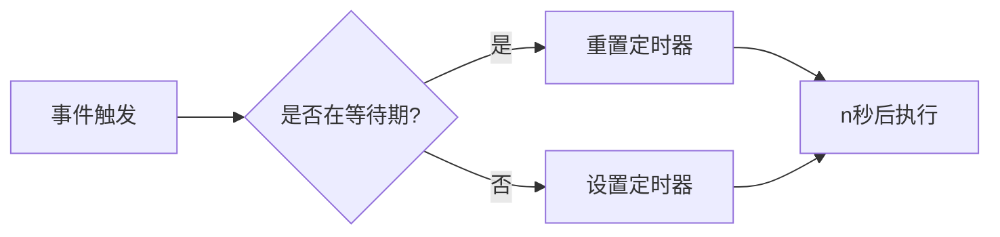
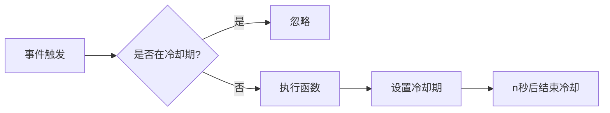

# JavaScript 节流防抖

## 引言

在开发Web应用时，我们经常会遇到一些频繁触发的事件，如滚动事件、窗口调整、按键搜索等。过于频繁地执行这些事件的回调函数可能会导致性能问题，影响用户体验。这时，**节流(Throttle)** 和 **防抖(Debounce)** 就派上用场了 - 它们是JavaScript中常用的两种性能优化技术，用于控制函数的执行频率。

本文将带你深入理解这两种技术的概念、实现方法及应用场景，帮助你在实际开发中有效提升应用性能。

## 什么是防抖(Debounce)

### 防抖的概念

**防抖** 是指在事件被触发后，延迟n秒再执行回调函数。如果在这n秒内事件又被触发，则重新计时。这可以确保函数在一系列连续操作停止后才执行一次。

想象一个电梯场景：当电梯门要关闭时，如果有人按下开门按钮，电梯会重新计时等待。只有当一段时间内没有人按按钮，电梯门才会最终关闭。



### 防抖的实现

下面是一个简单的防抖函数实现：

```javascript
function debounce(func, wait) {
  let timeout;
  
  return function() {
    const context = this;
    const args = arguments;
    
    clearTimeout(timeout);
    
    timeout = setTimeout(() => {
      func.apply(context, args);
    }, wait);
  };
}
```

### 使用示例

下面是一个使用防抖优化搜索输入的例子：

```javascript
// 未优化的搜索函数
function search(query) {
  console.log("搜索查询:", query);
  // 发送API请求等操作
}

// 使用防抖优化后的搜索函数
const debouncedSearch = debounce(search, 500);

// 在输入框中使用
document.querySelector('#search-input').addEventListener('input', function(e) {
  debouncedSearch(e.target.value);
});
```

在这个例子中，只有当用户停止输入500毫秒后，才会执行搜索操作，有效减少了不必要的API请求。

## 什么是节流(Throttle)

### 节流的概念

**节流** 是指在一定时间内，函数只执行一次。即使在这段时间内触发多次事件，也只执行一次函数。节流会稀释函数的执行频率。

想象一个水龙头场景：无论你如何快速拧动水龙头，水流的速度始终保持稳定，不会因为你拧得更快而增加。



### 节流的实现

下面是一个简单的节流函数实现：

```javascript
function throttle(func, wait) {
  let timeout = null;
  
  return function() {
    const context = this;
    const args = arguments;
    
    if (!timeout) {
      timeout = setTimeout(() => {
        func.apply(context, args);
        timeout = null;
      }, wait);
    }
  };
}
```

另一种基于时间戳的实现：

```javascript
function throttle(func, wait) {
  let previous = 0;
  
  return function() {
    const now = Date.now();
    const context = this;
    const args = arguments;
    
    if (now - previous > wait) {
      func.apply(context, args);
      previous = now;
    }
  };
}
```

### 使用示例

下面是一个使用节流优化滚动事件的例子：

```javascript
// 未优化的滚动处理函数
function handleScroll() {
  console.log("滚动位置:", window.scrollY);
  // 执行复杂计算或DOM操作
}

// 使用节流优化后的滚动处理函数
const throttledScroll = throttle(handleScroll, 300);

// 添加滚动事件监听
window.addEventListener('scroll', throttledScroll);
```

在这个例子中，即使用户快速滚动页面，`handleScroll`函数最多每300毫秒只会执行一次，有效降低了CPU负载。

## 防抖 vs 节流：如何选择

:::tip
**防抖(Debounce)**：适用于只关心"最后一次"操作的场景，如搜索框输入、窗口调整完成后的重新布局。

**节流(Throttle)**：适用于需要"匀速"执行的场景，如滚动事件处理、游戏中的按键响应等。
:::

下表总结了两者的主要区别：

| 特性 | 防抖(Debounce) | 节流(Throttle) |
|------|---------------|--------------|
| 执行时机 | 等待期结束后执行一次 | 冷却期内最多执行一次 |
| 连续触发时 | 重置计时器，延迟执行 | 按固定频率执行 |
| 适用场景 | 输入搜索、窗口调整 | 页面滚动、鼠标移动 |
| 副作用 | 可能导致响应延迟 | 可能丢失中间状态 |

## 实际应用场景

### 防抖应用场景

1. **搜索框输入**：用户输入完毕后再发起请求，避免每输入一个字符都发送请求
2. **表单验证**：用户完成输入后再验证
3. **窗口调整**：调整完成后再重新布局
4. **按钮点击**：防止用户快速多次点击提交表单

### 节流应用场景

1. **页面滚动事件**：控制滚动处理函数执行频率
2. **游戏中的按键响应**：限制射击、跳跃等动作的频率
3. **鼠标移动**：如拖拽事件，控制回调执行频率
4. **图表数据刷新**：控制高频数据更新的渲染频率

## 高级实现：带选项的防抖和节流

在实际应用中，我们可能需要更灵活的防抖和节流功能。以下是带有选项的增强版实现：

### 增强版防抖

```javascript
function debounce(func, wait, options = {}) {
  let timeout;
  
  // options.leading为true时，第一次触发会立即执行
  // options.trailing为true时，等待期结束后会执行一次
  return function() {
    const context = this;
    const args = arguments;
    
    // 如果是第一次触发且需要立即执行
    const callNow = options.leading && !timeout;
    
    clearTimeout(timeout);
    
    timeout = setTimeout(() => {
      timeout = null;
      // 如果需要尾部执行
      if (options.trailing && !callNow) {
        func.apply(context, args);
      }
    }, wait);
    
    // 立即执行
    if (callNow) {
      func.apply(context, args);
    }
  };
}
```

### 增强版节流

```javascript
function throttle(func, wait, options = {}) {
  let timeout = null;
  let previous = 0;
  
  // options.leading为false时，禁用第一次执行
  // options.trailing为false时，禁用最后一次执行
  return function() {
    const now = Date.now();
    const context = this;
    const args = arguments;
    
    if (!previous && options.leading === false) {
      previous = now;
    }
    
    const remaining = wait - (now - previous);
    
    if (remaining <= 0) {
      if (timeout) {
        clearTimeout(timeout);
        timeout = null;
      }
      
      func.apply(context, args);
      previous = now;
    } else if (!timeout && options.trailing !== false) {
      timeout = setTimeout(() => {
        previous = options.leading === false ? 0 : Date.now();
        timeout = null;
        func.apply(context, args);
      }, remaining);
    }
  };
}
```

## 实战：构建一个带防抖搜索的组件

下面是一个使用React和防抖技术构建的搜索组件示例：

```jsx
import React, { useState, useEffect } from 'react';

// 自定义防抖Hook
function useDebounce(value, delay) {
  const [debouncedValue, setDebouncedValue] = useState(value);

  useEffect(() => {
    const timer = setTimeout(() => {
      setDebouncedValue(value);
    }, delay);

    return () => {
      clearTimeout(timer);
    };
  }, [value, delay]);

  return debouncedValue;
}

// 搜索组件
function DebouncedSearchInput() {
  const [searchTerm, setSearchTerm] = useState('');
  const [results, setResults] = useState([]);
  const [isSearching, setIsSearching] = useState(false);
  
  // 使用防抖处理搜索词
  const debouncedSearchTerm = useDebounce(searchTerm, 500);
  
  // 当防抖后的搜索词变化时才执行搜索
  useEffect(() => {
    if (debouncedSearchTerm) {
      setIsSearching(true);
      
      // 模拟API调用
      fetchSearchResults(debouncedSearchTerm).then(results => {
        setIsSearching(false);
        setResults(results);
      });
    } else {
      setResults([]);
    }
  }, [debouncedSearchTerm]);

  return (
    <div>
      <input
        type="text"
        placeholder="搜索..."
        onChange={e => setSearchTerm(e.target.value)}
        value={searchTerm}
      />
      
      {isSearching && <div>搜索中...</div>}
      
      <ul>
        {results.map(result => (
          <li key={result.id}>{result.name}</li>
        ))}
      </ul>
    </div>
  );
}

// 模拟API调用
function fetchSearchResults(query) {
  return new Promise(resolve => {
    setTimeout(() => {
      resolve([
        { id: 1, name: `结果1 (${query})` },
        { id: 2, name: `结果2 (${query})` },
        { id: 3, name: `结果3 (${query})` }
      ]);
    }, 300);
  });
}
```

## 性能测试和比较

为了直观展示防抖和节流的性能提升，我们可以进行简单的性能测试：

```javascript
// 测试函数
function performanceTest() {
  let normalCount = 0;
  let debouncedCount = 0;
  let throttledCount = 0;
  
  // 普通函数
  function normalFunc() {
    normalCount++;
    updateCounter('normal', normalCount);
  }
  
  // 防抖函数
  const debouncedFunc = debounce(function() {
    debouncedCount++;
    updateCounter('debounced', debouncedCount);
  }, 100);
  
  // 节流函数
  const throttledFunc = throttle(function() {
    throttledCount++;
    updateCounter('throttled', throttledCount);
  }, 100);
  
  // 模拟高频事件触发
  let trigger = setInterval(() => {
    normalFunc();
    debouncedFunc();
    throttledFunc();
    
    // 10秒后停止测试
    if (normalCount >= 100) {
      clearInterval(trigger);
      showResults(normalCount, debouncedCount, throttledCount);
    }
  }, 100);
  
  function updateCounter(type, count) {
    console.log(`${type} 函数已执行 ${count} 次`);
  }
  
  function showResults(normal, debounced, throttled) {
    console.log('---测试结果---');
    console.log(`普通函数执行次数: ${normal}`);
    console.log(`防抖函数执行次数: ${debounced}`);
    console.log(`节流函数执行次数: ${throttled}`);
    console.log(`防抖减少了 ${((normal - debounced) / normal * 100).toFixed(2)}% 的执行次数`);
    console.log(`节流减少了 ${((normal - throttled) / normal * 100).toFixed(2)}% 的执行次数`);
  }
}

// 运行测试
performanceTest();
```

:::caution
在实际开发中，请注意防抖和节流可能会导致一些副作用，如用户操作响应延迟或中间状态丢失。在选择使用时需要权衡用户体验和性能之间的平衡。
:::

## 总结

防抖(Debounce)和节流(Throttle)是JavaScript性能优化的重要技术，能有效控制高频事件的处理频率，提升应用性能和用户体验：

- **防抖**：将连续多次触发的事件合并为一次执行，适合处理"最终状态"
- **节流**：按一定频率执行函数，适合处理"过程状态"

这两种技术的核心在于用时间控制函数执行，合理使用它们可以大大提升应用的响应速度和降低资源消耗。

选择合适的技术取决于具体的应用场景和需求，有时甚至需要将两种技术结合使用，以达到最佳的优化效果。

## 练习与挑战

1. **基础练习**：实现一个带取消功能的防抖函数
2. **进阶练习**：结合防抖和节流技术，优化一个拖拽组件
3. **实战挑战**：构建一个无限滚动列表，使用节流优化滚动性能

## 参考资源

- [MDN: Debounce](https://developer.mozilla.org/en-US/docs/Web/API/Document/scroll_event)
- [Lodash: debounce](https://lodash.com/docs/4.17.15#debounce)
- [Lodash: throttle](https://lodash.com/docs/4.17.15#throttle)
- [You Don't Know JS: Async & Performance](https://github.com/getify/You-Dont-Know-JS)

通过掌握这些技术，你将能够编写更高效、更流畅的JavaScript应用程序，为用户提供更好的体验。