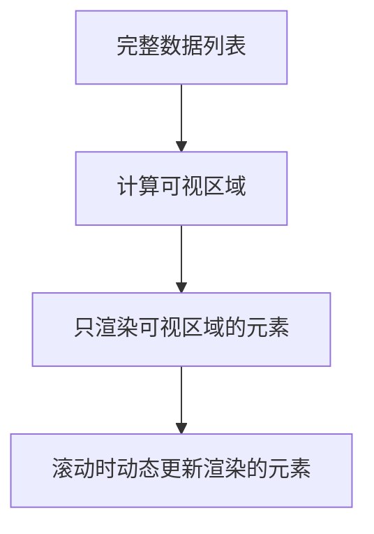

# JavaScript 虚拟列表

在前端开发中，我们经常需要渲染包含大量数据的列表。当这些列表数据达到几百甚至几千条时，将它们全部渲染到DOM中会导致严重的性能问题。这时，**虚拟列表**（Virtual List）技术就显得尤为重要了。

## 什么是虚拟列表？

:::info 定义
虚拟列表是一种用于优化长列表性能的技术，它只渲染用户当前可见区域的内容，而不是一次性渲染所有数据。
:::

当我们滚动列表时，虚拟列表会动态地创建和销毁DOM元素，确保在任何时候，页面中只存在有限数量的DOM节点，从而大大提升了页面的性能和响应速度。



## 为什么需要虚拟列表？

考虑以下场景：你需要展示一个包含10,000条数据的列表。如果使用传统方式渲染，会出现这些问题：

1. **初始加载慢**：一次创建10,000个DOM节点会阻塞主线程
2. **内存消耗大**：大量DOM节点占用大量内存
3. **滚动卡顿**：事件处理和重新计算样式会导致滚动不流畅
4. **用户体验差**：响应缓慢，可能导致浏览器崩溃

通过虚拟列表技术，我们可以将这10,000条数据转换为只渲染几十个DOM节点的高性能列表。

## 虚拟列表的工作原理

虚拟列表的核心原理包括以下几个关键点：

1. **可视区域计算**：确定用户当前可以看到的区域大小
2. **元素高度管理**：知道每个列表项的高度，以便正确定位
3. **滚动位置监听**：监控滚动事件，计算应该显示哪些项
4. **DOM元素复用**：通过重新定位和更新内容来复用DOM节点

## 实现一个简单的虚拟列表

下面我们将实现一个基础的虚拟列表示例：

```html
<!DOCTYPE html>
<html>
<head>
  <style>
    .list-container {
      height: 400px;
      overflow-y: auto;
      position: relative;
      border: 1px solid #ccc;
    }
    
    .list-phantom {
      position: absolute;
      left: 0;
      top: 0;
      right: 0;
      z-index: -1;
    }
    
    .list-item {
      padding: 10px;
      border-bottom: 1px solid #eee;
      box-sizing: border-box;
      height: 50px;
    }
  </style>
</head>
<body>
  <div id="app">
    <div class="list-container" id="container">
      <div class="list-phantom" id="phantom"></div>
      <div class="list-content" id="content"></div>
    </div>
  </div>

  <script>
    // 配置参数
    const config = {
      itemHeight: 50,    // 每项高度
      visibleItems: 8,   // 可见项数
      bufferItems: 2,    // 缓冲区项数
      listData: Array(1000).fill(null).map((_, i) => `列表项 ${i+1}`) // 1000条数据
    };
    
    // 获取DOM元素
    const container = document.getElementById('container');
    const phantom = document.getElementById('phantom');
    const content = document.getElementById('content');
    
    // 设置幻影区域高度
    phantom.style.height = `${config.itemHeight * config.listData.length}px`;
    
    // 渲染可见区域
    function renderVisibleItems(scrollTop) {
      // 计算开始索引
      const startIndex = Math.max(
        0,
        Math.floor(scrollTop / config.itemHeight) - config.bufferItems
      );
      
      // 计算结束索引
      const endIndex = Math.min(
        config.listData.length - 1,
        startIndex + config.visibleItems + config.bufferItems * 2
      );
      
      // 计算偏移量
      const offsetY = startIndex * config.itemHeight;
      
      // 更新内容区域位置
      content.style.transform = `translateY(${offsetY}px)`;
      
      // 清空内容区域
      content.innerHTML = '';
      
      // 添加可见项
      for (let i = startIndex; i <= endIndex; i++) {
        const item = document.createElement('div');
        item.className = 'list-item';
        item.textContent = config.listData[i];
        content.appendChild(item);
      }
    }
    
    // 监听滚动事件
    container.addEventListener('scroll', () => {
      const scrollTop = container.scrollTop;
      renderVisibleItems(scrollTop);
    });
    
    // 初始渲染
    renderVisibleItems(0);
  </script>
</body>
</html>
```

让我们分析这个实现：

1. 我们创建了一个`list-container`作为可视区域，其高度固定为400px
2. `list-phantom`是一个"幻影"元素，它的高度等于所有列表项的总高度，用于创建正确的滚动条
3. `list-content`包含实际渲染的元素，它会根据滚动位置动态调整内容
4. 当用户滚动时，我们计算应该显示哪些项，并只渲染这些项

运行这段代码后，你会看到一个1000条数据的流畅列表，但实际DOM中只有约12个元素（可见项 + 缓冲项）。

## 优化与改进

基础实现后，我们可以考虑一些优化措施：

### 1. 处理不定高的列表项

真实场景中，列表项的高度可能不固定。解决方案：

```javascript
// 在元素渲染后测量其高度
function updateItemHeight(index, element) {
  const height = element.getBoundingClientRect().height;
  itemHeightCache[index] = height;
  updatePhantomHeight();
}

// 更新幻影区域高度
function updatePhantomHeight() {
  const totalHeight = itemHeightCache.reduce((sum, height) => sum + height, 0);
  phantom.style.height = `${totalHeight}px`;
}
```

### 2. 减少重排重绘

使用`transform`代替直接修改`top`值可以减少重排：

```javascript
content.style.transform = `translateY(${offsetY}px)`;
```

### 3. 添加节流函数

防止滚动事件过于频繁触发:

```javascript
function throttle(fn, delay) {
  let timer = null;
  let lastRun = 0;
  
  return function() {
    const now = Date.now();
    const remaining = delay - (now - lastRun);
    const context = this;
    const args = arguments;
    
    if (remaining <= 0) {
      if (timer) {
        clearTimeout(timer);
        timer = null;
      }
      lastRun = now;
      fn.apply(context, args);
    } else if (!timer) {
      timer = setTimeout(() => {
        lastRun = Date.now();
        timer = null;
        fn.apply(context, args);
      }, remaining);
    }
  };
}

// 使用节流函数
container.addEventListener('scroll', throttle(() => {
  const scrollTop = container.scrollTop;
  renderVisibleItems(scrollTop);
}, 16)); // 约60fps
```

## 实际应用场景

虚拟列表在以下场景中特别有用：

1. **社交媒体信息流**：Facebook、Twitter等平台的无限滚动列表
2. **电商网站商品列表**：展示成千上万的商品而不影响性能
3. **在线文档编辑器**：处理大型文档中的段落和元素
4. **聊天应用**：显示长时间的聊天记录
5. **数据分析平台**：展示大量数据表格而不卡顿

### 实例：电商商品列表

```jsx
function VirtualProductList({ products }) {
  const [visibleRange, setVisibleRange] = useState({ start: 0, end: 10 });
  const containerRef = useRef(null);
  
  // 监听滚动
  const handleScroll = useCallback(() => {
    const { scrollTop, clientHeight } = containerRef.current;
    const start = Math.floor(scrollTop / 200); // 假设每个商品卡片高度为200px
    const visibleCount = Math.ceil(clientHeight / 200);
    
    setVisibleRange({
      start: Math.max(0, start - 3), // 添加缓冲
      end: Math.min(products.length, start + visibleCount + 3) // 添加缓冲
    });
  }, [products.length]);
  
  return (
    <div 
      ref={containerRef}
      style={{ height: '600px', overflow: 'auto' }}
      onScroll={handleScroll}
    >
      <div style={{ height: `${products.length * 200}px`, position: 'relative' }}>
        {products.slice(visibleRange.start, visibleRange.end).map((product, index) => (
          <div
            key={product.id}
            style={{
              position: 'absolute',
              top: `${(index + visibleRange.start) * 200}px`,
              height: '200px',
              width: '100%'
            }}
          >
            <ProductCard product={product} />
          </div>
        ))}
      </div>
    </div>
  );
}
```

## 框架中的虚拟列表实现

现代前端框架都有现成的虚拟列表库：

### React

- `react-window`：轻量级虚拟列表库
- `react-virtualized`：功能更丰富的虚拟滚动库

```jsx
import { FixedSizeList as List } from 'react-window';

function Example({ data }) {
  const Row = ({ index, style }) => (
    <div style={style}>
      行 {index}: {data[index]}
    </div>
  );
  
  return (
    <List
      height={400}
      itemCount={data.length}
      itemSize={35}
      width={300}
    >
      {Row}
    </List>
  );
}
```

### Vue

- `vue-virtual-scroller`：Vue的虚拟滚动组件

```vue
<template>
  <RecycleScroller
    class="scroller"
    :items="items"
    :item-size="50"
    key-field="id"
    v-slot="{ item }"
  >
    <div class="user">
      {{ item.name }}
    </div>
  </RecycleScroller>
</template>

<script>
import { RecycleScroller } from 'vue-virtual-scroller'
import 'vue-virtual-scroller/dist/vue-virtual-scroller.css'

export default {
  components: {
    RecycleScroller
  },
  data() {
    return {
      items: Array(1000).fill().map((_, i) => ({ id: i, name: `用户 ${i}` }))
    }
  }
}
</script>
```

## 性能对比

让我们对比一下使用虚拟列表前后的性能差异：

:::tip 性能对比
| 指标 | 传统渲染（10,000项） | 虚拟列表（10,000项） |
|------|---------------------|-------------------|
| DOM节点数 | 10,000+ | `~20-50` |
| 内存使用 | 高 | 低 |
| 初始渲染时间 | 1000ms+ | `<100ms` |
| 滚动性能 | 卡顿 | 流畅 |
| CPU使用率 | 高峰可达100% | 通常低于10% |
:::

## 总结

虚拟列表是一种强大的性能优化技术，通过只渲染可见区域的内容，它极大地提高了长列表的渲染性能和用户体验。

实现虚拟列表的关键点包括：
- 计算并维护可视区域
- 监听滚动事件并更新渲染内容
- 正确设置内容定位和高度

在实际开发中，建议使用成熟的虚拟列表库，这些库已经处理了各种边缘情况和兼容性问题。但了解虚拟列表的工作原理，对于理解前端性能优化和提升开发技能非常有价值。

## 练习与扩展

1. 尝试实现一个支持不定高列表项的虚拟列表
2. 为虚拟列表添加"回到顶部"功能
3. 实现一个支持横向滚动的虚拟列表
4. 为虚拟列表添加加载更多（无限滚动）功能

## 扩展阅读

- [High Performance React: 3 New Tools to Speed Up Your Apps](https://reactjs.org/blog/2018/03/01/sneak-peek-beyond-react-16.html)
- [Rendering Lists Using React Virtualized](https://blog.logrocket.com/rendering-large-lists-react-virtualized/)
- [Understanding Virtual DOM](https://medium.com/swlh/understanding-virtual-dom-in-vuejs-react-8fb771f19a1c)
- [Web Performance Optimization with Virtualization](https://web.dev/virtualize-lists-with-react-window/)

通过掌握虚拟列表技术，你将能够轻松处理大数据量的前端渲染问题，为用户提供流畅的体验！