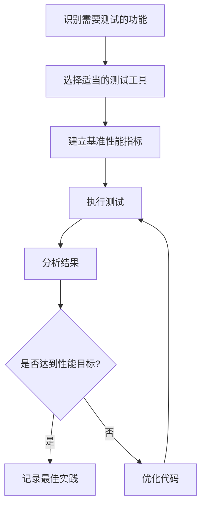

# JavaScript 性能测试

在Web开发中，性能是用户体验的关键因素。一个运行缓慢的网站会导致用户流失，影响业务目标。本文将介绍JavaScript性能测试的基础知识、工具和技术，帮助你识别和解决代码中的性能瓶颈。

## 什么是JavaScript性能测试？

JavaScript性能测试是测量和分析JavaScript代码执行效率的过程。它帮助开发者识别代码中的瓶颈，并通过优化改善网站或应用程序的性能。

:::tip 为什么性能测试很重要？
研究表明，页面加载时间每增加1秒，转化率可能下降7%。性能测试帮助你发现并解决可能影响用户体验的性能问题。
:::

## 性能测试的基本指标

在进行JavaScript性能测试时，我们通常关注以下几个关键指标：

1. **执行时间**：代码运行所需的时间
2. **内存使用**：代码执行过程中消耗的内存
3. **CPU使用率**：代码对CPU资源的占用程度
4. **渲染性能**：页面渲染的流畅程度
5. **加载时间**：资源加载所需的时间

## 基本性能测试技术

### 使用console.time()和console.timeEnd()

最简单的性能测试方法之一是使用浏览器内置的`console.time()`和`console.timeEnd()`方法来测量代码块的执行时间。

```javascript
// 开始计时
console.time('循环测试');

// 要测试的代码
let sum = 0;
for (let i = 0; i < 1000000; i++) {
  sum += i;
}

// 结束计时并输出结果
console.timeEnd('循环测试');
// 输出: 循环测试: 12.158ms (时间会因设备而异)
```

### 使用Performance API

浏览器的Performance API提供了更详细的性能测量功能：

```javascript
// 记录起始时间
const startTime = performance.now();

// 要测试的代码
let sum = 0;
for (let i = 0; i < 1000000; i++) {
  sum += i;
}

// 计算并输出执行时间
const endTime = performance.now();
console.log(`执行时间: ${endTime - startTime} 毫秒`);
// 输出例如: 执行时间: 11.500000001396984 毫秒
```

Performance API比`console.time()`更精确，可以测量到微秒级别。

## 比较不同实现的性能

让我们比较两种实现同一功能的方法性能：

```javascript
// 测试数组求和的两种方法

// 准备测试数据
const testArray = Array(1000000).fill(1);

// 方法1: 使用for循环
console.time('for循环');
let sum1 = 0;
for (let i = 0; i < testArray.length; i++) {
  sum1 += testArray[i];
}
console.timeEnd('for循环');

// 方法2: 使用reduce方法
console.time('reduce方法');
const sum2 = testArray.reduce((acc, curr) => acc + curr, 0);
console.timeEnd('reduce方法');

console.log(`结果比较: for循环结果 = ${sum1}, reduce结果 = ${sum2}`);

/*
可能的输出：
for循环: 8.123ms
reduce方法: 12.456ms
结果比较: for循环结果 = 1000000, reduce结果 = 1000000
*/
```

通过这种方式，你可以直观地比较不同实现方法之间的性能差异。

## 高级性能测试工具

### 1. Chrome DevTools

Chrome开发者工具是进行JavaScript性能测试最常用的工具之一：

1. 打开Chrome DevTools (F12或Cmd+Option+I)
2. 切换到"Performance"面板
3. 点击"Record"按钮
4. 执行你想测试的操作
5. 点击"Stop"按钮
6. 分析结果

Chrome DevTools可以帮助你识别：
- JavaScript执行耗时
- 布局重排和重绘事件
- 内存使用情况
- 帧率下降等问题

:::caution 注意
在使用DevTools进行性能分析时，确保禁用浏览器扩展，使用隐私模式可以避免扩展影响测试结果。
:::

### 2. Lighthouse

Lighthouse是一个开源的自动化工具，用于改进网页质量：

1. 在Chrome DevTools中切换到"Lighthouse"面板
2. 选择你想测试的类别（性能、可访问性等）
3. 点击"Generate report"
4. 查看详细的性能报告和优化建议

### 3. jsPerf

jsPerf是一个在线工具，可以创建和共享JavaScript性能测试用例。它使用Benchmark.js库来运行测试，并提供详细的统计数据。

### 4. Benchmark.js

Benchmark.js是一个强大的JavaScript基准测试库，可以用来精确测量代码性能：

```javascript
// 首先在项目中安装Benchmark.js
// npm install benchmark

// 使用Benchmark.js进行测试
const Benchmark = require('benchmark');
const suite = new Benchmark.Suite;

// 添加测试
suite
  .add('for循环', function() {
    let sum = 0;
    for (let i = 0; i < 1000; i++) {
      sum += i;
    }
    return sum;
  })
  .add('reduce方法', function() {
    return Array(1000).fill(0).map((_, i) => i).reduce((a, b) => a + b, 0);
  })
  // 添加监听器
  .on('cycle', function(event) {
    console.log(String(event.target));
  })
  .on('complete', function() {
    console.log('最快的是 ' + this.filter('fastest').map('name'));
  })
  // 运行测试
  .run({ 'async': true });

/*
可能的输出：
for循环 x 95,042 ops/sec ±0.51% (93 runs sampled)
reduce方法 x 10,223 ops/sec ±0.49% (97 runs sampled)
最快的是 for循环
*/
```

## 内存性能测试

### 使用Chrome DevTools内存分析器

1. 打开Chrome DevTools
2. 切换到"Memory"面板
3. 选择"Heap snapshot"
4. 点击"Take snapshot"
5. 分析内存使用情况

以下代码展示了可能导致内存泄漏的情况：

```javascript
// 内存泄漏示例
let leakedObjects = [];

function createObjects() {
  for (let i = 0; i < 10000; i++) {
    // 创建大量对象并存储在全局数组中
    leakedObjects.push({
      data: new Array(10000).fill('测试数据'),
      id: i
    });
  }
  console.log(`创建了 ${leakedObjects.length} 个对象`);
}

// 使用Chrome内存分析器，在执行前后分别拍摄内存快照，对比内存增长
```

## 实际案例：优化图片库滚动性能

假设我们有一个包含大量图片的滚动库，用户滚动时性能不佳。我们可以通过以下步骤测试和优化：

1. **初始性能测量**：

```javascript
// 记录初始滚动性能
console.time('scrollTest');
document.addEventListener('scroll', function scrollHandler() {
  // 滚动结束后停止计时
  if ((window.innerHeight + window.scrollY) >= document.body.offsetHeight) {
    console.timeEnd('scrollTest');
    document.removeEventListener('scroll', scrollHandler);
  }
});
```

2. **识别问题**：使用Chrome DevTools Performance面板记录滚动，观察帧率和JavaScript执行时间。

3. **实施优化**：

```javascript
// 优化前: 每次滚动都重新计算所有图片位置
function updateImagePositions() {
  const images = document.querySelectorAll('.gallery-image');
  images.forEach(image => {
    // 重新计算每个图片的位置
    updateImagePosition(image);
  });
}

// 优化后: 使用IntersectionObserver只处理视口内的图片
const imageObserver = new IntersectionObserver((entries) => {
  entries.forEach(entry => {
    if (entry.isIntersecting) {
      // 只处理进入视口的图片
      updateImagePosition(entry.target);
    }
  });
});

document.querySelectorAll('.gallery-image').forEach(image => {
  imageObserver.observe(image);
});
```

4. **再次测量性能**：使用相同的测试方法，比较优化前后的性能差异。

## 性能测试最佳实践

1. **测试真实环境**：在与生产环境相似的条件下进行测试。
2. **多次运行测试**：单次测试可能受随机因素影响，多次测试求平均值更准确。
3. **测试不同设备**：特别是低端设备，性能问题往往在低端设备上更明显。
4. **关注用户指标**：优化应该以提升用户体验为目标。
5. **建立性能预算**：设定明确的性能目标，例如"页面加载时间不超过2秒"。



## 总结

JavaScript性能测试是优化应用程序不可或缺的一部分。通过掌握基本的测量技术和工具，你可以识别代码中的性能瓶颈，做出数据驱动的优化决策。记住，性能优化应该是一个持续的过程，而不是一次性任务。随着应用功能的增加，定期进行性能测试可以确保你的应用始终保持良好的用户体验。

## 练习与进阶学习

1. 使用`console.time()`和Performance API比较以下操作的性能：
   - 使用`for`循环和`forEach`遍历大型数组
   - 使用`querySelector`和`getElementById`选择DOM元素
   - 字符串连接vs模板字符串

2. 使用Chrome DevTools记录你最近开发的一个页面，找出至少两个可能的性能优化点。

3. 尝试使用Benchmark.js创建一个小型基准测试套件，测试不同的算法实现。

### 附加资源

- [MDN Web文档: Performance API](https://developer.mozilla.org/en-US/docs/Web/API/Performance)
- [Chrome DevTools性能分析指南](https://developers.google.com/web/tools/chrome-devtools/evaluate-performance)
- [Lighthouse文档](https://developers.google.com/web/tools/lighthouse)
- [Benchmark.js官方文档](https://benchmarkjs.com/)

通过不断练习和应用这些工具和技术，你将能够编写更高效的JavaScript代码，提供更好的用户体验。