# JavaScript 性能指标

## 什么是性能指标？

性能指标是衡量Web应用程序在用户体验方面表现的量化方法。对于前端开发人员来说，了解和优化这些指标对于创建流畅、快速响应的Web应用至关重要。

:::tip 为什么性能很重要？
研究表明，如果页面加载时间超过3秒，超过40%的用户会离开网站。每提高1秒的加载速度，可以显著提升转化率。
:::

## 核心性能指标

### 1. 加载性能指标

#### First Contentful Paint (FCP)

FCP测量从页面开始加载到页面内容的任何部分呈现在屏幕上的时间。

```mermaid
gantt
    title 页面加载时间线
    dateFormat  s
    axisFormat %S秒
    
    导航开始      :milestone, m1, 0, 0
    网络请求      :0, 1
    DOM构建      :0.8, 1.2
    FCP          :milestone, m2, 1.2, 0
    页面交互      :milestone, m3, 2.5, 0
```



**优良标准**：
- 良好: < 1.8秒
- 需要改进: 1.8秒 - 3秒
- 较差: > 3秒

#### Largest Contentful Paint (LCP)

LCP测量页面主要内容加载完成的时间，是用户感知加载速度的重要指标。

**优良标准**：
- 良好: < 2.5秒
- 需要改进: 2.5秒 - 4秒
- 较差: > 4秒

#### DOM Content Loaded (DOMContentLoaded)

当HTML文档被完全加载和解析时触发，不等待样式表、图像和子框架完成加载。

```javascript
document.addEventListener('DOMContentLoaded', () => {
  console.log('DOM 完全加载和解析');
});
```

#### Load Event

当整个页面及其所有依赖资源（如样式表和图像）已完成加载时触发。

```javascript
window.addEventListener('load', () => {
  console.log('页面完全加载');
});
```

### 2. 交互性指标

#### First Input Delay (FID)

FID测量用户首次与页面交互（如点击按钮）到浏览器实际能够响应该交互的时间。

**优良标准**：
- 良好: < 100毫秒
- 需要改进: 100毫秒 - 300毫秒
- 较差: > 300毫秒

#### Time to Interactive (TTI)

TTI测量页面从开始加载到完全可交互所需的时间。

#### Total Blocking Time (TBT)

TBT衡量FCP与TTI之间主线程被阻塞足够长的时间而无法响应用户输入的总时间。

### 3. 视觉稳定性指标

#### Cumulative Layout Shift (CLS)

CLS测量页面加载期间元素意外移动的频率，是用户体验的重要指标。

**优良标准**：
- 良好: < 0.1
- 需要改进: 0.1 - 0.25
- 较差: > 0.25

### 4. 运行时性能指标

#### CPU使用率

浏览器开发者工具可以帮助监视JavaScript执行过程中的CPU使用情况。

#### 内存使用

监控应用程序的内存占用，防止内存泄漏。

```javascript
// 在Chrome开发者工具中查看内存使用
console.log(performance.memory);
```

## 如何测量性能指标

### 1. 使用浏览器开发者工具

Chrome DevTools提供了强大的性能分析工具：

1. 打开Chrome DevTools (F12或右键点击 → 检查)
2. 切换到"Performance"或"Lighthouse"标签
3. 点击记录按钮开始分析

### 2. Web Vitals API

使用Google的Web Vitals库可以在实际用户中收集核心Web指标数据。

```javascript
import {getLCP, getFID, getCLS} from 'web-vitals';

function sendToAnalytics({name, delta, id}) {
  console.log(`指标: ${name}, 值: ${delta}`);
  // 发送到分析服务
}

// 监测并报告所有三个核心Web指标
getCLS(sendToAnalytics);
getFID(sendToAnalytics);
getLCP(sendToAnalytics);
```

### 3. 性能测量API

使用内置的Performance API测量特定代码执行时间：

```javascript
// 开始测量
performance.mark('functionStart');

// 执行代码
expensiveCalculation();

// 结束测量
performance.mark('functionEnd');
performance.measure('functionDuration', 'functionStart', 'functionEnd');

// 输出结果
const measure = performance.getEntriesByName('functionDuration')[0];
console.log(`函数执行时间: ${measure.duration}毫秒`);
```

## 实际案例：分析和改进加载性能

### 案例1：优化大型JavaScript文件

**问题**：一个电子商务网站的产品页面加载缓慢，LCP超过5秒。

**分析**：使用Lighthouse发现大型JavaScript包是主要问题。

**解决方案**：

1. 代码分割 - 将大文件拆分成更小的块：

```javascript
// 改变前: 直接导入
import { ProductGallery, ProductDetails, RelatedProducts } from './product-components';

// 改变后: 使用动态导入
const ProductGallery = React.lazy(() => import('./ProductGallery'));
const ProductDetails = React.lazy(() => import('./ProductDetails'));
const RelatedProducts = React.lazy(() => import('./RelatedProducts'));
```

2. 实施延迟加载：

```javascript
// 检测元素是否进入视口
const observer = new IntersectionObserver((entries) => {
  entries.forEach(entry => {
    if (entry.isIntersecting) {
      // 元素在视口中，加载相关资源
      const lazyElement = entry.target;
      lazyElement.src = lazyElement.dataset.src;
      observer.unobserve(lazyElement);
    }
  });
});

// 观察所有延迟加载元素
document.querySelectorAll('.lazy-load').forEach(element => {
  observer.observe(element);
});
```

**结果**：LCP从5秒改善到2.3秒，提升了54%的性能。

### 案例2：减少Layout Shifts

**问题**：新闻网站在图片加载时发生大量布局偏移(CLS高)。

**解决方案**：预留图片空间并使用骨架屏幕：

```html
<div class="image-container" style="position: relative; width: 100%; padding-top: 56.25%;">
  
</div>
```

```css
.image-container {
  position: relative;
  width: 100%;
  padding-top: 56.25%; /* 16:9 宽高比 */
  background: #f0f0f0; /* 骨架屏颜色 */
}

.lazy-image {
  position: absolute;
  top: 0;
  left: 0;
  width: 100%;
  height: 100%;
  opacity: 0;
  transition: opacity 0.3s;
}

.lazy-image.loaded {
  opacity: 1;
}
```

**结果**：CLS从0.32降低到0.05，显著提升了视觉稳定性。

## 性能预算

设置性能预算是确保网站保持高性能的好方法。例如：

- JavaScript总体积：不超过300KB (压缩和最小化后)
- FCP：不超过1.5秒
- TTI：不超过3.5秒
- CLS：不超过0.1

## 总结

JavaScript性能指标是衡量和改进Web应用用户体验的关键工具。通过关注核心Web指标(LCP、FID、CLS)和其他重要指标，开发者可以创建更快速、更具响应性的应用程序。记住，性能优化是一个持续的过程，需要不断测量、分析和改进。

## 练习

1. 使用Chrome DevTools的Lighthouse对你喜欢的网站执行性能审计，并识别主要的性能问题。
2. 使用Performance API测量一个简单函数的执行时间。
3. 实施延迟加载技术，并比较实施前后的FCP和LCP指标。
4. 为你的项目创建一个性能预算，并设置监控系统。

## 附加资源

- [Web Vitals](https://web.dev/vitals/) - Google关于核心Web指标的详细指南
- [Performance API MDN文档](https://developer.mozilla.org/zh-CN/docs/Web/API/Performance)
- [Chrome DevTools Performance分析](https://developers.google.com/web/tools/chrome-devtools/evaluate-performance)

:::note 持续学习
性能优化是前端开发的永恒主题。建议定期回顾这些指标和最佳实践，因为浏览器技术和性能标准会不断发展。
:::