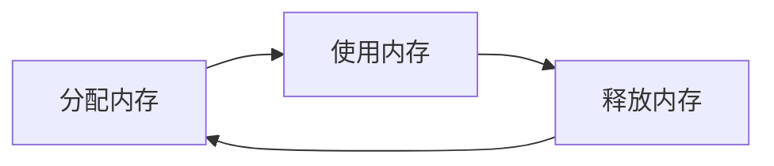
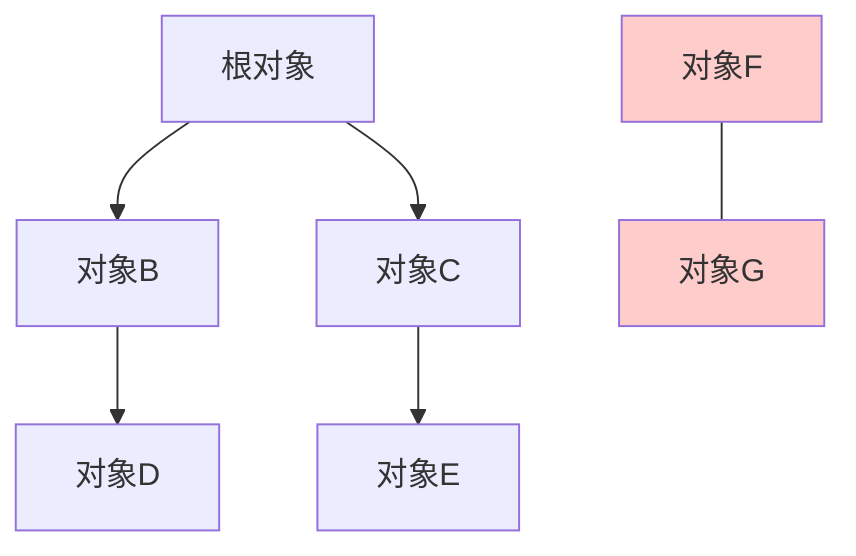

# JavaScript 内存管理

## 什么是JavaScript内存管理？

JavaScript作为一种高级编程语言，会自动为我们处理内存分配和释放。然而，了解JavaScript如何管理内存对于编写高效、无bug的应用程序至关重要。内存管理不当可能导致应用程序性能下降，甚至崩溃。

:::note 内存管理的核心概念
内存管理主要涉及两个方面：
- **内存分配**：当我们创建变量、函数和对象时，JavaScript会自动分配内存
- **内存释放**：当不再需要这些数据时，JavaScript的垃圾回收机制会释放内存
:::

## JavaScript 的内存生命周期

JavaScript中的内存生命周期遵循以下步骤：



1. **分配内存** - JavaScript在声明变量时自动分配内存
2. **使用内存** - 程序读取和修改分配的内存
3. **释放内存** - 当内存不再需要时，垃圾回收器释放它

## JavaScript 中的内存分配

JavaScript会在创建变量时自动分配内存：

```javascript
// 为数字分配内存
let number = 123; 

// 为字符串分配内存
let string = "Hello, world!"; 

// 为对象及其属性分配内存
let object = {
  name: "JavaScript",
  year: 1995
}; 

// 为数组及其元素分配内存
let array = [1, 2, 3, 4]; 

// 为函数分配内存（函数是一种特殊的对象）
let func = function(a) {
  return a + 2;
}; 
```

## JavaScript 中的内存使用

在分配内存后，可以通过读取或写入分配的值来使用内存：

```javascript
// 读取和修改变量值（使用内存）
let name = "JavaScript"; // 分配内存并存储初始值
name = "ECMAScript";     // 使用内存（修改存储的值）

// 读取对象属性
let language = {
  name: "JavaScript",
  age: 26
};
console.log(language.name); // 使用内存（读取值）
```

## JavaScript 的垃圾回收机制

JavaScript使用自动垃圾回收机制来释放不再需要的内存。主要有两种常见的垃圾回收算法：

### 1. 引用计数算法

这是最简单的垃圾收集算法。如果没有任何引用指向某个对象，则认为该对象是"垃圾"，可以回收其占用的内存。

```javascript
let user = { name: "John" }; // 创建对象，引用计数为1
let admin = user;           // 现在有两个引用指向对象，引用计数为2
user = null;                // 引用计数减少到1
admin = null;               // 引用计数减少到0，对象可以被垃圾回收
```

但是，引用计数存在**循环引用**的问题：

```javascript
function createCycle() {
  let objectA = {};
  let objectB = {};
  
  objectA.ref = objectB;
  objectB.ref = objectA;  // 创建循环引用
  
  return "Cycle created";
}

createCycle();  // 执行函数后，尽管函数内的对象已经无法访问，但因为相互引用，引用计数不为0
```

### 2. 标记-清除算法

这是现代浏览器使用的主要算法。它从"根"开始（在JavaScript中通常是全局对象），标记所有可达的对象，然后清除所有未标记的对象。



上图中，对象F和G相互引用，但从根对象无法访问到它们，因此会被垃圾回收器标记为可回收。

## 常见的内存泄漏问题

内存泄漏是指程序中分配的内存由于某种原因未被释放，导致内存占用不断增长。以下是JavaScript中常见的内存泄漏情况：

### 1. 意外的全局变量

```javascript
function createGlobal() {
  user = { name: "John" };  // 没有使用var、let或const声明，意外创建了全局变量
}

createGlobal();
// 现在user是全局变量，即使createGlobal函数执行完毕，user也不会被垃圾回收
```

### 2. 被遗忘的计时器或回调函数

```javascript
function setUpInterval() {
  let userData = {
    name: "John",
    age: 25
  };
  
  setInterval(function() {
    console.log(userData.name + " is " + userData.age);
  }, 1000);
}

setUpInterval();
// 即使setUpInterval执行完毕，但因为定时器仍然持有userData的引用，所以userData不会被垃圾回收
```

### 3. DOM引用问题

```javascript
function addClickHandler() {
  let element = document.getElementById("button");
  
  let data = { message: "Click event data" };
  
  element.addEventListener("click", function() {
    console.log(data.message);
  });
  
  // 即使后续移除了DOM元素，但因为事件处理程序仍然持有data的引用，data不会被垃圾回收
}
```

### 4. 闭包引起的内存泄漏

```javascript
function createLeak() {
  let largeObject = new Array(1000000).fill("potential memory leak");
  
  return function() {
    // 这个内部函数形成闭包，持有对largeObject的引用
    console.log(largeObject[0]);
  };
}

let leak = createLeak(); // 现在leak函数持有对大数组的引用
// 如果leak长时间存在但很少使用，就会导致内存占用过高
```

## 如何优化JavaScript内存使用

以下是一些优化JavaScript内存使用的最佳实践：

### 1. 使用适当的变量声明

始终使用`let`、`const`或`var`声明变量，避免创建意外的全局变量：

```javascript
// 不好的做法
function badFunction() {
  user = { name: "John" };  // 全局变量
}

// 好的做法
function goodFunction() {
  const user = { name: "John" };  // 局部变量
}
```

### 2. 及时清除不再需要的对象引用

```javascript
let data = {
  value: "some data",
  largeArray: new Array(10000).fill("data")
};

// 使用数据完成操作后
function processData(data) {
  // 处理数据...
  
  // 完成后清除引用
  data = null;
}
```

### 3. 合理使用闭包

```javascript
// 不好的做法：闭包持有大数组引用
function createBadClosure() {
  let largeArray = new Array(1000000).fill("data");
  return function() {
    console.log(largeArray.length);
  };
}

// 好的做法：只保留需要的数据
function createGoodClosure() {
  let largeArray = new Array(1000000).fill("data");
  let length = largeArray.length;
  
  // 释放大数组
  largeArray = null;
  
  return function() {
    console.log(length);
  };
}
```

### 4. 清除定时器和事件监听器

```javascript
// 设置定时器
const timerId = setInterval(() => {
  // 执行某些操作
}, 1000);

// 不再需要时，清除定时器
clearInterval(timerId);

// 添加事件监听器
const handleClick = () => {
  // 处理点击
};
button.addEventListener("click", handleClick);

// 不再需要时，移除事件监听器
button.removeEventListener("click", handleClick);
```

### 5. 使用弱引用WeakMap和WeakSet

当需要将对象作为键存储数据，但又不想阻止这些对象被垃圾回收时，可以使用WeakMap或WeakSet：

```javascript
// 使用Map（会阻止垃圾回收）
const map = new Map();
let user = { name: "John" };
map.set(user, "some data");
user = null;  // user对象仍被map引用，不会被回收

// 使用WeakMap（不会阻止垃圾回收）
const weakMap = new WeakMap();
let user2 = { name: "Jane" };
weakMap.set(user2, "some data");
user2 = null;  // 没有其他引用时，user2可以被垃圾回收
```

## 实际案例：内存泄漏排查与修复

以下是一个实际的内存泄漏案例及其解决方案：

### 问题描述

假设我们有一个简单的待办事项应用，用户可以添加和删除待办事项。但是，我们发现应用程序在运行一段时间后变得越来越慢。

### 有内存泄漏的代码

```javascript
// 全局存储所有待办事项
const todoItems = [];

function createTodoItem(text) {
  const todoItem = {
    text,
    createdAt: Date.now(),
    complete: false,
    // 大量数据
    metadata: new Array(10000).fill(Math.random())
  };
  
  // 添加到DOM
  const element = document.createElement('div');
  element.className = 'todo-item';
  element.textContent = text;
  
  // 添加删除按钮
  const deleteButton = document.createElement('button');
  deleteButton.textContent = '删除';
  deleteButton.onclick = function() {
    // 只从DOM中移除元素，但没有从todoItems数组中移除
    element.remove();
  };
  
  element.appendChild(deleteButton);
  document.getElementById('todo-list').appendChild(element);
  
  // 将项目添加到数组
  todoItems.push(todoItem);
}

document.getElementById('add-todo').addEventListener('click', function() {
  const text = document.getElementById('todo-text').value;
  if (text) {
    createTodoItem(text);
    document.getElementById('todo-text').value = '';
  }
});
```

### 问题分析

上述代码中的主要问题是：
1. 当删除待办事项时，只从DOM中移除了元素，但没有从`todoItems`数组中删除对应的对象
2. 每个待办事项都包含大量数据（metadata数组），增加了内存占用

### 修复后的代码

```javascript
// 全局存储所有待办事项
const todoItems = [];

function createTodoItem(text) {
  // 创建简化版的待办事项对象，只保留必要信息
  const todoItem = {
    id: Date.now(), // 用作唯一标识符
    text,
    complete: false
  };
  
  // 添加到DOM
  const element = document.createElement('div');
  element.className = 'todo-item';
  element.dataset.id = todoItem.id; // 存储ID用于后续删除
  element.textContent = text;
  
  // 添加删除按钮
  const deleteButton = document.createElement('button');
  deleteButton.textContent = '删除';
  deleteButton.onclick = function() {
    // 从DOM中移除
    element.remove();
    
    // 同时从数组中移除
    const index = todoItems.findIndex(item => item.id === todoItem.id);
    if (index !== -1) {
      todoItems.splice(index, 1);
    }
  };
  
  element.appendChild(deleteButton);
  document.getElementById('todo-list').appendChild(element);
  
  // 将项目添加到数组
  todoItems.push(todoItem);
}

document.getElementById('add-todo').addEventListener('click', function() {
  const text = document.getElementById('todo-text').value;
  if (text) {
    createTodoItem(text);
    document.getElementById('todo-text').value = '';
  }
});
```

### 修复说明

1. 添加了唯一ID以便于识别每个待办事项
2. 删除元素时，同时从DOM和数组中移除对象
3. 简化了待办事项对象，移除了不必要的大量数据

## 使用Chrome开发者工具分析内存使用

Chrome开发者工具提供了强大的功能来分析和监控页面的内存使用情况。

### 步骤1: 打开内存面板

1. 按F12打开Chrome开发者工具
2. 切换到"Memory"标签

### 步骤2: 拍摄内存快照

1. 点击"Take snapshot"按钮
2. 执行可能导致内存泄漏的操作（如添加和删除多个待办事项）
3. 再次拍摄快照
4. 比较不同快照之间的内存使用变化

### 步骤3: 分析内存泄漏

1. 查看"Comparison"视图来检测内存增长
2. 检查Detached DOM树，这通常是DOM相关内存泄漏的迹象
3. 查找未被适当释放的大对象

## 总结与最佳实践

JavaScript的内存管理对于创建高性能的应用程序至关重要。以下是关键要点：

1. **了解内存生命周期**：分配、使用和释放
2. **熟悉垃圾回收机制**：了解引用计数和标记-清除算法
3. **避免常见的内存泄漏陷阱**：
   - 避免意外的全局变量
   - 及时清除定时器和事件监听器  
   - 注意闭包可能导致的问题
   - 正确处理DOM引用
4. **使用内存优化技术**：
   - 对不再需要的对象置null
   - 使用WeakMap和WeakSet处理对象引用
   - 谨慎创建闭包
   - 优化大数据结构的使用

:::tip 实践建议
定期使用Chrome开发者工具的Memory面板来检查你的应用程序是否存在内存泄漏问题。在开发阶段发现和修复内存问题，要比在生产环境中修复容易得多。
:::

## 练习与挑战

1. **练习1**：审查你现有的代码，寻找潜在的内存泄漏问题。特别关注事件监听器和定时器。

2. **练习2**：创建一个简单的页面，让用户可以添加和删除元素。使用Chrome开发者工具验证你的代码没有内存泄漏。

3. **挑战**：找出以下代码中的内存泄漏问题并修复它：

```javascript
function createButtons() {
  const data = new Array(1000000).fill('data');
  
  for (let i = 0; i < 10; i++) {
    const button = document.createElement('button');
    button.textContent = `Button ${i}`;
    
    button.addEventListener('click', function() {
      console.log(data.length);
    });
    
    document.body.appendChild(button);
  }
}

createButtons();
```

## 扩展资源

- [MDN - 内存管理](https://developer.mozilla.org/zh-CN/docs/Web/JavaScript/Memory_Management)
- [Google Web Fundamentals - Memory Terminology](https://developers.google.com/web/tools/chrome-devtools/memory-problems/memory-101)
- [深入理解V8垃圾回收机制](https://v8.dev/blog/trash-talk)