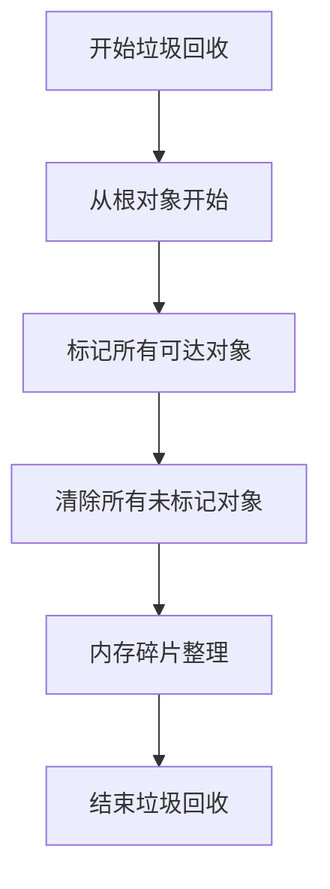

# JavaScript 垃圾回收

在JavaScript编程中，合理的内存管理对于创建高性能的应用至关重要。与一些低级语言不同，JavaScript会自动进行内存分配和释放，这个过程称为"垃圾回收"。理解垃圾回收的工作原理能帮助我们写出更高效、更稳定的代码。

## 什么是垃圾回收？

垃圾回收(Garbage Collection，简称GC)是JavaScript引擎自动执行的一个过程，用于识别不再需要的内存空间并将其释放，以便重新使用。

:::note
JavaScript程序员不需要像C/C++那样手动分配和释放内存，但理解垃圾回收机制有助于避免内存泄漏问题。
:::

## JavaScript 中的内存分配

当我们创建变量、对象或函数时，JavaScript会自动分配内存：

```javascript
// 为基本类型分配内存
let number = 123; // 为数字分配内存
let string = "Hello"; // 为字符串分配内存

// 为对象分配内存
let obj = { name: "John", age: 30 }; // 为对象及其属性分配内存

// 为函数分配内存
function greet() {
  console.log("Hello!");
}
```

## 垃圾回收的工作原理

JavaScript主要使用两种垃圾回收算法：

### 1. 引用计数(Reference Counting)

这是最简单的垃圾回收算法。其基本原理是：跟踪每个对象被引用的次数，当引用计数为0时，这个对象就会被回收。

```javascript
let obj = { name: "JavaScript" }; // 创建对象，引用计数为1
let anotherRef = obj; // 又一个引用，计数为2
obj = null; // 移除一个引用，计数变为1
anotherRef = null; // 移除最后一个引用，计数变为0，对象可以被回收
```

然而，引用计数有一个重大问题：它无法处理循环引用。

```javascript
function createCycle() {
  let obj1 = {};
  let obj2 = {};
  
  obj1.ref = obj2; // obj1引用obj2
  obj2.ref = obj1; // obj2引用obj1
  
  return "Cycle created";
}

createCycle(); // 创建了循环引用，但函数执行完毕后，这些对象仍然互相引用
               // 在纯粹的引用计数算法中，这会导致内存泄漏
```

### 2. 标记-清除(Mark-and-Sweep)

现代JavaScript引擎使用的主要算法是标记-清除算法。其工作原理是：

1. 垃圾回收器从"根"开始（在浏览器中通常是全局window对象）
2. 标记所有从根可以访问到的对象
3. 清除所有未被标记的对象



这种方法可以有效解决循环引用的问题。

## 常见的内存泄漏场景及解决方案

尽管JavaScript有自动垃圾回收，但仍然可能出现内存泄漏问题。以下是一些常见场景：

### 1. 全局变量

```javascript
function leakMemory() {
  leakedVariable = "I am leaked"; // 没有使用var/let/const声明，成为全局变量
}

// 解决方案：使用严格模式和正确的变量声明
function noLeak() {
  'use strict';
  let safeVariable = "I am safe"; // 使用let或const声明局部变量
}
```

### 2. 闭包引起的内存泄漏

```javascript
function createLargeClosure() {
  const largeData = new Array(1000000).fill("X"); // 一个很大的数组
  
  return function() {
    // 这个内部函数引用了largeData，导致largeData不能被回收
    console.log(largeData[0]);
  };
}

const closure = createLargeClosure(); // largeData将一直存在于内存中
```

解决方案：

```javascript
function betterFunction() {
  const largeData = new Array(1000000).fill("X");
  
  const result = largeData[0]; // 只保留需要的数据
  
  return function() {
    console.log(result); // 仅引用必要的数据
  };
}
```

### 3. 事件监听器未移除

```javascript
function addHandler() {
  const button = document.getElementById("myButton");
  button.addEventListener("click", function() {
    // 事件处理逻辑
    console.log("Button clicked");
  });
}

// 如果重复调用addHandler而不移除旧的监听器，会导致内存泄漏
```

解决方案：

```javascript
function addHandlerSafely() {
  const button = document.getElementById("myButton");
  const handler = function() {
    console.log("Button clicked");
  };
  
  button.addEventListener("click", handler);
  
  // 当不需要时移除监听器
  return function removeHandler() {
    button.removeEventListener("click", handler);
  };
}

// 使用方式
const cleanup = addHandlerSafely();
// 当不需要监听器时
cleanup();
```

### 4. DOM引用

```javascript
let elements = {
  button: document.getElementById("button"),
  div: document.getElementById("div"),
  span: document.getElementById("span")
};

function removeButton() {
  document.body.removeChild(document.getElementById("button"));
  // 虽然DOM中移除了button，但elements.button仍然引用它，导致它不能被垃圾回收
}
```

解决方案：

```javascript
function removeButtonSafely() {
  document.body.removeChild(document.getElementById("button"));
  elements.button = null; // 移除引用，允许垃圾回收器回收节点
}
```

## 如何监控内存使用

在现代浏览器中，可以使用开发者工具来监控内存使用情况：

1. Chrome DevTools的Performance和Memory面板
2. Firefox的Memory工具

简单的内存使用监控代码：

```javascript
function checkMemoryUsage() {
  if (window.performance && window.performance.memory) {
    console.log("总堆内存大小:", window.performance.memory.totalJSHeapSize / 1048576, "MB");
    console.log("已用堆内存大小:", window.performance.memory.usedJSHeapSize / 1048576, "MB");
    console.log("堆内存大小限制:", window.performance.memory.jsHeapSizeLimit / 1048576, "MB");
  } else {
    console.log("当前浏览器不支持内存监控API");
  }
}

// 定期检查内存使用
setInterval(checkMemoryUsage, 5000);
```

:::caution
`window.performance.memory` 是一个非标准的Chrome特定API，不适用于所有浏览器。
:::

## 优化技巧

1. **及时释放引用**：设置不再需要的对象为`null`

```javascript
let data = fetchLargeData(); // 获取大量数据
processData(data); // 处理数据
data = null; // 不再需要时释放引用
```

2. **避免创建过多的对象**：重用对象而非频繁创建新对象

```javascript
// 不推荐 - 在循环中创建新对象
function badFunction() {
  let result = [];
  for (let i = 0; i < 1000; i++) {
    result.push({
      id: i,
      value: `item ${i}`
    });
  }
  return result;
}

// 推荐 - 使用对象池
function betterFunction() {
  const objectPool = [];
  for (let i = 0; i < 20; i++) {
    objectPool.push({});
  }
  
  function getObject() {
    return objectPool.pop() || {};
  }
  
  function releaseObject(obj) {
    // 重置对象
    for (let key in obj) {
      if (obj.hasOwnProperty(key)) {
        delete obj[key];
      }
    }
    objectPool.push(obj);
  }
  
  // 使用对象池
  let result = [];
  for (let i = 0; i < 1000; i++) {
    const obj = getObject();
    obj.id = i;
    obj.value = `item ${i}`;
    result.push(obj);
    // 在实际场景中，处理完后应该释放对象
    // releaseObject(obj);
  }
  return result;
}
```

3. **使用WeakMap和WeakSet**：这些集合对其键的引用是"弱引用"，不会阻止垃圾回收

```javascript
// 使用Map可能导致内存泄漏
const cache = new Map();

function processUser(user) {
  if (!cache.has(user)) {
    cache.set(user, calculateExpensiveData(user));
  }
  return cache.get(user);
}
// 即使user对象不再被其他地方引用，因为cache中存在引用，它也不会被回收

// 使用WeakMap避免内存泄漏
const weakCache = new WeakMap();

function processBetterUser(user) {
  if (!weakCache.has(user)) {
    weakCache.set(user, calculateExpensiveData(user));
  }
  return weakCache.get(user);
}
// 如果user对象不再被其他地方引用，它可以被垃圾回收，同时从weakCache中移除
```

## 实际案例：单页应用中的内存管理

在现代单页应用(SPA)中，用户可能会长时间不刷新页面，这使得内存管理更加重要。以下是一个实际案例：

```javascript
class DataGrid {
  constructor(containerId) {
    this.container = document.getElementById(containerId);
    this.data = [];
    this.eventHandlers = [];
    this.render = this.render.bind(this);
    
    // 添加滚动事件监听器
    window.addEventListener("scroll", this.onScroll.bind(this));
  }
  
  loadData(newData) {
    // 追加新数据
    this.data = this.data.concat(newData);
    this.render();
  }
  
  render() {
    // 清空容器
    this.container.innerHTML = "";
    
    // 为每条数据创建DOM元素并添加事件处理器
    this.data.forEach((item, index) => {
      const row = document.createElement("div");
      row.className = "data-row";
      row.innerHTML = `<span>${item.id}</span><span>${item.name}</span>`;
      
      const handler = () => this.selectRow(index);
      row.addEventListener("click", handler);
      this.eventHandlers.push({ element: row, handler, type: "click" });
      
      this.container.appendChild(row);
    });
  }
  
  onScroll() {
    // 滚动事件处理
    console.log("Scrolling");
  }
  
  selectRow(index) {
    console.log(`Selected row: ${index}`);
  }
  
  destroy() {
    // 清理方法，防止内存泄漏
    
    // 1. 移除事件监听器
    this.eventHandlers.forEach(({ element, handler, type }) => {
      element.removeEventListener(type, handler);
    });
    this.eventHandlers = [];
    
    // 2. 移除全局事件监听
    window.removeEventListener("scroll", this.onScroll);
    
    // 3. 清空数据
    this.data = null;
    
    // 4. 移除DOM引用
    this.container = null;
  }
}

// 使用示例
const grid = new DataGrid("dataGridContainer");
grid.loadData([/* 初始数据 */]);

// 当组件不再需要时
function removeGrid() {
  grid.destroy(); // 清理资源
  grid = null; // 允许对象被垃圾回收
}
```

在这个案例中，我们创建了一个数据网格类，它在DOM中显示数据并处理事件。当不再需要时，`destroy`方法确保移除所有事件监听器并清除引用，避免内存泄漏。

## 总结

JavaScript的垃圾回收机制虽然自动管理内存，但开发者仍需了解其工作原理以避免内存泄漏问题。关键点包括：

1. JavaScript主要使用标记-清除算法进行垃圾回收
2. 常见的内存泄漏场景包括全局变量、闭包、未移除的事件监听器和悬空的DOM引用
3. 使用现代工具如Chrome DevTools可以监控和分析内存使用
4. 通过正确的编程实践，如及时释放引用、使用WeakMap/WeakSet和创建清理方法等，可以优化内存使用

良好的内存管理实践不仅可以提高应用性能，还能减少崩溃和异常行为，提升用户体验。

## 练习与拓展阅读

### 练习

1. 找出并修复以下代码中的内存泄漏问题：

```javascript
function createButtons() {
  const data = new Array(10000).fill("Large data");
  
  for (let i = 0; i < 10; i++) {
    const button = document.createElement("button");
    button.innerHTML = `Button ${i}`;
    
    button.addEventListener("click", function() {
      console.log(data[i]);
    });
    
    document.body.appendChild(button);
  }
}
```

2. 实现一个缓存系统，使用WeakMap避免内存泄漏。

### 拓展阅读

1. [MDN Web文档：内存管理](https://developer.mozilla.org/zh-CN/docs/Web/JavaScript/Memory_Management)
2. [深入理解V8垃圾回收机制](https://v8.dev/blog/trash-talk)
3. [Chrome开发者工具中的内存分析](https://developers.google.com/web/tools/chrome-devtools/memory-problems)

通过更深入地了解JavaScript的垃圾回收机制，你将能够开发出更高效、更稳定的Web应用程序。