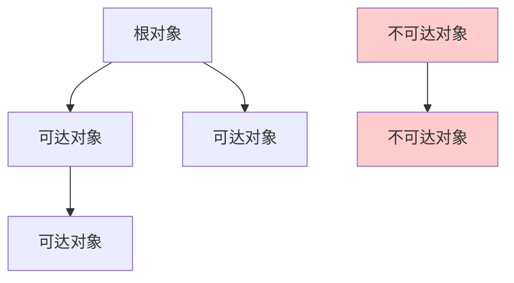

# JavaScript 内存泄漏

## 什么是内存泄漏？

内存泄漏是指程序分配的内存由于某些原因未被释放或无法释放，造成系统内存的浪费，导致程序运行速度变慢，甚至崩溃的现象。在JavaScript中，虽然有垃圾回收机制（Garbage Collection）自动管理内存，但开发者仍然可能写出导致内存泄漏的代码。

:::caution 注意
JavaScript内存泄漏可能不会立即表现出来，但在长时间运行的应用（如单页应用）中会逐渐积累，最终影响用户体验。
:::

## JavaScript 中的垃圾回收机制

在深入内存泄漏之前，让我们先了解JavaScript的垃圾回收机制：

1. **标记-清除算法**：这是现代浏览器采用的主要算法
   - 垃圾回收器定期从"根"开始（如全局对象）
   - 标记所有从根可访问的对象
   - 清除所有未被标记的对象

2. **引用计数**：一些老旧的实现使用此方法
   - 跟踪每个值被引用的次数
   - 当引用计数为0时，回收该值的内存



## 常见的内存泄漏类型

### 1. 意外的全局变量

```javascript
function createGlobalLeak() {
    leakyVariable = "我会泄漏内存"; // 没有声明，成为全局变量
}

createGlobalLeak();
console.log(window.leakyVariable); // "我会泄漏内存"
```

**解决方法**：总是使用 `let`、`const` 或 `var` 声明变量，并在严格模式下开发。

```javascript
'use strict';
function noLeak() {
    leakyVariable = "我会抛出错误"; // ReferenceError
}
```

### 2. 被遗忘的定时器和回调函数

```javascript
function setupTimer() {
    const largeData = new Array(100000).fill('x');
    
    setInterval(() => {
        // 引用了largeData
        console.log(largeData.length);
    }, 1000);
}

setupTimer(); // 定时器持续运行，largeData永远不会被回收
```

**解决方法**：记得在适当的时候清除定时器。

```javascript
function properTimerSetup() {
    const largeData = new Array(100000).fill('x');
    
    const timerId = setInterval(() => {
        console.log(largeData.length);
    }, 1000);
    
    // 适当时候清除定时器
    setTimeout(() => {
        clearInterval(timerId);
        console.log("定时器已清除");
    }, 5000);
}
```

### 3. 闭包引起的内存泄漏

闭包是JavaScript的强大特性，但不当使用可能导致内存泄漏：

```javascript
function createLeak() {
    const largeData = new Array(100000).fill('x');
    
    return function() {
        console.log(largeData[0]); // 持有对largeData的引用
    }
}

const leakyFunction = createLeak(); // largeData会被一直保存在内存中
```

**解决方法**：使用完闭包后，将其设为null。

```javascript
let potentiallyLeakyFunction = createLeak();
potentiallyLeakyFunction(); // 使用函数

potentiallyLeakyFunction = null; // 允许垃圾回收
```

### 4. DOM引用

在JavaScript中引用DOM元素是很常见的，但如果不当处理可能导致内存泄漏：

```javascript
function setupHandler() {
    const element = document.getElementById("button");
    const processData = {
        largeData: new Array(100000).fill('x'),
        handleClick: function() {
            // 使用largeData处理点击
        }
    };
    
    element.addEventListener("click", processData.handleClick);
    
    // 即使element被移除，processData仍被事件处理器引用
}
```

**解决方法**：移除不再需要的事件监听器。

```javascript
function properDomHandling() {
    const element = document.getElementById("button");
    const processData = {
        largeData: new Array(100000).fill('x'),
        handleClick: function() {
            // 处理点击
        }
    };
    
    element.addEventListener("click", processData.handleClick);
    
    // 当不再需要时
    element.removeEventListener("click", processData.handleClick);
}
```

### 5. 控制台日志

在开发中，我们经常使用`console.log`调试，但在生产环境保留这些可能导致内存问题：

```javascript
function processLargeData(data) {
    console.log("处理数据:", data); // 浏览器可能保留data的引用
    // 处理数据...
}

// 使用大数据集
processLargeData(new Array(1000000));
```

**解决方法**：在生产环境中移除或禁用控制台日志。

## 如何检测内存泄漏

### 1. Chrome开发者工具

Chrome浏览器提供了强大的内存分析工具：

1. 打开Chrome开发者工具（F12）
2. 切换到"Memory"标签
3. 捕获堆快照（Heap Snapshot）
4. 分析内存使用情况

### 2. 性能监控

```javascript
// 简单的内存使用监控
function checkMemoryUsage() {
    if (window.performance && window.performance.memory) {
        console.log("已用堆大小:", 
            Math.round(window.performance.memory.usedJSHeapSize / (1024 * 1024)) + "MB");
        console.log("总堆大小:", 
            Math.round(window.performance.memory.totalJSHeapSize / (1024 * 1024)) + "MB");
    }
}

// 定期检查内存使用
setInterval(checkMemoryUsage, 10000);
```

## 实际案例：单页应用中的内存泄漏

考虑一个简单的单页应用，用户可以在不同"页面"间切换：

```javascript
class PageManager {
    constructor() {
        this.currentPage = null;
        this.data = {};
    }
    
    loadPage(pageName) {
        // 清理旧页面
        if (this.currentPage) {
            this.currentPage.unload(); // 重要：清理当前页面
        }
        
        // 加载新页面
        this.currentPage = new Page(pageName);
        this.currentPage.load();
    }
}

class Page {
    constructor(name) {
        this.name = name;
        this.elements = [];
        this.timers = [];
        this.eventHandlers = [];
    }
    
    load() {
        // 创建DOM元素
        const container = document.createElement('div');
        document.body.appendChild(container);
        this.elements.push(container);
        
        // 设置定时器
        const timerId = setInterval(() => {
            console.log(`页面 ${this.name} 更新`);
        }, 1000);
        this.timers.push(timerId);
        
        // 添加事件处理器
        const handler = () => console.log(`页面 ${this.name} 点击`);
        document.addEventListener('click', handler);
        this.eventHandlers.push({ event: 'click', handler });
    }
    
    unload() {
        // 移除DOM元素
        this.elements.forEach(el => {
            if (el.parentNode) el.parentNode.removeChild(el);
        });
        
        // 清除定时器
        this.timers.forEach(id => clearInterval(id));
        
        // 移除事件监听器
        this.eventHandlers.forEach(({ event, handler }) => {
            document.removeEventListener(event, handler);
        });
        
        // 清空引用
        this.elements = [];
        this.timers = [];
        this.eventHandlers = [];
    }
}
```

在这个例子中，如果没有`unload`方法，每次页面切换都会留下未清理的定时器和事件处理器，导致严重的内存泄漏。

## 最佳实践总结

1. **使用严格模式**：避免意外的全局变量
2. **注意闭包**：确保不要无意中保留大对象的引用
3. **及时清理**：
   - 清除不再需要的定时器（`clearTimeout`和`clearInterval`）
   - 移除不再需要的事件监听器（`removeEventListener`）
   - 在单页应用中实现组件卸载逻辑
4. **弱引用**：考虑使用`WeakMap`和`WeakSet`存储对象引用
5. **监控内存使用**：定期检查应用的内存使用情况
6. **避免过度使用控制台**：生产环境中移除敏感或大型对象的日志
7. **注意全局缓存**：设计缓存时考虑内存限制和过期策略

## 练习题

1. 找出并修复以下代码中的内存泄漏：

```javascript
function createButtons() {
  let data = new Array(10000).fill('data');
  
  for (let i = 0; i < 10; i++) {
    let button = document.createElement('button');
    button.innerText = `Button ${i}`;
    
    button.addEventListener('click', function() {
      console.log('Button clicked', data.length);
    });
    
    document.body.appendChild(button);
  }
}
```

2. 设计一个简单的缓存系统，避免内存泄漏问题。

## 附加资源

- MDN Web文档: [内存管理](https://developer.mozilla.org/zh-CN/docs/Web/JavaScript/Memory_Management)
- Chrome开发者工具: [内存问题](https://developer.chrome.com/docs/devtools/memory-problems/)
- 学习更多关于WeakMap和WeakSet的使用
- 探索性能监控工具和库

通过理解并避免内存泄漏，你可以创建更高效、更稳定的JavaScript应用程序。记住，最好的方法是在开发过程中就建立良好的习惯，而不是在出现问题后再去修复。
