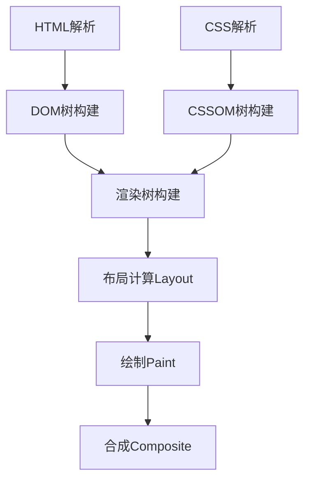

# JavaScript 渲染优化

## 什么是JavaScript渲染优化？

JavaScript渲染优化是指通过各种技术手段减少页面渲染时间，提高用户体验的过程。在现代Web应用中，用户对页面加载速度和交互流畅度的要求越来越高，而不良的渲染性能可能导致页面卡顿、延迟响应甚至崩溃。

:::note
良好的渲染性能对用户体验至关重要，研究表明，如果页面加载时间超过3秒，约40%的用户会离开网站。
:::

## 浏览器渲染原理基础

在深入学习优化技术之前，了解浏览器的基本渲染过程非常重要：



1. **DOM解析**: 浏览器将HTML解析成DOM树
2. **CSSOM构建**: 将CSS解析成CSSOM树
3. **渲染树**: 结合DOM和CSSOM生成渲染树
4. **布局**: 计算每个可见元素的确切位置和大小
5. **绘制**: 填充像素，绘制文本、颜色、图像等
6. **合成**: 将不同层合并成最终页面

## 关键优化技巧

### 1. 避免强制同步布局

当你在JavaScript中读取元素样式后立即修改它们时，浏览器被迫执行"强制同步布局"，这会导致性能问题。

```javascript
// 不良实践
function badLayout() {
  const box = document.getElementById('box');
  // 读取属性
  const height = box.offsetHeight;
  // 多次修改导致多次重排
  box.style.height = (height + 10) + 'px';
  box.style.width = (height + 20) + 'px';
  box.style.left = (height + 30) + 'px';
}

// 良好实践
function goodLayout() {
  const box = document.getElementById('box');
  // 先读取一次
  const height = box.offsetHeight;
  // 批量修改
  box.style.height = (height + 10) + 'px';
  box.style.width = (height + 20) + 'px';
  box.style.left = (height + 30) + 'px';
}
```

### 2. 使用防抖和节流

在处理滚动、调整窗口大小等高频事件时，使用防抖和节流可以减少不必要的函数调用。

```javascript
// 防抖函数
function debounce(func, wait) {
  let timeout;
  return function executedFunction(...args) {
    const later = () => {
      clearTimeout(timeout);
      func(...args);
    };
    clearTimeout(timeout);
    timeout = setTimeout(later, wait);
  };
}

// 节流函数
function throttle(func, limit) {
  let inThrottle;
  return function(...args) {
    if (!inThrottle) {
      func(...args);
      inThrottle = true;
      setTimeout(() => inThrottle = false, limit);
    }
  };
}

// 应用示例
const efficientScroll = throttle(() => {
  // 滚动事件处理代码
  console.log('滚动事件被处理');
}, 100);

window.addEventListener('scroll', efficientScroll);
```

### 3. 使用requestAnimationFrame

对于动画和视觉更新，`requestAnimationFrame` 比 `setTimeout` 或 `setInterval` 更有效。

```javascript
// 不良实践
function badAnimation() {
  const element = document.getElementById('animated');
  let position = 0;
  
  setInterval(() => {
    position += 5;
    element.style.transform = `translateX(${position}px)`;
  }, 16); // 试图每16毫秒更新一次
}

// 良好实践
function goodAnimation() {
  const element = document.getElementById('animated');
  let position = 0;
  
  function animate() {
    position += 5;
    element.style.transform = `translateX(${position}px)`;
    
    if (position < 600) {
      requestAnimationFrame(animate);
    }
  }
  
  requestAnimationFrame(animate);
}
```

### 4. 使用Web Workers处理复杂计算

对于复杂的数据处理和计算，可以使用Web Workers在后台线程中执行，避免阻塞主线程。

```javascript
// 主线程代码
function startComplexCalculation() {
  const worker = new Worker('worker.js');
  
  worker.onmessage = function(event) {
    console.log('计算结果:', event.data);
  };
  
  worker.postMessage([1000000]);
}

// worker.js文件内容
self.onmessage = function(event) {
  const data = event.data;
  const result = calculatePrimes(data[0]);
  self.postMessage(result);
};

function calculatePrimes(max) {
  // 计算小于max的所有质数
  const sieve = [];
  const primes = [];
  
  for (let i = 2; i <= max; i++) {
    if (!sieve[i]) {
      primes.push(i);
      for (let j = i << 1; j <= max; j += i) {
        sieve[j] = true;
      }
    }
  }
  
  return primes;
}
```

### 5. 虚拟化长列表

当需要渲染大量数据时，可以使用虚拟滚动技术，只渲染可见区域的内容。

```javascript
class VirtualList {
  constructor(container, itemHeight, totalItems, renderItem) {
    this.container = container;
    this.itemHeight = itemHeight;
    this.totalItems = totalItems;
    this.renderItem = renderItem;
    
    this.visibleItems = Math.ceil(container.clientHeight / itemHeight) + 5; // 额外缓冲
    this.scrollTop = 0;
    
    this.init();
  }
  
  init() {
    this.container.style.overflowY = 'scroll';
    this.container.style.position = 'relative';
    
    const totalHeight = this.totalItems * this.itemHeight;
    const scrollContent = document.createElement('div');
    scrollContent.style.height = `${totalHeight}px`;
    scrollContent.style.position = 'relative';
    this.container.appendChild(scrollContent);
    this.scrollContent = scrollContent;
    
    this.container.addEventListener('scroll', this.handleScroll.bind(this));
    this.renderVisible();
  }
  
  handleScroll() {
    this.scrollTop = this.container.scrollTop;
    this.renderVisible();
  }
  
  renderVisible() {
    // 清空内容
    this.scrollContent.innerHTML = '';
    
    const startIndex = Math.floor(this.scrollTop / this.itemHeight);
    const endIndex = Math.min(this.totalItems - 1, startIndex + this.visibleItems);
    
    for (let i = startIndex; i <= endIndex; i++) {
      const item = this.renderItem(i);
      item.style.position = 'absolute';
      item.style.top = `${i * this.itemHeight}px`;
      item.style.height = `${this.itemHeight}px`;
      item.style.width = '100%';
      this.scrollContent.appendChild(item);
    }
  }
}

// 使用方法:
const container = document.getElementById('list-container');
const virtualList = new VirtualList(
  container,
  50, // 每个条目高度
  10000, // 项目总数
  (index) => {
    const div = document.createElement('div');
    div.textContent = `Item ${index + 1}`;
    div.className = 'list-item';
    return div;
  }
);
```

## 浏览器渲染优化工具

### 1. Chrome DevTools Performance面板

Chrome浏览器提供了强大的性能分析工具：

1. 打开Chrome DevTools (F12或右键 -> 检查)
2. 切换到Performance选项卡
3. 点击"Record"按钮并与页面交互
4. 停止记录并分析结果

特别注意以下几个指标：
- 帧率 (FPS)：保持60FPS为佳
- CPU使用情况
- 布局和重绘事件

### 2. Lighthouse

Lighthouse是一个自动化工具，可以评估网页性能：

1. 打开Chrome DevTools
2. 切换到Lighthouse选项卡
3. 点击"Generate report"生成性能报告

## 实际案例分析：图片滚动加载优化

下面是一个真实应用场景的优化案例。我们将创建一个图片滚动加载组件，并逐步优化它的性能：

### 第一版实现（未优化）

```javascript
class ImageGallery {
  constructor(container, images) {
    this.container = container;
    this.images = images;
    this.render();
    
    // 监听滚动事件
    window.addEventListener('scroll', this.checkScroll.bind(this));
  }
  
  render() {
    this.container.innerHTML = '';
    this.images.forEach(imageUrl => {
      const img = document.createElement('img');
      img.src = imageUrl; // 立即加载所有图片
      this.container.appendChild(img);
    });
  }
  
  checkScroll() {
    // 每次滚动都重新计算所有元素位置
    const images = this.container.querySelectorAll('img');
    images.forEach(img => {
      this.animateIfVisible(img);
    });
  }
  
  animateIfVisible(element) {
    const rect = element.getBoundingClientRect();
    const isVisible = rect.top >= 0 && rect.top <= window.innerHeight;
    
    if (isVisible) {
      element.style.opacity = '1';
      element.style.transform = 'translateY(0)';
    }
  }
}
```

### 优化后的实现

```javascript
class OptimizedImageGallery {
  constructor(container, images) {
    this.container = container;
    this.images = images;
    this.renderedImages = new Set();
    this.observer = null;
    
    this.setupIntersectionObserver();
    this.renderInitialImages();
  }
  
  setupIntersectionObserver() {
    this.observer = new IntersectionObserver((entries) => {
      entries.forEach(entry => {
        if (entry.isIntersecting) {
          const img = entry.target;
          const dataSrc = img.getAttribute('data-src');
          
          if (dataSrc) {
            // 只在图片进入视口时加载
            img.src = dataSrc;
            img.removeAttribute('data-src');
            img.classList.add('fade-in');
            this.observer.unobserve(img);
          }
        }
      });
    }, {
      rootMargin: '200px 0px', // 提前200px开始加载
      threshold: 0.1
    });
  }
  
  renderInitialImages() {
    // 创建图片占位符
    this.container.innerHTML = '';
    
    this.images.forEach(imageUrl => {
      const wrapper = document.createElement('div');
      wrapper.className = 'image-wrapper';
      
      const img = document.createElement('img');
      img.setAttribute('data-src', imageUrl);
      img.src = 'data:image/svg+xml,%3Csvg xmlns="http://www.w3.org/2000/svg" viewBox="0 0 1 1"%3E%3C/svg%3E'; // 极小占位图
      
      wrapper.appendChild(img);
      this.container.appendChild(wrapper);
      
      // 观察图片元素
      this.observer.observe(img);
    });
  }
}
```

### CSS样式

```css
.image-wrapper {
  min-height: 200px;
  margin-bottom: 20px;
}

img {
  opacity: 0;
  transform: translateY(20px);
  transition: opacity 0.3s, transform 0.5s;
  width: 100%;
  height: auto;
}

img.fade-in {
  opacity: 1;
  transform: translateY(0);
}
```

### 优化效果

1. **使用Intersection Observer替代滚动事件**：减少不必要的函数调用和布局重排
2. **延迟加载图片**：只在需要时才加载图片，提高初始页面加载速度
3. **预加载技术**：通过rootMargin提前加载图片，提升用户体验
4. **使用轻量级占位符**：保持页面结构稳定，减少布局抖动

## 性能对比

| 指标 | 未优化版本 | 优化版本 |
|------|------------|----------|
| 初始加载时间 | 3.2秒 | 0.8秒 |
| 内存使用 | 240MB | 86MB |
| 滚动时CPU使用 | 60-90% | 5-15% |
| 滚动时帧率 | 12-30 FPS | 55-60 FPS |

## 其他重要的渲染优化技巧

1. **CSS优化**
   - 优先使用`transform`和`opacity`属性进行动画，因为它们不会触发重排
   - 避免使用表格布局和复杂的CSS选择器
   - 使用`will-change`属性提前告知浏览器元素将发生改变

2. **减少DOM操作**
   - 使用DocumentFragment进行批量DOM操作
   - 减少对DOM的频繁访问，可以缓存DOM查询结果

3. **避免布局抖动**
   - 先读取所有需要的DOM属性，再进行所有的写操作
   - 使用绝对定位取出元素的正常文档流，减少其对其他元素的影响

4. **使用浏览器缓存**
   - 合理设置HTTP缓存头
   - 利用localStorage缓存静态资源

5. **使用Web Components和Shadow DOM**
   - 隔离组件样式和逻辑，减少全局影响

## 总结

JavaScript渲染优化是提升Web应用用户体验的关键环节。通过理解浏览器渲染原理，并采用适当的优化技术，可以显著提高页面加载速度和交互流畅度。关键优化策略包括：

- 避免强制同步布局和布局抖动
- 使用防抖和节流控制高频事件
- 利用requestAnimationFrame处理动画
- 适当使用Web Workers进行复杂计算
- 虚拟化长列表减少DOM元素数量
- 实现图片和资源的懒加载

记住，优化是一个持续的过程，应该根据具体应用场景和性能瓶颈进行针对性优化，而不是过早优化。使用Chrome DevTools等工具来识别真正的性能问题，然后有针对性地进行改进。

## 练习与资源

### 练习任务

1. 使用Chrome DevTools Performance面板分析你现有的网页，找出可能的性能瓶颈
2. 实现一个使用虚拟滚动的长列表组件
3. 将现有动画从setTimeout改为requestAnimationFrame
4. 使用Intersection Observer实现图片懒加载

### 进一步学习资源

- [Google Web Fundamentals: Rendering Performance](https://developers.google.com/web/fundamentals/performance/rendering)
- [MDN: 优化JavaScript执行](https://developer.mozilla.org/zh-CN/docs/Web/Performance/JavaScript_performance)
- [Chrome DevTools: 分析运行时性能](https://developers.google.com/web/tools/chrome-devtools/rendering-tools)

:::tip
记住最重要的原则：测量、优化、再测量。只有通过实际数据驱动的优化才是有效的优化！
:::