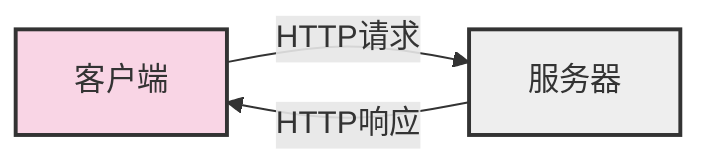

# JavaScript 网络优化

在当今互联网时代，用户对网页加载速度的要求越来越高。研究表明，如果一个网页加载时间超过3秒，约40%的用户会选择离开。因此，优化JavaScript应用的网络性能变得尤为重要。本文将介绍JavaScript网络优化的基本概念、常用技术和最佳实践。

## 为什么网络优化很重要？

网络优化对用户体验和网站性能有着直接影响：

1. **提高用户留存率** - 加载速度快的网站能留住更多用户
2. **提升转化率** - 研究表明，页面加载时间每减少0.1秒，转化率可能增加8%
3. **改善SEO排名** - 搜索引擎更青睐加载速度快的网站
4. **节省带宽** - 对用户和服务器都更加友好
5. **提升用户体验** - 特别是在移动设备和网络条件不佳的情况下

## 网络请求基础

在深入优化技术之前，让我们先了解JavaScript中的网络请求基础：



### 常见的网络请求方法

JavaScript中常用的网络请求方法包括：

1. **XMLHttpRequest (XHR)** - 传统方法
2. **Fetch API** - 现代化的网络请求API
3. **axios** - 流行的第三方HTTP客户端库
4. **jQuery.ajax()** - jQuery提供的Ajax方法

## 网络优化技术

### 1. 减少请求数量

减少HTTP请求是提高页面加载速度的最有效方法之一。

:::tip 减少请求的方法
- 合并多个CSS文件
- 合并多个JavaScript文件
- 使用CSS Sprites合并图片
- 使用数据URI嵌入小图片
:::

**示例：使用JavaScript动态加载非关键资源**

```javascript
// 页面初始加载完成后再加载非关键JavaScript
window.addEventListener('load', function() {
  const script = document.createElement('script');
  script.src = '/path/to/non-critical.js';
  document.body.appendChild(script);
});
```

### 2. 实现资源延迟加载

延迟加载(lazy loading)是一种推迟加载非立即需要的资源的技术。

**图片延迟加载示例：**

```javascript
document.addEventListener("DOMContentLoaded", function() {
  const lazyImages = document.querySelectorAll('img.lazy');
  
  if ('IntersectionObserver' in window) {
    const imageObserver = new IntersectionObserver(function(entries, observer) {
      entries.forEach(function(entry) {
        if (entry.isIntersecting) {
          const lazyImage = entry.target;
          lazyImage.src = lazyImage.dataset.src;
          lazyImage.classList.remove("lazy");
          imageObserver.unobserve(lazyImage);
        }
      });
    });

    lazyImages.forEach(function(lazyImage) {
      imageObserver.observe(lazyImage);
    });
  }
});
```

```html

```

### 3. 使用HTTP缓存

合理设置HTTP缓存头可以大幅减少重复资源的下载。

**主要的缓存头：**

- `Cache-Control` - 控制浏览器和中间缓存如何缓存资源
- `ETag` - 资源的唯一标识符，用于验证缓存
- `Last-Modified` - 资源最后修改时间

**在服务端设置缓存头示例(Node.js)：**

```javascript
app.get('/static/script.js', (req, res) => {
  // 设置缓存一周
  res.set('Cache-Control', 'public, max-age=604800');
  res.sendFile(path.join(__dirname, 'static/script.js'));
});
```

### 4. 利用Service Worker缓存

Service Worker可以拦截网络请求并从缓存中提供资源，即使在离线状态下也能工作。

**注册Service Worker:**

```javascript
if ('serviceWorker' in navigator) {
  window.addEventListener('load', function() {
    navigator.serviceWorker.register('/service-worker.js').then(function(registration) {
      console.log('ServiceWorker 注册成功: ', registration.scope);
    }).catch(function(err) {
      console.log('ServiceWorker 注册失败: ', err);
    });
  });
}
```

**Service Worker基础缓存示例:**

```javascript
// service-worker.js
const CACHE_NAME = 'v1-cache';
const urlsToCache = [
  '/',
  '/styles/main.css',
  '/scripts/main.js'
];

self.addEventListener('install', event => {
  event.waitUntil(
    caches.open(CACHE_NAME)
      .then(cache => {
        return cache.addAll(urlsToCache);
      })
  );
});

self.addEventListener('fetch', event => {
  event.respondWith(
    caches.match(event.request)
      .then(response => {
        // 如果缓存中找到了，就返回缓存的响应
        if (response) {
          return response;
        }
        
        // 否则发起网络请求
        return fetch(event.request).then(response => {
          // 检查是否得到了有效的响应
          if(!response || response.status !== 200 || response.type !== 'basic') {
            return response;
          }
          
          // 复制响应，因为响应是流，只能使用一次
          const responseToCache = response.clone();
          
          caches.open(CACHE_NAME)
            .then(cache => {
              cache.put(event.request, responseToCache);
            });
            
          return response;
        });
      })
  );
});
```

### 5. 压缩资源

减小传输文件大小是提升加载速度的关键。

- **使用Gzip或Brotli压缩** - 服务器端配置
- **压缩JavaScript和CSS文件** - 使用webpack、uglify等工具
- **优化图片** - 选择合适的格式和压缩率

### 6. 使用内容分发网络(CDN)

CDN可以将资源分布在全球各地的服务器上，用户从最近的节点获取资源，大大减少延迟。

```html
<!-- 使用CDN加载常用库 -->
<script src="https://cdn.jsdelivr.net/npm/vue@2.6.14/dist/vue.min.js"></script>
```

### 7. 优化Ajax请求

合理使用Ajax请求可以显著提高应用响应速度。

**使用Fetch API示例:**

```javascript
// 发送GET请求
fetch('/api/data')
  .then(response => {
    if (!response.ok) {
      throw new Error('网络响应不正常');
    }
    return response.json();
  })
  .then(data => {
    console.log('成功获取数据:', data);
  })
  .catch(error => {
    console.error('获取数据失败:', error);
  });

// 发送POST请求
fetch('/api/save', {
  method: 'POST',
  headers: {
    'Content-Type': 'application/json'
  },
  body: JSON.stringify({ name: 'John', age: 30 })
})
.then(response => response.json())
.then(data => console.log('保存成功:', data))
.catch(error => console.error('保存失败:', error));
```

**使用AbortController取消不必要的请求:**

```javascript
const controller = new AbortController();
const signal = controller.signal;

fetch('/api/data', { signal })
  .then(response => response.json())
  .then(data => console.log(data))
  .catch(err => {
    if (err.name === 'AbortError') {
      console.log('Fetch已取消!');
    } else {
      console.error('发生其他错误:', err);
    }
  });

// 如果需要，可以取消请求
controller.abort();
```

### 8. 实现请求合并和批处理

减少频繁的小请求，改为批量处理数据。

**示例：使用Promise.all同时处理多个请求**

```javascript
// 同时发起多个请求并等待所有结果
Promise.all([
  fetch('/api/users'),
  fetch('/api/products'),
  fetch('/api/settings')
])
.then(responses => Promise.all(responses.map(res => res.json())))
.then(([users, products, settings]) => {
  console.log('用户数据:', users);
  console.log('产品数据:', products);
  console.log('设置数据:', settings);
  
  // 处理所有数据...
})
.catch(error => console.error('获取数据失败:', error));
```

### 9. 实现防抖和节流

防止过于频繁的API调用，特别是在搜索输入、滚动事件等场景。

**防抖函数示例:**

```javascript
function debounce(func, wait) {
  let timeout;
  
  return function executedFunction(...args) {
    const later = () => {
      clearTimeout(timeout);
      func(...args);
    };
    
    clearTimeout(timeout);
    timeout = setTimeout(later, wait);
  };
}

// 使用防抖优化搜索输入
const searchInput = document.getElementById('search');
const debouncedSearch = debounce(function(e) {
  console.log('发送搜索请求:', e.target.value);
  fetch(`/api/search?q=${e.target.value}`)
    .then(response => response.json())
    .then(results => {
      // 更新搜索结果
      console.log('搜索结果:', results);
    });
}, 500);

searchInput.addEventListener('input', debouncedSearch);
```

**节流函数示例:**

```javascript
function throttle(func, limit) {
  let inThrottle;
  
  return function(...args) {
    if (!inThrottle) {
      func.apply(this, args);
      inThrottle = true;
      setTimeout(() => inThrottle = false, limit);
    }
  };
}

// 使用节流优化滚动事件
const throttledScroll = throttle(function() {
  console.log('滚动处理...');
  // 执行滚动相关操作
}, 300);

window.addEventListener('scroll', throttledScroll);
```

## 实际案例：优化新闻网站的页面加载

以下是一个新闻网站优化前后的对比案例：

### 优化前

- 一次性加载所有新闻内容和图片
- 每篇新闻单独发送API请求
- 没有任何缓存策略
- 图片未经优化
- 总页面加载时间：7.2秒

### 优化后

1. **实现延迟加载**：只加载首屏内容，其余内容在滚动时加载
2. **批量请求**：首次加载合并获取头条新闻和分类列表
3. **图片优化**：使用适当大小和格式的图片，实现图片延迟加载
4. **使用Service Worker**：缓存主要资源和已访问的新闻
5. **数据预取**：基于用户行为预测并预先加载可能会点击的内容

**优化后的加载时间减少到1.8秒，页面交互时间提高了300%。**

**关键代码示例：**

```javascript
// 图片延迟加载
const newsImages = document.querySelectorAll('.news-img[data-src]');
const imageObserver = new IntersectionObserver((entries) => {
  entries.forEach(entry => {
    if (entry.isIntersecting) {
      const img = entry.target;
      img.src = img.dataset.src;
      img.removeAttribute('data-src');
      imageObserver.unobserve(img);
    }
  });
});

newsImages.forEach(img => imageObserver.observe(img));

// 新闻内容延迟加载
const newsBlocks = document.querySelectorAll('.news-block[data-id]');
const contentObserver = new IntersectionObserver((entries) => {
  entries.forEach(entry => {
    if (entry.isIntersecting) {
      const block = entry.target;
      const newsId = block.dataset.id;
      
      if (!block.dataset.loaded) {
        fetch(`/api/news/${newsId}`)
          .then(response => response.json())
          .then(data => {
            block.querySelector('.news-content').innerHTML = data.content;
            block.dataset.loaded = "true";
            contentObserver.unobserve(block);
          });
      }
    }
  });
}, {
  rootMargin: '200px' // 提前200px开始加载
});

newsBlocks.forEach(block => contentObserver.observe(block));
```

## 最佳实践总结

1. **减少请求数量**：合并文件、使用sprite图、内联小资源
2. **减小资源体积**：压缩代码、优化图片、移除未使用的代码
3. **利用浏览器缓存**：设置合理的缓存头
4. **使用CDN**：分散流量，减少延迟
5. **延迟加载**：非关键资源延迟加载
6. **批量处理请求**：合并多个小请求为一个大请求
7. **优化API设计**：只返回必要数据，减少传输大小
8. **实现防抖和节流**：避免过于频繁的网络请求
9. **预加载关键资源**：使用`<link rel="preload">`预加载关键资源
10. **合理使用离线存储**：LocalStorage、IndexedDB、Service Worker

## 性能测量工具

为了验证优化效果，可以使用以下工具：

1. **Chrome DevTools Network面板** - 分析网络请求
2. **Lighthouse** - 全面的性能评估
3. **WebPageTest** - 从不同地理位置测试性能
4. **Performance API** - 在代码中测量性能

**使用Performance API测量网络性能示例：**

```javascript
// 测量资源加载时间
function measureResourceLoading() {
  const resources = performance.getEntriesByType('resource');
  
  resources.forEach(resource => {
    console.log(`${resource.name}: ${resource.duration.toFixed(2)}ms`);
  });
  
  // 找出加载时间最长的5个资源
  const slowestResources = [...resources]
    .sort((a, b) => b.duration - a.duration)
    .slice(0, 5);
    
  console.log('加载最慢的5个资源:');
  slowestResources.forEach((resource, index) => {
    console.log(`${index + 1}. ${resource.name}: ${resource.duration.toFixed(2)}ms`);
  });
}

// 页面加载完成后分析资源加载情况
window.addEventListener('load', measureResourceLoading);
```

## 练习与挑战

1. **优化练习**：分析一个现有网站并确定可以优化的网络请求。
2. **实现挑战**：在一个简单的网页中实现图片延迟加载功能。
3. **高级挑战**：创建一个Service Worker，缓存关键资源并提供离线功能。

## 扩展资源

要深入学习JavaScript网络优化，请查看以下资源：

- MDN Web文档关于[Fetch API](https://developer.mozilla.org/zh-CN/docs/Web/API/Fetch_API)的指南
- Google的[Web基础知识](https://web.dev/)网站上有关性能优化的内容
- [Chrome开发者工具文档](https://developer.chrome.com/docs/devtools/)

---

网络性能优化是前端开发中不可忽视的重要环节。通过本文介绍的技术和最佳实践，你可以显著提高JavaScript应用的加载速度和响应能力，为用户提供更好的体验。记住，优化是一个持续的过程，需要不断测试、分析和改进。

:::tip
如果你发现自己的网站有性能问题，建议先从最基础的优化开始，如减少请求数量和资源大小，这通常能带来最显著的改进。
:::