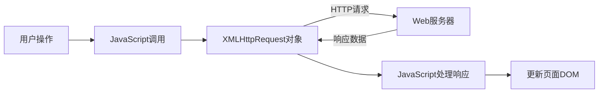

# JavaScript Ajax基础

## Ajax是什么？

AJAX（Asynchronous JavaScript and XML）是一种使用现有标准的技术组合，用于异步交换和处理数据。Ajax允许网页与服务器进行数据交换而无需刷新整个页面，从而创建更快、更动态的Web应用程序。

:::note
尽管名称中包含XML，但现代Ajax应用程序通常使用JSON而非XML作为数据交换格式，因为JSON更轻量且易于处理。
:::

## Ajax的工作原理

Ajax的基本工作流程如下：



## XMLHttpRequest对象

XMLHttpRequest是实现Ajax的核心对象，它提供了在后台与服务器交换数据的能力。

### 创建一个XHR对象

```javascript
// 创建一个新的XMLHttpRequest对象
const xhr = new XMLHttpRequest();
```

### 配置请求

```javascript
// 配置请求
// 参数1: HTTP方法（GET, POST, PUT, DELETE等）
// 参数2: URL
// 参数3: 是否异步处理请求（true表示异步，false表示同步）
xhr.open('GET', 'https://api.example.com/data', true);
```

### 发送请求

```javascript
// 发送请求
// 可以在send()方法中添加要发送的数据
xhr.send();

// 如果是POST请求，可以这样发送数据
// xhr.send('name=John&age=30');
```

### 处理响应

```javascript
// 添加一个事件监听器来处理服务器响应
xhr.onreadystatechange = function() {
  // readyState为4表示请求已完成
  // status为200表示请求成功
  if (xhr.readyState === 4 && xhr.status === 200) {
    // 处理响应数据
    const responseData = xhr.responseText;
    console.log(responseData);
    // 更新页面DOM
    document.getElementById('result').textContent = responseData;
  }
};
```

### XHR的readyState值

XHR对象的`readyState`属性有5个可能的值：

| 值 | 状态 | 描述 |
|---|---|---|
| 0 | UNSENT | XHR对象已被创建，但open()方法尚未被调用 |
| 1 | OPENED | open()方法已被调用 |
| 2 | HEADERS_RECEIVED | send()方法已被调用，响应头已被接收 |
| 3 | LOADING | 响应体部分正在被接收 |
| 4 | DONE | 请求操作已完成 |

## 一个完整的Ajax示例

下面是一个完整的Ajax示例，展示了如何从服务器获取数据并更新页面：

```javascript
// 创建Ajax函数
function loadData() {
  // 创建XHR对象
  const xhr = new XMLHttpRequest();
  
  // 配置请求
  xhr.open('GET', 'https://jsonplaceholder.typicode.com/posts/1', true);
  
  // 监听状态变化
  xhr.onreadystatechange = function() {
    if (xhr.readyState === 4) {
      if (xhr.status === 200) {
        // 请求成功
        const data = JSON.parse(xhr.responseText);
        
        // 更新DOM
        const resultElement = document.getElementById('result');
        resultElement.innerHTML = `
          <h3>${data.title}</h3>
          <p>${data.body}</p>
        `;
      } else {
        // 请求失败
        console.error('请求失败，状态码：', xhr.status);
        document.getElementById('result').textContent = '数据加载失败';
      }
    }
  };
  
  // 发送请求
  xhr.send();
}

// 调用函数
loadData();
```

## 处理不同类型的数据

### 处理JSON数据

```javascript
xhr.onreadystatechange = function() {
  if (xhr.readyState === 4 && xhr.status === 200) {
    // 将JSON字符串转换为JavaScript对象
    const data = JSON.parse(xhr.responseText);
    console.log(data.name); // 访问对象属性
  }
};
```

### 处理XML数据

```javascript
xhr.onreadystatechange = function() {
  if (xhr.readyState === 4 && xhr.status === 200) {
    // 获取XML响应
    const xmlDoc = xhr.responseXML;
    const items = xmlDoc.getElementsByTagName("item");
    
    for (let i = 0; i < items.length; i++) {
      console.log(items[i].getElementsByTagName("title")[0].childNodes[0].nodeValue);
    }
  }
};
```

## 使用POST请求发送数据

```javascript
function submitForm() {
  const xhr = new XMLHttpRequest();
  
  // 配置POST请求
  xhr.open('POST', 'https://jsonplaceholder.typicode.com/posts', true);
  
  // 设置请求头
  xhr.setRequestHeader('Content-Type', 'application/json;charset=UTF-8');
  
  // 监听状态变化
  xhr.onreadystatechange = function() {
    if (xhr.readyState === 4) {
      if (xhr.status === 201) { // 201表示资源已创建
        const response = JSON.parse(xhr.responseText);
        console.log('数据已成功提交:', response);
      } else {
        console.error('提交失败，状态码：', xhr.status);
      }
    }
  };
  
  // 创建要发送的数据对象
  const data = {
    title: document.getElementById('title').value,
    body: document.getElementById('body').value,
    userId: 1
  };
  
  // 将JavaScript对象转换为JSON字符串并发送
  xhr.send(JSON.stringify(data));
}
```

## Ajax中的错误处理

```javascript
const xhr = new XMLHttpRequest();
xhr.open('GET', 'https://api.example.com/data', true);

// 处理网络错误
xhr.onerror = function() {
  console.error('网络错误发生');
};

// 处理超时
xhr.timeout = 5000; // 设置5秒超时
xhr.ontimeout = function() {
  console.error('请求超时');
};

// 常规状态变化处理
xhr.onreadystatechange = function() {
  if (xhr.readyState === 4) {
    if (xhr.status >= 200 && xhr.status < 300) {
      // 处理成功
    } else {
      console.error('HTTP错误：', xhr.status);
    }
  }
};

xhr.send();
```

## 实际应用场景

### 场景1：动态加载内容

使用Ajax可以在用户滚动到页面底部时加载更多内容，实现"无限滚动"：

```javascript
window.addEventListener('scroll', function() {
  if ((window.innerHeight + window.scrollY) >= document.body.offsetHeight) {
    // 用户已滚动到底部
    loadMoreContent();
  }
});

function loadMoreContent() {
  const xhr = new XMLHttpRequest();
  xhr.open('GET', `https://api.example.com/articles?page=${currentPage}`, true);
  
  xhr.onreadystatechange = function() {
    if (xhr.readyState === 4 && xhr.status === 200) {
      const newArticles = JSON.parse(xhr.responseText);
      // 将新文章添加到页面
      appendArticlesToPage(newArticles);
      currentPage++;
    }
  };
  
  xhr.send();
}
```

### 场景2：表单验证

使用Ajax可以在用户提交表单前进行实时验证：

```javascript
document.getElementById('username').addEventListener('blur', function() {
  const username = this.value;
  
  if (username.length > 0) {
    checkUsername(username);
  }
});

function checkUsername(username) {
  const xhr = new XMLHttpRequest();
  xhr.open('GET', `https://api.example.com/check-username?username=${username}`, true);
  
  xhr.onreadystatechange = function() {
    if (xhr.readyState === 4 && xhr.status === 200) {
      const response = JSON.parse(xhr.responseText);
      
      if (response.available) {
        document.getElementById('username-feedback').textContent = '用户名可用';
        document.getElementById('username-feedback').style.color = 'green';
      } else {
        document.getElementById('username-feedback').textContent = '用户名已存在';
        document.getElementById('username-feedback').style.color = 'red';
      }
    }
  };
  
  xhr.send();
}
```

### 场景3：自动补全搜索

使用Ajax可以实现输入时的实时搜索建议：

```javascript
document.getElementById('search').addEventListener('input', function() {
  const query = this.value;
  
  if (query.length > 2) { // 至少3个字符才开始搜索
    getSuggestions(query);
  } else {
    document.getElementById('suggestions').innerHTML = '';
  }
});

function getSuggestions(query) {
  const xhr = new XMLHttpRequest();
  xhr.open('GET', `https://api.example.com/suggestions?q=${encodeURIComponent(query)}`, true);
  
  xhr.onreadystatechange = function() {
    if (xhr.readyState === 4 && xhr.status === 200) {
      const suggestions = JSON.parse(xhr.responseText);
      
      // 清空旧的建议
      const suggestionsElement = document.getElementById('suggestions');
      suggestionsElement.innerHTML = '';
      
      // 添加新的建议
      suggestions.forEach(function(item) {
        const div = document.createElement('div');
        div.textContent = item;
        div.className = 'suggestion-item';
        div.onclick = function() {
          document.getElementById('search').value = item;
          suggestionsElement.innerHTML = '';
        };
        suggestionsElement.appendChild(div);
      });
    }
  };
  
  xhr.send();
}
```

## Ajax的优缺点

### 优点

- **更好的用户体验**：页面不需要完全刷新
- **减少服务器负载**：只传输需要的数据
- **异步通信**：不阻塞用户的其他操作
- **更快的响应时间**：部分更新比完整页面加载更快

### 缺点

- **浏览器历史问题**：Ajax请求不会自动记录在浏览器历史中
- **SEO挑战**：搜索引擎可能无法索引通过Ajax加载的内容
- **可能存在跨域问题**：受浏览器的同源策略限制
- **需要JavaScript支持**：如果用户禁用JavaScript，Ajax将无法工作

:::caution
对于重要的功能，应该考虑提供不依赖JavaScript的备选方案。
:::

## 现代Ajax与Fetch API

虽然XMLHttpRequest是Ajax的传统实现方式，但现代Web开发中，[Fetch API](https://developer.mozilla.org/en-US/docs/Web/API/Fetch_API)提供了更简洁、更强大的替代方案。

基本的Fetch用法：

```javascript
fetch('https://api.example.com/data')
  .then(response => {
    if (!response.ok) {
      throw new Error('网络响应不正常');
    }
    return response.json();
  })
  .then(data => {
    console.log('获取到的数据:', data);
    // 更新DOM
  })
  .catch(error => {
    console.error('获取数据出错:', error);
  });
```

:::tip
虽然Fetch API是更现代的方法，但了解XMLHttpRequest仍然很重要，因为许多现有项目和库仍然使用它，而且它在一些特定场景（如进度监控）下提供了Fetch API不具备的功能。
:::

## 总结

Ajax是现代Web开发中不可或缺的技术，它使Web应用能够异步加载和发送数据，从而创建更动态、响应更快的用户体验。本教程介绍了使用XMLHttpRequest对象实现Ajax的基础知识，包括创建请求、处理响应以及实际应用场景。

通过掌握Ajax，您可以构建更加交互式的Web应用程序，提升用户体验，减少页面刷新带来的中断。同时，了解Ajax的局限性和最佳实践，可以帮助你更有效地使用这项技术。

## 练习

1. 创建一个简单的Ajax程序，从[JSONPlaceholder API](https://jsonplaceholder.typicode.com/posts)获取数据并显示在页面上。

2. 实现一个基于Ajax的简单表单提交功能，显示提交状态和响应消息。

3. 使用Ajax实现一个实时搜索功能，当用户在输入框中输入内容时，显示匹配的结果。

4. 比较使用XMLHttpRequest和Fetch API实现相同功能的代码，体会它们的差异。

## 进一步学习资源

- [MDN Web Docs - XMLHttpRequest](https://developer.mozilla.org/zh-CN/docs/Web/API/XMLHttpRequest)
- [MDN Web Docs - Fetch API](https://developer.mozilla.org/zh-CN/docs/Web/API/Fetch_API)
- [JavaScript.info - Network Requests](https://javascript.info/network)
- [W3Schools - AJAX Tutorial](https://www.w3schools.com/js/js_ajax_intro.asp)

通过本教程和这些资源，你将能够掌握Ajax的基础知识，为构建现代、交互式Web应用打下坚实基础。