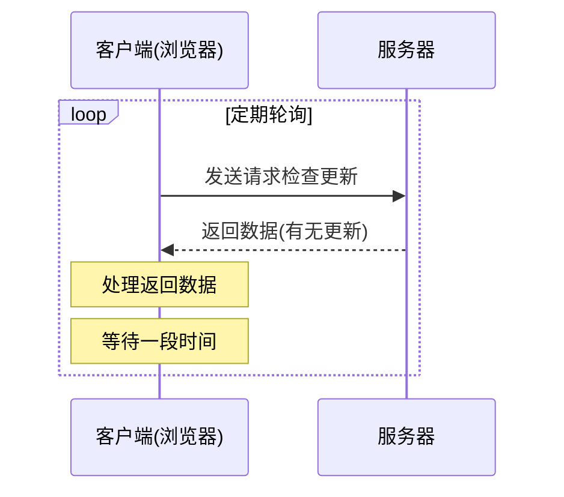

# JavaScript 轮询

## 什么是轮询？

轮询（Polling）是一种在客户端和服务器之间进行通信的技术，客户端通过定期向服务器发送请求来检查是否有新数据或状态更新。这种方式让网页能够在不刷新的情况下获取最新信息，实现动态更新内容的效果。

:::note 轮询的本质
轮询本质上是一种"拉取"（Pull）模式——客户端主动从服务器拉取数据，而不是等待服务器推送。
:::

## 轮询的基本原理

轮询的基本工作流程如下：



## 实现轮询的方法

### 1. 使用 `setInterval` 实现基本轮询

最简单的轮询方式是使用 `setInterval` 方法定期发送请求：

```javascript
// 基本轮询示例
function startPolling() {
    // 设置轮询间隔(毫秒)
    const POLLING_INTERVAL = 5000; 
    
    setInterval(function() {
        // 发送 AJAX 请求
        fetch('https://api.example.com/data')
            .then(response => response.json())
            .then(data => {
                console.log('获取到新数据:', data);
                updateUI(data); // 更新界面
            })
            .catch(error => {
                console.error('轮询请求失败:', error);
            });
    }, POLLING_INTERVAL);
}

function updateUI(data) {
    // 使用数据更新界面
    document.getElementById('content').innerHTML = `
        <p>最新数据: ${data.message}</p>
        <p>更新时间: ${new Date().toLocaleTimeString()}</p>
    `;
}

// 启动轮询
startPolling();
```

### 2. 使用 `setTimeout` 实现更灵活的轮询

使用 `setTimeout` 可以实现更灵活的轮询，特别是当你需要在每次请求后根据结果动态调整轮询间隔时：

```javascript
function improvedPolling() {
    let pollingInterval = 5000; // 初始轮询间隔
    
    function poll() {
        fetch('https://api.example.com/status')
            .then(response => response.json())
            .then(data => {
                processData(data);
                
                // 根据响应动态调整下次轮询间隔
                if (data.highPriority) {
                    pollingInterval = 2000; // 高优先级情况下，更频繁地轮询
                } else {
                    pollingInterval = 5000; // 正常间隔
                }
                
                // 设置下一次轮询
                setTimeout(poll, pollingInterval);
            })
            .catch(error => {
                console.error('轮询出错:', error);
                // 出错后可以增加轮询间隔，避免频繁失败请求
                pollingInterval = 10000;
                setTimeout(poll, pollingInterval);
            });
    }
    
    // 启动首次轮询
    poll();
}

function processData(data) {
    // 处理数据的逻辑
    console.log('处理数据:', data);
}

// 启动改进版轮询
improvedPolling();
```

## 轮询的高级技巧

### 智能轮询

我们可以根据用户行为或应用状态动态调整轮询频率：

```javascript
class SmartPolling {
    constructor(url, initialInterval = 5000) {
        this.url = url;
        this.baseInterval = initialInterval;
        this.currentInterval = initialInterval;
        this.isActive = true;
        this.timeoutId = null;
    }
    
    start() {
        this.poll();
        
        // 当用户与页面交互时重置为较短轮询间隔
        document.addEventListener('click', () => this.userActivity());
        document.addEventListener('keypress', () => this.userActivity());
        
        // 当页面不可见时减少轮询频率
        document.addEventListener('visibilitychange', () => {
            if (document.hidden) {
                this.slowDown();
            } else {
                this.speedUp();
            }
        });
    }
    
    poll() {
        if (!this.isActive) return;
        
        fetch(this.url)
            .then(response => response.json())
            .then(data => {
                this.handleData(data);
                this.scheduleNextPoll();
            })
            .catch(error => {
                console.error('轮询出错:', error);
                // 错误情况下增加间隔
                this.currentInterval = Math.min(this.currentInterval * 2, 60000);
                this.scheduleNextPoll();
            });
    }
    
    scheduleNextPoll() {
        this.timeoutId = setTimeout(() => this.poll(), this.currentInterval);
    }
    
    handleData(data) {
        // 根据数据更新UI
        console.log('处理新数据:', data);
    }
    
    userActivity() {
        // 用户活动检测到，加速轮询
        this.speedUp();
    }
    
    speedUp() {
        this.currentInterval = this.baseInterval;
        if (this.timeoutId) {
            clearTimeout(this.timeoutId);
            this.scheduleNextPoll();
        }
    }
    
    slowDown() {
        // 减慢轮询速度，如用户离开页面
        this.currentInterval = this.baseInterval * 3;
    }
    
    stop() {
        this.isActive = false;
        if (this.timeoutId) {
            clearTimeout(this.timeoutId);
        }
    }
}

// 使用智能轮询
const poller = new SmartPolling('https://api.example.com/updates');
poller.start();

// 需要停止时
// poller.stop();
```

### 带取消功能的轮询

在单页应用程序中，当用户导航到不同页面时，我们需要能够停止轮询：

```javascript
function createCancellablePolling(url, interval) {
    let isPolling = true;
    
    function startPolling() {
        if (!isPolling) return;
        
        fetch(url)
            .then(response => response.json())
            .then(data => {
                if (!isPolling) return; // 检查是否已取消
                
                // 处理数据
                console.log('轮询数据:', data);
                
                // 安排下一次轮询
                setTimeout(startPolling, interval);
            })
            .catch(error => {
                if (!isPolling) return;
                
                console.error('轮询错误:', error);
                setTimeout(startPolling, interval);
            });
    }
    
    // 启动轮询
    startPolling();
    
    // 返回取消函数
    return function cancel() {
        isPolling = false;
        console.log('轮询已取消');
    };
}

// 使用方法:
const stopPolling = createCancellablePolling('https://api.example.com/data', 3000);

// 当需要停止轮询时(例如在组件卸载时)
// stopPolling();
```

## 实际应用场景

### 场景一：实时聊天应用的消息更新

在简单的聊天应用中，可以使用轮询来定期检查新消息：

```javascript
class ChatPoller {
    constructor() {
        this.lastMessageId = 0;
        this.pollingInterval = 3000;
        this.isPolling = false;
    }
    
    startPolling() {
        this.isPolling = true;
        this.poll();
    }
    
    poll() {
        if (!this.isPolling) return;
        
        fetch(`https://chat-api.example.com/messages?since=${this.lastMessageId}`)
            .then(response => response.json())
            .then(data => {
                if (data.messages && data.messages.length > 0) {
                    // 更新最后消息ID
                    this.lastMessageId = data.messages[data.messages.length - 1].id;
                    
                    // 显示新消息
                    this.displayNewMessages(data.messages);
                }
                
                // 继续轮询
                setTimeout(() => this.poll(), this.pollingInterval);
            })
            .catch(error => {
                console.error('获取消息失败:', error);
                setTimeout(() => this.poll(), this.pollingInterval * 2);
            });
    }
    
    displayNewMessages(messages) {
        const chatContainer = document.getElementById('chat-messages');
        
        messages.forEach(message => {
            const messageElement = document.createElement('div');
            messageElement.className = 'message';
            messageElement.innerHTML = `
                <span class="username">${message.username}:</span>
                <span class="text">${message.text}</span>
                <span class="time">${new Date(message.timestamp).toLocaleTimeString()}</span>
            `;
            chatContainer.appendChild(messageElement);
        });
        
        // 滚动到底部
        chatContainer.scrollTop = chatContainer.scrollHeight;
    }
    
    stopPolling() {
        this.isPolling = false;
    }
}

// 使用方法
const chatPoller = new ChatPoller();
chatPoller.startPolling();
```

### 场景二：任务进度监控

当用户启动一个需要较长时间完成的任务（如文件上传、数据处理）时，可以使用轮询来更新进度：

```javascript
function monitorTaskProgress(taskId) {
    const progressBar = document.getElementById('progress-bar');
    const statusElement = document.getElementById('status-message');
    let completed = false;
    
    function checkProgress() {
        if (completed) return;
        
        fetch(`https://api.example.com/tasks/${taskId}/status`)
            .then(response => response.json())
            .then(data => {
                // 更新进度条
                const progress = data.progress || 0;
                progressBar.style.width = `${progress}%`;
                progressBar.setAttribute('aria-valuenow', progress);
                
                // 更新状态消息
                statusElement.textContent = data.statusMessage || '处理中...';
                
                if (data.completed) {
                    completed = true;
                    statusElement.textContent = '任务完成!';
                    onTaskCompleted(data.result);
                } else if (data.error) {
                    completed = true;
                    statusElement.textContent = `错误: ${data.error}`;
                    progressBar.classList.add('bg-danger');
                } else {
                    // 继续轮询
                    setTimeout(checkProgress, 2000);
                }
            })
            .catch(error => {
                console.error('检查进度失败:', error);
                statusElement.textContent = '检查进度时出错，正在重试...';
                setTimeout(checkProgress, 5000);
            });
    }
    
    function onTaskCompleted(result) {
        console.log('任务完成，结果:', result);
        // 可以进行后续处理，如展示结果或提供下载链接
    }
    
    // 开始监控进度
    checkProgress();
    
    // 返回取消监控的函数
    return function cancelMonitoring() {
        completed = true;
    };
}

// 使用示例
const stopMonitoring = monitorTaskProgress('task-12345');

// 用户取消任务时
// stopMonitoring();
```

## 轮询的优缺点

### 优点

- **实现简单**：相比复杂的实时通信技术，轮询非常容易实现
- **兼容性好**：几乎所有浏览器和服务器环境都支持
- **可靠性较高**：即使某次请求失败，后续轮询仍会继续尝试

### 缺点

:::caution 轮询的缺点
- **资源消耗**：频繁的HTTP请求会消耗带宽和服务器资源
- **实时性有限**：数据更新存在延迟，取决于轮询间隔
- **可能产生空请求**：大量请求可能没有数据变化，造成资源浪费
:::

## 轮询的替代方案

当轮询的局限性成为问题时，可以考虑以下替代方案：

1. **长轮询（Long Polling）**：客户端发送请求后，服务器保持连接打开，直到有新数据再响应
2. **WebSocket**：建立持久的双向通信连接，适合需要低延迟的实时应用
3. **Server-Sent Events (SSE)**：服务器通过单向通道向客户端推送事件

## 最佳实践

1. **设置合理的轮询间隔**：根据业务需求平衡实时性和资源消耗
2. **实现指数退避算法**：失败后逐渐增加轮询间隔
3. **添加状态监控**：根据用户活动和页面可见性调整轮询频率
4. **设置超时处理**：对每个请求设置合理的超时时间
5. **提供取消机制**：当组件卸载或页面离开时停止轮询

## 总结

JavaScript轮询是一种简单而有效的技术，适用于需要定期更新数据的场景。虽然它不如WebSocket等技术实时，但由于实现简单且兼容性好，在很多场景下仍然是一个实用的选择。通过优化轮询策略，可以在保持良好用户体验的同时降低资源消耗。

对于初学者来说，掌握轮询技术是理解更复杂的实时通信方案的良好起点。在实际应用中，应根据项目需求和性能要求，选择合适的通信方式。

## 练习题

1. 实现一个带有智能退避机制的轮询系统，连续失败时增加间隔，成功后恢复正常间隔
2. 创建一个简单的股票价格监控应用，使用轮询获取最新价格并在图表上显示
3. 实现一个轮询系统，当页面处于后台标签时自动减少轮询频率，前台时恢复正常频率

## 进一步学习资源

- MDN Web Docs上的[Fetch API](https://developer.mozilla.org/zh-CN/docs/Web/API/Fetch_API)文档
- 了解[WebSocket](https://developer.mozilla.org/zh-CN/docs/Web/API/WebSockets_API)作为轮询的替代方案
- 学习[Server-Sent Events](https://developer.mozilla.org/zh-CN/docs/Web/API/Server-sent_events)技术