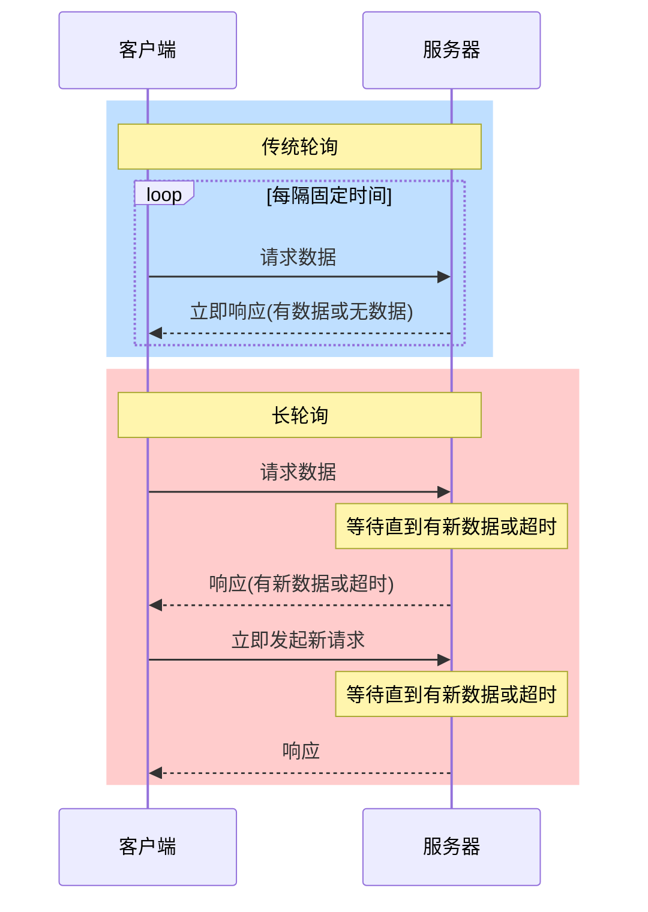

# JavaScript 长轮询

在网络应用开发中，客户端需要及时获取服务器上的最新数据。长轮询是一种在实时通信中常用的技术，它弥补了传统轮询的不足，提供了一种更高效的服务器-客户端通信方式。

## 什么是长轮询？

长轮询（Long Polling）是一种客户端从服务器获取数据的技术，它是对传统轮询的改进。

:::note 基本原理
客户端向服务器发送HTTP请求，服务器不会立即响应，而是保持连接打开状态直到有新数据可用或超时，之后客户端会立即发起新的请求。
:::

### 长轮询 vs 传统轮询



## 长轮询的优缺点

### 优点
- 减少不必要的请求和响应，降低服务器负载
- 相比传统轮询，数据更新延迟更低
- 实现简单，不需要特殊协议支持
- 可以穿透大多数防火墙

### 缺点
- 服务器需要维护大量开放连接，可能影响性能
- 如果频繁通信，可能会消耗较多资源
- 某些服务器配置可能不支持长时间保持连接
- 有超时限制

## 如何实现JavaScript长轮询

下面是一个基本的长轮询实现示例：

```javascript
function longPolling() {
    const xhr = new XMLHttpRequest();
    
    xhr.onreadystatechange = function() {
        if (xhr.readyState === 4) { // 请求完成
            if (xhr.status === 200) { // 成功
                // 处理返回的数据
                const response = JSON.parse(xhr.responseText);
                console.log("收到新数据:", response);
                
                // 更新UI
                updateUI(response);
                
                // 立即发起新的请求
                longPolling();
            } else {
                // 发生错误，等待一段时间后重试
                console.error("请求失败, 状态码:", xhr.status);
                setTimeout(longPolling, 5000);
            }
        }
    };
    
    xhr.open("GET", "/api/updates", true);
    xhr.timeout = 30000; // 设置30秒超时
    xhr.ontimeout = function() {
        // 超时后立即发起新请求
        console.log("请求超时，重新连接");
        longPolling();
    };
    xhr.send();
}

// 启动长轮询
longPolling();

// 更新UI的函数
function updateUI(data) {
    // 根据收到的数据更新页面
    const messageContainer = document.getElementById('messages');
    if (data.message) {
        const messageElement = document.createElement('div');
        messageElement.textContent = data.message;
        messageContainer.appendChild(messageElement);
    }
}
```

## 使用 Fetch API 实现长轮询

现代浏览器中，我们也可以使用Fetch API来实现长轮询：

```javascript
async function longPollingWithFetch() {
    try {
        const response = await fetch('/api/updates', {
            method: 'GET',
            headers: {
                'Content-Type': 'application/json'
            },
            // AbortSignal.timeout()是一个实验性API，可以使用setTimeout和AbortController替代
            signal: AbortSignal.timeout(30000) // 30秒超时
        });
        
        if (response.ok) {
            const data = await response.json();
            console.log("收到新数据:", data);
            
            // 处理数据
            updateUI(data);
        }
    } catch (error) {
        console.error("长轮询出错:", error);
    } finally {
        // 无论成功与否，都开始新的轮询
        longPollingWithFetch();
    }
}

// 启动长轮询
longPollingWithFetch();
```

## 服务器端实现（Node.js示例）

以下是一个简单的Node.js服务器端长轮询实现：

```javascript
const express = require('express');
const app = express();

// 存储连接的客户端
const clients = [];
// 消息历史
const messages = [];

// 处理长轮询请求
app.get('/api/updates', (req, res) => {
    // 设置响应头，防止浏览器缓存
    res.setHeader('Cache-Control', 'no-cache');
    res.setHeader('Content-Type', 'application/json');
    
    // 获取上次客户端收到的最后一条消息ID
    const lastMessageId = parseInt(req.query.lastId) || 0;
    
    // 检查是否有新消息
    const newMessages = messages.filter(msg => msg.id > lastMessageId);
    
    if (newMessages.length > 0) {
        // 有新消息，立即返回
        return res.json({
            messages: newMessages,
            lastId: messages[messages.length - 1].id
        });
    }
    
    // 没有新消息，保持连接
    const clientId = Date.now();
    const newClient = {
        id: clientId,
        res
    };
    
    clients.push(newClient);
    
    // 设置超时处理
    req.on('close', () => {
        // 客户端关闭连接
        const index = clients.findIndex(client => client.id === clientId);
        if (index !== -1) {
            clients.splice(index, 1);
            console.log(`客户端 ${clientId} 断开连接`);
        }
    });
    
    // 30秒后如果还没有新消息，返回空结果
    setTimeout(() => {
        const index = clients.findIndex(client => client.id === clientId);
        if (index !== -1) {
            clients.splice(index, 1);
            res.json({ messages: [], lastId: lastMessageId });
            console.log(`客户端 ${clientId} 超时，断开连接`);
        }
    }, 30000);
});

// 添加新消息的API
app.post('/api/messages', express.json(), (req, res) => {
    const newMessage = {
        id: messages.length + 1,
        text: req.body.text,
        time: new Date().toISOString()
    };
    
    messages.push(newMessage);
    
    // 通知所有正在等待的客户端
    clients.forEach(client => {
        client.res.json({
            messages: [newMessage],
            lastId: newMessage.id
        });
    });
    
    // 清空客户端列表
    clients.length = 0;
    
    res.status(201).json(newMessage);
});

const PORT = 3000;
app.listen(PORT, () => {
    console.log(`服务器运行在 http://localhost:${PORT}`);
});
```

## 实际应用场景

长轮询在许多需要实时或近实时通信的应用场景中非常有用：

### 1. 聊天应用
实时接收新消息而不需要刷新页面或频繁查询。

### 2. 协作工具
共享文档编辑、项目管理工具中的实时更新。

### 3. 通知系统
实时推送网站通知或警报。

### 4. 实时数据更新
股票价格、体育比分、投票结果等需要频繁更新的数据。

### 5. 游戏状态同步
多人在线游戏中的游戏状态同步。

## 实战示例：简易聊天应用

下面是一个简单的聊天应用前端实现：

```html
<!DOCTYPE html>
<html lang="en">
<head>
    <meta charset="UTF-8">
    <meta name="viewport" content="width=device-width, initial-scale=1.0">
    <title>长轮询聊天示例</title>
    <style>
        #chat-box {
            height: 300px;
            border: 1px solid #ccc;
            overflow-y: auto;
            margin-bottom: 10px;
            padding: 10px;
        }
        .message {
            margin: 5px 0;
            padding: 5px;
            border-radius: 5px;
        }
        .message.own {
            background-color: #e3f2fd;
            text-align: right;
        }
        .message.other {
            background-color: #f5f5f5;
        }
    </style>
</head>
<body>
    <h2>长轮询聊天示例</h2>
    <div id="chat-box"></div>
    <input type="text" id="message-input" placeholder="输入消息...">
    <button id="send-button">发送</button>

    <script>
        // 全局变量
        let lastMessageId = 0;
        const username = "user_" + Math.floor(Math.random() * 1000);
        
        // 长轮询函数
        async function pollMessages() {
            try {
                const response = await fetch(`/api/messages?lastId=${lastMessageId}`);
                
                if (response.ok) {
                    const data = await response.json();
                    
                    // 处理新消息
                    if (data.messages && data.messages.length > 0) {
                        data.messages.forEach(displayMessage);
                        lastMessageId = data.lastId;
                    }
                }
            } catch (error) {
                console.error("轮询出错:", error);
            } finally {
                // 继续轮询
                pollMessages();
            }
        }
        
        // 显示消息函数
        function displayMessage(message) {
            const chatBox = document.getElementById('chat-box');
            const messageDiv = document.createElement('div');
            messageDiv.className = `message ${message.username === username ? 'own' : 'other'}`;
            messageDiv.innerHTML = `<strong>${message.username}:</strong> ${message.text}`;
            chatBox.appendChild(messageDiv);
            chatBox.scrollTop = chatBox.scrollHeight;
        }
        
        // 发送消息函数
        async function sendMessage() {
            const input = document.getElementById('message-input');
            const text = input.value.trim();
            
            if (!text) return;
            
            try {
                await fetch('/api/messages', {
                    method: 'POST',
                    headers: {
                        'Content-Type': 'application/json'
                    },
                    body: JSON.stringify({
                        text,
                        username
                    })
                });
                
                // 清空输入框
                input.value = '';
            } catch (error) {
                console.error("发送消息出错:", error);
            }
        }
        
        // 事件监听
        document.getElementById('send-button').addEventListener('click', sendMessage);
        document.getElementById('message-input').addEventListener('keypress', event => {
            if (event.key === 'Enter') {
                sendMessage();
            }
        });
        
        // 开始轮询
        pollMessages();
    </script>
</body>
</html>
```

## 长轮询的替代技术

虽然长轮询是一种有效的实时通信技术，但在现代Web开发中，还有其他更高效的技术可供选择：

- **WebSockets**：提供全双工通信通道，适合需要频繁、低延迟通信的应用
- **Server-Sent Events (SSE)**：服务器向客户端推送事件的标准，适合单向通信场景
- **WebRTC**：浏览器之间的点对点通信，适合视频/音频通话等场景

:::tip 选择建议
如果你的应用需要双向实时通信且浏览器支持，WebSockets通常是最佳选择。对于只需要服务器到客户端的单向通信，SSE可能更加简单和高效。长轮询作为一种回退技术，在不支持这些现代技术的环境中仍然非常有用。
:::

## 总结

长轮询是介于传统轮询和WebSockets之间的一种技术，它通过延迟服务器响应来减少不必要的请求，同时提供近实时的数据更新体验。在现代Web开发中，虽然WebSockets和SSE等技术提供了更高效的实时通信方式，但长轮询因其简单性和广泛的兼容性，仍然是一个重要的技术选择。

学习长轮询对于理解客户端-服务器通信模型和解决实时数据更新问题至关重要。作为一名开发者，掌握多种通信技术可以帮助你为各种场景选择最合适的解决方案。

## 练习

1. 实现一个简单的天气更新应用，使用长轮询从服务器获取最新的天气数据。
2. 修改上面的聊天应用，添加用户在线状态功能。
3. 对比实现：尝试使用传统轮询、长轮询和WebSocket三种方式实现相同功能，比较它们的性能和资源消耗。
4. 实现一个长轮询的超时和重试机制，当连接失败或超时时能够自动重连。
5. 创建一个实时协作绘图应用，多用户可以在同一个画布上绘图，使用长轮询同步绘图数据。

## 进一步学习资源

- MDN Web文档中关于XMLHttpRequest和Fetch API的详细说明
- 学习服务器发送事件(SSE)和WebSockets作为长轮询的替代方案
- 了解HTTP/2推送功能如何影响实时Web应用的设计
- 探索Node.js和Express框架中的异步处理机制

掌握长轮询技术将帮助你构建更具响应性的Web应用程序，为用户提供更好的体验。