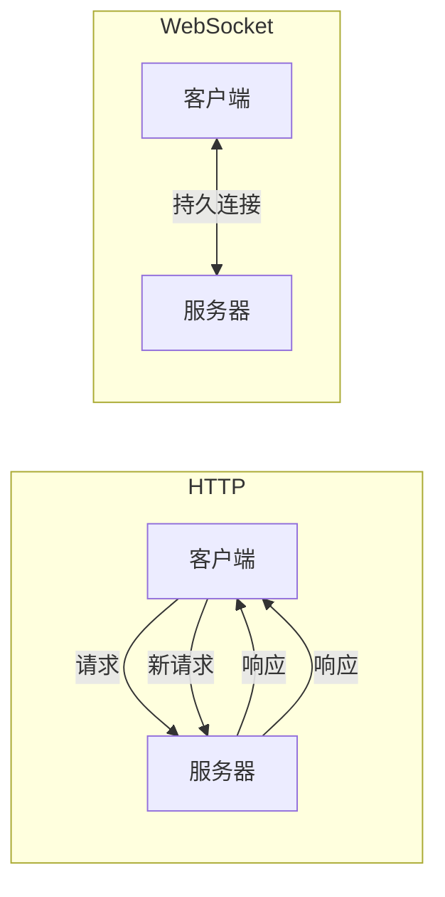

# JavaScript WebSocket

在现代 Web 应用中，实时通信已经成为一种常见需求。无论是聊天应用、在线游戏、股票行情还是协作工具，都需要服务器能够主动向客户端推送数据。传统的 HTTP 请求-响应模型并不适合这些场景，而 WebSocket 技术正是为解决这一问题而诞生的。

## 什么是 WebSocket？

WebSocket 是一种网络通信协议，提供了在单个 TCP 连接上进行全双工通信的能力。与传统的 HTTP 不同，WebSocket 建立连接后，客户端和服务器可以随时互相发送数据，无需重复建立连接。

### WebSocket vs HTTP



:::note
HTTP 是单向的请求-响应模式，而 WebSocket 建立后可以双向自由通信。
:::

## WebSocket API 基础

JavaScript 提供了原生的 WebSocket API，使我们能够轻松地在浏览器中创建和管理 WebSocket 连接。

### 建立连接

创建 WebSocket 连接非常简单：

```javascript
// 创建一个新的 WebSocket 连接
const socket = new WebSocket('ws://example.com/socket');
```

:::tip
WebSocket URL 使用 `ws://` 或 `wss://` 协议（后者是安全的加密连接，类似于 HTTPS）。
:::

### 连接事件

WebSocket 对象提供了多个事件，用于监听连接状态的变化：

```javascript
// 连接成功打开时触发
socket.onopen = function(event) {
  console.log('WebSocket 连接已建立');
};

// 接收到消息时触发
socket.onmessage = function(event) {
  console.log('收到消息:', event.data);
};

// 连接关闭时触发
socket.onclose = function(event) {
  console.log('WebSocket 连接已关闭:', event.code, event.reason);
};

// 发生错误时触发
socket.onerror = function(error) {
  console.error('WebSocket 错误:', error);
};
```

也可以使用 addEventListener 方法注册事件监听器：

```javascript
socket.addEventListener('open', function(event) {
  console.log('连接已建立');
});
```

### 发送数据

连接建立后，可以使用 `send()` 方法发送数据：

```javascript
// 发送文本消息
socket.send('Hello, WebSocket!');

// 发送 JSON 数据
const data = {
  type: 'message',
  content: 'Hello, WebSocket!',
  timestamp: Date.now()
};
socket.send(JSON.stringify(data));
```

WebSocket API 不仅支持发送文本，还支持发送二进制数据：

```javascript
// 发送 Blob 数据
const blob = new Blob(['Hello, binary WebSocket!'], { type: 'text/plain' });
socket.send(blob);

// 发送 ArrayBuffer 数据
const buffer = new ArrayBuffer(8);
const view = new Uint8Array(buffer);
for (let i = 0; i < view.length; i++) {
  view[i] = i;
}
socket.send(buffer);
```

### 关闭连接

当不再需要连接时，应该主动关闭它：

```javascript
// 正常关闭连接
socket.close();

// 带有状态码和原因的关闭
socket.close(1000, '连接正常关闭');
```

## 实际应用场景

### 1. 实时聊天应用

以下是一个简单的聊天应用实现：

```javascript
// 建立连接
const chatSocket = new WebSocket('wss://chat.example.com/socket');

// 发送消息
function sendMessage(message) {
  if (chatSocket.readyState === WebSocket.OPEN) {
    chatSocket.send(JSON.stringify({
      type: 'chat',
      message: message,
      sender: currentUser.username,
      timestamp: new Date().toISOString()
    }));
    return true;
  } else {
    console.error('连接未打开，无法发送消息');
    return false;
  }
}

// 接收消息
chatSocket.onmessage = function(event) {
  const data = JSON.parse(event.data);
  
  if (data.type === 'chat') {
    displayMessage(data.sender, data.message, data.timestamp);
  } else if (data.type === 'user_joined') {
    notifyUserJoined(data.username);
  }
};

// 处理连接关闭
chatSocket.onclose = function() {
  console.log('聊天连接已断开，尝试重新连接...');
  setTimeout(function() {
    // 尝试重新连接
    window.location.reload();
  }, 3000);
};
```

### 2. 实时数据更新（如股票行情）

```javascript
const stockSocket = new WebSocket('wss://stocks.example.com/socket');

stockSocket.onopen = function() {
  // 订阅特定股票
  stockSocket.send(JSON.stringify({
    action: 'subscribe',
    symbols: ['AAPL', 'MSFT', 'GOOGL']
  }));
};

stockSocket.onmessage = function(event) {
  const data = JSON.parse(event.data);
  
  // 更新股票价格
  if (data.type === 'price_update') {
    updateStockPrice(data.symbol, data.price, data.change);
  }
};
```

### 3. 协作编辑工具

```javascript
const docSocket = new WebSocket('wss://docs.example.com/socket/document/123');

// 用户更改文档内容时
function onDocumentChange(change) {
  docSocket.send(JSON.stringify({
    type: 'edit',
    position: change.position,
    insert: change.inserted,
    delete: change.deleted,
    user: currentUser.id
  }));
}

// 接收其他用户的更改
docSocket.onmessage = function(event) {
  const change = JSON.parse(event.data);
  
  if (change.type === 'edit' && change.user !== currentUser.id) {
    applyDocumentChange(change);
  } else if (change.type === 'cursor_move') {
    updateUserCursor(change.user, change.position);
  }
};
```

## WebSocket 状态

WebSocket 对象有一个 `readyState` 属性，表示当前连接状态：

```javascript
const socket = new WebSocket('ws://example.com/socket');

// 检查连接状态
function checkState() {
  switch (socket.readyState) {
    case WebSocket.CONNECTING: // 0
      console.log('连接中...');
      break;
    case WebSocket.OPEN: // 1
      console.log('连接已打开');
      break;
    case WebSocket.CLOSING: // 2
      console.log('连接正在关闭');
      break;
    case WebSocket.CLOSED: // 3
      console.log('连接已关闭');
      break;
  }
}
```

## 高级技巧

### 心跳机制

为了保持连接活跃，避免因超时而断开，可以实现心跳机制：

```javascript
function setupHeartbeat(socket, interval = 30000) {
  let heartbeatInterval;
  
  function startHeartbeat() {
    heartbeatInterval = setInterval(() => {
      if (socket.readyState === WebSocket.OPEN) {
        socket.send(JSON.stringify({ type: 'ping' }));
      }
    }, interval);
  }
  
  function stopHeartbeat() {
    clearInterval(heartbeatInterval);
  }
  
  socket.addEventListener('open', startHeartbeat);
  socket.addEventListener('close', stopHeartbeat);
  
  // 服务器响应 ping
  socket.addEventListener('message', (event) => {
    const data = JSON.parse(event.data);
    if (data.type === 'pong') {
      console.log('Received heartbeat response');
    }
  });
}

const socket = new WebSocket('ws://example.com/socket');
setupHeartbeat(socket);
```

### 自动重连

当连接意外断开时，自动尝试重新连接是很有用的：

```javascript
function createWebSocketWithReconnect(url, maxRetries = 5) {
  let socket;
  let retryCount = 0;
  let reconnectInterval = 1000; // 初始重连间隔 1 秒
  
  function connect() {
    socket = new WebSocket(url);
    
    socket.onopen = function() {
      console.log('连接已建立');
      retryCount = 0;
      reconnectInterval = 1000;
      // ... 其他打开连接后的逻辑
    };
    
    socket.onclose = function(event) {
      if (event.code !== 1000) { // 不是正常关闭
        if (retryCount < maxRetries) {
          retryCount++;
          console.log(`连接已关闭，${reconnectInterval / 1000}秒后尝试重连...`);
          setTimeout(connect, reconnectInterval);
          // 指数退避策略
          reconnectInterval = Math.min(30000, reconnectInterval * 2);
        } else {
          console.error('达到最大重试次数，放弃重连');
        }
      }
    };
    
    // ... 其他事件处理
    
    return socket;
  }
  
  return connect();
}

const socket = createWebSocketWithReconnect('ws://example.com/socket');
```

## 兼容性和后备方案

虽然现代浏览器都支持 WebSocket，但在某些环境下可能不可用。此时，可以使用如 Socket.IO 这样的库，它会在 WebSocket 不可用时自动降级到其他技术（如轮询）：

```javascript
// 使用 Socket.IO（需要先引入库）
const socket = io('https://example.com');

// 发送消息
socket.emit('chat message', 'Hello, Socket.IO!');

// 接收消息
socket.on('chat message', function(msg) {
  console.log('收到消息: ' + msg);
});
```

:::caution
Socket.IO 是一个独立的库，使用前需要先在项目中添加相关依赖。
:::

## 安全性考虑

使用 WebSocket 时，应注意以下安全事项：

1. 使用 `wss://` 而非 `ws://`，确保数据传输加密
2. 实现适当的身份验证机制，如 JWT token
3. 验证所有输入数据，防止注入攻击
4. 实现速率限制，防止滥用
5. 考虑添加 CSRF 保护措施

## 总结

WebSocket 技术为 Web 应用程序提供了全双工实时通信能力，大大扩展了 Web 应用可能的交互模式。本文介绍了：

- WebSocket 的基本概念及其与 HTTP 的区别
- 如何建立、使用和关闭 WebSocket 连接
- 发送和接收不同类型的数据
- 实际应用场景
- 高级技巧如心跳机制和自动重连
- 兼容性和安全性考虑

掌握 WebSocket 技术对于构建现代、交互性强的 Web 应用至关重要。通过合理使用 WebSocket，可以大大提升应用程序的用户体验。

## 练习

1. 创建一个简单的 WebSocket 聊天应用，支持用户加入、发送消息和接收消息。
2. 实现一个实时协作绘图板，多个用户可以同时在画布上绘制。
3. 尝试使用 WebSocket 创建一个简单的多人游戏，如井字棋或贪吃蛇。
4. 为现有的 WebSocket 应用添加心跳机制和自动重连功能。

## 延伸阅读

- [WebSocket API - MDN Web Docs](https://developer.mozilla.org/en-US/docs/Web/API/WebSockets_API)
- [RFC 6455 - WebSocket 协议规范](https://tools.ietf.org/html/rfc6455)
- [Socket.IO - 实时应用框架](https://socket.io/)
- [SockJS - WebSocket 模拟库](https://github.com/sockjs/sockjs-client)

通过深入学习 WebSocket 技术，你将能够创建更加丰富、动态和实时的 Web 应用。