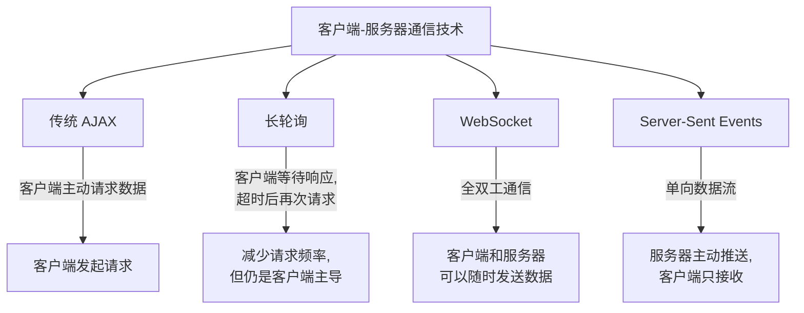

# JavaScript Server-Sent Events

## 什么是 Server-Sent Events？

Server-Sent Events (SSE) 是一种允许服务器向客户端推送数据的 Web 技术。与 WebSocket 不同，SSE 是单向通信的 - 数据只能从服务器流向客户端。这种技术特别适用于需要服务器实时更新客户端，但不需要客户端向服务器发送数据的场景。

:::note
SSE 使用 HTTP 协议，这意味着它不需要特殊的协议支持，可以在现有的 Web 基础设施上工作。
:::

## SSE 与其他技术的对比

在了解 SSE 之前，我们先来看看它与其他技术的区别：



## SSE 的特点

1. **单向通信**：服务器向客户端发送数据，客户端只能接收
2. **自动重连**：如果连接丢失，浏览器会自动尝试重新连接
3. **基于 HTTP**：不需要特殊的协议，兼容现有的代理和防火墙
4. **事件 ID**：支持为每个事件指定 ID，便于断线重连时恢复
5. **自定义事件类型**：可以定义多种事件类型，便于客户端处理不同类型的数据

## 客户端：如何使用 SSE

在客户端，我们使用 `EventSource` 接口来接收服务器发送的事件。

### 基本用法

```javascript
// 创建 EventSource 实例，连接到服务器的 SSE 端点
const eventSource = new EventSource('/api/events');

// 监听从服务器发送的消息
eventSource.onmessage = function(event) {
  const data = JSON.parse(event.data);
  console.log('收到数据:', data);
};

// 监听连接打开事件
eventSource.onopen = function() {
  console.log('SSE 连接已建立');
};

// 监听错误
eventSource.onerror = function(error) {
  console.error('SSE 连接出错:', error);
  // 可以在这里处理重连逻辑，或者依赖 EventSource 的自动重连
};
```

### 自定义事件

服务器可以发送具有特定类型的事件，客户端可以针对不同类型的事件注册不同的处理函数：

```javascript
const eventSource = new EventSource('/api/events');

// 监听名为 'update' 的事件
eventSource.addEventListener('update', function(event) {
  const updateData = JSON.parse(event.data);
  console.log('收到更新:', updateData);
});

// 监听名为 'alert' 的事件
eventSource.addEventListener('alert', function(event) {
  const alertData = JSON.parse(event.data);
  console.log('收到警报:', alertData);
});
```

### 关闭连接

当你不再需要 SSE 连接时，应该关闭它以释放资源：

```javascript
// 关闭 SSE 连接
function closeConnection() {
  eventSource.close();
  console.log('SSE 连接已关闭');
}
```

## 服务器端：如何实现 SSE

下面我们来看看如何在服务器端实现 SSE。这里以 Node.js 和 Express 为例：

```javascript
const express = require('express');
const app = express();

app.get('/api/events', (req, res) => {
  // 设置 SSE 所需的响应头
  res.setHeader('Content-Type', 'text/event-stream');
  res.setHeader('Cache-Control', 'no-cache');
  res.setHeader('Connection', 'keep-alive');
  
  // 发送一条初始消息
  res.write('data: {"message": "连接已建立"}\n\n');
  
  // 创建一个定时器，每隔 3 秒发送一条消息
  const intervalId = setInterval(() => {
    const data = {
      time: new Date().toISOString(),
      value: Math.random()
    };
    
    // 发送普通消息
    res.write(`data: ${JSON.stringify(data)}\n\n`);
    
    // 发送带有事件类型的消息
    res.write(`event: update\ndata: ${JSON.stringify({ status: "updated" })}\n\n`);
  }, 3000);
  
  // 当客户端断开连接时清除定时器
  req.on('close', () => {
    clearInterval(intervalId);
    console.log('客户端关闭了连接');
  });
});

app.listen(3000, () => {
  console.log('服务器启动在 3000 端口');
});
```

### SSE 消息格式

服务器发送的消息需要遵循特定的格式：

```
field: value\n
field: value\n
\n
```

常用的字段包括：
- **data**: 消息的内容
- **event**: 事件类型
- **id**: 事件的唯一标识符
- **retry**: 重连间隔（毫秒）

例如：

```
event: update
id: 123
data: {"status":"updated","time":"2023-05-10T12:34:56Z"}

```

:::tip
每个消息结束时必须有两个换行符（\n\n）。如果 data 字段有多行，每行都需要以 "data: " 开头。
:::

## 实际应用案例

### 案例 1: 实时股票价格更新

假设我们正在开发一个股票监控应用，需要实时显示股票价格变化：

**客户端代码：**

```javascript
// 创建到股票价格 SSE 端点的连接
const stockUpdates = new EventSource('/api/stocks/live');

// 监听价格更新
stockUpdates.addEventListener('price-update', function(event) {
  const stockData = JSON.parse(event.data);
  
  // 更新 UI 显示
  const stockElement = document.querySelector(`#stock-${stockData.symbol}`);
  if (stockElement) {
    // 更新价格
    stockElement.querySelector('.price').textContent = stockData.price;
    
    // 根据涨跌显示不同颜色
    const changeElement = stockElement.querySelector('.change');
    changeElement.textContent = stockData.change;
    if (stockData.change > 0) {
      changeElement.className = 'change positive';
    } else if (stockData.change < 0) {
      changeElement.className = 'change negative';
    } else {
      changeElement.className = 'change neutral';
    }
  }
});
```

**服务器端代码（Node.js/Express）：**

```javascript
app.get('/api/stocks/live', (req, res) => {
  // 设置 SSE 响应头
  res.setHeader('Content-Type', 'text/event-stream');
  res.setHeader('Cache-Control', 'no-cache');
  res.setHeader('Connection', 'keep-alive');
  
  // 模拟股票数据源
  const stocks = ['AAPL', 'GOOGL', 'MSFT', 'AMZN'];
  const initialPrices = {
    'AAPL': 150.0,
    'GOOGL': 2800.0,
    'MSFT': 300.0,
    'AMZN': 3400.0
  };
  
  // 每秒更新一次股票价格
  const intervalId = setInterval(() => {
    // 随机选择一只股票
    const symbol = stocks[Math.floor(Math.random() * stocks.length)];
    const currentPrice = initialPrices[symbol];
    
    // 模拟价格变化 (-1% 到 +1%)
    const change = currentPrice * (Math.random() * 0.02 - 0.01);
    initialPrices[symbol] += change;
    
    // 发送价格更新事件
    res.write(`event: price-update\n`);
    res.write(`data: ${JSON.stringify({
      symbol,
      price: initialPrices[symbol].toFixed(2),
      change: change.toFixed(2)
    })}\n\n`);
  }, 1000);
  
  // 当客户端断开连接时清除定时器
  req.on('close', () => {
    clearInterval(intervalId);
  });
});
```

### 案例 2: 实时通知系统

另一个常见的应用是实时通知系统，比如社交媒体平台上的新消息提醒：

**客户端代码：**

```javascript
const notifications = new EventSource('/api/notifications');

// 处理不同类型的通知
notifications.addEventListener('new-message', event => {
  const data = JSON.parse(event.data);
  showNotification('新消息', `来自 ${data.sender}: ${data.preview}`);
});

notifications.addEventListener('friend-request', event => {
  const data = JSON.parse(event.data);
  showNotification('好友请求', `${data.name} 想添加你为好友`);
});

notifications.addEventListener('system', event => {
  const data = JSON.parse(event.data);
  showNotification('系统通知', data.message);
});

function showNotification(title, message) {
  // 创建通知元素
  const notification = document.createElement('div');
  notification.className = 'notification';
  notification.innerHTML = `
    <h4>${title}</h4>
    <p>${message}</p>
  `;
  
  // 添加到通知区域
  document.getElementById('notification-area').appendChild(notification);
  
  // 5秒后自动移除
  setTimeout(() => {
    notification.classList.add('fade-out');
    setTimeout(() => notification.remove(), 500);
  }, 5000);
}
```

## SSE 的浏览器兼容性

SSE 在大多数现代浏览器中都得到了支持，但在 Internet Explorer 中不可用：

| 浏览器 | 兼容性 |
|-------|--------|
| Chrome | ✅ 支持 |
| Firefox | ✅ 支持 |
| Safari | ✅ 支持 |
| Edge | ✅ 支持 |
| Internet Explorer | ❌ 不支持 |

如果需要支持 Internet Explorer，可以使用 polyfill 库如 [EventSource polyfill](https://github.com/Yaffle/EventSource)。

## SSE 的优缺点

### 优点

1. **简单易用**：API 简单，容易实现
2. **基于 HTTP**：可以利用现有的 HTTP 基础设施
3. **自动重连**：浏览器会自动处理连接断开的情况
4. **原生支持事件 ID**：有利于断点续传
5. **支持自定义事件**：可以定义不同类型的事件

### 缺点

1. **单向通信**：只能从服务器向客户端发送数据
2. **连接数限制**：每个浏览器对于同一个域名的连接数有限制
3. **IE 不支持**：需要使用 polyfill
4. **无法发送二进制数据**：只能发送文本数据

## 最佳实践

1. **实现心跳机制**：定期发送小型消息保持连接活跃
2. **使用事件 ID**：便于客户端在断线重连时恢复
3. **设置合理的重连时间**：避免在网络不稳定时过于频繁地重连
4. **错误处理**：在客户端和服务器端都实现错误处理逻辑
5. **优化数据格式**：只发送必要的数据，减少网络负载

```javascript
// 服务器端发送心跳的例子
function startEventStream(res) {
  let id = 0;
  
  // 每 30 秒发送一次心跳
  const heartbeat = setInterval(() => {
    res.write(`:heartbeat\n\n`);
  }, 30000);
  
  // 每次发送数据时包含 ID
  function sendEvent(event, data) {
    id++;
    res.write(`id: ${id}\n`);
    res.write(`event: ${event}\n`);
    res.write(`data: ${JSON.stringify(data)}\n\n`);
  }
  
  // 处理连接关闭
  req.on('close', () => {
    clearInterval(heartbeat);
  });
  
  // 返回发送事件的函数
  return sendEvent;
}
```

## 总结

Server-Sent Events 是一种强大而简单的技术，适用于从服务器向客户端推送实时更新。它比 WebSocket 更轻量，使用标准的 HTTP 协议，并具有自动重连和事件 ID 等便利功能。

SSE 特别适用于以下场景：
- 实时通知系统
- 股票或加密货币价格更新
- 社交媒体动态推送
- 实时数据仪表板
- 日志或事件监控

通过学习本文内容，你应该已经掌握了 SSE 的基本概念、客户端和服务器端的实现方法，以及实际应用案例。在接下来的项目中，当需要从服务器向客户端推送实时数据时，不妨考虑使用 SSE 这一高效而简洁的解决方案。

## 练习

1. 创建一个简单的聊天室应用，使用 SSE 推送新消息。
2. 实现一个天气更新应用，每隔一段时间从服务器获取最新天气情况。
3. 构建一个简单的游戏排行榜，实时显示玩家分数变化。
4. 尝试实现一个带有重连机制的 SSE 客户端，使用 `Last-Event-ID` 头部恢复连接。

## 延伸阅读

- [MDN Web Docs: EventSource](https://developer.mozilla.org/en-US/docs/Web/API/EventSource)
- [HTML5 标准: Server-Sent Events](https://html.spec.whatwg.org/multipage/server-sent-events.html)
- [使用 SSE 而不是 WebSockets 的理由](https://developer.mozilla.org/en-US/docs/Web/API/Server-sent_events/Using_server-sent_events)