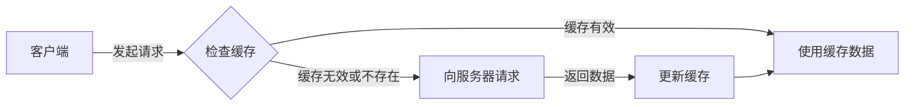

# JavaScript 请求缓存

在现代 Web 开发中，浏览器缓存是优化网络请求和提升用户体验的关键技术。合理利用缓存机制可以显著减少网络请求次数，加快页面加载速度，减轻服务器负担。本文将全面介绍 JavaScript 中处理请求缓存的方法和最佳实践。

## 什么是请求缓存？

请求缓存是浏览器将曾经下载的资源（如 HTML 页面、CSS 样式表、JavaScript 脚本、图片等）存储在本地，以便在后续请求相同资源时可以直接从本地读取，而不必再次从服务器获取。



## 浏览器缓存机制

浏览器缓存主要受 HTTP 缓存头控制，包括两种类型：

### 1. 强缓存

强缓存不需要向服务器发送请求，直接从缓存中获取资源。相关的 HTTP 头包括：

- **`Cache-Control`**：HTTP/1.1 的缓存头，提供多种缓存策略
  - `max-age`：缓存的最大有效时间，单位为秒
  - `public`：表示响应可以被任何缓存区缓存
  - `private`：表示响应只能被浏览器缓存，不能被中间代理服务器缓存
  - `no-cache`：强制向服务器再验证
  - `no-store`：不缓存任何内容

- **`Expires`**：HTTP/1.0 的缓存头，指定缓存到期时间

### 2. 协商缓存

当强缓存失效后，浏览器会向服务器发送请求，询问资源是否有更新。相关的 HTTP 头包括：

- **`Last-Modified` / `If-Modified-Since`**：基于资源修改时间的验证
- **`ETag` / `If-None-Match`**：基于资源内容的验证

## JavaScript 中控制缓存的方法

### 1. 使用 Fetch API 控制缓存

Fetch API 提供了更细粒度的缓存控制能力：

```javascript
// 默认情况，fetch 会使用浏览器标准缓存策略
fetch('https://api.example.com/data')
  .then(response => response.json())
  .then(data => console.log(data));

// 禁止使用缓存
fetch('https://api.example.com/data', {
  cache: 'no-store' // 完全禁用缓存
})
  .then(response => response.json())
  .then(data => console.log(data));

// 强制验证缓存
fetch('https://api.example.com/data', {
  cache: 'no-cache' // 每次都发请求验证缓存
})
  .then(response => response.json())
  .then(data => console.log(data));

// 其他缓存策略
// 'default' - 使用浏览器默认缓存策略
// 'reload' - 类似于 no-cache，但会强制重新请求
// 'force-cache' - 强制使用缓存，即使缓存过期
// 'only-if-cached' - 只使用缓存，不发送网络请求
```

### 2. 通过 URL 参数绕过缓存

一种简单但有效的方法是在 URL 后添加动态参数，使每次请求都"不同"：

```javascript
// 添加时间戳作为查询参数
const timestamp = new Date().getTime();
fetch(`https://api.example.com/data?t=${timestamp}`)
  .then(response => response.json())
  .then(data => console.log(data));

// 或者使用随机字符串
const randomString = Math.random().toString(36).substring(7);
fetch(`https://api.example.com/data?r=${randomString}`)
  .then(response => response.json())
  .then(data => console.log(data));
```

### 3. 使用 XMLHttpRequest 控制缓存

虽然现代应用更多使用 Fetch API，但在一些旧项目中可能还会看到 XMLHttpRequest：

```javascript
const xhr = new XMLHttpRequest();
xhr.open('GET', 'https://api.example.com/data', true);
xhr.setRequestHeader('Cache-Control', 'no-cache'); // 设置缓存控制头
xhr.onreadystatechange = function() {
  if (xhr.readyState === 4 && xhr.status === 200) {
    const data = JSON.parse(xhr.responseText);
    console.log(data);
  }
};
xhr.send();
```

### 4. 利用 Service Worker 实现自定义缓存策略

Service Worker 提供了更强大的离线缓存能力：

```javascript
// 注册 Service Worker
if ('serviceWorker' in navigator) {
  navigator.serviceWorker.register('/sw.js')
    .then(registration => {
      console.log('Service Worker 注册成功:', registration.scope);
    })
    .catch(error => {
      console.log('Service Worker 注册失败:', error);
    });
}
```

Service Worker 文件 (sw.js) 示例：

```javascript
// 缓存名称
const CACHE_NAME = 'my-site-cache-v1';

// 需要缓存的资源
const urlsToCache = [
  '/',
  '/styles/main.css',
  '/scripts/main.js',
  '/images/logo.png'
];

// 安装 Service Worker
self.addEventListener('install', event => {
  event.waitUntil(
    caches.open(CACHE_NAME)
      .then(cache => {
        console.log('缓存已打开');
        return cache.addAll(urlsToCache);
      })
  );
});

// 网络请求处理
self.addEventListener('fetch', event => {
  event.respondWith(
    caches.match(event.request)
      .then(response => {
        // 如果匹配到缓存，返回缓存的资源
        if (response) {
          return response;
        }
        
        // 否则发起网络请求
        return fetch(event.request)
          .then(response => {
            // 检查响应是否有效
            if (!response || response.status !== 200 || response.type !== 'basic') {
              return response;
            }
            
            // 克隆响应（因为响应流只能被消费一次）
            const responseToCache = response.clone();
            
            caches.open(CACHE_NAME)
              .then(cache => {
                // 将新响应添加到缓存
                cache.put(event.request, responseToCache);
              });
              
            return response;
          });
      })
  );
});

// 清理旧版本缓存
self.addEventListener('activate', event => {
  const cacheWhitelist = [CACHE_NAME];
  
  event.waitUntil(
    caches.keys().then(cacheNames => {
      return Promise.all(
        cacheNames.map(cacheName => {
          if (cacheWhitelist.indexOf(cacheName) === -1) {
            // 删除不在白名单中的缓存
            return caches.delete(cacheName);
          }
        })
      );
    })
  );
});
```

## 实际应用场景

### 场景1：API 数据的缓存策略

当你的应用需要频繁请求相同的 API 数据时：

```javascript
// 创建一个简单的内存缓存
const apiCache = new Map();
const CACHE_DURATION = 60000; // 缓存持续时间（毫秒）

async function fetchWithCache(url) {
  const now = new Date().getTime();
  
  // 检查缓存中是否有有效数据
  if (apiCache.has(url)) {
    const cachedData = apiCache.get(url);
    if (now - cachedData.timestamp < CACHE_DURATION) {
      console.log('使用缓存数据');
      return cachedData.data;
    }
    console.log('缓存已过期');
  }
  
  // 没有缓存或缓存过期，从服务器获取
  console.log('从服务器获取数据');
  try {
    const response = await fetch(url);
    const data = await response.json();
    
    // 更新缓存
    apiCache.set(url, {
      data,
      timestamp: now
    });
    
    return data;
  } catch (error) {
    console.error('获取数据失败:', error);
    throw error;
  }
}

// 使用
fetchWithCache('https://api.example.com/users')
  .then(data => console.log('用户数据:', data))
  .catch(err => console.error(err));
```

### 场景2：基于 localStorage 的请求结果缓存

对于不经常变化的数据，可以使用 localStorage 进行持久缓存：

```javascript
async function fetchWithLocalStorage(url, expirationMinutes = 60) {
  const cacheKey = `api_cache_${url}`;
  const now = new Date().getTime();
  
  // 尝试从 localStorage 获取
  const cachedItem = localStorage.getItem(cacheKey);
  
  if (cachedItem) {
    const { data, timestamp } = JSON.parse(cachedItem);
    const expirationTime = timestamp + (expirationMinutes * 60 * 1000);
    
    // 检查缓存是否过期
    if (now < expirationTime) {
      console.log('使用本地存储的缓存数据');
      return data;
    }
    console.log('本地缓存已过期');
  }
  
  // 从服务器获取新数据
  console.log('从服务器获取新数据');
  try {
    const response = await fetch(url);
    const data = await response.json();
    
    // 保存到 localStorage
    localStorage.setItem(cacheKey, JSON.stringify({
      data,
      timestamp: now
    }));
    
    return data;
  } catch (error) {
    console.error('获取数据失败:', error);
    throw error;
  }
}
```

:::caution
localStorage 大小限制约为 5MB，不适合存储大量数据。对于大型数据集，考虑使用 IndexedDB。
:::

### 场景3：实现带刷新功能的缓存策略

有时候，我们需要让用户手动刷新缓存：

```javascript
const dataCache = {};

function fetchData(url, forceRefresh = false) {
  return new Promise((resolve, reject) => {
    // 如果有缓存且不强制刷新，则使用缓存
    if (dataCache[url] && !forceRefresh) {
      console.log('使用缓存的数据');
      return resolve(dataCache[url]);
    }
    
    // 否则从服务器获取
    console.log('从服务器获取数据');
    fetch(url)
      .then(response => response.json())
      .then(data => {
        // 更新缓存
        dataCache[url] = data;
        resolve(data);
      })
      .catch(error => {
        reject(error);
      });
  });
}

// 使用示例
// 第一次调用 - 从服务器获取
fetchData('https://api.example.com/products')
  .then(products => renderProducts(products));

// 后续调用 - 使用缓存
fetchData('https://api.example.com/products')
  .then(products => renderProducts(products));

// 用户点击刷新按钮时 - 强制从服务器获取
document.getElementById('refreshBtn').addEventListener('click', () => {
  fetchData('https://api.example.com/products', true)
    .then(products => {
      renderProducts(products);
      showNotification('数据已刷新');
    });
});
```

## 缓存的最佳实践

1. **为不同类型的资源设置不同的缓存策略**
   - API 数据：短期缓存或根据数据变化频率决定
   - 静态资源（JS/CSS/图片）：长期缓存，通过文件名/版本更新

2. **使用适当的缓存状态指示器**
   - 在加载数据时显示加载状态
   - 从缓存加载数据时可选择性地显示"来自缓存"的提示
   - 提供刷新操作让用户可以强制更新数据

3. **考虑缓存失效情况**
   - 实现服务器端版本控制机制
   - 在重要数据更新后通知客户端刷新缓存

4. **监控和调试**
   - 使用浏览器开发者工具的网络面板分析缓存行为
   - 记录缓存命中率和过期情况

## 总结

JavaScript 请求缓存是提高应用性能的关键技术。通过合理利用浏览器内置缓存机制和实现自定义缓存策略，我们可以：

- 减少不必要的网络请求
- 提供更流畅的用户体验
- 减轻服务器负担
- 优化应用在弱网络条件下的表现

熟练掌握这些缓存技术，能让你的应用响应更快，用户体验更佳。根据实际需求选择合适的缓存策略，并记住定期检查和更新缓存，确保用户能获取到最新的数据。

## 练习与进阶学习

1. 实现一个能够自动处理缓存过期的通用数据获取函数
2. 结合 Service Worker 创建一个完全可离线使用的网页应用
3. 研究 HTTP/2 和 HTTP/3 对缓存策略的影响
4. 探索 IndexedDB 作为大型数据集的客户端缓存解决方案
5. 学习并实现 stale-while-revalidate 缓存策略

:::tip
记住，缓存是一把双刃剑。过度依赖缓存可能导致用户看到过时的数据，而缓存不足则会造成不必要的网络请求。寻找适合你应用的平衡点是关键。
:::