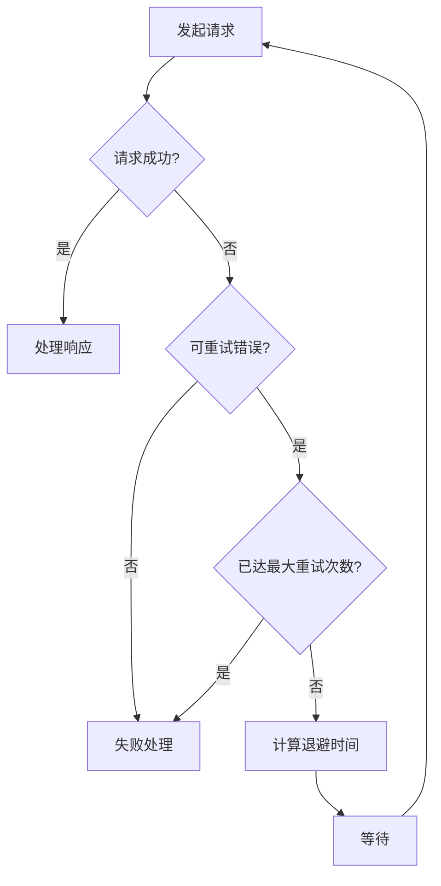

# JavaScript 请求重试

在网络应用开发过程中，我们经常需要与远程服务器进行通信。但由于网络环境的不稳定性，请求可能会因为各种原因失败——服务器暂时不可用、网络连接中断或请求超时等。为了提高应用的稳定性和用户体验，我们通常需要实现**请求重试**机制。

## 什么是请求重试？

请求重试是指在网络请求失败后，按照特定策略自动重新发送请求的机制。一个良好的重试策略能够帮助应用程序在遇到临时性问题时自动恢复，而不需要用户手动干预。

:::note 重试机制的基本组成
1. **重试条件**：决定何时进行重试
2. **重试次数**：最大尝试次数
3. **重试间隔**：两次请求之间的等待时间
4. **退避策略**：调整重试间隔的方法（例如指数退避）
:::

## 简单的重试实现

让我们从一个基础的重试函数开始：

```javascript
async function fetchWithRetry(url, options = {}, retries = 3, delay = 1000) {
  try {
    const response = await fetch(url, options);
    if (!response.ok) {
      throw new Error(`HTTP error! status: ${response.status}`);
    }
    return response.json();
  } catch (error) {
    if (retries <= 0) {
      throw error; // 重试次数用完，抛出错误
    }
    
    console.log(`请求失败，${delay}ms后重试。剩余重试次数：${retries-1}`);
    
    // 等待指定的延迟时间
    await new Promise(resolve => setTimeout(resolve, delay));
    
    // 递归调用自身进行重试
    return fetchWithRetry(url, options, retries - 1, delay);
  }
}

// 使用示例
fetchWithRetry('https://api.example.com/data')
  .then(data => console.log('获取数据成功:', data))
  .catch(error => console.error('最终失败:', error));
```

**输出示例**：
```
请求失败，1000ms后重试。剩余重试次数：2
请求失败，1000ms后重试。剩余重试次数：1
请求失败，1000ms后重试。剩余重试次数：0
最终失败: Error: HTTP error! status: 404
```

## 高级重试策略

### 指数退避策略

指数退避是一种常见的重试策略，随着重试次数的增加，等待时间呈指数增长。这有助于减少对服务器的压力，并为临时性问题的恢复留出更多时间。

```javascript
async function fetchWithExponentialBackoff(url, options = {}, maxRetries = 3) {
  let retries = 0;
  
  while (true) {
    try {
      const response = await fetch(url, options);
      if (!response.ok) {
        throw new Error(`HTTP error! status: ${response.status}`);
      }
      return await response.json();
    } catch (error) {
      if (retries >= maxRetries) {
        throw error; // 重试次数用完，抛出错误
      }
      
      // 计算退避时间：2^retries * 1000ms (1s, 2s, 4s, 8s...)
      const delay = Math.pow(2, retries) * 1000;
      
      console.log(`请求失败，${delay}ms后重试。重试次数：${retries+1}/${maxRetries}`);
      
      // 等待退避时间
      await new Promise(resolve => setTimeout(resolve, delay));
      
      retries++;
    }
  }
}
```

### 添加随机抖动

为了避免多个客户端同时重试导致的"雪崩效应"，我们可以在退避时间中添加随机抖动（Jitter）：

```javascript
async function fetchWithBackoffAndJitter(url, options = {}, maxRetries = 3) {
  let retries = 0;
  
  while (true) {
    try {
      const response = await fetch(url, options);
      if (!response.ok) {
        throw new Error(`HTTP error! status: ${response.status}`);
      }
      return await response.json();
    } catch (error) {
      if (retries >= maxRetries) {
        throw error;
      }
      
      // 基础退避时间
      const baseDelay = Math.pow(2, retries) * 1000;
      // 添加0-1000ms的随机抖动
      const jitter = Math.random() * 1000;
      const delay = baseDelay + jitter;
      
      console.log(`请求失败，${Math.round(delay)}ms后重试。重试次数：${retries+1}/${maxRetries}`);
      
      await new Promise(resolve => setTimeout(resolve, delay));
      
      retries++;
    }
  }
}
```

## 根据错误类型决定是否重试

并非所有错误都适合重试。例如，认证错误(401)或资源不存在(404)通常不会因为重试而解决。

```javascript
async function smartRetry(url, options = {}, maxRetries = 3) {
  let retries = 0;
  
  while (true) {
    try {
      const response = await fetch(url, options);
      
      // 判断是否需要重试
      if (!response.ok) {
        // 这些状态码通常不适合重试
        if ([400, 401, 403, 404].includes(response.status)) {
          console.log(`收到状态码 ${response.status}，不进行重试`);
          throw new Error(`HTTP error! status: ${response.status}`);
        }
        
        // 服务器错误(500系列)和某些特定错误(429 - 请求过多)可以重试
        throw new Error(`HTTP error! status: ${response.status}`);
      }
      
      return await response.json();
    } catch (error) {
      if (retries >= maxRetries) {
        throw error;
      }
      
      // 网络错误适合重试
      const isNetworkError = error instanceof TypeError && error.message === 'Failed to fetch';
      
      // 如果是HTTP错误且已被上面的代码处理为不适合重试，则直接抛出
      if (!isNetworkError && error.message.includes('HTTP error!') && 
          !error.message.includes('status: 5') && !error.message.includes('status: 429')) {
        throw error;
      }
      
      const delay = Math.pow(2, retries) * 1000 + (Math.random() * 1000);
      console.log(`请求失败，${Math.round(delay)}ms后重试。重试次数：${retries+1}/${maxRetries}`);
      
      await new Promise(resolve => setTimeout(resolve, delay));
      retries++;
    }
  }
}
```

## 使用Promise实现非递归重试

下面是一个使用Promise链实现的非递归重试方法：

```javascript
function fetchWithRetryPromise(url, options = {}, maxRetries = 3, delayMs = 1000) {
  return new Promise((resolve, reject) => {
    function attemptFetch(retriesLeft) {
      fetch(url, options)
        .then(response => {
          if (!response.ok) {
            throw new Error(`HTTP error! status: ${response.status}`);
          }
          return response.json();
        })
        .then(resolve)
        .catch(error => {
          if (retriesLeft <= 0) {
            reject(error);
            return;
          }
          
          console.log(`请求失败，${delayMs}ms后重试。剩余重试次数：${retriesLeft-1}`);
          
          setTimeout(() => {
            attemptFetch(retriesLeft - 1);
          }, delayMs);
        });
    }
    
    attemptFetch(maxRetries);
  });
}
```

## 实际应用案例

### 案例1：数据加载组件

下面是一个React组件，使用重试机制从API加载数据：

```jsx
import React, { useState, useEffect } from 'react';

// 重试函数
async function fetchWithRetry(url, options = {}, maxRetries = 3) {
  let lastError;
  
  for (let i = 0; i < maxRetries; i++) {
    try {
      const response = await fetch(url, options);
      if (!response.ok) throw new Error(`HTTP error! status: ${response.status}`);
      return await response.json();
    } catch (error) {
      console.log(`尝试 ${i + 1}/${maxRetries} 失败: ${error.message}`);
      lastError = error;
      
      if (i < maxRetries - 1) {
        // 计算退避时间
        const delay = Math.pow(2, i) * 1000 + (Math.random() * 1000);
        await new Promise(resolve => setTimeout(resolve, delay));
      }
    }
  }
  
  throw lastError;
}

function DataLoader({ url }) {
  const [data, setData] = useState(null);
  const [loading, setLoading] = useState(true);
  const [error, setError] = useState(null);
  
  useEffect(() => {
    async function loadData() {
      try {
        setLoading(true);
        const result = await fetchWithRetry(url);
        setData(result);
        setError(null);
      } catch (err) {
        setError(`加载失败: ${err.message}`);
      } finally {
        setLoading(false);
      }
    }
    
    loadData();
  }, [url]);
  
  if (loading) return <div>加载中...</div>;
  if (error) return <div>错误: {error}</div>;
  
  return (
    <div>
      <h2>数据加载成功!</h2>
      <pre>{JSON.stringify(data, null, 2)}</pre>
    </div>
  );
}
```

### 案例2：使用Axios实现请求重试

Axios是一个流行的HTTP客户端库，我们可以为其配置拦截器来实现重试功能：

```javascript
import axios from 'axios';

// 创建axios实例
const api = axios.create({
  baseURL: 'https://api.example.com',
  timeout: 5000
});

// 添加响应拦截器
api.interceptors.response.use(null, async (error) => {
  const config = error.config;
  
  // 设置重试计数器
  config.__retryCount = config.__retryCount || 0;
  
  // 最大重试次数
  const maxRetries = 3;
  
  // 如果已达到最大重试次数，或响应已收到但状态码表明不应重试
  if (config.__retryCount >= maxRetries || 
      (error.response && [400, 401, 403, 404].includes(error.response.status))) {
    return Promise.reject(error);
  }
  
  // 增加重试计数
  config.__retryCount++;
  
  // 计算退避延迟
  const delay = Math.pow(2, config.__retryCount - 1) * 1000 + (Math.random() * 1000);
  console.log(`请求失败，${Math.round(delay)}ms后重试。重试次数：${config.__retryCount}/${maxRetries}`);
  
  // 等待延迟时间
  await new Promise(resolve => setTimeout(resolve, delay));
  
  // 返回axios实例，重新发送请求
  return api(config);
});

// 使用示例
async function fetchUserData(userId) {
  try {
    const response = await api.get(`/users/${userId}`);
    return response.data;
  } catch (error) {
    console.error('最终获取用户数据失败:', error);
    throw error;
  }
}
```

## 实现请求重试的最佳实践

1. **选择性重试**：只对可能是临时性故障的错误进行重试，如网络错误或服务器过载。

2. **指数退避**：随着重试次数增加，延长等待时间。

3. **添加随机抖动**：在退避时间中加入随机成分，避免多个客户端同时重试。

4. **设置最大重试次数**：防止无限重试消耗资源。

5. **考虑请求幂等性**：确保重复发送请求不会产生意外后果。

6. **日志记录**：记录每次重试的结果，便于调试和监控。

7. **超时控制**：为每个请求设置合理的超时时间。

## 请求重试的流程



## 总结

请求重试是提高应用程序稳定性和用户体验的重要机制。通过实现智能的重试策略，我们可以:

- 自动处理临时性网络故障
- 减少用户感知的错误
- 提高应用的整体可靠性
- 在遇到服务器过载时采取负责任的行为

在实现重试机制时，需要权衡重试带来的好处与可能增加的服务器负载。设计良好的重试策略应当在增强可靠性的同时，避免对服务器造成不必要的压力。

## 练习

1. 实现一个加载用户数据的函数，使用指数退避策略处理可能的网络错误。

2. 修改上面的智能重试函数，使其能够区分不同类型的服务器错误，并只对特定错误进行重试。

3. 创建一个文件上传组件，当上传失败时能够自动重试，并显示重试进度。

4. 扩展fetchWithRetry函数，添加一个回调函数来跟踪每次重试的状态。

## 附加资源

- [MDN Web API - Fetch](https://developer.mozilla.org/zh-CN/docs/Web/API/Fetch_API)
- [Axios文档](https://axios-http.com/docs/intro)
- [重试模式 - Microsoft Azure Architecture](https://docs.microsoft.com/zh-cn/azure/architecture/patterns/retry)
- [理解指数退避算法](https://cloud.google.com/storage/docs/exponential-backoff)

通过掌握请求重试技术，你将能够构建更加稳健的网络应用，为用户提供更好的体验!