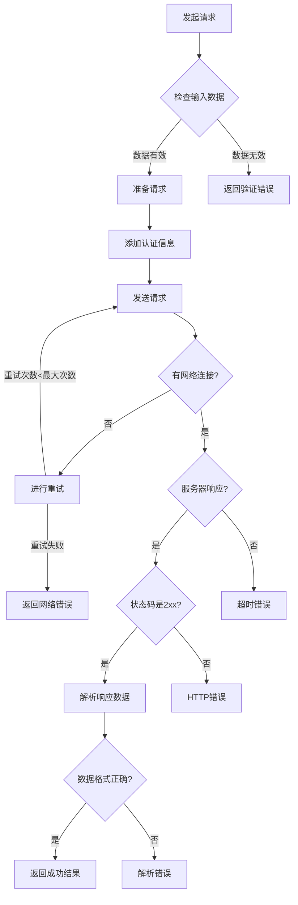

# JavaScript 网络请求最佳实践

在现代Web应用程序开发中，网络请求是连接前端与后端的重要桥梁。掌握JavaScript网络请求的最佳实践不仅能提高应用性能，还能增强用户体验和安全性。本文将全面介绍JavaScript网络请求的最佳实践，从基础概念到高级技巧，帮助你编写更高效、更健壮的网络请求代码。

## 为什么网络请求最佳实践很重要？

网络请求是现代Web应用的核心组成部分，它们直接影响：

- **用户体验** - 快速响应的请求使应用感觉更流畅
- **性能** - 高效的请求策略减少带宽消耗和服务器负载
- **安全性** - 适当的请求处理有助于防止常见的安全漏洞
- **可维护性** - 组织良好的网络请求代码更易于调试和扩展

## 选择合适的请求工具

### Fetch API

Fetch API是现代浏览器内置的网络请求API，简洁而强大。

```javascript
// 基本的Fetch请求
fetch('https://api.example.com/data')
  .then(response => {
    if (!response.ok) {
      throw new Error('Network response was not ok');
    }
    return response.json();
  })
  .then(data => console.log(data))
  .catch(error => console.error('Fetch error:', error));
```

:::tip
Fetch API使用Promise，使异步代码更易于管理。然而，与jQuery的AJAX和Axios不同，Fetch不会自动将非2xx响应视为错误，需要手动检查`response.ok`。
:::

### Axios库

Axios是一个流行的HTTP客户端库，提供了更多开箱即用的功能。

```javascript
// 使用Axios进行GET请求
axios.get('https://api.example.com/data')
  .then(response => console.log(response.data))
  .catch(error => console.error('Axios error:', error));

// POST请求示例
axios.post('https://api.example.com/create', {
  name: 'John Doe',
  email: 'john@example.com'
})
  .then(response => console.log('Created:', response.data))
  .catch(error => console.error('Error creating resource:', error));
```

### 选择工具的考虑因素

| 工具 | 优势 | 劣势 | 适用场景 |
|------|------|------|----------|
| Fetch API | 浏览器原生支持，无需额外依赖 | 错误处理较复杂，旧浏览器需polyfill | 简单项目，现代浏览器环境 |
| Axios | 自动转换JSON，更全面的错误处理，请求/响应拦截 | 需要额外依赖 | 大型应用，需要高级功能 |
| jQuery AJAX | 熟悉度高，兼容性好 | 需要引入jQuery，API较老 | 已使用jQuery的遗留项目 |

## 处理异步请求的最佳实践

### 使用async/await简化代码

```javascript
// 使用async/await处理Fetch请求
async function fetchData() {
  try {
    const response = await fetch('https://api.example.com/data');
    
    if (!response.ok) {
      throw new Error(`HTTP error! Status: ${response.status}`);
    }
    
    const data = await response.json();
    console.log(data);
    return data;
  } catch (error) {
    console.error('Fetching data failed:', error);
    // 更优雅的错误处理
  }
}
```

### 请求超时处理

Fetch API本身不支持超时，但我们可以使用Promise.race来实现：

```javascript
async function fetchWithTimeout(url, options = {}, timeout = 5000) {
  const controller = new AbortController();
  const id = setTimeout(() => controller.abort(), timeout);
  
  try {
    const response = await fetch(url, {
      ...options,
      signal: controller.signal
    });
    clearTimeout(id);
    return response;
  } catch (error) {
    clearTimeout(id);
    if (error.name === 'AbortError') {
      throw new Error('Request timeout');
    }
    throw error;
  }
}

// 使用示例
fetchWithTimeout('https://api.example.com/data', {}, 3000)
  .then(response => response.json())
  .then(data => console.log(data))
  .catch(error => console.error(error));
```

## 错误处理策略

### 全面的错误类型处理

```javascript
async function robustFetch(url) {
  try {
    const response = await fetch(url);
    
    if (!response.ok) {
      // 处理HTTP错误状态
      switch(response.status) {
        case 400:
          throw new Error('Bad request - check your input');
        case 401:
          throw new Error('Authentication required');
        case 403:
          throw new Error('You don\'t have permission to access this resource');
        case 404:
          throw new Error('Resource not found');
        case 500:
          throw new Error('Server error - please try again later');
        default:
          throw new Error(`HTTP error! Status: ${response.status}`);
      }
    }
    
    return await response.json();
  } catch (error) {
    // 捕获网络错误
    if (error instanceof TypeError && error.message.includes('fetch')) {
      console.error('Network error - check your connection');
    }
    // 重新抛出错误供上层处理
    throw error;
  }
}
```

### 重试机制

对于不稳定的网络环境，实现重试逻辑非常有用：

```javascript
async function fetchWithRetry(url, options = {}, retries = 3, backoff = 300) {
  let lastError;
  
  for (let i = 0; i < retries; i++) {
    try {
      return await fetch(url, options);
    } catch (error) {
      console.log(`Attempt ${i + 1} failed, retrying in ${backoff}ms...`);
      lastError = error;
      
      // 等待一段时间后重试
      await new Promise(resolve => setTimeout(resolve, backoff));
      
      // 指数退避策略
      backoff *= 2;
    }
  }
  
  throw lastError;
}
```

## 性能优化

### 缓存策略

利用HTTP缓存可以显著提高性能：

```javascript
// 使用缓存优先策略
fetch(url, {
  cache: 'force-cache' // 优先使用缓存，即使缓存过期
})

// 必须重新验证缓存
fetch(url, {
  cache: 'no-cache' // 每次请求都会发送到服务器进行验证
})
```

### 数据序列化与批量请求

```javascript
// 批量处理多个请求
async function fetchAllData() {
  try {
    const [usersResponse, postsResponse, commentsResponse] = await Promise.all([
      fetch('/api/users'),
      fetch('/api/posts'),
      fetch('/api/comments')
    ]);
    
    const users = await usersResponse.json();
    const posts = await postsResponse.json();
    const comments = await commentsResponse.json();
    
    return { users, posts, comments };
  } catch (error) {
    console.error('Failed to fetch data:', error);
    throw error;
  }
}
```

## 安全最佳实践

### CSRF保护

```javascript
// 在请求头中添加CSRF令牌
const csrfToken = document.querySelector('meta[name="csrf-token"]').getAttribute('content');

fetch('/api/update-profile', {
  method: 'POST',
  headers: {
    'Content-Type': 'application/json',
    'X-CSRF-Token': csrfToken
  },
  body: JSON.stringify({ name: 'New Name' })
});
```

### 数据验证

```javascript
function validateUserInput(userData) {
  const errors = {};
  
  if (!userData.name || userData.name.length < 2) {
    errors.name = 'Name must be at least 2 characters';
  }
  
  if (!userData.email || !userData.email.match(/^[^@]+@[^@]+\.[^@]+$/)) {
    errors.email = 'Please provide a valid email address';
  }
  
  return {
    isValid: Object.keys(errors).length === 0,
    errors
  };
}

// 在发送请求前验证
function submitUserData(userData) {
  const validation = validateUserInput(userData);
  
  if (!validation.isValid) {
    console.error('Validation errors:', validation.errors);
    return Promise.reject(validation.errors);
  }
  
  return fetch('/api/users', {
    method: 'POST',
    headers: { 'Content-Type': 'application/json' },
    body: JSON.stringify(userData)
  });
}
```

## 实际案例：构建一个完整的数据服务

下面是一个实际案例，展示如何创建一个健壮的数据服务类：

```javascript
class ApiService {
  constructor(baseUrl, defaultOptions = {}) {
    this.baseUrl = baseUrl;
    this.defaultOptions = {
      headers: {
        'Content-Type': 'application/json'
      },
      ...defaultOptions
    };
  }
  
  // 添加授权令牌
  setAuthToken(token) {
    this.defaultOptions.headers = {
      ...this.defaultOptions.headers,
      'Authorization': `Bearer ${token}`
    };
  }
  
  // 通用请求方法
  async request(endpoint, options = {}) {
    const url = `${this.baseUrl}${endpoint}`;
    
    // 合并选项
    const fetchOptions = {
      ...this.defaultOptions,
      ...options,
      headers: {
        ...this.defaultOptions.headers,
        ...options.headers
      }
    };
    
    try {
      const response = await fetchWithTimeout(url, fetchOptions, 10000);
      
      if (!response.ok) {
        // 处理错误响应
        const errorData = await response.json().catch(() => ({}));
        throw {
          status: response.status,
          statusText: response.statusText,
          data: errorData
        };
      }
      
      // 检查内容类型
      const contentType = response.headers.get('content-type');
      if (contentType && contentType.includes('application/json')) {
        return await response.json();
      }
      
      return await response.text();
    } catch (error) {
      // 增强错误信息
      console.error(`API request to ${endpoint} failed:`, error);
      throw {
        message: 'API request failed',
        endpoint,
        originalError: error
      };
    }
  }
  
  // 便捷方法
  get(endpoint, options = {}) {
    return this.request(endpoint, { ...options, method: 'GET' });
  }
  
  post(endpoint, data, options = {}) {
    return this.request(endpoint, {
      ...options,
      method: 'POST',
      body: JSON.stringify(data)
    });
  }
  
  put(endpoint, data, options = {}) {
    return this.request(endpoint, {
      ...options,
      method: 'PUT',
      body: JSON.stringify(data)
    });
  }
  
  delete(endpoint, options = {}) {
    return this.request(endpoint, { ...options, method: 'DELETE' });
  }
}

// 使用示例
const api = new ApiService('https://api.example.com');

// 用户登录
async function login(email, password) {
  try {
    const response = await api.post('/login', { email, password });
    // 存储认证令牌
    api.setAuthToken(response.token);
    localStorage.setItem('authToken', response.token);
    return response.user;
  } catch (error) {
    console.error('Login failed:', error);
    throw error;
  }
}

// 获取用户数据
async function getUserProfile() {
  return await api.get('/user/profile');
}
```

:::note
这个ApiService类封装了网络请求的常见最佳实践，包括错误处理、认证令牌管理以及便捷的请求方法。这使得应用程序中的API调用更加一致且易于维护。
:::

## 请求状态管理与UI集成

处理请求状态对于提供良好的用户体验至关重要：

```javascript
function useApiCall(apiMethod, initialData = null) {
  const [data, setData] = useState(initialData);
  const [loading, setLoading] = useState(false);
  const [error, setError] = useState(null);
  
  const execute = async (...args) => {
    setLoading(true);
    setError(null);
    
    try {
      const result = await apiMethod(...args);
      setData(result);
      return result;
    } catch (err) {
      setError(err);
      throw err;
    } finally {
      setLoading(false);
    }
  };
  
  return { data, loading, error, execute };
}

// React组件中使用示例
function UserProfile() {
  const { 
    data: user, 
    loading, 
    error, 
    execute: fetchUser 
  } = useApiCall(api.get.bind(api, '/user/profile'));
  
  useEffect(() => {
    fetchUser();
  }, []);
  
  if (loading) return <div>Loading user data...</div>;
  if (error) return <div>Error loading user: {error.message}</div>;
  if (!user) return null;
  
  return (
    <div>
      <h1>{user.name}</h1>
      <p>{user.email}</p>
    </div>
  );
}
```

## 请求流程图示



## 总结

本文涵盖了JavaScript网络请求的重要最佳实践:

1. **选择合适的工具** - Fetch API适合简单场景，而Axios提供更多功能
2. **异步处理** - 使用async/await简化异步代码
3. **健壮的错误处理** - 包括超时、重试和错误分类
4. **性能优化** - 利用缓存、批量请求和数据序列化
5. **安全考虑** - 实施CSRF保护和数据验证
6. **优雅的状态管理** - 跟踪加载、错误和成功状态

遵循这些最佳实践将帮助你创建更加健壮、高效和安全的网络请求代码，提升应用程序的整体质量。

## 练习与进一步学习

### 练习

1. 实现一个带有缓存功能的fetch包装器
2. 创建一个完整的表单提交函数，包含验证、提交和错误处理
3. 优化一组顺序API请求，将其转换为并行请求以提高性能

### 进一步学习资源

- [MDN Web Docs: Fetch API](https://developer.mozilla.org/en-US/docs/Web/API/Fetch_API)
- [Axios文档](https://axios-http.com/docs/intro)
- [JavaScript.info: 网络请求](https://javascript.info/network)
- [Web.dev: 网络可靠性](https://web.dev/reliable/)

掌握这些最佳实践将帮助你构建更加专业、可靠的Web应用程序，无论是简单项目还是企业级应用。