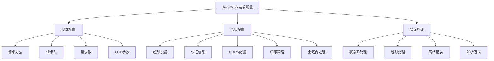

# JavaScript 请求配置

在Web开发中，网络请求是前端应用与后端服务器交互的关键方式。而请求配置则决定了这些交互的具体行为。本文将详细介绍JavaScript中如何配置网络请求，帮助你更好地控制数据传输过程。

## 请求配置基础

请求配置是指在发送网络请求时，对请求本身进行的各种参数设置，包括请求方法、头信息、超时时间等。通过合理配置，可以使网络请求更加安全、高效、稳定。

### 为什么需要配置请求？

- **控制请求行为**：决定请求的方式（GET、POST等）
- **传递元数据**：通过请求头传递认证信息、内容类型等
- **提升用户体验**：设置超时时间、处理错误等
- **性能优化**：配置缓存策略、压缩数据等

## 常见的请求配置选项

### 请求方法（Request Methods）

HTTP协议定义了多种请求方法，每种方法适用于不同的操作场景：

```javascript
// GET请求 - 获取资源
fetch('https://api.example.com/users', {
  method: 'GET' // GET是默认值，可以省略
});

// POST请求 - 创建资源
fetch('https://api.example.com/users', {
  method: 'POST',
  body: JSON.stringify({
    name: '张三',
    email: 'zhangsan@example.com'
  })
});

// PUT请求 - 更新资源
fetch('https://api.example.com/users/123', {
  method: 'PUT',
  body: JSON.stringify({
    name: '张三',
    email: 'zhangsan_new@example.com'
  })
});

// DELETE请求 - 删除资源
fetch('https://api.example.com/users/123', {
  method: 'DELETE'
});
```

:::tip
选择适当的请求方法是遵循RESTful API设计原则的重要部分，它使API的意图更加明确。
:::

### 请求头（Request Headers）

请求头包含了关于请求的元数据，如内容类型、认证信息等：

```javascript
fetch('https://api.example.com/data', {
  headers: {
    'Content-Type': 'application/json',        // 指定请求体格式
    'Authorization': 'Bearer your_token_here', // 认证信息
    'Accept-Language': 'zh-CN,zh;q=0.9',       // 语言偏好
    'User-Agent': 'My Custom App/1.0'          // 客户端标识
  }
});
```

常用的请求头包括：

- `Content-Type`: 指定请求体的MIME类型
- `Authorization`: 身份验证信息
- `Accept`: 客户端能够处理的内容类型
- `Cache-Control`: 缓存控制指令

### 请求体（Request Body）

对于POST、PUT等请求方法，通常需要在请求体中携带数据：

```javascript
// 发送JSON数据
fetch('https://api.example.com/users', {
  method: 'POST',
  headers: {
    'Content-Type': 'application/json'
  },
  body: JSON.stringify({
    name: '李四',
    age: 25,
    city: '上海'
  })
});

// 发送表单数据
const formData = new FormData();
formData.append('username', 'wangwu');
formData.append('avatar', fileInput.files[0]);

fetch('https://api.example.com/profile', {
  method: 'POST',
  body: formData  // FormData会自动设置正确的Content-Type
});
```

## 高级配置选项

### 超时设置

在Fetch API中，默认没有提供超时设置，但我们可以结合Promise.race()实现：

```javascript
// 设置5秒超时的fetch请求
const fetchWithTimeout = (url, options, timeout = 5000) => {
  return Promise.race([
    fetch(url, options),
    new Promise((_, reject) => 
      setTimeout(() => reject(new Error('请求超时')), timeout)
    )
  ]);
};

// 使用方式
fetchWithTimeout('https://api.example.com/data', {
  method: 'GET'
}, 3000)
  .then(response => response.json())
  .then(data => console.log(data))
  .catch(error => console.error('Error:', error));
```

### 跨域资源共享（CORS）设置

处理跨域请求时的配置：

```javascript
fetch('https://api.another-domain.com/data', {
  method: 'GET',
  mode: 'cors', // cors, no-cors, same-origin
  credentials: 'include' // include, same-origin, omit
});
```

`mode`选项：
- `cors`: 允许跨域请求（默认值）
- `no-cors`: 限制跨域请求，但可能导致无法读取响应体
- `same-origin`: 仅允许同源请求

`credentials`选项：
- `include`: 跨域请求时发送Cookie
- `same-origin`: 仅同源请求时发送Cookie
- `omit`: 不发送Cookie

### 缓存控制

控制浏览器如何缓存请求：

```javascript
fetch('https://api.example.com/data', {
  cache: 'no-cache' // default, no-store, reload, no-cache, force-cache, only-if-cached
});
```

常用的缓存策略：
- `default`: 使用浏览器默认缓存策略
- `no-store`: 不使用缓存
- `no-cache`: 验证缓存是否过期，过期则重新获取
- `force-cache`: 强制使用缓存，即使已过期
- `only-if-cached`: 仅使用缓存，没有则失败（仅在same-origin模式下有效）

## 使用Axios进行请求配置

Axios是一个流行的HTTP客户端库，提供了更简洁的API来配置请求：

```javascript
// 全局默认配置
axios.defaults.baseURL = 'https://api.example.com';
axios.defaults.timeout = 5000;
axios.defaults.headers.common['Authorization'] = 'Bearer token';

// 单次请求配置
axios.get('/users', {
  params: { // URL参数
    page: 1,
    limit: 10
  },
  timeout: 3000, // 覆盖默认超时设置
  headers: {
    'Accept-Language': 'zh-CN'
  }
})
.then(response => console.log(response.data))
.catch(error => console.error(error));

// 创建配置实例
const apiClient = axios.create({
  baseURL: 'https://api.another-service.com',
  timeout: 8000,
  headers: {
    'Content-Type': 'application/json',
    'X-Custom-Header': 'foobar'
  }
});

// 使用实例发送请求
apiClient.post('/orders', {
  product: 'laptop',
  quantity: 1
});
```

:::note
Axios相比原生Fetch，提供了更多开箱即用的功能，如请求/响应拦截、自动转换JSON数据、更好的错误处理等。
:::

## 实际应用案例

### 案例1：带认证的API请求

```javascript
// 登录功能
async function login(username, password) {
  try {
    const response = await fetch('https://api.example.com/login', {
      method: 'POST',
      headers: {
        'Content-Type': 'application/json'
      },
      body: JSON.stringify({ username, password })
    });
    
    if (!response.ok) {
      throw new Error('登录失败');
    }
    
    const data = await response.json();
    // 存储token
    localStorage.setItem('auth_token', data.token);
    
    return data;
  } catch (error) {
    console.error('登录出错:', error);
    throw error;
  }
}

// 获取需要认证的资源
async function fetchProtectedData() {
  const token = localStorage.getItem('auth_token');
  
  if (!token) {
    throw new Error('未登录');
  }
  
  try {
    const response = await fetch('https://api.example.com/protected-data', {
      headers: {
        'Authorization': `Bearer ${token}`
      }
    });
    
    if (response.status === 401) {
      // token失效，需要重新登录
      localStorage.removeItem('auth_token');
      throw new Error('会话已过期，请重新登录');
    }
    
    if (!response.ok) {
      throw new Error('请求失败');
    }
    
    return await response.json();
  } catch (error) {
    console.error('获取数据出错:', error);
    throw error;
  }
}
```

### 案例2：文件上传带进度监控

```javascript
function uploadFileWithProgress(file, onProgress) {
  return new Promise((resolve, reject) => {
    const xhr = new XMLHttpRequest();
    const formData = new FormData();
    
    formData.append('file', file);
    
    xhr.open('POST', 'https://api.example.com/upload', true);
    
    // 设置请求头（如果需要）
    xhr.setRequestHeader('Authorization', 'Bearer your_token');
    
    // 进度事件
    xhr.upload.addEventListener('progress', (event) => {
      if (event.lengthComputable) {
        const percentComplete = (event.loaded / event.total) * 100;
        onProgress(percentComplete);
      }
    });
    
    xhr.onload = function() {
      if (xhr.status >= 200 && xhr.status < 300) {
        resolve(JSON.parse(xhr.responseText));
      } else {
        reject(new Error(`上传失败，状态码: ${xhr.status}`));
      }
    };
    
    xhr.onerror = function() {
      reject(new Error('网络错误'));
    };
    
    xhr.send(formData);
  });
}

// 使用示例
const fileInput = document.getElementById('fileInput');
const uploadButton = document.getElementById('uploadButton');
const progressBar = document.getElementById('progressBar');

uploadButton.addEventListener('click', async () => {
  const file = fileInput.files[0];
  if (!file) {
    alert('请选择文件');
    return;
  }
  
  try {
    const result = await uploadFileWithProgress(file, (percent) => {
      progressBar.style.width = `${percent}%`;
      progressBar.textContent = `${Math.round(percent)}%`;
    });
    
    console.log('上传成功:', result);
  } catch (error) {
    console.error('上传错误:', error);
    alert(`上传失败: ${error.message}`);
  }
});
```

### 案例3：创建API请求客户端

```javascript
// 创建一个简单的API客户端
class ApiClient {
  constructor(baseURL) {
    this.baseURL = baseURL;
    this.defaultHeaders = {
      'Content-Type': 'application/json'
    };
  }

  setAuthToken(token) {
    this.defaultHeaders.Authorization = `Bearer ${token}`;
  }

  removeAuthToken() {
    delete this.defaultHeaders.Authorization;
  }

  async request(endpoint, options = {}) {
    const url = `${this.baseURL}${endpoint}`;
    
    const config = {
      ...options,
      headers: {
        ...this.defaultHeaders,
        ...options.headers
      }
    };

    try {
      const response = await fetch(url, config);
      
      // 检查HTTP状态
      if (!response.ok) {
        // 处理常见HTTP错误
        if (response.status === 401) {
          this.removeAuthToken();
          throw new Error('未授权，请重新登录');
        }
        
        const errorData = await response.json().catch(() => ({}));
        throw new Error(errorData.message || `请求失败，状态码: ${response.status}`);
      }
      
      // 检查内容类型，决定如何解析响应
      const contentType = response.headers.get('content-type');
      if (contentType && contentType.includes('application/json')) {
        return await response.json();
      } else {
        return await response.text();
      }
    } catch (error) {
      console.error('API请求错误:', error);
      throw error;
    }
  }

  // 便捷方法
  get(endpoint, params = {}) {
    const url = new URL(`${this.baseURL}${endpoint}`);
    Object.keys(params).forEach(key => {
      url.searchParams.append(key, params[key]);
    });
    
    return this.request(url.pathname + url.search, {
      method: 'GET'
    });
  }

  post(endpoint, data) {
    return this.request(endpoint, {
      method: 'POST',
      body: JSON.stringify(data)
    });
  }

  put(endpoint, data) {
    return this.request(endpoint, {
      method: 'PUT',
      body: JSON.stringify(data)
    });
  }

  delete(endpoint) {
    return this.request(endpoint, {
      method: 'DELETE'
    });
  }
}

// 使用示例
const api = new ApiClient('https://api.example.com');

// 登录
async function login(username, password) {
  try {
    const data = await api.post('/login', { username, password });
    api.setAuthToken(data.token);
    return data;
  } catch (error) {
    console.error('登录失败:', error);
    throw error;
  }
}

// 获取用户列表
async function getUsers() {
  try {
    return await api.get('/users', { page: 1, limit: 20 });
  } catch (error) {
    console.error('获取用户失败:', error);
    throw error;
  }
}
```

## 错误处理最佳实践

配置请求时，合理的错误处理是非常重要的：

```javascript
async function fetchData(url) {
  try {
    const response = await fetch(url);
    
    // 检查HTTP状态
    if (!response.ok) {
      // 根据状态码进行不同处理
      switch(response.status) {
        case 400:
          throw new Error('请求参数错误');
        case 401:
          throw new Error('未授权，请登录');
        case 403:
          throw new Error('禁止访问，权限不足');
        case 404:
          throw new Error('请求的资源不存在');
        case 500:
          throw new Error('服务器内部错误');
        default:
          throw new Error(`请求失败，状态码: ${response.status}`);
      }
    }
    
    // 尝试解析JSON响应
    try {
      return await response.json();
    } catch (parseError) {
      throw new Error('无法解析服务器响应');
    }
  } catch (error) {
    // 网络错误处理
    if (error.name === 'TypeError' && error.message === 'Failed to fetch') {
      console.error('网络请求失败，请检查您的网络连接');
    }
    
    // 重新抛出错误，便于上层处理
    throw error;
  }
}
```

## 请求配置图解

以下是JavaScript请求配置的主要组成部分：



## 总结

JavaScript请求配置是前端开发中一个重要的技能点，掌握它可以让你更好地控制网络请求的行为：

- 基本配置包括请求方法、请求头和请求体
- 高级配置涵盖超时设置、CORS、缓存控制等
- 合理的错误处理策略能够提升应用的稳定性和用户体验
- 封装请求客户端可以简化API调用并提高代码可维护性

通过本文的学习，你应该已经了解了如何在JavaScript中配置网络请求，以及如何应对常见的请求场景。

## 练习与进阶

1. 创建一个通用的请求函数，支持配置超时、重试和进度监控
2. 实现一个简单的API客户端类，封装常见的CRUD操作
3. 添加请求拦截器和响应拦截器功能，用于处理认证和错误
4. 模拟实现断点续传功能的文件上传

## 延伸阅读

- [MDN Fetch API文档](https://developer.mozilla.org/zh-CN/docs/Web/API/Fetch_API)
- [Axios文档](https://axios-http.com/zh/docs/intro)
- [HTTP状态码详解](https://developer.mozilla.org/zh-CN/docs/Web/HTTP/Status)
- [CORS完全指南](https://developer.mozilla.org/zh-CN/docs/Web/HTTP/CORS)

:::tip
请求配置是前端开发的基础技能，掌握它将使你能够构建更加健壮、高效的Web应用程序。持续学习和实践是提升这一技能的关键！
:::