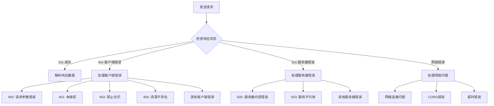

# JavaScript 响应处理

在网络编程中，发送请求只是第一步，合理地处理服务器返回的响应数据是确保应用程序健壮性的关键。本文将详细介绍JavaScript中如何有效地处理网络请求的响应。

## 响应处理的基础知识

当我们发送一个网络请求后，服务器会返回一个响应对象，这个对象包含了状态码、响应头和响应体等信息。作为开发者，我们需要正确地解析这些信息，并根据不同情况采取相应的操作。

### 响应对象的结构

一个典型的响应对象包含以下关键部分：

1. **状态码（Status Code）**：表示请求的结果状态，如200（成功）、404（未找到）等
2. **响应头（Headers）**：包含有关响应的元数据，如内容类型、长度等
3. **响应体（Body）**：包含实际的数据内容，可以是JSON、文本、二进制数据等

## 使用Fetch API处理响应

Fetch API是现代JavaScript中处理网络请求的标准方式。下面我们将探讨如何使用它来处理不同类型的响应。

### 基本响应处理

```javascript
fetch('https://api.example.com/data')
  .then(response => {
    // 检查响应状态
    if (!response.ok) {
      throw new Error(`HTTP error! Status: ${response.status}`);
    }
    // 解析JSON响应
    return response.json();
  })
  .then(data => {
    // 处理数据
    console.log('Success:', data);
  })
  .catch(error => {
    // 处理错误
    console.error('Error:', error);
  });
```

在这个例子中，我们首先检查`response.ok`属性（当状态码在200-299范围内时为true），然后解析JSON数据。如果任何一步出错，将会跳转到catch块处理错误。

### 检查响应状态

状态码是了解请求是否成功的关键指标：

```javascript
fetch('https://api.example.com/data')
  .then(response => {
    // 详细的状态码检查
    if (response.status === 200) {
      return response.json();
    } else if (response.status === 404) {
      throw new Error('Resource not found');
    } else if (response.status === 500) {
      throw new Error('Server error');
    } else {
      throw new Error(`Unexpected status: ${response.status}`);
    }
  })
  .then(data => console.log(data))
  .catch(error => console.error(error));
```

### 读取响应头

响应头包含了服务器返回的重要元信息：

```javascript
fetch('https://api.example.com/data')
  .then(response => {
    // 读取特定的响应头
    console.log('Content-Type:', response.headers.get('Content-Type'));
    console.log('Content-Length:', response.headers.get('Content-Length'));
    
    // 遍历所有响应头
    response.headers.forEach((value, name) => {
      console.log(`${name}: ${value}`);
    });
    
    return response.json();
  })
  .then(data => console.log(data))
  .catch(error => console.error(error));
```

## 处理不同类型的响应数据

服务器可能返回多种格式的数据，JavaScript提供了多种方法来处理这些不同类型的响应。

### JSON数据

JSON是最常见的响应格式：

```javascript
fetch('https://api.example.com/data')
  .then(response => response.json())
  .then(data => {
    console.log('Parsed JSON:', data);
    // 现在可以像操作JavaScript对象一样操作数据
    console.log('User name:', data.user.name);
  })
  .catch(error => console.error('JSON parsing error:', error));
```

### 文本数据

处理纯文本响应：

```javascript
fetch('https://api.example.com/text')
  .then(response => response.text())
  .then(text => {
    console.log('Text response:', text);
    // 处理文本内容
  })
  .catch(error => console.error('Error:', error));
```

### 二进制数据

处理图片等二进制数据：

```javascript
fetch('https://api.example.com/image')
  .then(response => response.blob())
  .then(blob => {
    const imageUrl = URL.createObjectURL(blob);
    const imgElement = document.createElement('img');
    imgElement.src = imageUrl;
    document.body.appendChild(imgElement);
  })
  .catch(error => console.error('Error:', error));
```

### FormData

处理表单数据：

```javascript
fetch('https://api.example.com/form-data')
  .then(response => response.formData())
  .then(formData => {
    // 处理表单数据
    console.log('Form field value:', formData.get('fieldName'));
  })
  .catch(error => console.error('Error:', error));
```

## 使用async/await简化响应处理

使用async/await可以让网络请求代码更加清晰和可读：

```javascript
async function fetchData() {
  try {
    const response = await fetch('https://api.example.com/data');
    
    if (!response.ok) {
      throw new Error(`HTTP error! Status: ${response.status}`);
    }
    
    const data = await response.json();
    console.log('Data received:', data);
    return data;
  } catch (error) {
    console.error('Fetching error:', error);
    throw error; // 重新抛出错误以便上层处理
  }
}

// 使用该函数
fetchData()
  .then(data => {
    // 进一步处理数据
  })
  .catch(error => {
    // 处理错误
  });
```

:::tip
使用async/await时，务必记得使用try/catch来捕获可能的错误，这样可以避免未处理的Promise拒绝。
:::

## 超时处理

Fetch API本身不支持请求超时，但我们可以使用Promise.race方法实现这一功能：

```javascript
function fetchWithTimeout(url, options = {}, timeout = 5000) {
  return Promise.race([
    fetch(url, options),
    new Promise((_, reject) =>
      setTimeout(() => reject(new Error('Request timed out')), timeout)
    )
  ]);
}

// 使用带超时的fetch
fetchWithTimeout('https://api.example.com/data', {}, 3000)
  .then(response => response.json())
  .then(data => console.log(data))
  .catch(error => console.error('Error or timeout:', error));
```

## 实际应用案例

### 案例1：用户登录系统

下面是一个用户登录系统的响应处理示例：

```javascript
async function loginUser(username, password) {
  try {
    const response = await fetch('https://api.example.com/login', {
      method: 'POST',
      headers: {
        'Content-Type': 'application/json'
      },
      body: JSON.stringify({ username, password })
    });

    // 检查HTTP状态
    if (response.status === 401) {
      return { success: false, message: '用户名或密码错误' };
    } else if (!response.ok) {
      return { success: false, message: `服务器错误: ${response.status}` };
    }

    const data = await response.json();
    
    // 保存身份验证令牌
    if (data.token) {
      localStorage.setItem('authToken', data.token);
      return { success: true, user: data.user };
    } else {
      return { success: false, message: '登录成功但未收到令牌' };
    }
  } catch (error) {
    console.error('登录过程中发生错误:', error);
    return { success: false, message: '网络错误，请稍后重试' };
  }
}

// 使用登录函数
document.getElementById('loginForm').addEventListener('submit', async (e) => {
  e.preventDefault();
  const username = document.getElementById('username').value;
  const password = document.getElementById('password').value;
  
  const result = await loginUser(username, password);
  
  if (result.success) {
    document.getElementById('message').textContent = `欢迎, ${result.user.name}!`;
    window.location.href = '/dashboard';
  } else {
    document.getElementById('message').textContent = result.message;
  }
});
```

### 案例2：天气数据展示应用

```javascript
async function getWeatherData(city) {
  const apiKey = 'your_api_key'; // 在实际应用中使用环境变量存储
  
  try {
    const response = await fetch(
      `https://api.weatherapi.com/v1/current.json?key=${apiKey}&q=${encodeURIComponent(city)}`
    );
    
    if (!response.ok) {
      if (response.status === 400) {
        throw new Error('无效的城市名');
      } else if (response.status === 403) {
        throw new Error('API密钥无效');
      } else {
        throw new Error('获取天气数据失败');
      }
    }
    
    const data = await response.json();
    return {
      temperature: data.current.temp_c,
      condition: data.current.condition.text,
      humidity: data.current.humidity,
      windSpeed: data.current.wind_kph
    };
  } catch (error) {
    console.error('获取天气数据时出错:', error);
    throw error;
  }
}

// 使用该函数更新UI
document.getElementById('weatherForm').addEventListener('submit', async (e) => {
  e.preventDefault();
  const city = document.getElementById('cityInput').value;
  const weatherDisplay = document.getElementById('weatherDisplay');
  
  try {
    weatherDisplay.textContent = '加载中...';
    const weatherData = await getWeatherData(city);
    
    weatherDisplay.innerHTML = `
      <h3>${city}的天气</h3>
      <p>温度: ${weatherData.temperature}°C</p>
      <p>天气状况: ${weatherData.condition}</p>
      <p>湿度: ${weatherData.humidity}%</p>
      <p>风速: ${weatherData.windSpeed} km/h</p>
    `;
  } catch (error) {
    weatherDisplay.textContent = `错误: ${error.message}`;
  }
});
```

## 响应处理的最佳实践

以下是一些处理网络响应的最佳实践：

1. **始终进行错误处理**：使用try/catch或.catch()捕获可能的错误
2. **检查响应状态**：不要假设每个请求都会成功
3. **解析数据前验证数据类型**：使用适当的方法解析不同类型的响应体
4. **实现请求超时**：避免长时间挂起的请求
5. **使用合适的HTTP状态码**：根据不同的HTTP状态码采取不同的行动
6. **重试机制**：对于暂时性错误，实现重试逻辑

```javascript
// 实现重试逻辑的例子
async function fetchWithRetry(url, options = {}, maxRetries = 3) {
  let retries = 0;
  while (retries < maxRetries) {
    try {
      const response = await fetch(url, options);
      if (response.ok) return response;
      
      // 只对服务器错误(5xx)进行重试
      if (response.status >= 500) {
        retries++;
        console.log(`请求失败，正在进行第${retries}次重试...`);
        await new Promise(resolve => setTimeout(resolve, 1000 * retries));
      } else {
        // 对于其他类型的错误，不重试
        return response;
      }
    } catch (error) {
      // 对网络错误进行重试
      retries++;
      if (retries >= maxRetries) {
        throw error;
      }
      console.log(`网络错误，正在进行第${retries}次重试...`);
      await new Promise(resolve => setTimeout(resolve, 1000 * retries));
    }
  }
}
```

## 常见错误及处理方式

下面是一些常见的网络请求错误及其处理方式：



### 处理CORS错误

跨源资源共享(CORS)错误是前端开发中常见的问题：

```javascript
fetch('https://api.example.com/data')
  .then(response => response.json())
  .catch(error => {
    if (error instanceof TypeError && error.message.includes('CORS')) {
      console.error('CORS错误：确保服务器允许跨源请求');
      // 显示友好的错误消息
      document.getElementById('error').textContent = 
        '无法从服务器加载数据，可能是由于跨源限制。';
    } else {
      console.error('其他错误:', error);
    }
  });
```

:::warning
CORS是一种服务器端的安全机制，客户端无法绕过它。解决CORS问题通常需要服务器配置适当的响应头。
:::

## 总结

有效地处理JavaScript中的网络响应是构建健壮Web应用的关键技能。通过本文，我们学习了：

1. 理解响应对象的基本结构
2. 使用Fetch API处理不同类型的响应数据
3. 实现错误处理和状态码检查
4. 使用async/await简化异步代码
5. 处理实际应用场景中的响应数据
6. 遵循响应处理的最佳实践

掌握这些技能将帮助你构建更加可靠和用户友好的Web应用程序。

## 练习

1. 创建一个简单的应用，从公共API获取数据并显示在页面上，处理所有可能的错误情况。
2. 实现一个带有超时和重试机制的网络请求函数。
3. 构建一个表单提交系统，处理不同类型的服务器响应，包括成功、验证错误和服务器错误。

## 进一步学习的资源

- [MDN Web Docs: Fetch API](https://developer.mozilla.org/en-US/docs/Web/API/Fetch_API)
- [MDN Web Docs: Response](https://developer.mozilla.org/en-US/docs/Web/API/Response)
- [JavaScript.info: Network Requests](https://javascript.info/network)
- [HTTP状态码参考](https://developer.mozilla.org/en-US/docs/Web/HTTP/Status)

通过持续学习和实践，你将能够熟练地处理各种网络请求场景，为用户提供流畅的应用体验。