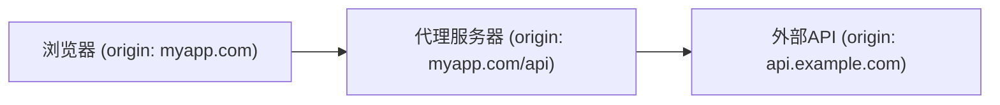

# JavaScript 跨域请求

## 什么是跨域请求

在Web开发中，出于安全考虑，浏览器实施了**同源策略**（Same-Origin Policy），这是一个重要的安全机制，它限制了从一个源加载的文档或脚本如何与来自另一个源的资源进行交互。

:::note 同源定义
两个URL的协议、域名和端口都相同，则它们被认为是**同源**的。
:::

例如，下面这些URL与`https://example.com/page.html`的比较：

| URL | 是否同源 | 原因 |
|-----|---------|------|
| `https://example.com/about.html` | ✅ 是 | 仅路径不同 |
| `https://example.com:443/page.html` | ✅ 是 | 443是HTTPS的默认端口 |
| `http://example.com/page.html` | ❌ 否 | 协议不同 (http vs https) |
| `https://sub.example.com/page.html` | ❌ 否 | 子域名不同 |
| `https://example.org/page.html` | ❌ 否 | 域名不同 |
| `https://example.com:8080/page.html` | ❌ 否 | 端口不同 |

当你的JavaScript代码尝试向不同源的服务器发送请求时，就会发生**跨域请求**。这些请求默认会被浏览器的同源策略阻止。

## 为什么存在跨域限制

跨域限制主要是为了保护用户安全和隐私：

1. **防止恶意网站读取其他网站的敏感数据**：如果没有跨域限制，恶意网站可能会读取用户在其他站点的私人信息。
2. **防止CSRF攻击**（Cross-Site Request Forgery）：这类攻击利用用户在受信任网站的登录状态执行未授权的操作。
3. **数据隔离**：确保不同的网站之间的数据保持隔离。

## 跨域请求的常见错误

当你尝试进行跨域请求时，可能会在浏览器控制台中看到类似这样的错误：

```
Access to fetch at 'https://api.example.com/data' from origin 'https://myapp.com' 
has been blocked by CORS policy: No 'Access-Control-Allow-Origin' header is present 
on the requested resource.
```

这说明你的请求因为跨域限制而被阻止了。

## 解决跨域问题的主要方法

### 1. CORS (Cross-Origin Resource Sharing)

CORS是最常用的跨域解决方案，它通过添加HTTP头来告诉浏览器允许一个域的网页访问不同源的资源。

CORS的工作原理是在服务器端添加特定的HTTP响应头：

```
Access-Control-Allow-Origin: https://myapp.com
Access-Control-Allow-Methods: GET, POST, PUT
Access-Control-Allow-Headers: Content-Type
Access-Control-Allow-Credentials: true
```

#### 简单请求示例

对于简单请求（如GET或简单的POST请求），CORS处理相对直接：

```javascript
// 前端代码
fetch('https://api.example.com/data')
  .then(response => response.json())
  .then(data => console.log(data))
  .catch(error => console.error('Error:', error));
```

在服务器端（以Express为例）：

```javascript
// 后端代码 (Node.js + Express)
const express = require('express');
const app = express();

app.use((req, res, next) => {
  res.header('Access-Control-Allow-Origin', 'https://myapp.com');
  res.header('Access-Control-Allow-Headers', 'Content-Type');
  next();
});

app.get('/data', (req, res) => {
  res.json({ message: "这是来自服务器的数据" });
});

app.listen(3000, () => {
  console.log('服务器运行在3000端口');
});
```

#### 预检请求

对于"非简单请求"（如使用PUT方法或自定义头的请求），浏览器会首先发送一个"预检"OPTIONS请求：

```javascript
// 前端代码 - 发送包含自定义头的PUT请求
fetch('https://api.example.com/update-data', {
  method: 'PUT',
  headers: {
    'Content-Type': 'application/json',
    'X-Custom-Header': 'value'
  },
  body: JSON.stringify({ key: 'value' })
})
  .then(response => response.json())
  .then(data => console.log('Success:', data))
  .catch(error => console.error('Error:', error));
```

服务器需要处理OPTIONS请求：

```javascript
// 后端代码 (Node.js + Express)
app.use((req, res, next) => {
  res.header('Access-Control-Allow-Origin', 'https://myapp.com');
  res.header('Access-Control-Allow-Methods', 'GET, POST, PUT, DELETE');
  res.header('Access-Control-Allow-Headers', 'Content-Type, X-Custom-Header');
  
  // 处理预检请求
  if (req.method === 'OPTIONS') {
    return res.status(200).end();
  }
  next();
});
```

### 2. JSONP (JSON with Padding)

JSONP是一个较老但仍有效的技术，它利用`<script>`标签不受同源策略限制的特性：

```javascript
function handleResponse(data) {
  console.log('收到的数据:', data);
}

// 动态创建一个script标签
const script = document.createElement('script');
script.src = 'https://api.example.com/data?callback=handleResponse';
document.body.appendChild(script);
```

服务器端需要相应地包装JSON数据：

```javascript
// 服务器端伪代码
const data = { name: "John", age: 30 };
const callback = req.query.callback;
res.send(`${callback}(${JSON.stringify(data)})`);
```

:::caution 注意
JSONP只支持GET请求，且存在安全隐患，因为它会执行服务器返回的任何JavaScript代码。在现代Web开发中，通常更推荐使用CORS。
:::

### 3. 代理服务器

通过在同源的服务器上设置代理，可以间接地获取跨域资源：



前端代码：
```javascript
// 请求发送到同源的代理路径
fetch('/api/proxy/data')
  .then(response => response.json())
  .then(data => console.log(data))
  .catch(error => console.error('Error:', error));
```

代理服务器代码（Node.js示例）：
```javascript
// 后端代理代码
const express = require('express');
const axios = require('axios');
const app = express();

app.get('/api/proxy/data', async (req, res) => {
  try {
    // 从代理服务器发送请求到目标API
    const response = await axios.get('https://api.example.com/data');
    // 转发响应回前端
    res.json(response.data);
  } catch (error) {
    res.status(500).json({ error: '代理请求失败' });
  }
});

app.listen(3000);
```

### 4. WebSockets

WebSockets协议提供了一个全双工通信通道，一旦建立连接，就不受同源策略限制：

```javascript
// 建立WebSocket连接
const socket = new WebSocket('wss://api.example.com/socket');

// 连接建立时的事件
socket.onopen = function(event) {
  console.log('连接已建立');
  socket.send('Hello Server!');
};

// 接收消息的事件
socket.onmessage = function(event) {
  console.log('收到消息: ' + event.data);
};

// 关闭连接的事件
socket.onclose = function(event) {
  console.log('连接已关闭');
};
```

### 5. 使用postMessage API

对于iframe之间的通信，可以使用`window.postMessage`方法：

```javascript
// 在父页面中发送消息到iframe
const iframe = document.getElementById('myIframe');
iframe.onload = () => {
  iframe.contentWindow.postMessage('Hello from parent!', 'https://iframe-domain.com');
};

// 在iframe中接收消息
window.addEventListener('message', event => {
  // 验证消息来源
  if (event.origin !== 'https://parent-domain.com') return;
  
  console.log('收到消息:', event.data);
  // 可以向父页面回复
  event.source.postMessage('Hello from iframe!', event.origin);
});
```

## 实际案例：构建跨域API调用的天气应用

下面是一个简单的实际案例，展示如何使用CORS从前端JavaScript应用调用一个公共天气API：

### 前端代码：

```html
<!DOCTYPE html>
<html lang="zh">
<head>
  <meta charset="UTF-8">
  <title>天气查询应用</title>
  <style>
    body { font-family: Arial, sans-serif; max-width: 600px; margin: 0 auto; padding: 20px; }
    .weather-card { border: 1px solid #ddd; padding: 15px; border-radius: 5px; margin-top: 20px; }
  </style>
</head>
<body>
  <h1>城市天气查询</h1>
  
  <div>
    <input type="text" id="cityInput" placeholder="输入城市名称">
    <button onclick="getWeather()">查询</button>
  </div>
  
  <div id="weatherResult" class="weather-card" style="display: none;"></div>
  
  <script>
    function getWeather() {
      const city = document.getElementById('cityInput').value;
      if (!city) {
        alert('请输入城市名称');
        return;
      }
      
      const resultDiv = document.getElementById('weatherResult');
      resultDiv.innerHTML = '加载中...';
      resultDiv.style.display = 'block';
      
      // 请注意：这是一个假设的API密钥和URL，实际使用时需要替换
      const apiKey = 'YOUR_API_KEY';
      const apiUrl = `https://api.openweathermap.org/data/2.5/weather?q=${city}&appid=${apiKey}&units=metric`;
      
      fetch(apiUrl)
        .then(response => {
          if (!response.ok) {
            throw new Error('网络响应异常');
          }
          return response.json();
        })
        .then(data => {
          resultDiv.innerHTML = `
            <h2>${data.name}, ${data.sys.country}</h2>
            <p>温度: ${data.main.temp}°C</p>
            <p>感受温度: ${data.main.feels_like}°C</p>
            <p>天气状况: ${data.weather[0].description}</p>
            <p>湿度: ${data.main.humidity}%</p>
            <p>风速: ${data.wind.speed} m/s</p>
          `;
        })
        .catch(error => {
          resultDiv.innerHTML = `<p style="color: red;">发生错误: ${error.message}</p>`;
        });
    }
  </script>
</body>
</html>
```

### 分析：

1. 这个应用使用`fetch` API向OpenWeatherMap的公共API发送跨域请求。
2. 该API已实现CORS，允许从任何源发送请求（通过设置`Access-Control-Allow-Origin: *`头）。
3. 如果API没有实现CORS，我们可能需要使用上述其他方法（如代理服务器）来获取数据。

## 最佳实践

1. **优先使用CORS**：这是最现代、最安全的跨域解决方案。
2. **确保安全**：不要过于宽松地设置CORS头（如使用`Access-Control-Allow-Origin: *`），除非必要。
3. **可能时使用代理**：对于敏感操作，使用服务器端代理可能更安全。
4. **验证消息来源**：使用`postMessage`时，始终验证消息的来源。
5. **处理错误**：确保你的代码能够优雅地处理跨域错误。

## 总结

跨域请求是Web开发中常见的挑战，了解它们的工作原理和解决方法对于构建现代Web应用至关重要：

1. **同源策略**是浏览器的安全机制，限制了不同源之间的交互。
2. **CORS**是现代Web开发中处理跨域请求的标准方法。
3. 其他解决方案包括JSONP（较旧但仍有用）、代理服务器、WebSockets和postMessage API。
4. 每种方法都有其优缺点，选择取决于你的具体需求和安全考虑。

## 练习与深入学习

1. 尝试使用本文中的代码示例创建一个简单的跨域请求应用。
2. 实验不同的CORS设置，观察它们如何影响你的应用。
3. 构建一个使用代理服务器的应用，从不支持CORS的第三方API获取数据。

### 附加资源

- [MDN Web Docs: 同源策略](https://developer.mozilla.org/zh-CN/docs/Web/Security/Same-origin_policy)
- [MDN Web Docs: CORS](https://developer.mozilla.org/zh-CN/docs/Web/HTTP/CORS)
- [CORS详解：当浏览器遇上跨源请求](https://web.dev/cross-origin-resource-sharing/)
- [使用Fetch API](https://developer.mozilla.org/zh-CN/docs/Web/API/Fetch_API/Using_Fetch)