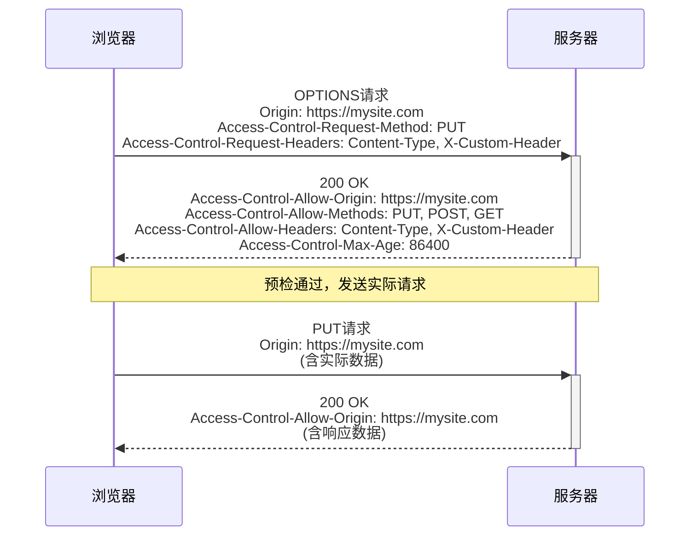

# JavaScript CORS

## 什么是CORS？

**CORS**（Cross-Origin Resource Sharing，跨源资源共享）是一种安全机制，允许一个网站的资源（如JavaScript、API等）在浏览器中请求另一个不同"源"（origin）的资源。

在了解CORS之前，我们首先要理解**同源策略**（Same-Origin Policy）。

### 同源策略

同源策略是浏览器的一种重要安全机制，它限制了来自一个源的文档或脚本如何与另一个源的资源进行交互。"同源"指的是相同的协议、主机名和端口号。

例如：

- `https://example.com/page1.html` 和 `https://example.com/page2.html` 是同源的
- `https://example.com` 和 `http://example.com` 不同源（协议不同）
- `https://example.com` 和 `https://api.example.com` 不同源（子域名不同）
- `https://example.com` 和 `https://example.com:8080` 不同源（端口不同）

:::note
同源策略是浏览器的默认行为，它阻止JavaScript从一个源向另一个源发送请求，以保护用户免受恶意网站的攻击。
:::

### 为什么需要CORS？

随着Web应用的发展，单一源的限制变得越来越不实用。例如：

- 前端应用可能需要访问托管在不同域名下的API
- 微服务架构中，各个服务可能运行在不同的域名上
- CDN（内容分发网络）常常使用不同的域名

CORS提供了一种安全的方式来放宽同源策略的限制，允许特定的跨域请求。

## CORS的工作原理

CORS通过HTTP头信息来工作，允许服务器声明哪些源可以访问其资源。

### 简单请求

满足以下条件的请求被称为"简单请求"：

1. HTTP方法是`GET`、`HEAD`或`POST`
2. 只包含被允许的头部信息
3. Content-Type只限于`application/x-www-form-urlencoded`、`multipart/form-data`或`text/plain`

对于简单请求，浏览器会自动添加`Origin`头部，服务器会返回`Access-Control-Allow-Origin`头部来指示允许哪些源访问资源。

```javascript
// 前端代码 - 简单请求示例
fetch('https://api.example.com/data', {
  method: 'GET',
  headers: {
    'Content-Type': 'application/x-www-form-urlencoded'
  }
})
.then(response => response.json())
.then(data => console.log(data))
.catch(error => console.error('Error:', error));
```

服务器响应示例：

```
HTTP/1.1 200 OK
Access-Control-Allow-Origin: https://mywebsite.com
Content-Type: application/json

{"message": "这是来自跨域API的数据"}
```

### 预检请求

对于非简单请求（如使用`PUT`、`DELETE`方法，或发送`application/json`格式的数据），浏览器会先发送一个OPTIONS预检请求（preflight request）。

预检请求的流程：

1. 浏览器自动发送OPTIONS请求，包含以下头部：
   - `Origin`: 请求的源
   - `Access-Control-Request-Method`: 实际请求将使用的HTTP方法
   - `Access-Control-Request-Headers`: 实际请求将发送的自定义头部

2. 服务器响应是否允许该请求，通过返回：
   - `Access-Control-Allow-Origin`: 允许的源
   - `Access-Control-Allow-Methods`: 允许的HTTP方法
   - `Access-Control-Allow-Headers`: 允许的头部
   - `Access-Control-Max-Age`: 预检请求的缓存时间

3. 如果预检请求被允许，浏览器才会发送实际请求

```javascript
// 前端代码 - 会触发预检请求的例子
fetch('https://api.example.com/data', {
  method: 'PUT',
  headers: {
    'Content-Type': 'application/json',
    'X-Custom-Header': 'value'
  },
  body: JSON.stringify({ key: 'value' })
})
.then(response => response.json())
.then(data => console.log(data))
.catch(error => console.error('Error:', error));
```



### 携带凭证的请求

默认情况下，跨域请求不会发送cookies或HTTP认证信息。如果需要发送这些凭证，你需要：

1. 在前端设置`credentials: 'include'`
2. 服务器必须设置`Access-Control-Allow-Credentials: true`
3. 服务器的`Access-Control-Allow-Origin`不能使用通配符`*`，必须明确指定源

```javascript
// 前端代码 - 带凭证的请求
fetch('https://api.example.com/user-data', {
  method: 'GET',
  credentials: 'include'  // 发送cookies等凭证
})
.then(response => response.json())
.then(data => console.log(data))
.catch(error => console.error('Error:', error));
```

服务器响应：

```
HTTP/1.1 200 OK
Access-Control-Allow-Origin: https://mywebsite.com
Access-Control-Allow-Credentials: true
Content-Type: application/json

{"username": "john_doe", "email": "john@example.com"}
```

## 常见的CORS错误和解决方案

### 错误信息解读

当CORS策略阻止请求时，浏览器会在控制台输出类似以下的错误：

```
Access to fetch at 'https://api.example.com/data' from origin 'https://mywebsite.com' 
has been blocked by CORS policy: No 'Access-Control-Allow-Origin' header is present on 
the requested resource.
```

### 解决方案

#### 前端解决方案（临时开发环境）

1. **使用代理服务器**：
   在开发阶段，可以配置开发服务器作为代理，转发API请求。

   例如，使用Create React App的proxy配置：

   ```json
   // package.json
   {
     "name": "my-app",
     "proxy": "https://api.example.com"
   }
   ```

   这样，当你请求`/data`时，实际上会被代理到`https://api.example.com/data`。

2. **浏览器插件或扩展**：
   仅用于开发测试，不适合生产环境。

#### 后端解决方案（推荐）

正确的解决方案是在服务器端配置CORS头部：

**Node.js (Express) 示例**：

```javascript
const express = require('express');
const cors = require('cors');
const app = express();

// 允许所有源访问（不推荐用于生产环境）
app.use(cors());

// 或者配置特定选项
app.use(cors({
  origin: 'https://mywebsite.com',  // 允许特定源
  methods: ['GET', 'POST', 'PUT'],  // 允许的HTTP方法
  allowedHeaders: ['Content-Type', 'Authorization'], // 允许的头部
  credentials: true  // 允许发送凭证
}));

app.get('/data', (req, res) => {
  res.json({ message: "这是API数据" });
});

app.listen(3000, () => {
  console.log('服务器运行在3000端口');
});
```

**Python (Flask) 示例**：

```python
from flask import Flask
from flask_cors import CORS

app = Flask(__name__)
CORS(app, resources={r"/api/*": {"origins": "https://mywebsite.com"}})

@app.route('/api/data')
def get_data():
    return {"message": "这是API数据"}

if __name__ == '__main__':
    app.run(debug=True)
```

## 实际应用案例

### 案例1：前端应用调用第三方API

假设你正在开发一个天气应用，需要从第三方气象API获取数据：

```javascript
// 天气应用 - 获取天气数据
async function getWeatherData(city) {
  try {
    const response = await fetch(`https://weather-api.example.com/forecast?city=${city}`, {
      method: 'GET',
      headers: {
        'API-Key': 'your_api_key_here'
      }
    });
    
    if (!response.ok) {
      throw new Error(`HTTP error! status: ${response.status}`);
    }
    
    const data = await response.json();
    displayWeather(data);
  } catch (error) {
    console.error('获取天气数据失败:', error);
    showErrorMessage('无法加载天气信息，请稍后再试');
  }
}

function displayWeather(data) {
  // 显示天气信息
  document.getElementById('temperature').textContent = `${data.temperature}°C`;
  document.getElementById('condition').textContent = data.condition;
  // 更多显示逻辑...
}

function showErrorMessage(message) {
  const errorElement = document.getElementById('error-message');
  errorElement.textContent = message;
  errorElement.style.display = 'block';
}

// 当用户搜索城市时调用
document.getElementById('search-form').addEventListener('submit', function(e) {
  e.preventDefault();
  const city = document.getElementById('city-input').value;
  getWeatherData(city);
});
```

在这个案例中，如果气象API没有正确配置CORS，请求会失败。API提供者需要在服务器端添加适当的CORS头部。

### 案例2：微服务架构中的前端

假设你的应用使用微服务架构，有多个服务运行在不同的域名上：

- 主网站：`https://myapp.com`
- 用户服务：`https://users-api.myapp.com`
- 产品服务：`https://products-api.myapp.com`

前端代码可能如下：

```javascript
// 用户登录
async function login(email, password) {
  try {
    const response = await fetch('https://users-api.myapp.com/login', {
      method: 'POST',
      headers: {
        'Content-Type': 'application/json'
      },
      credentials: 'include',  // 发送和接收cookies
      body: JSON.stringify({ email, password })
    });
    
    const data = await response.json();
    if (data.success) {
      showDashboard();
      loadProducts();  // 登录成功后加载产品
    } else {
      showLoginError(data.message);
    }
  } catch (error) {
    console.error('登录失败:', error);
  }
}

// 加载产品列表
async function loadProducts() {
  try {
    const response = await fetch('https://products-api.myapp.com/products', {
      method: 'GET',
      credentials: 'include'  // 发送身份验证cookie
    });
    
    const products = await response.json();
    displayProducts(products);
  } catch (error) {
    console.error('加载产品失败:', error);
  }
}

function displayProducts(products) {
  const container = document.getElementById('products-container');
  container.innerHTML = '';
  
  products.forEach(product => {
    const productElement = document.createElement('div');
    productElement.className = 'product-card';
    productElement.innerHTML = `
      <h3>${product.name}</h3>
      <p>${product.description}</p>
      <span class="price">$${product.price}</span>
      <button onclick="addToCart(${product.id})">添加到购物车</button>
    `;
    container.appendChild(productElement);
  });
}
```

在这个案例中，两个API服务都需要配置CORS以允许来自`https://myapp.com`的请求，并且允许带凭证的请求。

## 总结

CORS是现代Web开发中不可或缺的安全机制，它使得跨域请求成为可能，同时保持了网络安全。理解CORS的主要概念：

- **同源策略**是浏览器的默认安全机制
- **简单请求**直接发送，而**非简单请求**需要先发送**预检请求**
- CORS通过HTTP头部控制，主要是`Access-Control-Allow-Origin`等
- 处理**带凭证的请求**需要特殊配置
- 解决CORS问题的最佳方法是在服务器端正确配置CORS头部

### 练习

1. 创建一个简单的HTML页面，使用`fetch`向公共API（如JSONPlaceholder）发送请求，并观察浏览器控制台中的CORS行为。

2. 使用Node.js和Express设置一个简单的API服务器，配置CORS以允许来自特定域的请求。

3. 尝试发送一个带有自定义头部的跨域请求，观察预检请求的行为。

### 附加资源

- [MDN Web Docs: CORS](https://developer.mozilla.org/en-US/docs/Web/HTTP/CORS)
- [CORS规范](https://www.w3.org/TR/cors/)
- [Express CORS中间件](https://github.com/expressjs/cors)

:::tip
记住，CORS是由服务器控制的，作为前端开发者，你可能需要与后端团队协作来解决CORS问题。
:::