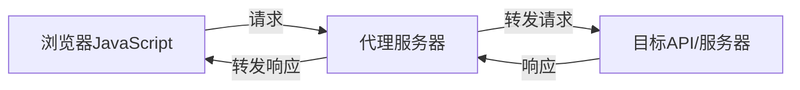

# JavaScript 代理请求

## 什么是代理请求？

在Web开发中，**代理请求**是指通过中间服务器转发HTTP请求的过程。当浏览器端JavaScript无法直接向某个目标服务器发送请求时（通常由于跨域资源共享CORS限制），我们可以通过代理服务器作为中介来转发这些请求。

:::note 基本概念
代理服务器接收来自客户端的请求，然后代表客户端向目标服务器发送请求，最后将响应返回给客户端。
:::



## 为什么需要代理请求？

### 1. 解决跨域问题

浏览器的**同源策略**限制了从一个源加载的文档或脚本如何与来自另一个源的资源进行交互。使用代理服务器可以绕过这一限制。

### 2. 隐藏API密钥

当你需要使用API密钥访问第三方服务时，将密钥暴露在前端代码中是不安全的。通过代理服务器，你可以在服务器端安全地存储和使用这些密钥。

### 3. 聚合多个API

代理可以帮助你整合来自多个API的数据，并将其作为单一响应返回给前端。

### 4. 修改请求/响应

代理可以在转发请求前修改请求头或请求体，或在返回响应前修改响应数据。

## 实现代理请求的方法

### 方法1: 使用后端服务器作为代理

最常见的方法是设置一个后端服务器（如Node.js、PHP或Python服务器）作为代理。

#### Node.js代理服务器示例

```javascript
// 使用Express和axios创建简单的代理服务器
const express = require('express');
const axios = require('axios');
const app = express();
const port = 3000;

app.use(express.json());

// 设置CORS头，允许前端访问
app.use((req, res, next) => {
  res.header('Access-Control-Allow-Origin', '*');
  res.header('Access-Control-Allow-Methods', 'GET, POST, PUT, DELETE');
  res.header('Access-Control-Allow-Headers', 'Content-Type, Authorization');
  next();
});

// 代理API路由
app.get('/api/proxy', async (req, res) => {
  try {
    // 从查询参数中获取目标URL
    const targetUrl = req.query.url;
    
    if (!targetUrl) {
      return res.status(400).json({ error: '缺少目标URL参数' });
    }
    
    // 发送请求到目标URL
    const response = await axios.get(targetUrl);
    
    // 将响应发送回客户端
    res.json(response.data);
  } catch (error) {
    res.status(500).json({ 
      error: '代理请求失败', 
      message: error.message 
    });
  }
});

app.listen(port, () => {
  console.log(`代理服务器运行在 http://localhost:${port}`);
});
```

#### 前端使用代理的示例

```javascript
// 使用Fetch API通过代理服务器获取数据
async function fetchDataViaProxy() {
  try {
    // 目标API的URL需要编码
    const targetApi = encodeURIComponent('https://api.example.com/data');
    
    // 发送请求到我们的代理服务器
    const response = await fetch(`http://localhost:3000/api/proxy?url=${targetApi}`);
    
    if (!response.ok) {
      throw new Error(`HTTP错误! 状态码: ${response.status}`);
    }
    
    const data = await response.json();
    console.log('通过代理获取的数据:', data);
    return data;
  } catch (error) {
    console.error('通过代理获取数据失败:', error);
    throw error;
  }
}

// 调用函数
fetchDataViaProxy()
  .then(data => {
    // 处理数据
    document.getElementById('result').textContent = JSON.stringify(data, null, 2);
  })
  .catch(error => {
    // 处理错误
    document.getElementById('error').textContent = error.message;
  });
```

### 方法2: 使用开发服务器的代理功能

如果你使用现代前端开发工具如webpack、Vite或Create React App，它们通常内置了代理配置功能。

#### webpack开发服务器配置

```javascript
// webpack.config.js
module.exports = {
  // ...其他配置
  devServer: {
    proxy: {
      '/api': {
        target: 'https://api.example.com',
        changeOrigin: true,
        pathRewrite: { '^/api': '' },
      },
    },
  },
};
```

#### 在Vite中配置代理

```javascript
// vite.config.js
export default {
  server: {
    proxy: {
      '/api': {
        target: 'https://api.example.com',
        changeOrigin: true,
        rewrite: (path) => path.replace(/^\/api/, '')
      }
    }
  }
}
```

#### 使用配置好的代理

```javascript
// 前端代码无需关心代理细节，直接使用相对路径
async function fetchData() {
  try {
    // 这个请求会被代理到 https://api.example.com/users
    const response = await fetch('/api/users');
    
    if (!response.ok) {
      throw new Error(`HTTP错误! 状态码: ${response.status}`);
    }
    
    const data = await response.json();
    console.log('获取的数据:', data);
    return data;
  } catch (error) {
    console.error('获取数据失败:', error);
    throw error;
  }
}
```

### 方法3: 使用专门的代理服务

对于生产环境，你可能需要更强大的代理解决方案，如CORS代理服务或API网关。

一些常用选项包括：

- CORS Anywhere (开源代理服务)
- Cloudflare Workers
- AWS API Gateway
- Netlify Functions 或 Vercel Serverless Functions

## 实际应用案例

### 案例1: 天气API应用

假设你正在构建一个天气应用，需要调用OpenWeatherMap API，但不想在前端暴露你的API密钥。

#### 代理服务器代码 (Node.js)

```javascript
// weather-proxy.js
const express = require('express');
const axios = require('axios');
require('dotenv').config(); // 用于加载环境变量中的API密钥

const app = express();
const port = 3000;

app.use(express.static('public')); // 提供静态文件

// 天气API代理路由
app.get('/api/weather', async (req, res) => {
  try {
    const { city } = req.query;
    
    if (!city) {
      return res.status(400).json({ error: '城市参数是必需的' });
    }
    
    // 使用服务器端存储的API密钥
    const API_KEY = process.env.OPENWEATHERMAP_API_KEY;
    const weatherUrl = `https://api.openweathermap.org/data/2.5/weather?q=${city}&units=metric&appid=${API_KEY}`;
    
    const response = await axios.get(weatherUrl);
    res.json(response.data);
  } catch (error) {
    console.error('天气API请求失败:', error);
    res.status(500).json({ 
      error: '无法获取天气数据',
      message: error.response?.data?.message || error.message
    });
  }
});

app.listen(port, () => {
  console.log(`天气应用运行在 http://localhost:${port}`);
});
```

#### 前端代码

```html
<!-- index.html -->
<!DOCTYPE html>
<html lang="zh-CN">
<head>
  <meta charset="UTF-8">
  <meta name="viewport" content="width=device-width, initial-scale=1.0">
  <title>天气应用</title>
  <style>
    body { font-family: Arial, sans-serif; max-width: 600px; margin: 0 auto; padding: 20px; }
    .weather-card { border: 1px solid #ddd; border-radius: 8px; padding: 20px; margin-top: 20px; }
  </style>
</head>
<body>
  <h1>天气查询</h1>
  
  <div>
    <input type="text" id="cityInput" placeholder="输入城市名称">
    <button onclick="getWeather()">查询天气</button>
  </div>
  
  <div id="weatherResult" class="weather-card" style="display: none;"></div>
  <div id="errorMessage" style="color: red; margin-top: 10px;"></div>
  
  <script>
    async function getWeather() {
      const city = document.getElementById('cityInput').value.trim();
      const resultDiv = document.getElementById('weatherResult');
      const errorDiv = document.getElementById('errorMessage');
      
      if (!city) {
        errorDiv.textContent = '请输入城市名称';
        return;
      }
      
      errorDiv.textContent = '';
      resultDiv.style.display = 'none';
      
      try {
        // 通过我们的代理服务器请求天气数据
        const response = await fetch(`/api/weather?city=${encodeURIComponent(city)}`);
        
        if (!response.ok) {
          throw new Error(`请求失败: ${response.status}`);
        }
        
        const data = await response.json();
        
        // 显示天气信息
        resultDiv.innerHTML = `
          <h2>${data.name}, ${data.sys.country}</h2>
          <p>温度: ${data.main.temp}°C</p>
          <p>体感温度: ${data.main.feels_like}°C</p>
          <p>天气状况: ${data.weather[0].description}</p>
          <p>湿度: ${data.main.humidity}%</p>
          <p>风速: ${data.wind.speed} m/s</p>
        `;
        resultDiv.style.display = 'block';
      } catch (error) {
        console.error('获取天气数据出错:', error);
        errorDiv.textContent = `获取天气数据失败: ${error.message}`;
      }
    }
  </script>
</body>
</html>
```

### 案例2: 多API聚合应用

假设你正在构建一个旅行应用，需要同时获取目的地的天气、酒店和景点信息。通过代理，你可以在服务器端获取所有数据，然后以单一响应返回给客户端。

```javascript
// 服务器端代理代码示例
app.get('/api/travel-info', async (req, res) => {
  try {
    const { destination } = req.query;
    
    // 并行请求多个API
    const [weatherData, hotelsData, attractionsData] = await Promise.all([
      axios.get(`https://weather-api.example/data?location=${destination}&key=${process.env.WEATHER_API_KEY}`),
      axios.get(`https://hotels-api.example/search?location=${destination}&key=${process.env.HOTEL_API_KEY}`),
      axios.get(`https://attractions-api.example/list?location=${destination}&key=${process.env.ATTRACTIONS_API_KEY}`)
    ]);
    
    // 组合数据返回给客户端
    res.json({
      destination,
      weather: weatherData.data,
      hotels: hotelsData.data.slice(0, 5), // 只返回前5个酒店
      attractions: attractionsData.data.slice(0, 10) // 只返回前10个景点
    });
    
  } catch (error) {
    res.status(500).json({ error: '获取旅行信息失败', details: error.message });
  }
});
```

## 最佳实践与安全考虑

1. **限制代理对象**：只代理必要的API，避免创建开放代理（可能导致安全问题）

2. **验证请求**：在代理服务器上实现请求验证，检查请求的合法性

3. **添加速率限制**：防止滥用你的代理服务

4. **处理敏感数据**：在代理中过滤掉API响应中的敏感数据

5. **设置超时**：为代理请求设置合理的超时时间

6. **适当的错误处理**：提供有意义的错误消息，但不泄露敏感信息

## 总结

JavaScript代理请求是解决前端网络请求中常见问题的强大技术，特别是处理跨域限制、保护敏感凭据和整合多个数据源。通过设置后端代理服务器或利用开发工具中的代理功能，我们可以创建更安全、更高效的Web应用程序。

在实际开发中，根据项目需求选择合适的代理方法，并确保遵循安全最佳实践，将帮助你构建更健壮的Web应用。

## 练习

1. 创建一个简单的Node.js代理服务器，将请求转发到公共API（如JSON Placeholder）
2. 扩展你的代理，添加缓存机制，避免重复请求相同的数据
3. 在代理中添加请求日志记录，跟踪发送了哪些请求
4. 实现一个代理，可以同时请求多个API并组合结果
5. 为你的代理添加错误处理和重试逻辑

## 附加资源

- [MDN Web文档: 同源策略](https://developer.mozilla.org/zh-CN/docs/Web/Security/Same-origin_policy)
- [了解CORS (跨源资源共享)](https://developer.mozilla.org/zh-CN/docs/Web/HTTP/CORS)
- [Express.js文档](https://expressjs.com/)
- [Node.js http-proxy模块](https://github.com/http-party/node-http-proxy)
- [webpack DevServer代理配置](https://webpack.js.org/configuration/dev-server/#devserverproxy)