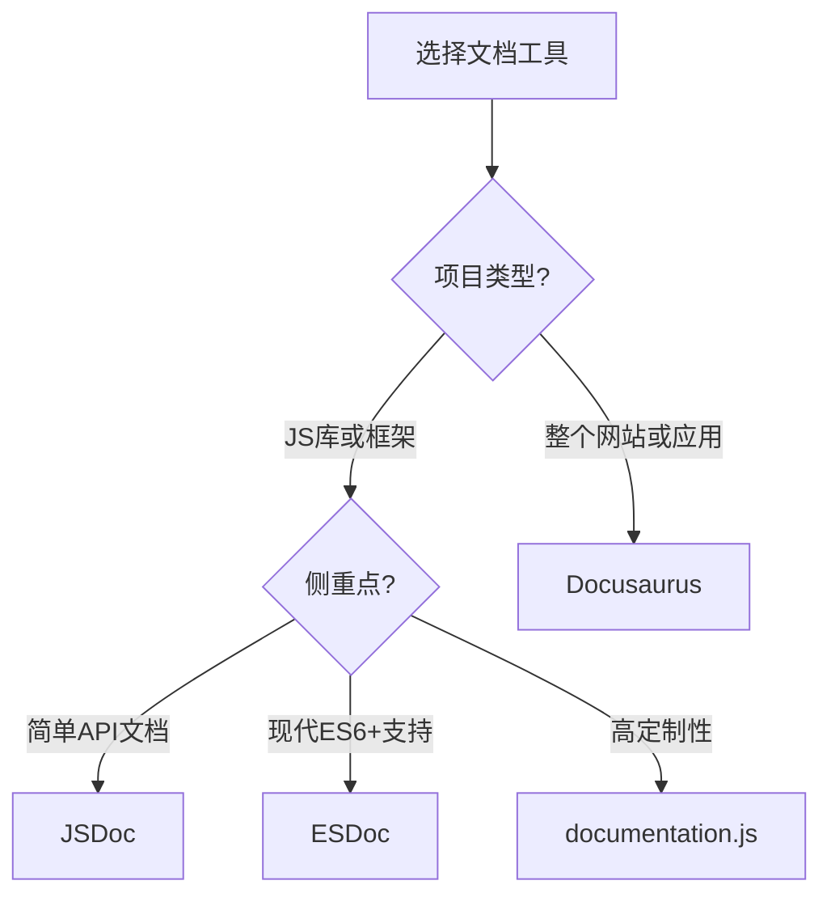

# JavaScript 文档工具

## 为什么需要文档工具？

良好的代码文档是任何成功项目的关键组成部分。当你编写JavaScript代码时，清晰明了的文档不仅能帮助其他开发者理解你的代码，也能帮助未来的自己快速回忆代码的功能和使用方法。

:::tip 文档的重要性
"代码告诉你如何做，注释告诉你为什么要这么做。"
:::

JavaScript文档工具能够自动从代码注释中生成格式统一、结构清晰的文档网站，极大地提高了开发效率和代码质量。

## 常见JavaScript文档工具

### 1. JSDoc

JSDoc是JavaScript世界中最广泛使用的文档生成工具。它通过特殊格式的注释，可以自动生成HTML格式的API文档。

#### 安装JSDoc

```bash
npm install -g jsdoc
```

#### JSDoc基本使用

JSDoc注释通常以`/**`开始，以`*/`结束：

```javascript
/**
 * 计算两个数的和
 * @param {number} a - 第一个数
 * @param {number} b - 第二个数
 * @returns {number} 两数之和
 */
function add(a, b) {
    return a + b;
}
```

#### 生成文档

```bash
jsdoc yourFile.js -d docs
```

这个命令将生成文档并保存在docs目录中。

#### JSDoc主要标签

| 标签 | 说明 |
|------|------|
| @param | 描述函数参数 |
| @returns | 描述函数返回值 |
| @example | 提供示例代码 |
| @throws | 描述可能抛出的异常 |
| @type | 指定变量类型 |
| @deprecated | 标记为已弃用 |

### 2. ESDoc

ESDoc是一个JavaScript文档生成器，专注于ES6+语法，提供了比JSDoc更丰富的功能。

#### 安装ESDoc

```bash
npm install --save-dev esdoc esdoc-standard-plugin
```

#### 配置ESDoc

创建`.esdoc.json`配置文件：

```json
{
  "source": "./src",
  "destination": "./docs",
  "plugins": [
    {"name": "esdoc-standard-plugin"}
  ]
}
```

#### 运行ESDoc

```bash
npx esdoc
```

### 3. Docusaurus

Docusaurus是由Facebook开发的静态网站生成器，特别适合创建文档网站。

#### 安装Docusaurus

```bash
npx create-docusaurus@latest my-website classic
```

#### 文档结构

在Docusaurus中，文档通常位于`docs`目录下，使用MDX格式（Markdown + JSX）。

```md
---
title: 我的JavaScript函数
description: 这是一个示例函数文档
---

# 我的函数

这个函数用于计算两个数的和。

```

### 4. documentation.js

documentation.js是一个现代化的文档生成工具，支持ES6+和Flow。

#### 安装documentation.js

```bash
npm install -g documentation
```

#### 使用documentation.js

```bash
documentation build src/index.js -f html -o docs
```

## 最佳实践

### 为类添加文档

```javascript
/**
 * 表示一个用户的类
 * @class
 */
class User {
  /**
   * 创建用户实例
   * @param {string} name - 用户名
   * @param {number} age - 用户年龄
   */
  constructor(name, age) {
    this.name = name;
    this.age = age;
  }
  
  /**
   * 获取用户信息
   * @returns {string} 用户信息字符串
   */
  getInfo() {
    return `${this.name}, ${this.age}岁`;
  }
}
```

### 为模块添加文档

```javascript
/**
 * 数学工具模块
 * @module math-utils
 */

/**
 * 计算两个数的和
 * @param {number} a - 第一个数
 * @param {number} b - 第二个数
 * @returns {number} 两数之和
 */
export function add(a, b) {
  return a + b;
}

/**
 * 计算两个数的差
 * @param {number} a - 第一个数
 * @param {number} b - 第二个数
 * @returns {number} 两数之差
 */
export function subtract(a, b) {
  return a - b;
}
```

## 实际项目案例

:::note 案例研究
假设我们正在开发一个简单的电子商务网站的购物车模块。
:::

### 项目结构

```
src/
  cart/
    Cart.js
    CartItem.js
  index.js
```

### Cart.js 文件示例

```javascript
/**
 * 购物车模块
 * @module Cart
 */

/**
 * 表示用户购物车的类
 * @class
 */
class Cart {
  /**
   * 创建购物车实例
   * @param {string} userId - 用户ID
   */
  constructor(userId) {
    /**
     * 用户ID
     * @type {string}
     */
    this.userId = userId;
    
    /**
     * 购物车项目
     * @type {Array<CartItem>}
     */
    this.items = [];
  }
  
  /**
   * 添加商品到购物车
   * @param {Object} product - 商品对象
   * @param {string} product.id - 商品ID
   * @param {string} product.name - 商品名称
   * @param {number} product.price - 商品价格
   * @param {number} [quantity=1] - 商品数量，默认为1
   * @throws {Error} 如果商品信息不完整
   * @returns {Cart} 当前购物车实例，用于链式调用
   * 
   * @example
   * const cart = new Cart('user123');
   * cart.addItem({id: 'prod1', name: 'T-shirt', price: 19.99}, 2);
   */
  addItem(product, quantity = 1) {
    if (!product.id || !product.name || !product.price) {
      throw new Error('商品信息不完整');
    }
    
    const existingItemIndex = this.items.findIndex(item => item.productId === product.id);
    
    if (existingItemIndex >= 0) {
      this.items[existingItemIndex].increaseQuantity(quantity);
    } else {
      const CartItem = require('./CartItem').default;
      this.items.push(new CartItem(product.id, product.name, product.price, quantity));
    }
    
    return this;
  }
  
  /**
   * 计算购物车总价
   * @returns {number} 总价
   */
  calculateTotal() {
    return this.items.reduce((total, item) => total + item.getSubtotal(), 0);
  }
}

export default Cart;
```

### 使用JSDoc生成文档

在项目根目录创建一个`jsdoc.json`配置文件：

```json
{
  "source": {
    "include": ["src"],
    "includePattern": ".js$"
  },
  "plugins": ["plugins/markdown"],
  "templates": {
    "cleverLinks": true,
    "monospaceLinks": true
  },
  "opts": {
    "destination": "./docs/",
    "recurse": true,
    "template": "templates/default"
  }
}
```

然后运行：

```bash
jsdoc -c jsdoc.json
```

这样就会在`docs`目录下生成完整的项目API文档。

## 文档工具选择指南

不同的文档工具各有优缺点，以下是选择适合你项目的文档工具的简要指南：



## 总结

JavaScript文档工具可以显著提升你的项目质量和可维护性。在本文中，我们学习了：

1. 为什么文档对于JavaScript项目至关重要
2. 几种主流JavaScript文档工具的基本使用方法
3. 如何在实际项目中应用这些工具
4. 如何根据项目需求选择合适的文档工具

随着你的项目规模增长，良好的文档将成为你和团队成员的重要资产。从现在开始养成编写良好文档的习惯，你未来的自己一定会感谢现在的努力！

## 练习

1. 为一个简单的计算器模块编写JSDoc注释，并生成文档。
2. 尝试使用Docusaurus为你的个人项目创建一个文档网站。
3. 比较JSDoc和ESDoc，找出它们在生成文档方面的三个主要区别。

## 附加资源

- [JSDoc官方文档](https://jsdoc.app/)
- [ESDoc官方网站](https://esdoc.org/)
- [Docusaurus官方文档](https://docusaurus.io/)
- [documentation.js GitHub](https://github.com/documentationjs/documentation)

掌握这些文档工具，将帮助你的JavaScript项目更加专业并易于维护。无论是个人项目还是团队协作，良好的文档都是项目成功的关键之一！