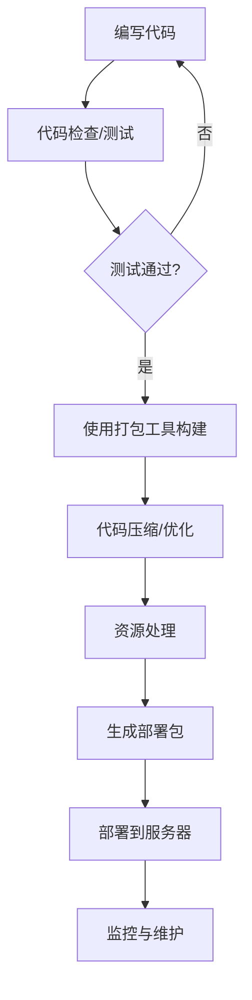

# JavaScript 部署工具

## 什么是JavaScript部署工具？

JavaScript部署工具是帮助开发者准备、优化和发布JavaScript应用程序的实用工具集。随着现代web应用程序变得越来越复杂，仅仅编写代码然后上传到服务器已经远远不够了。部署工具可以帮助我们自动化许多繁琐的任务，如代码压缩、文件打包、依赖管理和资源优化等。

:::tip
良好的部署流程可以显著提高项目质量和开发效率，同时减少生产环境中出现问题的风险。
:::

## 为什么需要部署工具？

作为初学者，你可能会疑惑：为什么不能直接编写代码并使用它？以下是使用部署工具的主要原因：

1. **代码优化** - 减小文件大小，提高加载速度
2. **浏览器兼容性** - 确保代码在各种浏览器中正常工作
3. **依赖管理** - 处理复杂的代码依赖关系
4. **自动化流程** - 减少手动操作，提高效率
5. **一致性保证** - 确保开发环境和生产环境的一致性

## 主要的JavaScript部署工具

### 1. 打包工具

打包工具将多个JavaScript文件和其他资源（如CSS、图片）打包成更少的文件，减少网络请求数量。

#### Webpack

Webpack是最流行的JavaScript打包工具之一，它可以处理几乎所有类型的资源。

**基本安装**:

```bash
npm install webpack webpack-cli --save-dev
```

**简单的webpack配置文件 (webpack.config.js)**:

```javascript
const path = require('path');

module.exports = {
  entry: './src/index.js',
  output: {
    filename: 'bundle.js',
    path: path.resolve(__dirname, 'dist'),
  },
};
```

**使用方法**:

```bash
npx webpack
```

#### Rollup

Rollup专注于ES模块打包，生成更小、更高效的代码，特别适合库的开发。

```bash
npm install rollup --save-dev
```

#### Parcel

Parcel是一个零配置的打包工具，对初学者非常友好。

```bash
npm install parcel --save-dev
```

**使用方法**:

```bash
npx parcel index.html
```

### 2. 任务运行器

任务运行器帮助自动化开发过程中的各种任务。

#### npm scripts

最简单的任务运行器就是package.json中的npm scripts。

**示例**:

```json
{
  "scripts": {
    "build": "webpack",
    "start": "webpack serve",
    "test": "jest"
  }
}
```

**使用方法**:

```bash
npm run build
```

#### Gulp

Gulp是一个基于流的任务运行器，适合处理文件操作。

```bash
npm install gulp --save-dev
```

**简单的gulpfile.js**:

```javascript
const gulp = require('gulp');
const uglify = require('gulp-uglify');

gulp.task('compress', function() {
  return gulp.src('src/*.js')
    .pipe(uglify())
    .pipe(gulp.dest('dist'));
});
```

### 3. 代码转换工具

#### Babel

Babel可以将现代JavaScript代码转换为向后兼容的版本，确保代码在旧浏览器中运行。

```bash
npm install @babel/core @babel/preset-env --save-dev
```

**配置示例 (.babelrc)**:

```json
{
  "presets": ["@babel/preset-env"]
}
```

#### TypeScript

虽然TypeScript本身是一种语言，但它的编译器也是一个重要的部署工具。

```bash
npm install typescript --save-dev
```

**基本配置 (tsconfig.json)**:

```json
{
  "compilerOptions": {
    "target": "es5",
    "module": "commonjs",
    "outDir": "./dist"
  },
  "include": ["src/**/*"]
}
```

### 4. 静态资源处理工具

#### 图片优化工具

例如`imagemin`可以压缩图像文件：

```bash
npm install imagemin --save-dev
```

#### CSS预处理器和后处理器

SASS、LESS(预处理器)和PostCSS(后处理器)可以增强CSS功能并优化输出。

```bash
npm install sass postcss autoprefixer --save-dev
```

### 5. 部署和CI/CD工具

#### Netlify / Vercel

这些平台提供了简单的方法来部署前端应用，只需连接到你的Git仓库。

#### GitHub Actions

GitHub内置的CI/CD工具，可以自动化测试和部署流程。

**基本配置示例 (.github/workflows/deploy.yml)**:

```yaml
name: Deploy

on:
  push:
    branches: [ main ]

jobs:
  build:
    runs-on: ubuntu-latest
    steps:
    - uses: actions/checkout@v2
    - name: Use Node.js
      uses: actions/setup-node@v1
      with:
        node-version: '14.x'
    - run: npm ci
    - run: npm run build
```

## 实际应用场景

### 场景1：部署一个React应用

假设你有一个React应用需要部署到生产环境：

1. 首先使用Webpack打包应用
2. 然后使用Babel转换代码以兼容旧浏览器
3. 使用各种插件优化资源（压缩JS、CSS、图像等）
4. 生成最终的build文件夹
5. 将build文件夹部署到托管服务（如Netlify）

具体流程：

```bash
# 安装依赖
npm install

# 构建应用
npm run build

# 部署（使用netlify-cli）
npm install netlify-cli -g
netlify deploy --prod
```

### 场景2：设置自动部署流程

使用GitHub Actions自动部署一个简单的JavaScript库：

1. 在GitHub仓库中设置Actions工作流
2. 每次推送到main分支时，自动执行测试
3. 测试通过后，自动构建并发布到npm

这种自动化流程确保了每次更改都经过测试，并且发布过程一致可靠。

## 构建部署流程图

下面的流程图展示了一个典型的JavaScript项目从开发到部署的过程：



## 选择合适的部署工具

作为初学者，选择合适的工具可能令人困惑。以下是一些建议：

1. **简单项目**：使用Parcel或Vite，它们几乎不需要配置
2. **学习目的**：从Webpack开始，因为它使用最广泛
3. **库开发**：考虑使用Rollup
4. **企业级应用**：使用完整的工具链，包括Webpack、Babel、ESLint等

:::note
记住，工具只是帮助你更有效率地工作。理解基本原理比掌握特定工具更重要。
:::

## 常见问题与解决方案

### 1. 打包过程很慢

**解决方案**：
- 使用增量构建
- 配置缓存
- 考虑使用更快的工具如Vite或esbuild

### 2. 打包后的文件太大

**解决方案**：
- 代码分割（Code Splitting）
- Tree Shaking（移除未使用的代码）
- 压缩和最小化

```javascript
// webpack配置示例 - 代码分割
module.exports = {
  // ...其他配置
  optimization: {
    splitChunks: {
      chunks: 'all',
    },
  },
};
```

### 3. 部署后发现bug

**解决方案**：
- 使用源映射（Source Maps）追踪错误
- 设置预发布环境
- 使用特性开关（Feature Flags）

## 总结

JavaScript部署工具是现代前端开发不可或缺的一部分。它们帮助我们:

- 优化应用性能
- 自动化重复任务
- 确保代码质量和兼容性
- 简化部署流程

作为初学者，从简单的工具开始，逐渐学习更复杂的配置。随着你的经验增长，你将能够构建更高效、更可靠的部署流程。

## 练习与进一步学习

### 练习

1. 使用Parcel创建一个简单的项目并部署到Netlify或Vercel
2. 为现有项目配置基本的Webpack设置
3. 创建npm scripts来自动化构建和部署过程

### 进一步学习资源

- [Webpack官方文档](https://webpack.js.org/)
- [现代JavaScript工具教程](https://frontendmasters.com/courses/webpack-fundamentals/)
- [构建现代JavaScript应用](https://developer.mozilla.org/en-US/docs/Learn/Tools_and_testing/Understanding_client-side_tools)

:::tip
记住，最好的学习方式是动手实践！创建一个小项目，并尝试使用不同的部署工具来体验它们的工作方式。
:::