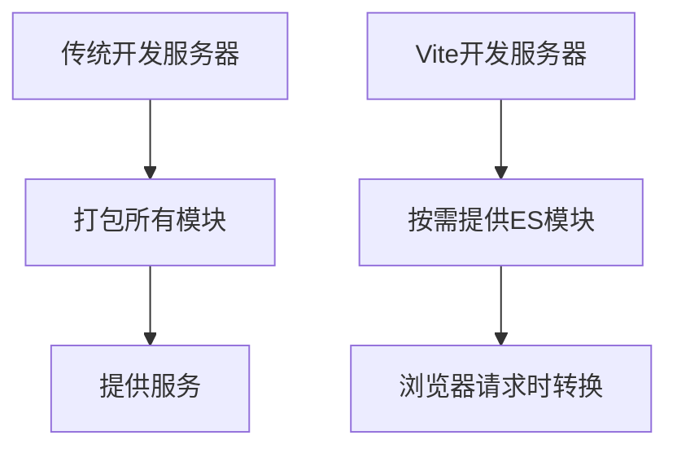

# JavaScript 开发服务器

## 什么是开发服务器？

开发服务器(Development Server)是前端开发中不可或缺的工具，它提供了一个本地环境，让开发者可以在不部署到生产环境的情况下，实时查看和测试自己的Web应用。

:::tip
虽然你可以直接通过浏览器打开HTML文件（即`file://`协议），但使用开发服务器（`http://`协议）能够避免很多跨域问题、更好地模拟真实环境，并提供额外的开发功能。
:::

## 为什么需要开发服务器？

开发服务器在现代前端开发中有以下优势：

1. **实时重载(Live Reload)** - 修改代码后自动刷新浏览器
2. **热模块替换(HMR)** - 在不刷新整个页面的情况下更新内容
3. **API代理** - 解决前端开发中的跨域问题
4. **模块化支持** - 直接使用ES模块和其他现代JavaScript特性
5. **静态资源服务** - 处理图片、CSS等静态资源
6. **构建优化** - 通常集成了打包、压缩等功能

## 常用的JavaScript开发服务器

### 1. Live Server (VS Code插件)

最简单的开发服务器选项之一，适合初学者快速启动项目。

**安装与使用:**
1. 在VS Code中安装Live Server插件
2. 在项目文件夹中打开HTML文件
3. 点击编辑器右下角的"Go Live"按钮


### 2. Node.js + Express

如果你对Node.js有基本了解，可以创建一个简单的自定义开发服务器。

```javascript
// server.js
const express = require('express');
const app = express();
const port = 3000;

// 提供静态文件
app.use(express.static('public'));

// 启动服务器
app.listen(port, () => {
  console.log(`开发服务器运行在 http://localhost:${port}`);
});
```

**使用方法:**
```bash
# 安装依赖
npm install express

# 运行服务器
node server.js
```

### 3. Webpack Dev Server

Webpack是一个流行的模块打包工具，其开发服务器提供了许多高级功能。

**基本设置:**

```javascript
// webpack.config.js
const path = require('path');

module.exports = {
  entry: './src/index.js',
  output: {
    filename: 'bundle.js',
    path: path.resolve(__dirname, 'dist'),
  },
  devServer: {
    static: './dist',
    hot: true, // 启用热模块替换
    port: 8080,
    open: true, // 自动打开浏览器
  }
};
```

**运行服务器:**
```bash
# 安装依赖
npm install webpack webpack-dev-server webpack-cli --save-dev

# 运行开发服务器
npx webpack serve
```

### 4. Vite

Vite是一个现代化的前端构建工具，提供了极快的开发服务器启动时间。

**创建项目:**
```bash
# 创建项目
npm create vite@latest my-vite-app

# 进入项目目录并安装依赖
cd my-vite-app
npm install

# 启动开发服务器
npm run dev
```

Vite开发服务器的特点：
- 极快的冷启动速度
- 即时的模块热更新
- 真正的按需编译



### 5. Create React App (React项目)

如果你在开发React应用，Create React App内置了开发服务器。

```bash
# 创建React项目
npx create-react-app my-react-app

# 进入项目目录
cd my-react-app

# 启动开发服务器
npm start
```

## 开发服务器核心功能介绍

### 实时重载和热模块替换

**实时重载(Live Reload)** 在文件更改时自动刷新整个页面，而**热模块替换(Hot Module Replacement, HMR)** 则只替换发生变化的模块，保持应用状态。

```javascript
// 在支持HMR的环境中，可以添加如下代码
if (module.hot) {
  module.hot.accept('./some-module.js', function() {
    // 当some-module.js更新时执行的回调
    console.log('模块已更新');
  });
}
```

### 代理API请求

开发服务器通常提供API代理功能，解决跨域问题。

**Webpack Dev Server 示例:**
```javascript
// webpack.config.js
module.exports = {
  // ...其他配置
  devServer: {
    proxy: {
      '/api': {
        target: 'http://localhost:3001',
        pathRewrite: { '^/api': '' },
      },
    },
  },
};
```

**Vite 示例:**
```javascript
// vite.config.js
export default {
  server: {
    proxy: {
      '/api': {
        target: 'http://localhost:3001',
        changeOrigin: true,
        rewrite: (path) => path.replace(/^\/api/, '')
      }
    }
  }
}
```

## 实际案例：构建一个简单的待办事项应用

让我们使用Vite创建一个简单的待办事项应用，演示开发服务器的使用方法。

1. **初始化项目:**
```bash
npm create vite@latest todo-app -- --template vanilla
cd todo-app
npm install
```

2. **编写HTML结构:**
```html
<!-- index.html -->
<!DOCTYPE html>
<html lang="en">
  <head>
    <meta charset="UTF-8" />
    <link rel="icon" type="image/svg+xml" href="/vite.svg" />
    <meta name="viewport" content="width=device-width, initial-scale=1.0" />
    <title>待办事项应用</title>
  </head>
  <body>
    <div id="app">
      <h1>我的待办事项</h1>
      <div class="input-container">
        <input type="text" id="todoInput" placeholder="添加新待办...">
        <button id="addButton">添加</button>
      </div>
      <ul id="todoList"></ul>
    </div>
    <script type="module" src="/src/main.js"></script>
  </body>
</html>
```

3. **编写JavaScript逻辑:**
```javascript
// src/main.js
import './style.css'

const todoInput = document.getElementById('todoInput');
const addButton = document.getElementById('addButton');
const todoList = document.getElementById('todoList');

// 添加待办事项
function addTodo() {
  const text = todoInput.value.trim();
  if (text) {
    const li = document.createElement('li');
    li.innerHTML = `
      <span>${text}</span>
      <button class="delete-btn">删除</button>
    `;
    todoList.appendChild(li);
    todoInput.value = '';
    
    // 添加删除功能
    li.querySelector('.delete-btn').addEventListener('click', () => {
      todoList.removeChild(li);
    });
  }
}

// 添加事件监听器
addButton.addEventListener('click', addTodo);
todoInput.addEventListener('keypress', (e) => {
  if (e.key === 'Enter') {
    addTodo();
  }
});
```

4. **添加一些样式:**
```css
/* src/style.css */
#app {
  max-width: 500px;
  margin: 0 auto;
  padding: 2rem;
  font-family: Arial, sans-serif;
}

.input-container {
  display: flex;
  margin-bottom: 20px;
}

input {
  flex: 1;
  padding: 8px;
  font-size: 16px;
}

button {
  padding: 8px 16px;
  background: #4c8bf5;
  color: white;
  border: none;
  cursor: pointer;
}

button:hover {
  background: #3a78e0;
}

ul {
  list-style-type: none;
  padding: 0;
}

li {
  display: flex;
  justify-content: space-between;
  align-items: center;
  padding: 8px 0;
  border-bottom: 1px solid #eee;
}

.delete-btn {
  background: #f44336;
  padding: 4px 8px;
  font-size: 12px;
}

.delete-btn:hover {
  background: #d32f2f;
}
```

5. **启动开发服务器:**
```bash
npm run dev
```

当你启动开发服务器后，Vite会在终端输出本地服务器地址（通常是`http://localhost:5173`）。打开这个地址，你就可以在浏览器中看到你的应用了。

尝试修改代码（例如更改标题文本或调整CSS样式），然后保存文件。你会发现浏览器会立即更新变化，而不需要手动刷新页面。这就是开发服务器提供的热模块替换功能。

## 总结

JavaScript开发服务器是现代前端开发工作流中的重要组成部分，它提供了实时重载、热模块替换、API代理等功能，显著提高开发效率。从简单的Live Server到功能丰富的Vite，不同的开发服务器工具可以满足各种开发需求。

作为初学者，你可以从简单的工具开始，例如VS Code的Live Server插件，随着对前端开发理解的深入，再逐渐探索更高级的工具如Webpack Dev Server或Vite。

## 练习与挑战

1. 尝试使用Live Server插件在VS Code中启动一个简单的HTML页面。
2. 使用Express创建一个自定义开发服务器，并添加一个API端点。
3. 使用Vite创建一个项目，并体验其热模块替换功能。
4. 为Webpack Dev Server或Vite配置API代理，连接到一个实际的后端服务。
5. 尝试扩展我们的待办事项应用，添加如下功能：
   - 待办事项完成状态切换
   - 本地存储保存待办事项
   - 过滤已完成和未完成的项目

## 更多学习资源

- [Vite官方文档](https://vitejs.dev/)
- [Webpack Dev Server文档](https://webpack.js.org/configuration/dev-server/)
- [Express.js官方文档](https://expressjs.com/)
- [现代JavaScript教程：本地开发服务器](https://javascript.info/network)